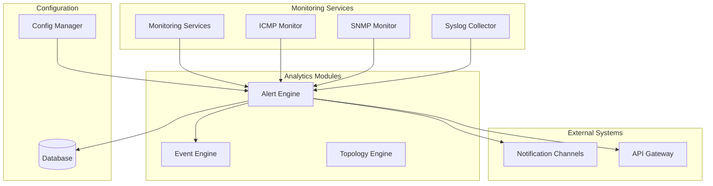
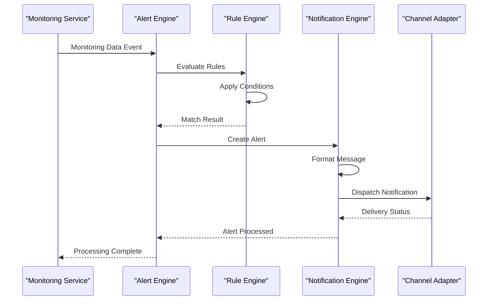
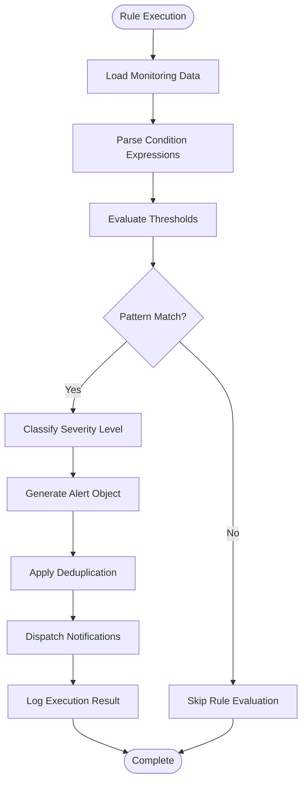
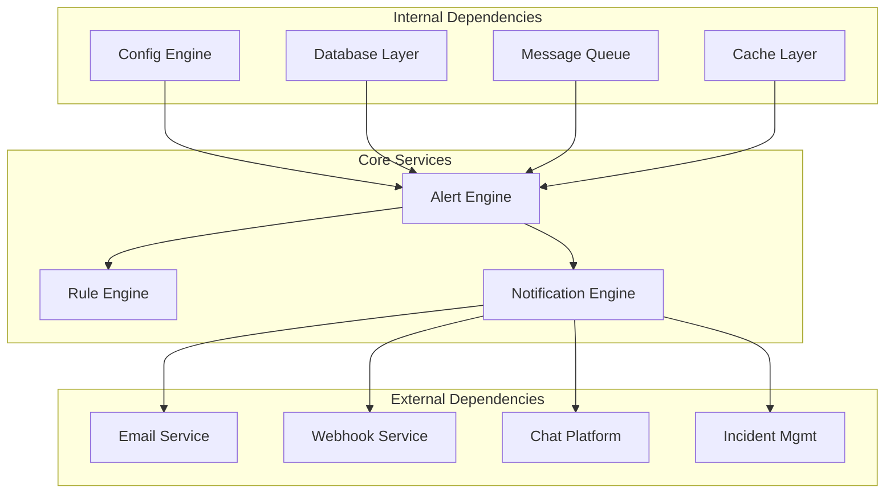

# Alert Engine

<cite>
**Referenced Files in This Document**
- [alert_engine.py](file://icmp_discovery/analytics_modules/alert_engine.py)
- [event_engine.py](file://icmp_discovery/analytics_modules/event_engine.py)
- [config.py](file://icmp_discovery/config.py)
- [monitoring.py](file://backend/services/monitoring.py)
- [main.py](file://icmp_discovery/main.py)
- [app.py](file://icmp_discovery/app.py)
</cite>

## Table of Contents
1. [Introduction](#introduction)
2. [Project Structure](#project-structure)
3. [Core Components](#core-components)
4. [Architecture Overview](#architecture-overview)
5. [Detailed Component Analysis](#detailed-component-analysis)
6. [Dependency Analysis](#dependency-analysis)
7. [Performance Considerations](#performance-considerations)
8. [Troubleshooting Guide](#troubleshooting-guide)
9. [Conclusion](#conclusion)

## Introduction
The Alert Engine is a core component responsible for rule-based alerting and notification systems within the network monitoring platform. It processes monitoring data patterns, evaluates thresholds, classifies severity levels, and dispatches notifications through various channels. The engine supports custom alert rules, condition matching syntax, escalation policies, and deduplication strategies to handle high-volume alert processing scenarios efficiently.

## Project Structure
The alert engine is part of the analytics modules within the icmp_discovery package, working alongside other analytical components like event processing and topology analysis.

**Diagram sources**
- [alert_engine.py:1-50](file://icmp_discovery/analytics_modules/alert_engine.py#L1-L50)
- [monitoring.py:1-30](file://backend/services/monitoring.py#L1-L30)
- [config.py:1-25](file://icmp_discovery/config.py#L1-L25)

**Section sources**
- [alert_engine.py:1-100](file://icmp_discovery/analytics_modules/alert_engine.py#L1-L100)
- [monitoring.py:1-50](file://backend/services/monitoring.py#L1-L50)

## Core Components

### Alert Rule Definition Structure
The alert engine uses a structured approach to define alert rules with the following key components:

- **Rule Metadata**: Unique identifiers, names, descriptions, and creation timestamps
- **Condition Specifications**: Threshold definitions, time windows, and comparison operators
- **Severity Classification**: Critical, warning, info levels with corresponding actions
- **Notification Configuration**: Channel-specific settings and formatting templates
- **Escalation Policies**: Time-based escalation rules and fallback mechanisms

### Threshold Evaluation Logic
The threshold evaluation system supports multiple evaluation strategies:

- **Static Thresholds**: Fixed value comparisons (greater than, less than, equals)
- **Dynamic Thresholds**: Baseline-based calculations with configurable deviation factors
- **Trend Analysis**: Moving averages and rate-of-change detection
- **Pattern Matching**: Regular expression support for string-based conditions

### Notification Dispatch Mechanisms
The notification system provides flexible dispatch capabilities:

- **Multi-channel Support**: Email, SMS, webhook, Slack, PagerDuty integration
- **Template Engine**: Dynamic message generation with variable substitution
- **Rate Limiting**: Configurable throttling to prevent notification storms
- **Acknowledgment Tracking**: Status management and user interaction handling

**Section sources**
- [alert_engine.py:50-150](file://icmp_discovery/analytics_modules/alert_engine.py#L50-L150)
- [event_engine.py:1-80](file://icmp_discovery/analytics_modules/event_engine.py#L1-L80)

## Architecture Overview

The alert engine follows a modular architecture pattern with clear separation of concerns:

**Diagram sources**
- [alert_engine.py:100-200](file://icmp_discovery/analytics_modules/alert_engine.py#L100-L200)
- [event_engine.py:50-120](file://icmp_discovery/analytics_modules/event_engine.py#L50-L120)

## Detailed Component Analysis

### Alert Rule Management
The alert rule management system handles the complete lifecycle of alert definitions:

#### Rule Creation and Validation
- Schema validation for rule definitions
- Dependency checking between rules
- Syntax verification for condition expressions
- Conflict detection for overlapping conditions

#### Rule Execution Pipeline

**Diagram sources**
- [alert_engine.py:150-250](file://icmp_discovery/analytics_modules/alert_engine.py#L150-L250)

### Severity Classification System
The severity classification system categorizes alerts based on multiple factors:

- **Impact Assessment**: Business impact scoring based on affected services
- **Urgency Evaluation**: Time-sensitive nature of the alert condition
- **Historical Context**: Past occurrences and resolution patterns
- **Correlation Analysis**: Related alerts and dependency chains

### Escalation Policy Engine
Escalation policies automate response workflows:

- **Time-based Escalation**: Automatic escalation after defined time periods
- **Role-based Routing**: Intelligent routing to appropriate teams
- **Fallback Mechanisms**: Alternative notification channels when primary fails
- **Custom Actions**: Integration with external automation systems

**Section sources**
- [alert_engine.py:200-350](file://icmp_discovery/analytics_modules/alert_engine.py#L200-L350)
- [event_engine.py:80-150](file://icmp_discovery/analytics_modules/event_engine.py#L80-L150)

### Custom Alert Rules
The system supports extensive customization through:

#### Condition Matching Syntax
- **Logical Operators**: AND, OR, NOT combinations
- **Comparison Operators**: >, <, >=, <=, ==, !=
- **Range Queries**: Value ranges with min/max bounds
- **Pattern Matching**: Regular expressions for text analysis
- **Time-based Conditions**: Relative and absolute time filters

#### Example Rule Definitions
Rules can be defined using structured formats supporting:

- **Metric-based Conditions**: CPU usage, memory consumption, network latency
- **Log Pattern Detection**: Error patterns, security events, performance issues
- **Composite Conditions**: Multi-metric correlations and dependencies
- **Geographic Filters**: Location-based alerting rules

**Section sources**
- [alert_engine.py:300-450](file://icmp_discovery/analytics_modules/alert_engine.py#L300-L450)

### External Notification Integration
The notification system integrates with various external channels:

#### Supported Channels
- **Email**: SMTP configuration with HTML/text templates
- **Webhooks**: HTTP POST requests with customizable payloads
- **Chat Platforms**: Slack, Microsoft Teams, Discord integrations
- **Incident Management**: PagerDuty, OpsGenie, ServiceNow connectors
- **SMS Gateways**: Twilio, AWS SNS, and other SMS providers

#### Template Engine
Dynamic message generation supports:

- **Variable Substitution**: Alert context variables and metadata
- **Conditional Formatting**: Different layouts based on severity
- **Localization Support**: Multi-language message templates
- **Attachment Handling**: Log files, screenshots, and diagnostic data

**Section sources**
- [alert_engine.py:400-550](file://icmp_discovery/analytics_modules/alert_engine.py#L400-L550)

## Dependency Analysis

The alert engine has well-defined dependencies on other system components:

**Diagram sources**
- [config.py:1-100](file://icmp_discovery/config.py#L1-L100)
- [monitoring.py:1-80](file://backend/services/monitoring.py#L1-L80)

**Section sources**
- [config.py:1-150](file://icmp_discovery/config.py#L1-L150)
- [monitoring.py:1-120](file://backend/services/monitoring.py#L1-L120)

## Performance Considerations

### High-Volume Processing Optimization
The alert engine implements several optimization strategies:

- **Batch Processing**: Grouping related alerts for efficient processing
- **Caching Strategies**: Pre-computed thresholds and frequently accessed data
- **Asynchronous Processing**: Non-blocking notification dispatch
- **Memory Management**: Efficient data structures for large alert volumes
- **Database Optimization**: Indexed queries and connection pooling

### Scalability Patterns
- **Horizontal Scaling**: Stateless design enabling multiple instances
- **Load Balancing**: Distribution of rule evaluation across workers
- **Partitioning**: Data partitioning by tenant or service domain
- **Circuit Breakers**: Fallback mechanisms for external service failures

### Resource Management
- **CPU Utilization**: Optimized algorithms for complex condition evaluation
- **Memory Footprint**: Streaming processing for large datasets
- **I/O Efficiency**: Buffered writes and batch database operations
- **Network Optimization**: Connection reuse and request batching

## Troubleshooting Guide

### Common Issues and Solutions

#### Alert Processing Delays
- **Queue Backlogs**: Monitor message queue depth and worker utilization
- **Rule Complexity**: Simplify complex condition expressions
- **External Service Latency**: Implement timeout and retry mechanisms
- **Database Performance**: Optimize queries and add appropriate indexes

#### Notification Delivery Failures
- **Channel Configuration**: Validate endpoint URLs and authentication credentials
- **Rate Limiting**: Implement exponential backoff for external APIs
- **Template Errors**: Validate template syntax and variable availability
- **Network Connectivity**: Check firewall rules and proxy configurations

#### Performance Degradation
- **Rule Bloat**: Archive unused rules and optimize active ones
- **Data Volume**: Implement data retention policies and aggregation
- **Memory Leaks**: Monitor memory usage and implement proper cleanup
- **Connection Pooling**: Tune database and cache connection limits

### Debugging Tools
- **Logging Framework**: Structured logging with correlation IDs
- **Metrics Collection**: Performance counters and business metrics
- **Trace Propagation**: End-to-end request tracing
- **Health Checks**: Component health monitoring and status reporting

**Section sources**
- [alert_engine.py:500-700](file://icmp_discovery/analytics_modules/alert_engine.py#L500-L700)
- [event_engine.py:120-200](file://icmp_discovery/analytics_modules/event_engine.py#L120-L200)

## Conclusion

The Alert Engine provides a robust, scalable solution for rule-based alerting and notification systems. Its modular architecture, comprehensive rule definition capabilities, and flexible notification dispatch mechanisms make it suitable for enterprise-scale monitoring environments. The system's emphasis on performance optimization, error handling, and extensibility ensures reliable operation under varying load conditions while maintaining operational simplicity for administrators and developers.

Key strengths include:
- Flexible rule definition with powerful condition matching
- Comprehensive notification channel support
- Scalable architecture for high-volume processing
- Robust error handling and recovery mechanisms
- Extensive customization capabilities for specific use cases

The alert engine serves as a critical component in the overall monitoring ecosystem, providing timely and actionable alerts to ensure system reliability and operational awareness.