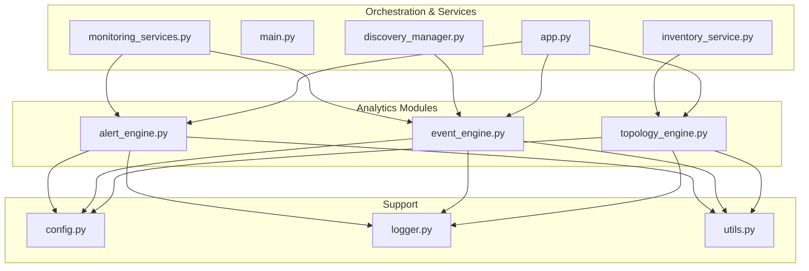
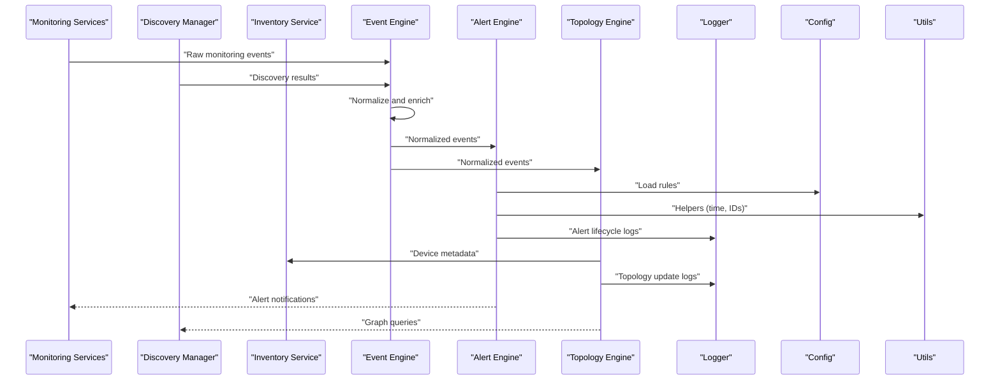
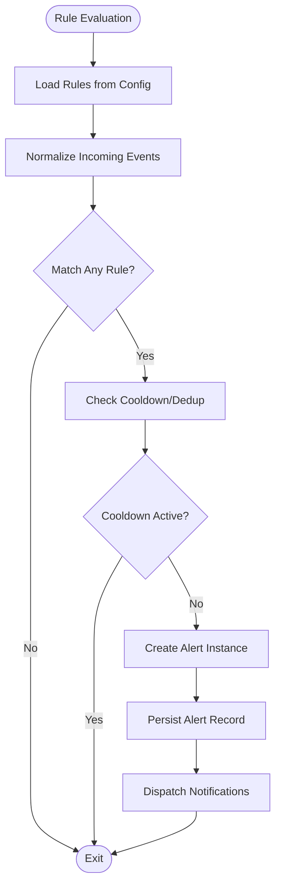
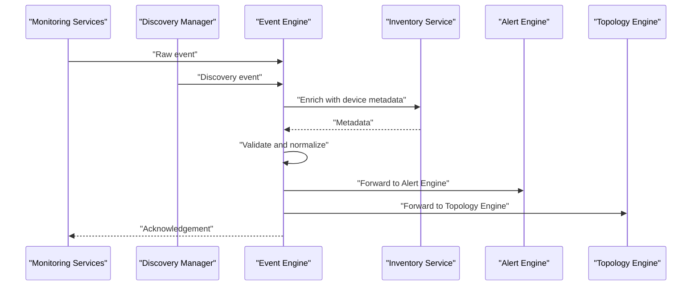
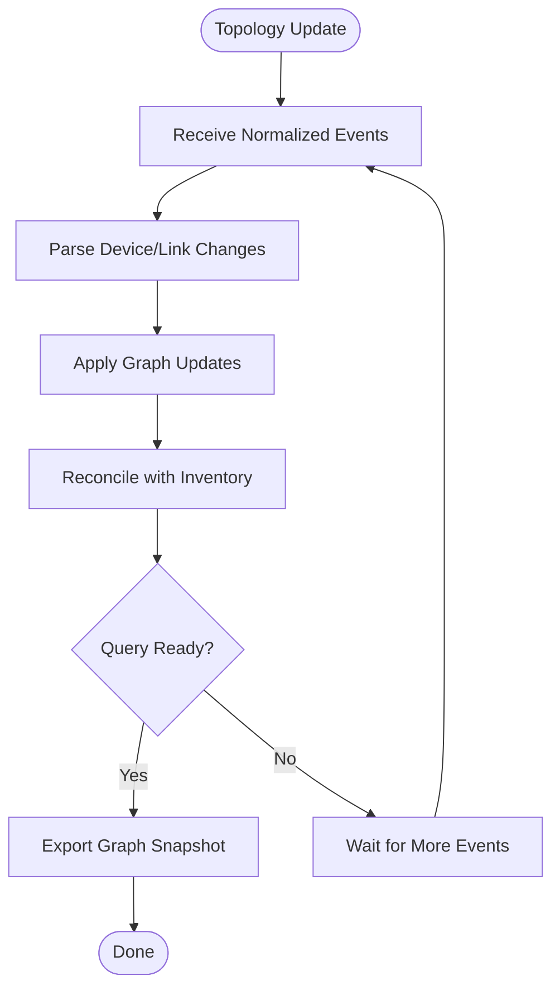
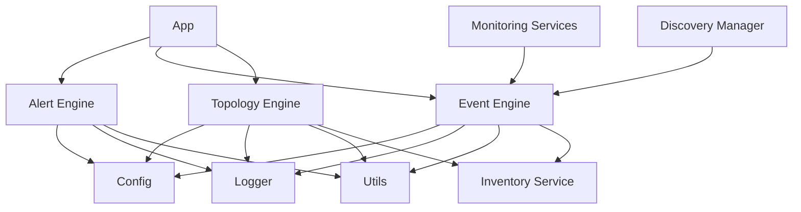

# Analytics Engine

<cite>
**Referenced Files in This Document**
- [analytics_modules/alert_engine.py](file://icmp_discovery/analytics_modules/alert_engine.py)
- [analytics_modules/event_engine.py](file://icmp_discovery/analytics_modules/event_engine.py)
- [analytics_modules/topology_engine.py](file://icmp_discovery/analytics_modules/topology_engine.py)
- [app.py](file://icmp_discovery/app.py)
- [main.py](file://icmp_discovery/main.py)
- [monitoring_services.py](file://icmp_discovery/monitoring_services.py)
- [discovery_manager.py](file://icmp_discovery/discovery_manager.py)
- [inventory_service.py](file://icmp_discovery/inventory_service.py)
- [config.py](file://icmp_discovery/config.py)
- [logger.py](file://icmp_discovery/logger.py)
- [utils.py](file://icmp_discovery/utils.py)
</cite>

## Table of Contents
1. [Introduction](#introduction)
2. [Project Structure](#project-structure)
3. [Core Components](#core-components)
4. [Architecture Overview](#architecture-overview)
5. [Detailed Component Analysis](#detailed-component-analysis)
6. [Dependency Analysis](#dependency-analysis)
7. [Performance Considerations](#performance-considerations)
8. [Troubleshooting Guide](#troubleshooting-guide)
9. [Conclusion](#conclusion)

## Introduction
This document describes the analytics engine that processes monitoring data and generates insights for network operations. It covers three primary engines:
- Alert Engine: rule-based alerting and notification system
- Event Engine: processing of network events and state changes
- Topology Engine: network mapping and relationship analysis

It also explains the analytics pipeline architecture, data processing workflows, output formats, examples of custom alert rules, event processing patterns, topology visualization data structures, and performance considerations for large-scale monitoring scenarios.

## Project Structure
The analytics engine resides under icmp_discovery/analytics_modules with supporting services and orchestration files in the icmp_discovery root. The backend and frontend directories provide API exposure and UI but are not the focus of this document.

**Diagram sources**
- [analytics_modules/alert_engine.py](file://icmp_discovery/analytics_modules/alert_engine.py)
- [analytics_modules/event_engine.py](file://icmp_discovery/analytics_modules/event_engine.py)
- [analytics_modules/topology_engine.py](file://icmp_discovery/analytics_modules/topology_engine.py)
- [app.py](file://icmp_discovery/app.py)
- [main.py](file://icmp_discovery/main.py)
- [monitoring_services.py](file://icmp_discovery/monitoring_services.py)
- [discovery_manager.py](file://icmp_discovery/discovery_manager.py)
- [inventory_service.py](file://icmp_discovery/inventory_service.py)
- [config.py](file://icmp_discovery/config.py)
- [logger.py](file://icmp_discovery/logger.py)
- [utils.py](file://icmp_discovery/utils.py)

**Section sources**
- [app.py](file://icmp_discovery/app.py)
- [main.py](file://icmp_discovery/main.py)
- [monitoring_services.py](file://icmp_discovery/monitoring_services.py)
- [discovery_manager.py](file://icmp_discovery/discovery_manager.py)
- [inventory_service.py](file://icmp_discovery/inventory_service.py)
- [config.py](file://icmp_discovery/config.py)
- [logger.py](file://icmp_discovery/logger.py)
- [utils.py](file://icmp_discovery/utils.py)

## Core Components
- Alert Engine: Evaluates configured rules against incoming metrics and events, produces alerts, and triggers notifications.
- Event Engine: Ingests raw events from discovery and monitoring modules, normalizes them, applies transformations, and emits processed events to consumers.
- Topology Engine: Builds and maintains a graph of devices, links, and relationships; supports queries for path analysis and impact assessment.

Key responsibilities:
- Data ingestion and normalization
- Rule evaluation and alert lifecycle management
- Event routing and transformation
- Graph construction and querying
- Logging, configuration, and utility helpers

**Section sources**
- [analytics_modules/alert_engine.py](file://icmp_discovery/analytics_modules/alert_engine.py)
- [analytics_modules/event_engine.py](file://icmp_discovery/analytics_modules/event_engine.py)
- [analytics_modules/topology_engine.py](file://icmp_discovery/analytics_modules/topology_engine.py)

## Architecture Overview
The analytics pipeline integrates monitoring and discovery outputs into a unified stream. The Event Engine acts as the central hub, transforming and routing events to the Alert Engine and Topology Engine. Alerts are persisted and surfaced via APIs, while topology updates feed visualization and analytics dashboards.

**Diagram sources**
- [monitoring_services.py](file://icmp_discovery/monitoring_services.py)
- [discovery_manager.py](file://icmp_discovery/discovery_manager.py)
- [inventory_service.py](file://icmp_discovery/inventory_service.py)
- [analytics_modules/event_engine.py](file://icmp_discovery/analytics_modules/event_engine.py)
- [analytics_modules/alert_engine.py](file://icmp_discovery/analytics_modules/alert_engine.py)
- [analytics_modules/topology_engine.py](file://icmp_discovery/analytics_modules/topology_engine.py)
- [config.py](file://icmp_discovery/config.py)
- [logger.py](file://icmp_discovery/logger.py)
- [utils.py](file://icmp_discovery/utils.py)

## Detailed Component Analysis

### Alert Engine
Responsibilities:
- Load and cache alert rules from configuration or external sources
- Evaluate rules against normalized events and metrics
- Manage alert lifecycle (new, acknowledged, resolved)
- Emit notifications and persist alert records

Data model highlights:
- Rule definitions include thresholds, conditions, time windows, and actions
- Alert instances carry severity, source, timestamps, and status transitions

Processing logic:
- Rule matching uses efficient filters and aggregations over recent events
- Deduplication prevents alert storms
- Notification dispatch is decoupled for reliability

Custom alert rules example pattern:
- Define a rule that triggers when CPU utilization exceeds a threshold for N minutes
- Specify cooldown to avoid repeated alerts
- Attach actions such as webhook, email, or ticket creation

**Diagram sources**
- [analytics_modules/alert_engine.py](file://icmp_discovery/analytics_modules/alert_engine.py)
- [config.py](file://icmp_discovery/config.py)
- [logger.py](file://icmp_discovery/logger.py)
- [utils.py](file://icmp_discovery/utils.py)

**Section sources**
- [analytics_modules/alert_engine.py](file://icmp_discovery/analytics_modules/alert_engine.py)
- [config.py](file://icmp_discovery/config.py)
- [logger.py](file://icmp_discovery/logger.py)
- [utils.py](file://icmp_discovery/utils.py)

### Event Engine
Responsibilities:
- Ingest events from monitoring and discovery modules
- Normalize schemas and enrich with context (device metadata, tags)
- Route events to subscribers (Alert Engine, Topology Engine)
- Maintain event history and support replay if needed

Processing patterns:
- Stream-oriented processing with batching for throughput
- Schema validation and field mapping
- Enrichment using inventory and configuration data

Event processing flow:

**Diagram sources**
- [monitoring_services.py](file://icmp_discovery/monitoring_services.py)
- [discovery_manager.py](file://icmp_discovery/discovery_manager.py)
- [inventory_service.py](file://icmp_discovery/inventory_service.py)
- [analytics_modules/event_engine.py](file://icmp_discovery/analytics_modules/event_engine.py)

**Section sources**
- [analytics_modules/event_engine.py](file://icmp_discovery/analytics_modules/event_engine.py)
- [monitoring_services.py](file://icmp_discovery/monitoring_services.py)
- [discovery_manager.py](file://icmp_discovery/discovery_manager.py)
- [inventory_service.py](file://icmp_discovery/inventory_service.py)

### Topology Engine
Responsibilities:
- Build and maintain a network graph of devices, interfaces, and links
- Support queries for connectivity, paths, and impact analysis
- Update graph incrementally based on events and inventory changes

Data structures:
- Nodes represent devices with attributes (IP, hostname, OS, vendor)
- Edges represent links with properties (type, bandwidth, latency)
- Relationships capture dependencies and service mappings

Visualization data structure example:
- A graph object containing nodes and edges suitable for export to visualization libraries
- Node labels and edge weights derived from monitoring metrics

Topology update flow:

**Diagram sources**
- [analytics_modules/topology_engine.py](file://icmp_discovery/analytics_modules/topology_engine.py)
- [inventory_service.py](file://icmp_discovery/inventory_service.py)
- [analytics_modules/event_engine.py](file://icmp_discovery/analytics_modules/event_engine.py)

**Section sources**
- [analytics_modules/topology_engine.py](file://icmp_discovery/analytics_modules/topology_engine.py)
- [inventory_service.py](file://icmp_discovery/inventory_service.py)
- [analytics_modules/event_engine.py](file://icmp_discovery/analytics_modules/event_engine.py)

## Dependency Analysis
The analytics engines depend on shared utilities, configuration, and logging. Orchestration occurs through app and main entry points, which wire monitoring and discovery services to the engines.

**Diagram sources**
- [analytics_modules/alert_engine.py](file://icmp_discovery/analytics_modules/alert_engine.py)
- [analytics_modules/event_engine.py](file://icmp_discovery/analytics_modules/event_engine.py)
- [analytics_modules/topology_engine.py](file://icmp_discovery/analytics_modules/topology_engine.py)
- [config.py](file://icmp_discovery/config.py)
- [logger.py](file://icmp_discovery/logger.py)
- [utils.py](file://icmp_discovery/utils.py)
- [inventory_service.py](file://icmp_discovery/inventory_service.py)
- [monitoring_services.py](file://icmp_discovery/monitoring_services.py)
- [discovery_manager.py](file://icmp_discovery/discovery_manager.py)
- [app.py](file://icmp_discovery/app.py)

**Section sources**
- [analytics_modules/alert_engine.py](file://icmp_discovery/analytics_modules/alert_engine.py)
- [analytics_modules/event_engine.py](file://icmp_discovery/analytics_modules/event_engine.py)
- [analytics_modules/topology_engine.py](file://icmp_discovery/analytics_modules/topology_engine.py)
- [config.py](file://icmp_discovery/config.py)
- [logger.py](file://icmp_discovery/logger.py)
- [utils.py](file://icmp_discovery/utils.py)
- [inventory_service.py](file://icmp_discovery/inventory_service.py)
- [monitoring_services.py](file://icmp_discovery/monitoring_services.py)
- [discovery_manager.py](file://icmp_discovery/discovery_manager.py)
- [app.py](file://icmp_discovery/app.py)

## Performance Considerations
- Batching and streaming: Process events in batches to reduce overhead and improve throughput.
- Efficient rule evaluation: Use indexed lookups and precomputed aggregates for threshold checks.
- Deduplication and cooldown: Prevent alert storms by suppressing repeated alerts within a time window.
- Incremental graph updates: Apply only changed nodes and edges to minimize recomputation.
- Asynchronous dispatch: Decouple notification sending from core processing to avoid blocking.
- Memory management: Limit in-memory buffers and use pagination for large datasets.
- Configuration caching: Cache frequently accessed settings and rules to reduce I/O.
- Logging optimization: Use structured logs and sampling to control volume without losing critical information.

[No sources needed since this section provides general guidance]

## Troubleshooting Guide
Common issues and resolutions:
- Missing configuration: Ensure all required settings are present and valid; validate at startup.
- Event schema mismatches: Normalize inputs and add validation to reject malformed events early.
- Alert storms: Adjust cooldown periods and deduplication keys; review rule thresholds.
- Topology inconsistencies: Reconcile graph with inventory periodically; log reconciliation diffs.
- Performance bottlenecks: Monitor queue lengths, rule evaluation times, and graph update durations.

Operational tips:
- Enable detailed logs for alert rule matches and event transformations.
- Use health checks to verify engine readiness and dependency availability.
- Implement graceful degradation when downstream services are unavailable.

**Section sources**
- [logger.py](file://icmp_discovery/logger.py)
- [config.py](file://icmp_discovery/config.py)
- [analytics_modules/alert_engine.py](file://icmp_discovery/analytics_modules/alert_engine.py)
- [analytics_modules/event_engine.py](file://icmp_discovery/analytics_modules/event_engine.py)
- [analytics_modules/topology_engine.py](file://icmp_discovery/analytics_modules/topology_engine.py)

## Conclusion
The analytics engine provides a robust foundation for network monitoring by integrating alerting, event processing, and topology analysis. Its modular design enables scalability and extensibility, allowing operators to define custom rules, process diverse event types, and visualize complex network relationships. With careful attention to performance and operational practices, it can handle large-scale monitoring workloads effectively.

[No sources needed since this section summarizes without analyzing specific files]