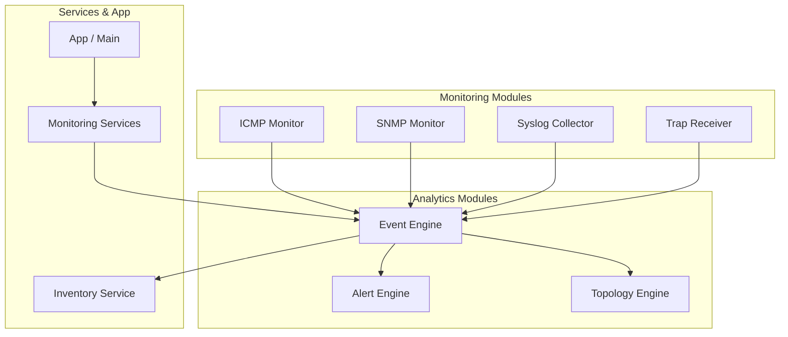
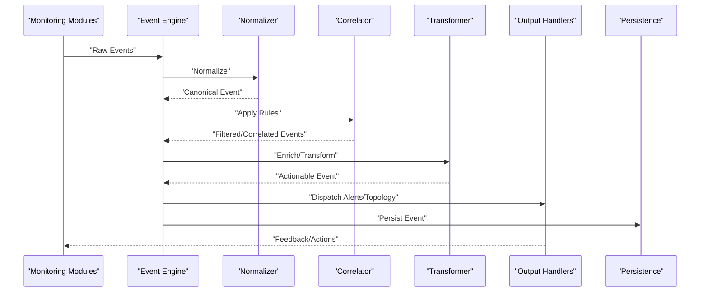
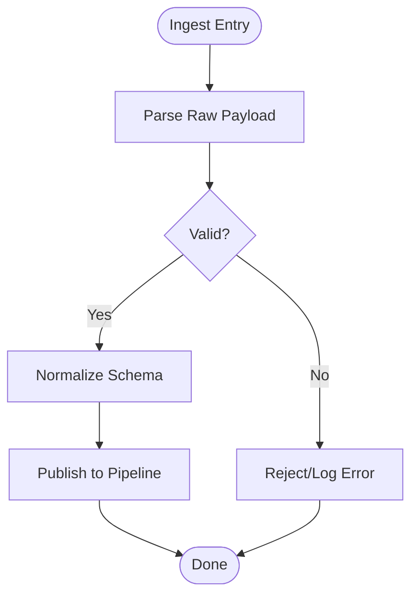
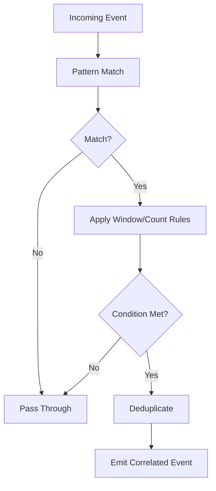
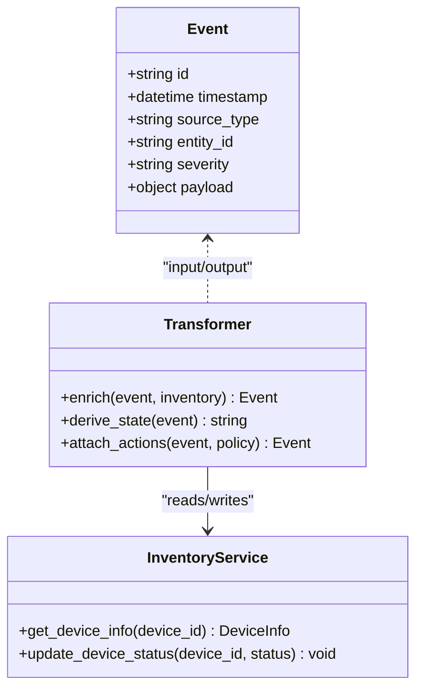
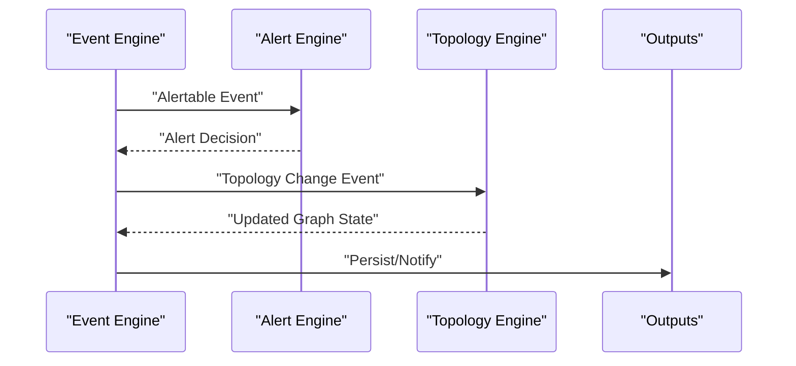
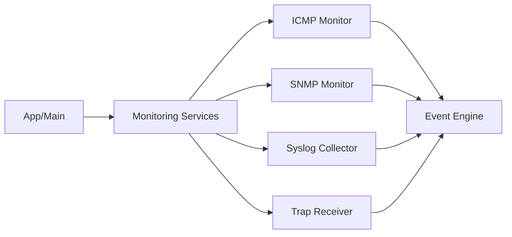
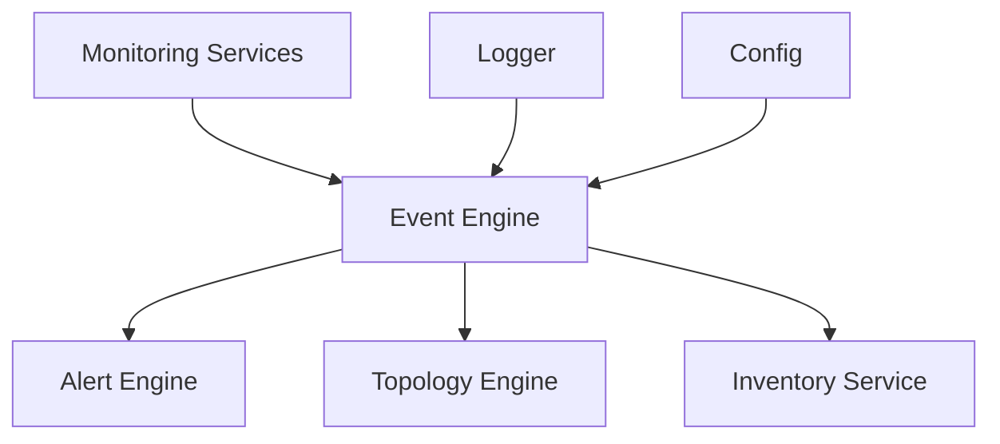

# Event Engine

<cite>
**Referenced Files in This Document**
- [event_engine.py](file://icmp_discovery/analytics_modules/event_engine.py)
- [alert_engine.py](file://icmp_discovery/analytics_modules/alert_engine.py)
- [topology_engine.py](file://icmp_discovery/analytics_modules/topology_engine.py)
- [monitoring_services.py](file://icmp_discovery/monitoring_services.py)
- [syslog_collector.py](file://icmp_discovery/monitoring_modules/syslog_collector.py)
- [trap_receiver.py](file://icmp_discovery/monitoring_modules/trap_receiver.py)
- [icmp_monitor.py](file://icmp_discovery/monitoring_modules/icmp_monitor.py)
- [snmp_monitor.py](file://icmp_discovery/monitoring_modules/snmp_monitor.py)
- [app.py](file://icmp_discovery/app.py)
- [main.py](file://icmp_discovery/main.py)
- [config.py](file://icmp_discovery/config.py)
- [inventory_service.py](file://icmp_discovery/inventory_service.py)
- [logger.py](file://icmp_discovery/logger.py)
</cite>

## Table of Contents
1. [Introduction](#introduction)
2. [Project Structure](#project-structure)
3. [Core Components](#core-components)
4. [Architecture Overview](#architecture-overview)
5. [Detailed Component Analysis](#detailed-component-analysis)
6. [Dependency Analysis](#dependency-analysis)
7. [Performance Considerations](#performance-considerations)
8. [Troubleshooting Guide](#troubleshooting-guide)
9. [Conclusion](#conclusion)
10. [Appendices](#appendices)

## Introduction
This document provides a comprehensive overview of the event engine that processes network events and state changes across monitored infrastructure. It explains how events are ingested from external sources, normalized into a consistent schema, correlated and filtered through processing rules, transformed into actionable outputs (alerts, topology updates), and persisted for downstream consumption. It also covers real-time processing capabilities, scalability considerations for high-throughput streams, and integration points with monitoring modules and external systems.

## Project Structure
The event engine resides within the analytics layer and integrates with monitoring modules and services:
- Analytics modules implement event ingestion, correlation, transformation, alerting, and topology updates.
- Monitoring modules collect raw telemetry and system logs, producing events consumed by the event engine.
- Application entry points orchestrate lifecycle management and configuration.
- Configuration and logging provide operational controls and diagnostics.

**Diagram sources**
- [event_engine.py](file://icmp_discovery/analytics_modules/event_engine.py)
- [alert_engine.py](file://icmp_discovery/analytics_modules/alert_engine.py)
- [topology_engine.py](file://icmp_discovery/analytics_modules/topology_engine.py)
- [monitoring_services.py](file://icmp_discovery/monitoring_services.py)
- [syslog_collector.py](file://icmp_discovery/monitoring_modules/syslog_collector.py)
- [trap_receiver.py](file://icmp_discovery/monitoring_modules/trap_receiver.py)
- [icmp_monitor.py](file://icmp_discovery/monitoring_modules/icmp_monitor.py)
- [snmp_monitor.py](file://icmp_discovery/monitoring_modules/snmp_monitor.py)
- [app.py](file://icmp_discovery/app.py)
- [main.py](file://icmp_discovery/main.py)

**Section sources**
- [event_engine.py](file://icmp_discovery/analytics_modules/event_engine.py)
- [monitoring_services.py](file://icmp_discovery/monitoring_services.py)
- [app.py](file://icmp_discovery/app.py)
- [main.py](file://icmp_discovery/main.py)

## Core Components
- Event Ingestion Pipeline: Receives raw events from monitoring modules and normalizes them into a unified schema.
- Correlation and Filtering: Applies pattern matching and rule evaluation to reduce noise and identify meaningful conditions.
- Transformation and Enrichment: Augments events with context (e.g., inventory data) and transforms into domain-specific actions.
- Alerting and Topology Updates: Emits alerts and updates network topology based on processed events.
- Persistence and Real-Time Processing: Persists events and supports streaming consumers for low-latency reactions.

Key responsibilities and interactions are implemented across the analytics and monitoring modules as described below.

**Section sources**
- [event_engine.py](file://icmp_discovery/analytics_modules/event_engine.py)
- [alert_engine.py](file://icmp_discovery/analytics_modules/alert_engine.py)
- [topology_engine.py](file://icmp_discovery/analytics_modules/topology_engine.py)
- [monitoring_services.py](file://icmp_discovery/monitoring_services.py)

## Architecture Overview
The event engine orchestrates a pipeline from ingestion to output:
- Ingestors accept events from monitoring modules (ICMP/SNMP/Syslog/Traps).
- Normalizer maps inputs to a canonical event schema.
- Correlator applies pattern matching and temporal/windowed rules.
- Transformer enriches with inventory and device context.
- Output handlers emit alerts and update topology; events are persisted for audit and analytics.

**Diagram sources**
- [event_engine.py](file://icmp_discovery/analytics_modules/event_engine.py)
- [monitoring_services.py](file://icmp_discovery/monitoring_services.py)
- [syslog_collector.py](file://icmp_discovery/monitoring_modules/syslog_collector.py)
- [trap_receiver.py](file://icmp_discovery/monitoring_modules/trap_receiver.py)
- [icmp_monitor.py](file://icmp_discovery/monitoring_modules/icmp_monitor.py)
- [snmp_monitor.py](file://icmp_discovery/monitoring_modules/snmp_monitor.py)

## Detailed Component Analysis

### Event Ingestion Pipeline
- Sources:
  - ICMP monitor emits reachability and latency events.
  - SNMP monitor emits metric thresholds and OID-based anomalies.
  - Syslog collector parses log lines into structured events.
  - Trap receiver handles SNMP traps and translates them to events.
- Ingestion flow:
  - Receive raw payloads.
  - Validate and parse fields.
  - Normalize into canonical schema.
  - Publish to internal processing queue or stream.

**Diagram sources**
- [icmp_monitor.py](file://icmp_discovery/monitoring_modules/icmp_monitor.py)
- [snmp_monitor.py](file://icmp_discovery/monitoring_modules/snmp_monitor.py)
- [syslog_collector.py](file://icmp_discovery/monitoring_modules/syslog_collector.py)
- [trap_receiver.py](file://icmp_discovery/monitoring_modules/trap_receiver.py)
- [event_engine.py](file://icmp_discovery/analytics_modules/event_engine.py)

**Section sources**
- [icmp_monitor.py](file://icmp_discovery/monitoring_modules/icmp_monitor.py)
- [snmp_monitor.py](file://icmp_discovery/monitoring_modules/snmp_monitor.py)
- [syslog_collector.py](file://icmp_discovery/monitoring_modules/syslog_collector.py)
- [trap_receiver.py](file://icmp_discovery/monitoring_modules/trap_receiver.py)
- [event_engine.py](file://icmp_discovery/analytics_modules/event_engine.py)

### Event Schema Definitions
- Canonical fields typically include:
  - Identifier: event_id, timestamp, source_type, source_id
  - Entity: device_ip, hostname, interface, service
  - Metric/Status: severity, value, threshold, unit
  - Context: tags, labels, metadata
  - Action: recommended_action, correlation_id
- Normalization ensures consistent typing and required fields before correlation.

[No sources needed since this section defines conceptual schema without analyzing specific files]

### Correlation and Filtering
- Pattern matching:
  - Regex or token-based patterns on message content.
  - Field-level comparisons (severity, status codes).
- Temporal/windowed rules:
  - Count-based thresholds over time windows.
  - Sequence detection (e.g., repeated failures followed by recovery).
- Deduplication:
  - Hash-based dedupe keys to avoid duplicate alerts.

**Diagram sources**
- [event_engine.py](file://icmp_discovery/analytics_modules/event_engine.py)

**Section sources**
- [event_engine.py](file://icmp_discovery/analytics_modules/event_engine.py)

### Transformation and Enrichment
- Enrichment sources:
  - Inventory service for device attributes, roles, ownership.
  - External configuration for thresholds and policies.
- Transformations:
  - Map raw metrics to normalized units.
  - Derive composite states (e.g., degraded, critical).
  - Attach recommended actions based on policy.

**Diagram sources**
- [event_engine.py](file://icmp_discovery/analytics_modules/event_engine.py)
- [inventory_service.py](file://icmp_discovery/inventory_service.py)

**Section sources**
- [event_engine.py](file://icmp_discovery/analytics_modules/event_engine.py)
- [inventory_service.py](file://icmp_discovery/inventory_service.py)

### Alerting and Topology Updates
- Alerting:
  - Severity escalation and suppression rules.
  - Notification channels (console, file, external integrations).
- Topology updates:
  - Link up/down events based on connectivity checks.
  - Node health transitions reflected in topology graph.

**Diagram sources**
- [alert_engine.py](file://icmp_discovery/analytics_modules/alert_engine.py)
- [topology_engine.py](file://icmp_discovery/analytics_modules/topology_engine.py)
- [event_engine.py](file://icmp_discovery/analytics_modules/event_engine.py)

**Section sources**
- [alert_engine.py](file://icmp_discovery/analytics_modules/alert_engine.py)
- [topology_engine.py](file://icmp_discovery/analytics_modules/topology_engine.py)
- [event_engine.py](file://icmp_discovery/analytics_modules/event_engine.py)

### Integration with External Event Sources
- Monitoring services coordinate collectors and feed events into the engine.
- Syslog and SNMP trap receivers translate vendor-specific formats into canonical events.
- Application entry points initialize engines and configure pipelines.

**Diagram sources**
- [monitoring_services.py](file://icmp_discovery/monitoring_services.py)
- [icmp_monitor.py](file://icmp_discovery/monitoring_modules/icmp_monitor.py)
- [snmp_monitor.py](file://icmp_discovery/monitoring_modules/snmp_monitor.py)
- [syslog_collector.py](file://icmp_discovery/monitoring_modules/syslog_collector.py)
- [trap_receiver.py](file://icmp_discovery/monitoring_modules/trap_receiver.py)
- [event_engine.py](file://icmp_discovery/analytics_modules/event_engine.py)
- [app.py](file://icmp_discovery/app.py)
- [main.py](file://icmp_discovery/main.py)

**Section sources**
- [monitoring_services.py](file://icmp_discovery/monitoring_services.py)
- [app.py](file://icmp_discovery/app.py)
- [main.py](file://icmp_discovery/main.py)

## Dependency Analysis
- Coupling:
  - Event engine depends on monitoring modules for input and on alert/topology engines for output.
  - Inventory service is used for enrichment and state synchronization.
- Cohesion:
  - Each module has a focused responsibility (ingest, correlate, transform, alert, topology).
- External dependencies:
  - Logging utilities for diagnostics.
  - Configuration module for runtime settings.

**Diagram sources**
- [event_engine.py](file://icmp_discovery/analytics_modules/event_engine.py)
- [alert_engine.py](file://icmp_discovery/analytics_modules/alert_engine.py)
- [topology_engine.py](file://icmp_discovery/analytics_modules/topology_engine.py)
- [inventory_service.py](file://icmp_discovery/inventory_service.py)
- [monitoring_services.py](file://icmp_discovery/monitoring_services.py)
- [logger.py](file://icmp_discovery/logger.py)
- [config.py](file://icmp_discovery/config.py)

**Section sources**
- [event_engine.py](file://icmp_discovery/analytics_modules/event_engine.py)
- [alert_engine.py](file://icmp_discovery/analytics_modules/alert_engine.py)
- [topology_engine.py](file://icmp_discovery/analytics_modules/topology_engine.py)
- [inventory_service.py](file://icmp_discovery/inventory_service.py)
- [monitoring_services.py](file://icmp_discovery/monitoring_services.py)
- [logger.py](file://icmp_discovery/logger.py)
- [config.py](file://icmp_discovery/config.py)

## Performance Considerations
- High-throughput ingestion:
  - Use asynchronous processing and non-blocking I/O where possible.
  - Batch normalization and enrichment to reduce per-event overhead.
- Correlation efficiency:
  - Maintain indexes for fast pattern matching and windowed aggregations.
  - Implement sliding windows with efficient data structures.
- Backpressure and resilience:
  - Apply rate limiting and circuit breakers for external calls.
  - Persist events asynchronously to avoid blocking the pipeline.
- Scalability:
  - Partition event streams by entity or source type.
  - Scale horizontally by sharding correlators and transformers.

[No sources needed since this section provides general guidance]

## Troubleshooting Guide
- Logging and diagnostics:
  - Ensure detailed logs at each pipeline stage (ingest, normalize, correlate, transform, output).
  - Track error rates and latency percentiles per stage.
- Common issues:
  - Schema mismatches during normalization lead to rejected events.
  - Correlation rules too broad cause alert storms; refine patterns and thresholds.
  - Enrichment failures due to missing inventory entries require fallback handling.
- Recovery strategies:
  - Replay persisted events to rebuild state after outages.
  - Gracefully degrade by skipping optional enrichment when dependencies fail.

**Section sources**
- [logger.py](file://icmp_discovery/logger.py)
- [event_engine.py](file://icmp_discovery/analytics_modules/event_engine.py)

## Conclusion
The event engine provides a robust, modular pipeline for ingesting, normalizing, correlating, transforming, and acting upon network events. By integrating closely with monitoring modules and leveraging alerting and topology engines, it enables real-time visibility and automated responses. With careful attention to performance, backpressure, and scalability, the system can handle high-throughput event streams while maintaining reliability and accuracy.

## Appendices
- Example event pattern matching:
  - Detect repeated ICMP failures within a time window to trigger an alert.
  - Match syslog messages containing specific error codes to escalate severity.
- Complex event processing rules:
  - Combine SNMP threshold breaches with link down events to infer root causes.
  - Sequence detection: multiple interface flaps followed by CPU spikes indicate instability.
- Integration examples:
  - Syslog collector parses RFC-compliant messages into canonical events.
  - Trap receiver translates SNMP v2/v3 traps into standardized alert payloads.

[No sources needed since this section provides conceptual examples]