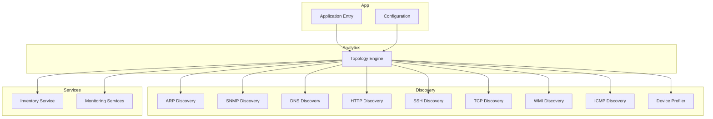
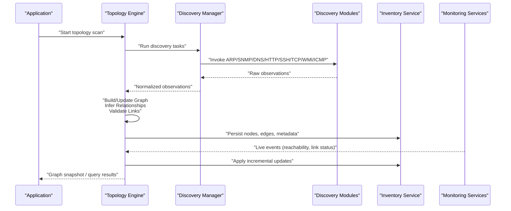
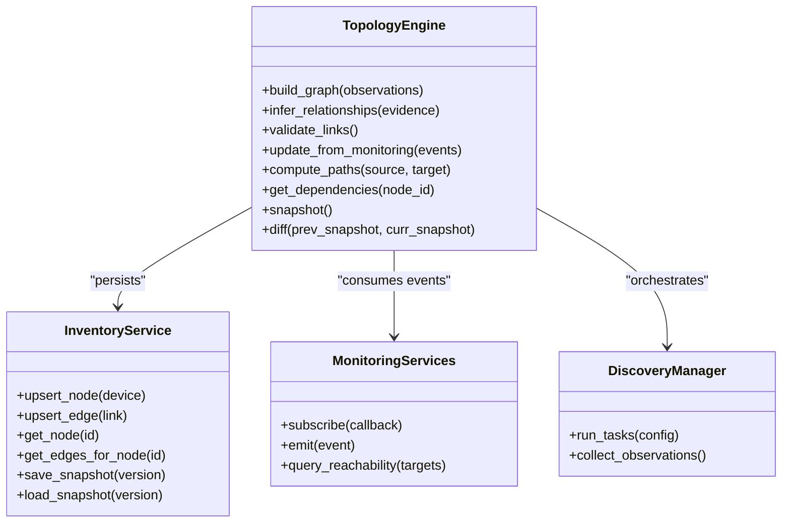
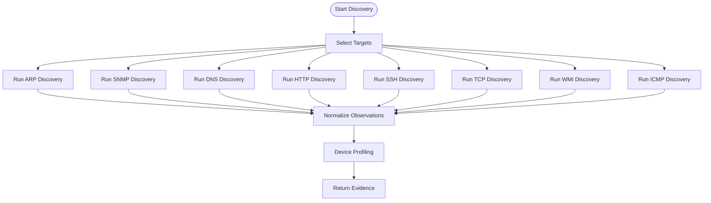
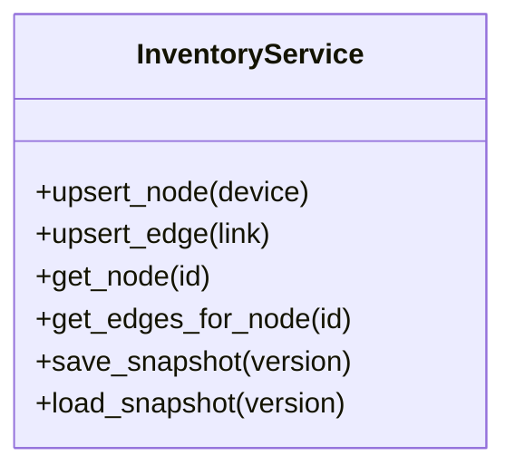
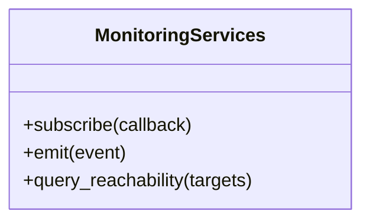
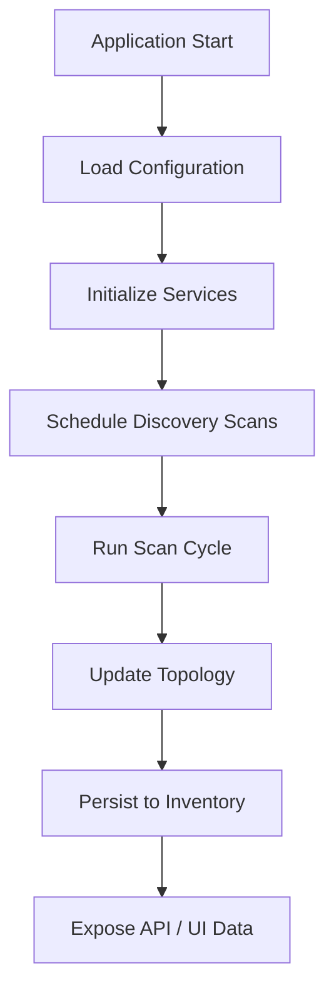
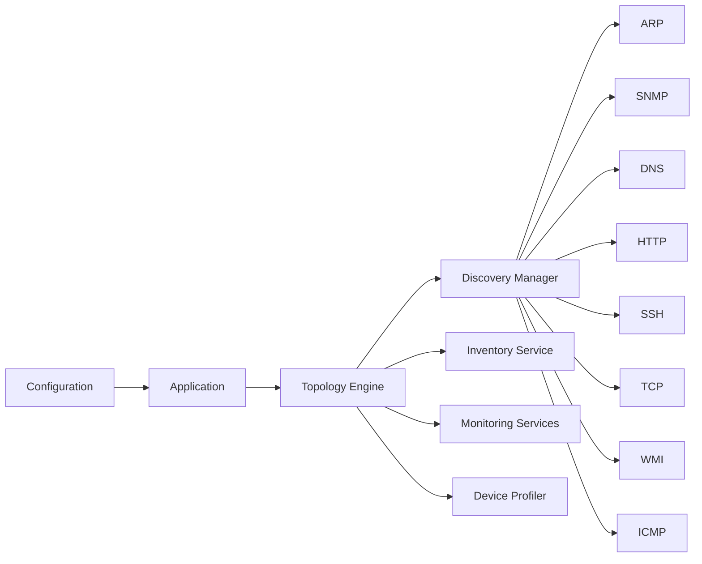

# Topology Engine

<cite>
**Referenced Files in This Document**
- [topology_engine.py](file://icmp_discovery/analytics_modules/topology_engine.py)
- [discovery_manager.py](file://icmp_discovery/discovery_manager.py)
- [arp_discovery.py](file://icmp_discovery/discovery_modules/arp_discovery.py)
- [snmp_discovery.py](file://icmp_discovery/discovery_modules/snmp_discovery.py)
- [dns_discovery.py](file://icmp_discovery/discovery_modules/dns_discovery.py)
- [http_discovery.py](file://icmp_discovery/discovery_modules/http_discovery.py)
- [ssh_discovery.py](file://icmp_discovery/discovery_modules/ssh_discovery.py)
- [tcp_discovery.py](file://icmp_discovery/discovery_modules/tcp_discovery.py)
- [wmi_discovery.py](file://icmp_discovery/discovery_modules/wmi_discovery.py)
- [icmp_discovery.py](file://icmp_discovery/discovery_modules/icmp_discovery.py)
- [device_profiler.py](file://icmp_discovery/discovery_modules/device_profiler.py)
- [inventory_service.py](file://icmp_discovery/inventory_service.py)
- [monitoring_services.py](file://icmp_discovery/monitoring_services.py)
- [app.py](file://icmp_discovery/app.py)
- [config.py](file://icmp_discovery/config.py)
</cite>

## Table of Contents
1. [Introduction](#introduction)
2. [Project Structure](#project-structure)
3. [Core Components](#core-components)
4. [Architecture Overview](#architecture-overview)
5. [Detailed Component Analysis](#detailed-component-analysis)
6. [Dependency Analysis](#dependency-analysis)
7. [Performance Considerations](#performance-considerations)
8. [Troubleshooting Guide](#troubleshooting-guide)
9. [Conclusion](#conclusion)

## Introduction
This document provides comprehensive documentation for the topology engine that performs network mapping and relationship analysis. It explains how device connections are discovered, validated, and maintained within a graph-based topology model. The document covers discovery algorithms, graph construction methods, relationship inference techniques, path analysis, dependency mapping, performance optimizations, caching strategies, real-time updates, validation, conflict resolution, and historical tracking.

## Project Structure
The topology engine resides primarily under the analytics modules and integrates with discovery, inventory, and monitoring services to build and maintain an up-to-date network graph. Key areas include:
- Analytics module implementing the core topology engine
- Discovery modules providing connection and attribute data from multiple protocols
- Inventory service managing device state and relationships
- Monitoring services enabling continuous observation and updates
- Configuration and application entry points coordinating workflows

**Diagram sources**
- [topology_engine.py](file://icmp_discovery/analytics_modules/topology_engine.py)
- [discovery_manager.py](file://icmp_discovery/discovery_manager.py)
- [inventory_service.py](file://icmp_discovery/inventory_service.py)
- [monitoring_services.py](file://icmp_discovery/monitoring_services.py)
- [app.py](file://icmp_discovery/app.py)
- [config.py](file://icmp_discovery/config.py)

**Section sources**
- [topology_engine.py](file://icmp_discovery/analytics_modules/topology_engine.py)
- [discovery_manager.py](file://icmp_discovery/discovery_manager.py)
- [inventory_service.py](file://icmp_discovery/inventory_service.py)
- [monitoring_services.py](file://icmp_discovery/monitoring_services.py)
- [app.py](file://icmp_discovery/app.py)
- [config.py](file://icmp_discovery/config.py)

## Core Components
- Topology Engine: Orchestrates discovery, builds and updates the network graph, infers relationships, validates connectivity, and supports path analysis and dependency mapping.
- Discovery Modules: Collect connection hints and device attributes via ARP, SNMP, DNS, HTTP, SSH, TCP, WMI, and ICMP. Device profiling enriches node metadata.
- Inventory Service: Maintains canonical device records, relationships, and versioned snapshots for historical tracking.
- Monitoring Services: Provides ongoing telemetry (e.g., reachability, link status) to drive real-time updates.
- Application and Configuration: Coordinates execution, schedules scans, and configures discovery parameters.

Key responsibilities:
- Graph construction: Nodes represent devices; edges represent observed or inferred links.
- Relationship inference: Combine multi-source evidence to determine link existence and type.
- Validation: Cross-check observations against thresholds and consistency rules.
- Updates: Incremental changes based on monitoring events and periodic scans.
- Path analysis: Compute shortest paths, critical nodes, and dependency chains.
- History: Maintain snapshots and diffs for change auditing.

**Section sources**
- [topology_engine.py](file://icmp_discovery/analytics_modules/topology_engine.py)
- [inventory_service.py](file://icmp_discovery/inventory_service.py)
- [monitoring_services.py](file://icmp_discovery/monitoring_services.py)

## Architecture Overview
The topology engine integrates discovery, inventory, and monitoring into a cohesive pipeline:
- Discovery modules probe networks and return raw observations.
- The topology engine normalizes observations, constructs a graph, and infers relationships.
- Inventory persists nodes, edges, and metadata with versioning.
- Monitoring feeds live signals to update the graph incrementally.
- Application orchestrates scheduling and exposes APIs for queries and visualizations.

**Diagram sources**
- [app.py](file://icmp_discovery/app.py)
- [discovery_manager.py](file://icmp_discovery/discovery_manager.py)
- [topology_engine.py](file://icmp_discovery/analytics_modules/topology_engine.py)
- [inventory_service.py](file://icmp_discovery/inventory_service.py)
- [monitoring_services.py](file://icmp_discovery/monitoring_services.py)

## Detailed Component Analysis

### Topology Engine
Responsibilities:
- Graph construction: Create nodes for devices and edges for links; assign types (physical, logical).
- Relationship inference: Fuse evidence from multiple discovery sources; apply confidence scoring and thresholds.
- Validation: Check link consistency, detect conflicts, and reconcile discrepancies.
- Path analysis: Compute shortest paths, identify bottlenecks, and map dependencies.
- Real-time updates: Apply monitoring events to adjust edge states and node attributes.
- Historical tracking: Snapshot graph versions and compute diffs for change logs.

**Diagram sources**
- [topology_engine.py](file://icmp_discovery/analytics_modules/topology_engine.py)
- [inventory_service.py](file://icmp_discovery/inventory_service.py)
- [monitoring_services.py](file://icmp_discovery/monitoring_services.py)
- [discovery_manager.py](file://icmp_discovery/discovery_manager.py)

**Section sources**
- [topology_engine.py](file://icmp_discovery/analytics_modules/topology_engine.py)

### Discovery Modules
Each discovery module contributes specific evidence:
- ARP: Local subnet neighbor detection and MAC/IP associations.
- SNMP: Interface details, neighbor tables, and device capabilities.
- DNS: Name-to-IP mappings and reverse lookups.
- HTTP: Service endpoints and banner information.
- SSH: Session enumeration and capability probing.
- TCP: Port scanning and service fingerprinting.
- WMI: Windows-specific system and network details.
- ICMP: Reachability and latency measurements.
- Device Profiler: OS and vendor identification, role classification.

**Diagram sources**
- [arp_discovery.py](file://icmp_discovery/discovery_modules/arp_discovery.py)
- [snmp_discovery.py](file://icmp_discovery/discovery_modules/snmp_discovery.py)
- [dns_discovery.py](file://icmp_discovery/discovery_modules/dns_discovery.py)
- [http_discovery.py](file://icmp_discovery/discovery_modules/http_discovery.py)
- [ssh_discovery.py](file://icmp_discovery/discovery_modules/ssh_discovery.py)
- [tcp_discovery.py](file://icmp_discovery/discovery_modules/tcp_discovery.py)
- [wmi_discovery.py](file://icmp_discovery/discovery_modules/wmi_discovery.py)
- [icmp_discovery.py](file://icmp_discovery/discovery_modules/icmp_discovery.py)
- [device_profiler.py](file://icmp_discovery/discovery_modules/device_profiler.py)

**Section sources**
- [arp_discovery.py](file://icmp_discovery/discovery_modules/arp_discovery.py)
- [snmp_discovery.py](file://icmp_discovery/discovery_modules/snmp_discovery.py)
- [dns_discovery.py](file://icmp_discovery/discovery_modules/dns_discovery.py)
- [http_discovery.py](file://icmp_discovery/discovery_modules/http_discovery.py)
- [ssh_discovery.py](file://icmp_discovery/discovery_modules/ssh_discovery.py)
- [tcp_discovery.py](file://icmp_discovery/discovery_modules/tcp_discovery.py)
- [wmi_discovery.py](file://icmp_discovery/discovery_modules/wmi_discovery.py)
- [icmp_discovery.py](file://icmp_discovery/discovery_modules/icmp_discovery.py)
- [device_profiler.py](file://icmp_discovery/discovery_modules/device_profiler.py)

### Inventory Service
Responsibilities:
- Upsert nodes and edges with attributes and timestamps.
- Provide retrieval methods for querying current state.
- Save and load snapshots for historical tracking and diffing.

**Diagram sources**
- [inventory_service.py](file://icmp_discovery/inventory_service.py)

**Section sources**
- [inventory_service.py](file://icmp_discovery/inventory_service.py)

### Monitoring Services
Responsibilities:
- Subscribe to and emit events such as reachability changes and link status updates.
- Query reachability for targeted targets to feed topology updates.

**Diagram sources**
- [monitoring_services.py](file://icmp_discovery/monitoring_services.py)

**Section sources**
- [monitoring_services.py](file://icmp_discovery/monitoring_services.py)

### Application and Configuration
Responsibilities:
- Application entry coordinates lifecycle, schedules scans, and exposes interfaces for topology queries.
- Configuration defines discovery scopes, intervals, and protocol settings.

**Diagram sources**
- [app.py](file://icmp_discovery/app.py)
- [config.py](file://icmp_discovery/config.py)

**Section sources**
- [app.py](file://icmp_discovery/app.py)
- [config.py](file://icmp_discovery/config.py)

## Dependency Analysis
The topology engine depends on discovery modules for evidence, inventory for persistence, and monitoring for live updates. The application orchestrates these components and configuration drives behavior.

**Diagram sources**
- [topology_engine.py](file://icmp_discovery/analytics_modules/topology_engine.py)
- [discovery_manager.py](file://icmp_discovery/discovery_manager.py)
- [inventory_service.py](file://icmp_discovery/inventory_service.py)
- [monitoring_services.py](file://icmp_discovery/monitoring_services.py)
- [app.py](file://icmp_discovery/app.py)
- [config.py](file://icmp_discovery/config.py)

**Section sources**
- [topology_engine.py](file://icmp_discovery/analytics_modules/topology_engine.py)
- [discovery_manager.py](file://icmp_discovery/discovery_manager.py)
- [inventory_service.py](file://icmp_discovery/inventory_service.py)
- [monitoring_services.py](file://icmp_discovery/monitoring_services.py)
- [app.py](file://icmp_discovery/app.py)
- [config.py](file://icmp_discovery/config.py)

## Performance Considerations
Optimizations for large topologies:
- Incremental updates: Apply only changed edges/nodes from monitoring events rather than full rebuilds.
- Parallel discovery: Execute independent discovery modules concurrently where safe.
- Caching: Cache resolved DNS entries, SNMP responses, and recent reachability results with TTLs.
- Batching: Batch inventory writes and snapshot saves to reduce I/O overhead.
- Pruning: Remove stale nodes/edges based on inactivity thresholds.
- Indexing: Maintain indexes by IP, hostname, and interface identifiers for fast queries.
- Sampling: For very large networks, sample targets per subnet to control scan volume.

Caching strategies:
- Protocol-level caches (DNS, SNMP, ARP tables) with expiration policies.
- Graph-level caches for computed paths and dependency sets.
- Event-driven invalidation when underlying data changes.

Real-time updates:
- Stream monitoring events to the topology engine for immediate edge state adjustments.
- Debounce rapid fluctuations to avoid churn in the graph.

[No sources needed since this section provides general guidance]

## Troubleshooting Guide
Common issues and resolutions:
- Missing neighbors: Verify ARP and SNMP access permissions and VLAN scope.
- Inconsistent links: Increase evidence threshold and review conflicting observations.
- Slow scans: Reduce parallelism or enable sampling; check network latency and timeouts.
- Stale data: Adjust cache TTLs and increase monitoring event frequency.
- Snapshot inconsistencies: Ensure atomic writes and consistent versioning during updates.

Validation and conflict resolution:
- Cross-validate ARP vs SNMP neighbor tables; prefer authoritative sources.
- Use confidence scores to weigh evidence; resolve conflicts by majority or source priority.
- Log discrepancies and provide audit trails for manual review.

Historical tracking:
- Compare snapshots to identify added/removed nodes and edges.
- Generate change reports for compliance and incident response.

**Section sources**
- [topology_engine.py](file://icmp_discovery/analytics_modules/topology_engine.py)
- [inventory_service.py](file://icmp_discovery/inventory_service.py)
- [monitoring_services.py](file://icmp_discovery/monitoring_services.py)

## Conclusion
The topology engine integrates diverse discovery sources to construct and maintain a robust network graph. Through evidence fusion, validation, and real-time updates, it delivers accurate topology visualization, path analysis, and dependency mapping. With careful performance tuning, caching, and historical tracking, it scales to large networks while supporting operational needs like troubleshooting and change management.

[No sources needed since this section summarizes without analyzing specific files]