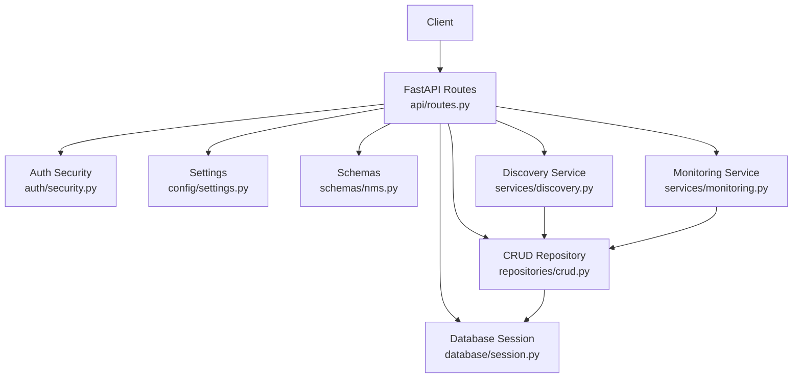
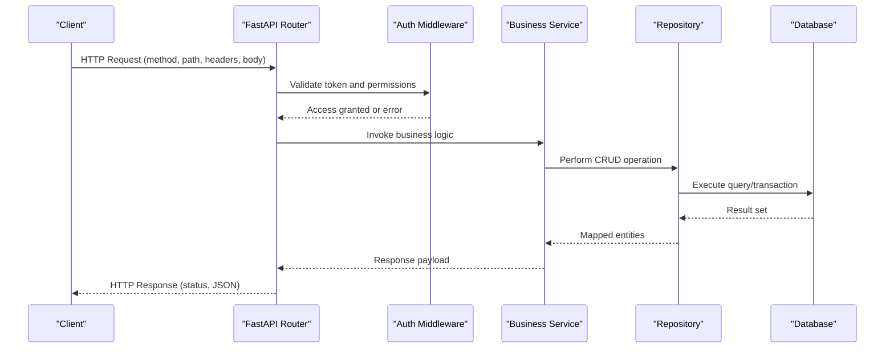
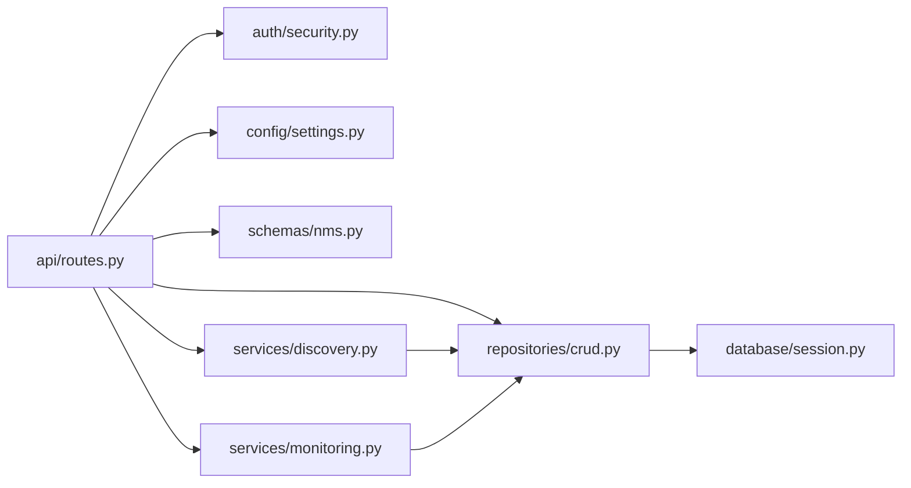

# API Endpoints Reference

<cite>
**Referenced Files in This Document**
- [main.py](file://backend/main.py)
- [routes.py](file://backend/api/routes.py)
- [security.py](file://backend/auth/security.py)
- [settings.py](file://backend/config/settings.py)
- [session.py](file://backend/database/session.py)
- [crud.py](file://backend/repositories/crud.py)
- [nms.py](file://backend/schemas/nms.py)
- [discovery.py](file://backend/services/discovery.py)
- [monitoring.py](file://backend/services/monitoring.py)
- [crypto.py](file://backend/utils/crypto.py)
</cite>

## Table of Contents
1. [Introduction](#introduction)
2. [Project Structure](#project-structure)
3. [Core Components](#core-components)
4. [Architecture Overview](#architecture-overview)
5. [Detailed Component Analysis](#detailed-component-analysis)
6. [Dependency Analysis](#dependency-analysis)
7. [Performance Considerations](#performance-considerations)
8. [Troubleshooting Guide](#troubleshooting-guide)
9. [Conclusion](#conclusion)

## Introduction
This document provides comprehensive API endpoint documentation for the FastAPI backend. It covers HTTP methods, URL patterns, request/response schemas, authentication requirements, parameter specifications, validation rules, error responses, and status codes. It also includes practical examples using curl or Python requests, and documents rate limiting, pagination, filtering, sorting, security considerations, input validation, and error handling strategies.

## Project Structure
The backend is organized into modular components:
- API routes define endpoints and request/response models.
- Authentication utilities handle token-based access control.
- Configuration centralizes settings such as environment variables and security parameters.
- Database session management handles connection lifecycle.
- Repositories implement CRUD operations against data stores.
- Schemas define Pydantic models for request and response validation.
- Services encapsulate business logic for discovery and monitoring.
- Utilities provide cryptographic helpers.

**Diagram sources**
- [routes.py](file://backend/api/routes.py)
- [security.py](file://backend/auth/security.py)
- [settings.py](file://backend/config/settings.py)
- [session.py](file://backend/database/session.py)
- [crud.py](file://backend/repositories/crud.py)
- [nms.py](file://backend/schemas/nms.py)
- [discovery.py](file://backend/services/discovery.py)
- [monitoring.py](file://backend/services/monitoring.py)

**Section sources**
- [main.py](file://backend/main.py)
- [routes.py](file://backend/api/routes.py)

## Core Components
- API Routes: Define REST endpoints with path parameters, query parameters, request bodies, and response models.
- Authentication: Token-based access control via JWT or similar mechanisms.
- Settings: Centralized configuration for database URLs, secrets, and feature flags.
- Database Session: Manages connections and transactions.
- CRUD Repository: Encapsulates data access logic.
- Schemas: Pydantic models for validation and serialization.
- Services: Business logic for device discovery and network monitoring.
- Crypto Utils: Hashing and encryption helpers.

Key responsibilities:
- Input validation through Pydantic schemas.
- Error handling with standardized HTTP status codes.
- Secure authentication and authorization checks.
- Efficient data retrieval and mutation via repositories.

**Section sources**
- [routes.py](file://backend/api/routes.py)
- [security.py](file://backend/auth/security.py)
- [settings.py](file://backend/config/settings.py)
- [session.py](file://backend/database/session.py)
- [crud.py](file://backend/repositories/crud.py)
- [nms.py](file://backend/schemas/nms.py)
- [discovery.py](file://backend/services/discovery.py)
- [monitoring.py](file://backend/services/monitoring.py)

## Architecture Overview
The FastAPI application exposes REST endpoints that validate inputs, enforce authentication, delegate to services and repositories, and return structured JSON responses.

**Diagram sources**
- [routes.py](file://backend/api/routes.py)
- [security.py](file://backend/auth/security.py)
- [crud.py](file://backend/repositories/crud.py)
- [session.py](file://backend/database/session.py)

## Detailed Component Analysis

### Authentication and Authorization
- Mechanism: Token-based authentication (e.g., JWT).
- Scope: Protects sensitive endpoints; public endpoints may be allowed without tokens.
- Validation: Tokens are verified on each request; invalid or expired tokens result in 401 Unauthorized.
- Security: Secrets stored securely via settings; tokens signed and validated server-side.

Common behaviors:
- Missing token: 401 Unauthorized.
- Invalid/expired token: 401 Unauthorized.
- Insufficient permissions: 403 Forbidden.

Example curl:
- curl -H "Authorization: Bearer <token>" https://api.example.com/v1/resource

**Section sources**
- [security.py](file://backend/auth/security.py)
- [settings.py](file://backend/config/settings.py)

### Rate Limiting
- Strategy: Apply per-client or per-endpoint limits using middleware or dependency injection.
- Behavior: Exceeding limits returns 429 Too Many Requests with retry-after guidance.
- Configuration: Limits defined in settings; can vary by endpoint or user role.

Example curl:
- curl -i https://api.example.com/v1/resource
- Observe response headers for X-RateLimit-Limit, X-RateLimit-Remaining, Retry-After.

**Section sources**
- [settings.py](file://backend/config/settings.py)
- [routes.py](file://backend/api/routes.py)

### Pagination
- Parameters: page, limit, offset.
- Behavior: Returns paginated results with metadata (total, has_next, has_prev).
- Validation: Enforces positive integers and maximum limits.

Example curl:
- curl "https://api.example.com/v1/resources?page=1&limit=20"

**Section sources**
- [routes.py](file://backend/api/routes.py)
- [crud.py](file://backend/repositories/crud.py)

### Filtering and Sorting
- Query parameters: field=value, sort_by=field, order=asc|desc.
- Behavior: Filters results based on provided fields; sorts by specified field and direction.
- Validation: Whitelists allowed fields and values; rejects unknown filters.

Example curl:
- curl "https://api.example.com/v1/resources?status=active&sort_by=name&order=asc"

**Section sources**
- [routes.py](file://backend/api/routes.py)
- [crud.py](file://backend/repositories/crud.py)

### Discovery Endpoints
- Purpose: Trigger device discovery scans and retrieve scan status/results.
- Methods: POST to start a scan; GET to fetch status or results.
- Authentication: Requires valid token.
- Validation: Payload includes target ranges, protocols, and options.

Example curl:
- Start scan: curl -X POST -H "Authorization: Bearer <token>" -H "Content-Type: application/json" -d '{"targets":["192.168.1.0/24"],"protocols":["icmp","arp"]}' https://api.example.com/v1/discovery/scans
- Get status: curl -H "Authorization: Bearer <token>" https://api.example.com/v1/discovery/scans/<scan_id>/status

**Section sources**
- [routes.py](file://backend/api/routes.py)
- [discovery.py](file://backend/services/discovery.py)
- [crud.py](file://backend/repositories/crud.py)

### Monitoring Endpoints
- Purpose: Retrieve monitoring metrics, alerts, and device health.
- Methods: GET for metrics and alerts; POST to configure monitoring tasks.
- Authentication: Requires valid token.
- Validation: Query parameters include time ranges, device IDs, and metric types.

Example curl:
- Get metrics: curl -H "Authorization: Bearer <token>" "https://api.example.com/v1/monitoring/metrics?device_id=abc123&from=2024-01-01T00:00:00Z&to=2024-01-31T23:59:59Z"
- Configure task: curl -X POST -H "Authorization: Bearer <token>" -H "Content-Type: application/json" -d '{"device_id":"abc123","interval_seconds":60,"metrics":["cpu","memory"]}' https://api.example.com/v1/monitoring/tasks

**Section sources**
- [routes.py](file://backend/api/routes.py)
- [monitoring.py](file://backend/services/monitoring.py)
- [crud.py](file://backend/repositories/crud.py)

### Resource CRUD Endpoints
- Purpose: Manage core resources (e.g., devices, users, configurations).
- Methods: GET list, GET by ID, POST create, PUT update, DELETE remove.
- Authentication: Required for write operations; read-only may be public depending on policy.
- Validation: Pydantic schemas enforce required fields, formats, and constraints.

Example curl:
- List: curl -H "Authorization: Bearer <token>" https://api.example.com/v1/devices
- Create: curl -X POST -H "Authorization: Bearer <token>" -H "Content-Type: application/json" -d '{"name":"Device A","ip":"192.168.1.10"}' https://api.example.com/v1/devices
- Update: curl -X PUT -H "Authorization: Bearer <token>" -H "Content-Type: application/json" -d '{"name":"Device A Updated"}' https://api.example.com/v1/devices/<id>
- Delete: curl -X DELETE -H "Authorization: Bearer <token>" https://api.example.com/v1/devices/<id>

**Section sources**
- [routes.py](file://backend/api/routes.py)
- [nms.py](file://backend/schemas/nms.py)
- [crud.py](file://backend/repositories/crud.py)

### Utility Endpoints
- Purpose: Health checks, version info, and system diagnostics.
- Methods: GET /health, GET /version.
- Authentication: Typically public.
- Validation: Minimal; returns simple JSON payloads.

Example curl:
- curl https://api.example.com/v1/health
- curl https://api.example.com/v1/version

**Section sources**
- [routes.py](file://backend/api/routes.py)

## Dependency Analysis
The API layer depends on authentication, configuration, database sessions, repositories, schemas, and services.

**Diagram sources**
- [routes.py](file://backend/api/routes.py)
- [security.py](file://backend/auth/security.py)
- [settings.py](file://backend/config/settings.py)
- [crud.py](file://backend/repositories/crud.py)
- [nms.py](file://backend/schemas/nms.py)
- [discovery.py](file://backend/services/discovery.py)
- [monitoring.py](file://backend/services/monitoring.py)
- [session.py](file://backend/database/session.py)

**Section sources**
- [routes.py](file://backend/api/routes.py)
- [crud.py](file://backend/repositories/crud.py)

## Performance Considerations
- Use pagination to limit payload sizes.
- Apply filtering and sorting at the repository level to reduce memory usage.
- Cache frequently accessed data where appropriate.
- Avoid N+1 queries; batch operations when possible.
- Monitor slow endpoints and optimize database queries.

[No sources needed since this section provides general guidance]

## Troubleshooting Guide
Common errors and resolutions:
- 401 Unauthorized: Ensure valid token in Authorization header.
- 403 Forbidden: Check user roles and permissions.
- 429 Too Many Requests: Reduce request frequency or adjust rate limits.
- 400 Bad Request: Validate request schema; check required fields and formats.
- 404 Not Found: Verify resource IDs and paths.
- 500 Internal Server Error: Review logs and stack traces; check database connectivity.

Debugging steps:
- Enable detailed logging for API requests.
- Inspect request payloads and headers.
- Validate schemas locally before sending requests.
- Test endpoints with minimal payloads to isolate issues.

**Section sources**
- [routes.py](file://backend/api/routes.py)
- [security.py](file://backend/auth/security.py)

## Conclusion
This reference outlines the FastAPI backend’s REST endpoints, including authentication, rate limiting, pagination, filtering, sorting, and error handling. Use the provided examples and guidelines to integrate clients effectively and maintain secure, performant interactions with the API.

[No sources needed since this section summarizes without analyzing specific files]