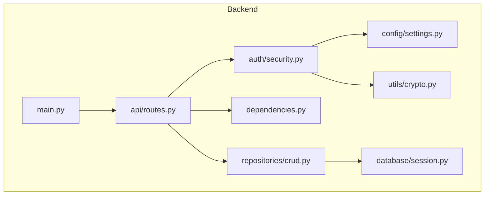
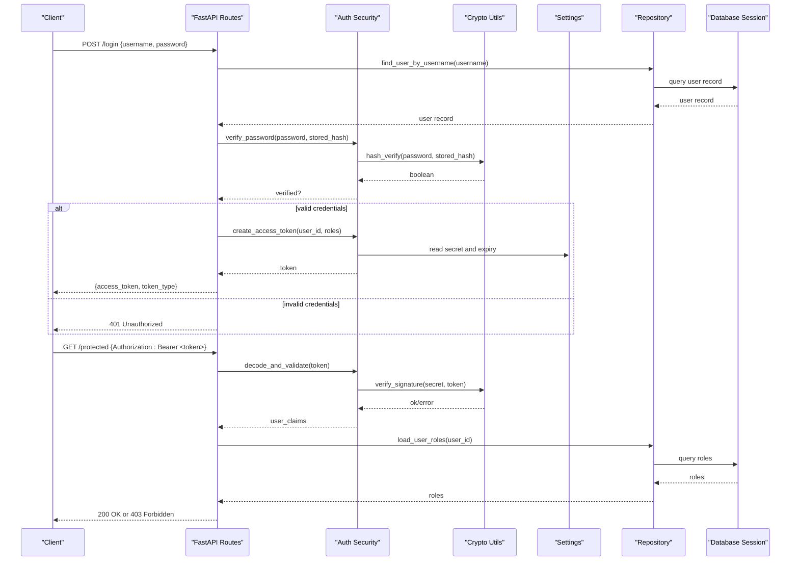
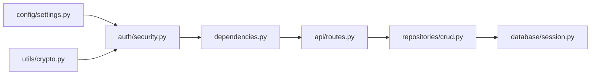

# Authentication & Security

<cite>
**Referenced Files in This Document**
- [main.py](file://backend/main.py)
- [security.py](file://backend/auth/security.py)
- [routes.py](file://backend/api/routes.py)
- [settings.py](file://backend/config/settings.py)
- [session.py](file://backend/database/session.py)
- [crud.py](file://backend/repositories/crud.py)
- [crypto.py](file://backend/utils/crypto.py)
- [dependencies.py](file://backend/dependencies.py)
</cite>

## Table of Contents
1. [Introduction](#introduction)
2. [Project Structure](#project-structure)
3. [Core Components](#core-components)
4. [Architecture Overview](#architecture-overview)
5. [Detailed Component Analysis](#detailed-component-analysis)
6. [Dependency Analysis](#dependency-analysis)
7. [Performance Considerations](#performance-considerations)
8. [Troubleshooting Guide](#troubleshooting-guide)
9. [Conclusion](#conclusion)
10. [Appendices](#appendices)

## Introduction
This document explains the authentication and authorization system implemented in the backend. It covers JWT token issuance and validation, password hashing, session management, security middleware, dependency injection patterns for auth context, access control mechanisms (including role-based access control), protected routes, token refresh flows, security best practices, vulnerability prevention, audit logging, and troubleshooting guidance. The goal is to help developers understand how to implement secure endpoints and maintain a robust security posture.

## Project Structure
The authentication and authorization features are primarily located under the backend package:
- API layer defines protected routes and request handling
- Auth module implements JWT and security utilities
- Config module centralizes settings such as secrets and token parameters
- Database session manages persistence
- Repositories provide data operations used by auth flows
- Utilities include cryptographic helpers
- Dependencies module wires up FastAPI dependencies for auth context

**Diagram sources**
- [main.py](file://backend/main.py)
- [routes.py](file://backend/api/routes.py)
- [security.py](file://backend/auth/security.py)
- [settings.py](file://backend/config/settings.py)
- [session.py](file://backend/database/session.py)
- [crud.py](file://backend/repositories/crud.py)
- [crypto.py](file://backend/utils/crypto.py)
- [dependencies.py](file://backend/dependencies.py)

**Section sources**
- [main.py](file://backend/main.py)
- [routes.py](file://backend/api/routes.py)
- [security.py](file://backend/auth/security.py)
- [settings.py](file://backend/config/settings.py)
- [session.py](file://backend/database/session.py)
- [crud.py](file://backend/repositories/crud.py)
- [crypto.py](file://backend/utils/crypto.py)
- [dependencies.py](file://backend/dependencies.py)

## Core Components
- JWT Token Implementation: Issuance, payload construction, signing, expiration, and verification.
- Password Hashing: Secure hashing with salted algorithms and parameter tuning.
- Session Management: Optional server-side session storage and token lifecycle coordination.
- Security Middleware: Request/response hooks for token extraction, validation, and error handling.
- Dependency Injection: FastAPI dependencies that inject authenticated user context into route handlers.
- Access Control: Role-based checks applied at route or handler level.

Key responsibilities:
- Extract tokens from Authorization headers
- Validate signatures and claims
- Resolve user identity and roles
- Enforce permissions before business logic executes
- Log security events for auditing

**Section sources**
- [security.py](file://backend/auth/security.py)
- [crypto.py](file://backend/utils/crypto.py)
- [settings.py](file://backend/config/settings.py)
- [dependencies.py](file://backend/dependencies.py)
- [routes.py](file://backend/api/routes.py)

## Architecture Overview
The authentication flow integrates with the API layer via FastAPI dependencies. Tokens are issued upon successful login, validated on subsequent requests, and enforced through role-based policies.

**Diagram sources**
- [routes.py](file://backend/api/routes.py)
- [security.py](file://backend/auth/security.py)
- [crypto.py](file://backend/utils/crypto.py)
- [settings.py](file://backend/config/settings.py)
- [crud.py](file://backend/repositories/crud.py)
- [session.py](file://backend/database/session.py)

## Detailed Component Analysis

### JWT Token Implementation
Responsibilities:
- Construct payloads with user identifiers and roles
- Sign tokens using configured secrets and algorithms
- Set appropriate expiration times
- Decode and validate incoming tokens

Implementation highlights:
- Secret key and algorithm sourced from configuration
- Expiration handled via configurable TTL
- Payload includes minimal necessary claims
- Validation rejects malformed or expired tokens

Security considerations:
- Use strong, rotated secrets
- Prefer short-lived access tokens
- Avoid storing sensitive data in payloads
- Validate all claims strictly

**Section sources**
- [security.py](file://backend/auth/security.py)
- [settings.py](file://backend/config/settings.py)

### Password Hashing
Responsibilities:
- Hash passwords securely during registration
- Verify passwords during login
- Ensure consistent hashing parameters

Implementation highlights:
- Salted hashing with recommended parameters
- Constant-time comparison to prevent timing attacks
- Centralized hashing utility for consistency

Security considerations:
- Do not store plaintext passwords
- Rotate hashing algorithms when needed
- Monitor performance implications of high iteration counts

**Section sources**
- [crypto.py](file://backend/utils/crypto.py)
- [security.py](file://backend/auth/security.py)

### User Session Management
Responsibilities:
- Manage optional server-side sessions alongside JWTs
- Coordinate token lifecycle and revocation if needed
- Persist session metadata securely

Implementation highlights:
- Database-backed session storage
- Clean-up of expired sessions
- Integration with repository layer

Security considerations:
- Bind sessions to client fingerprints where feasible
- Invalidate sessions on logout or suspicious activity
- Encrypt sensitive session data

**Section sources**
- [session.py](file://backend/database/session.py)
- [crud.py](file://backend/repositories/crud.py)

### Security Middleware and Protected Routes
Responsibilities:
- Extract Authorization header
- Validate tokens and resolve user context
- Apply role-based access control
- Return standardized error responses

Implementation highlights:
- FastAPI dependency injection for auth context
- Centralized error handling for auth failures
- Consistent response shapes for success and failure

Security considerations:
- Reject missing or malformed headers
- Enforce least privilege per endpoint
- Log failed attempts for auditing

**Section sources**
- [routes.py](file://backend/api/routes.py)
- [dependencies.py](file://backend/dependencies.py)
- [security.py](file://backend/auth/security.py)

### Dependency Injection Patterns
Responsibilities:
- Provide current_user and role context to handlers
- Centralize token decoding and validation
- Simplify route definitions with reusable dependencies

Implementation highlights:
- FastAPI Depends() usage for auth resolution
- Reusable decorators or dependencies for RBAC checks
- Clear separation between auth logic and business logic

Security considerations:
- Ensure dependencies fail fast on invalid tokens
- Avoid leaking internal errors to clients
- Keep auth dependencies stateless where possible

**Section sources**
- [dependencies.py](file://backend/dependencies.py)
- [routes.py](file://backend/api/routes.py)

### Access Control Mechanisms (RBAC)
Responsibilities:
- Map users to roles and permissions
- Enforce role checks at route boundaries
- Support fine-grained permission checks when needed

Implementation highlights:
- Role attributes included in token payload
- Route-level guards checking required roles
- Centralized policy evaluation for complex scenarios

Security considerations:
- Default deny unless explicitly allowed
- Regularly review role assignments
- Audit role changes and privileged actions

**Section sources**
- [routes.py](file://backend/api/routes.py)
- [dependencies.py](file://backend/dependencies.py)
- [security.py](file://backend/auth/security.py)

### Token Refresh Flow
Responsibilities:
- Issue refresh tokens with longer lifetimes
- Validate refresh tokens and issue new access tokens
- Rotate refresh tokens to mitigate replay attacks

Implementation highlights:
- Separate endpoints for refresh and revoke
- Store refresh tokens securely with binding info
- Enforce single-use or rotation policies

Security considerations:
- Short-lived access tokens
- Secure storage of refresh tokens on clients
- Detect and block suspicious refresh patterns

**Section sources**
- [security.py](file://backend/auth/security.py)
- [routes.py](file://backend/api/routes.py)

### Audit Logging
Responsibilities:
- Log authentication events (login, logout, failures)
- Record authorization decisions and violations
- Capture relevant context without sensitive data

Implementation highlights:
- Structured logs with timestamps and correlation IDs
- Centralized logging configuration
- Redaction of secrets and tokens

Security considerations:
- Avoid logging sensitive payloads
- Protect log integrity and retention policies
- Alert on anomalous patterns

**Section sources**
- [routes.py](file://backend/api/routes.py)
- [security.py](file://backend/auth/security.py)

## Dependency Analysis
The authentication subsystem depends on configuration, cryptography, database, and repository layers.

**Diagram sources**
- [settings.py](file://backend/config/settings.py)
- [crypto.py](file://backend/utils/crypto.py)
- [security.py](file://backend/auth/security.py)
- [dependencies.py](file://backend/dependencies.py)
- [routes.py](file://backend/api/routes.py)
- [crud.py](file://backend/repositories/crud.py)
- [session.py](file://backend/database/session.py)

**Section sources**
- [settings.py](file://backend/config/settings.py)
- [crypto.py](file://backend/utils/crypto.py)
- [security.py](file://backend/auth/security.py)
- [dependencies.py](file://backend/dependencies.py)
- [routes.py](file://backend/api/routes.py)
- [crud.py](file://backend/repositories/crud.py)
- [session.py](file://backend/database/session.py)

## Performance Considerations
- Minimize payload size in JWTs to reduce bandwidth and parsing overhead
- Cache user lookups where safe to avoid repeated database queries
- Use efficient hashing algorithms tuned for your environment
- Implement rate limiting on authentication endpoints
- Avoid synchronous I/O in hot paths; prefer async operations where applicable

[No sources needed since this section provides general guidance]

## Troubleshooting Guide
Common issues and resolutions:
- Invalid token errors: Check signature, expiration, and secret alignment
- Missing Authorization header: Ensure clients send bearer tokens correctly
- Role denied: Verify user roles and required permissions per endpoint
- Login failures: Confirm password hashing consistency and stored hashes
- Session mismatches: Inspect session storage and expiration policies
- Audit gaps: Validate logging configuration and event emission points

Debugging techniques:
- Enable verbose logging for auth flows
- Add correlation IDs to trace requests across services
- Validate token contents in development environments safely
- Use test fixtures for known-good tokens and user records

**Section sources**
- [routes.py](file://backend/api/routes.py)
- [security.py](file://backend/auth/security.py)
- [dependencies.py](file://backend/dependencies.py)

## Conclusion
The authentication and authorization system combines JWT-based token management, secure password hashing, and role-based access control with FastAPI’s dependency injection. By following the outlined best practices and leveraging the provided components, you can implement protected routes, enforce RBAC, and maintain a secure, auditable authentication flow.

[No sources needed since this section summarizes without analyzing specific files]

## Appendices

### Example: Implementing Protected Routes
- Define an endpoint requiring a valid token
- Inject the authenticated user context via dependencies
- Return appropriate responses for unauthorized or forbidden cases

**Section sources**
- [routes.py](file://backend/api/routes.py)
- [dependencies.py](file://backend/dependencies.py)

### Example: Role-Based Access Control
- Require specific roles for sensitive endpoints
- Use centralized guards to check roles against token claims
- Fail fast with clear error messages

**Section sources**
- [routes.py](file://backend/api/routes.py)
- [security.py](file://backend/auth/security.py)

### Example: Token Refresh Flow
- Provide a refresh endpoint that validates refresh tokens
- Issue new access tokens upon successful validation
- Revoke old refresh tokens to prevent reuse

**Section sources**
- [security.py](file://backend/auth/security.py)
- [routes.py](file://backend/api/routes.py)