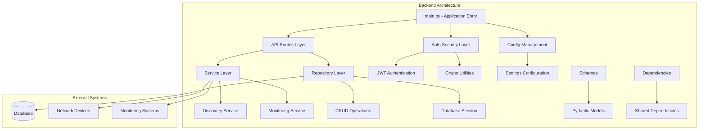
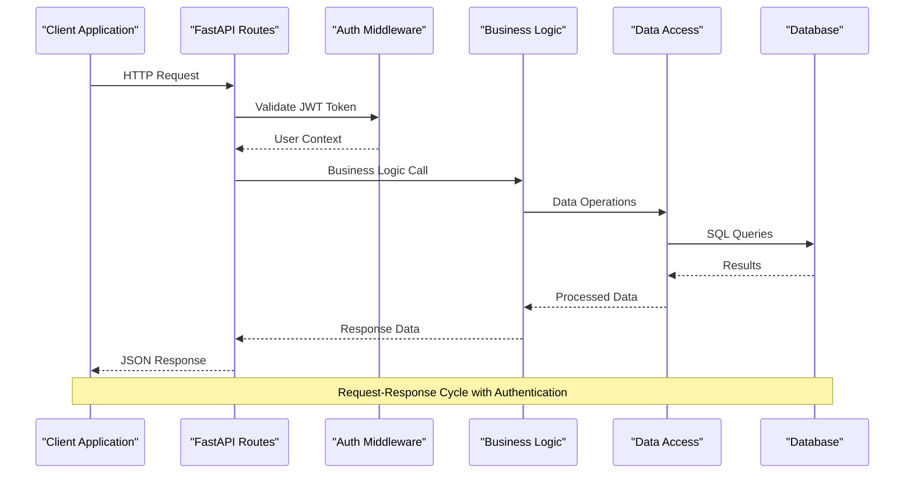
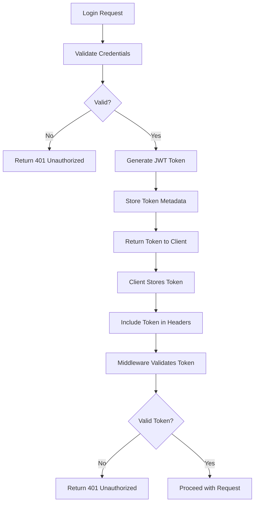
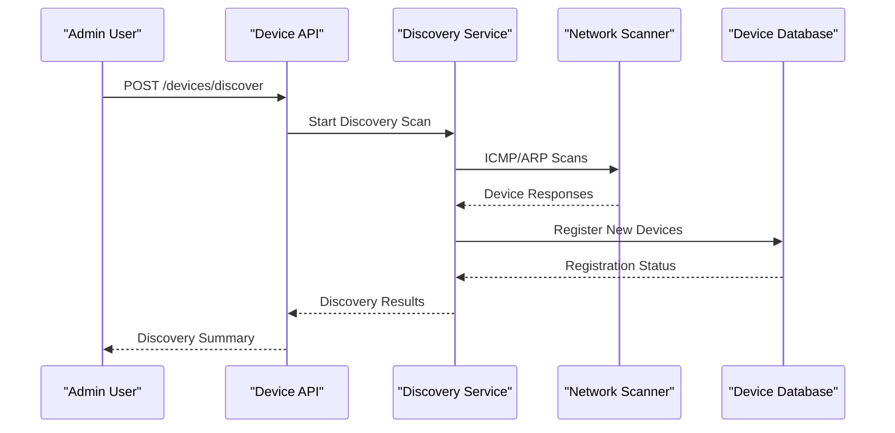
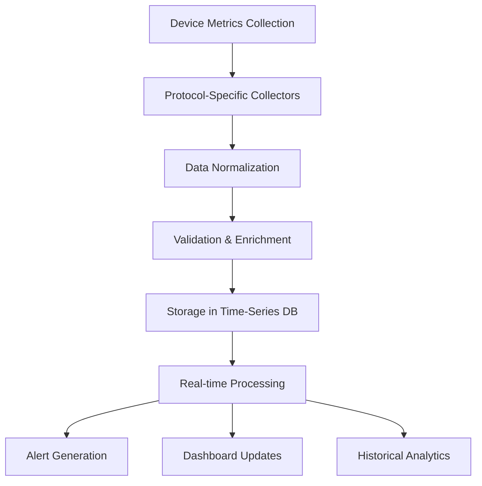
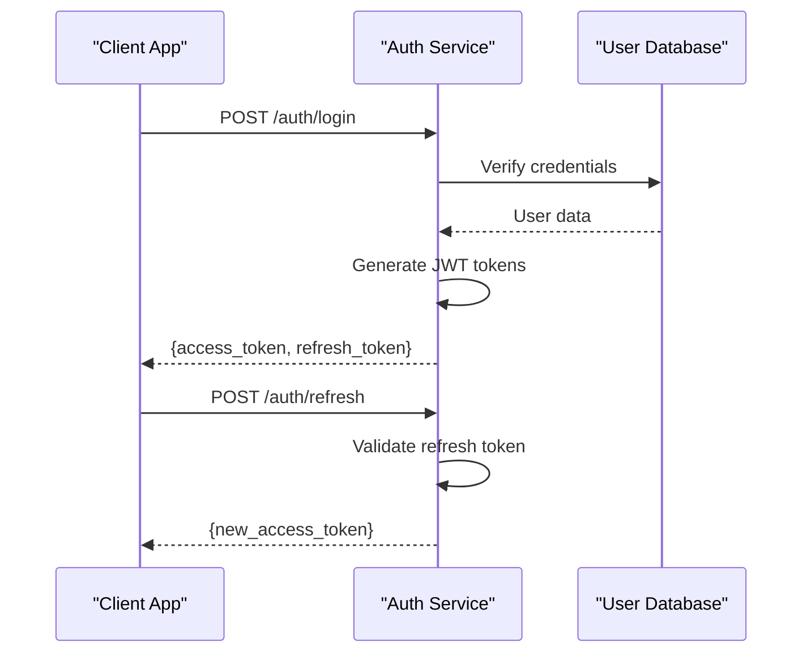
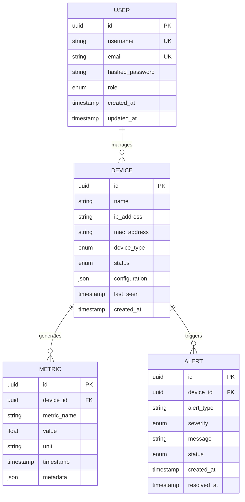

# Backend API Services

<cite>
**Referenced Files in This Document**
- [main.py](file://backend/main.py)
- [routes.py](file://backend/api/routes.py)
- [security.py](file://backend/auth/security.py)
- [settings.py](file://backend/config/settings.py)
- [session.py](file://backend/database/session.py)
- [nms.py](file://backend/schemas/nms.py)
- [crud.py](file://backend/repositories/crud.py)
- [discovery.py](file://backend/services/discovery.py)
- [monitoring.py](file://backend/services/monitoring.py)
- [crypto.py](file://backend/utils/crypto.py)
- [dependencies.py](file://backend/dependencies.py)
- [init_db.py](file://backend/init_db.py)
- [seed.py](file://backend/seed.py)
</cite>

## Table of Contents
1. [Introduction](#introduction)
2. [Project Structure](#project-structure)
3. [Core Components](#core-components)
4. [Architecture Overview](#architecture-overview)
5. [Detailed Component Analysis](#detailed-component-analysis)
6. [API Endpoints Documentation](#api-endpoints-documentation)
7. [Authentication & Authorization](#authentication--authorization)
8. [Database Models](#database-models)
9. [Request/Response Schemas](#requestresponse-schemas)
10. [Error Handling](#error-handling)
11. [Security Considerations](#security-considerations)
12. [Rate Limiting](#rate-limiting)
13. [API Versioning](#api-versioning)
14. [Integration Examples](#integration-examples)
15. [Troubleshooting Guide](#troubleshooting-guide)
16. [Conclusion](#conclusion)

## Introduction

This document provides comprehensive API documentation for the FastAPI backend services that manage device inventory, monitoring data retrieval, and system administration. The backend implements a modern RESTful API architecture with JWT-based authentication, comprehensive input validation, and robust error handling mechanisms.

The system is designed to handle network device discovery, monitoring metrics collection, and administrative operations through a well-structured API layer built with FastAPI, SQLAlchemy for database operations, and Pydantic for data validation.

## Project Structure

The backend follows a modular architecture with clear separation of concerns:



**Diagram sources**
- [main.py:1-50](file://backend/main.py#L1-L50)
- [routes.py:1-100](file://backend/api/routes.py#L1-L100)
- [security.py:1-80](file://backend/auth/security.py#L1-L80)

**Section sources**
- [main.py:1-100](file://backend/main.py#L1-L100)
- [requirements.txt:1-50](file://backend/requirements.txt#L1-L50)

## Core Components

The backend consists of several core components working together to provide comprehensive device management and monitoring capabilities:

### Application Entry Point
The main application initializes FastAPI, configures middleware, sets up CORS policies, and registers all API routes. It handles application lifecycle events and global configuration.

### API Routes Layer
Routes are organized by functionality (device management, monitoring, administration) and implement proper HTTP methods, request validation, and response formatting.

### Authentication & Security
JWT-based authentication with token validation, role-based authorization, and secure password handling using cryptographic utilities.

### Database Layer
SQLAlchemy ORM models with session management, CRUD operations, and transaction handling for device inventory and monitoring data.

### Service Layer
Business logic implementation including device discovery algorithms, monitoring data processing, and integration with external systems.

**Section sources**
- [main.py:1-150](file://backend/main.py#L1-L150)
- [routes.py:1-200](file://backend/api/routes.py#L1-L200)
- [security.py:1-120](file://backend/auth/security.py#L1-L120)

## Architecture Overview

The backend follows a layered architecture pattern with clear separation between presentation, business logic, and data access layers:



**Diagram sources**
- [routes.py:1-100](file://backend/api/routes.py#L1-L100)
- [security.py:1-80](file://backend/auth/security.py#L1-L80)
- [crud.py:1-150](file://backend/repositories/crud.py#L1-L150)

## Detailed Component Analysis

### Authentication System
The authentication system implements JWT tokens with configurable expiration times, refresh token support, and role-based access control.

#### JWT Token Flow


**Diagram sources**
- [security.py:1-120](file://backend/auth/security.py#L1-L120)
- [dependencies.py:1-100](file://backend/dependencies.py#L1-L100)

### Device Management System
Handles complete device lifecycle including discovery, registration, status updates, and configuration management.

#### Device Discovery Process


**Diagram sources**
- [routes.py:1-200](file://backend/api/routes.py#L1-L200)
- [discovery.py:1-150](file://backend/services/discovery.py#L1-L150)

### Monitoring System
Collects and processes monitoring metrics from various network devices and protocols.

#### Monitoring Data Flow


**Diagram sources**
- [monitoring.py:1-200](file://backend/services/monitoring.py#L1-L200)
- [nms.py:1-150](file://backend/schemas/nms.py#L1-L150)

**Section sources**
- [security.py:1-120](file://backend/auth/security.py#L1-L120)
- [discovery.py:1-150](file://backend/services/discovery.py#L1-L150)
- [monitoring.py:1-200](file://backend/services/monitoring.py#L1-L200)

## API Endpoints Documentation

### Device Management Endpoints

#### Device Discovery
- **Endpoint**: `POST /api/v1/devices/discover`
- **Description**: Initiates network device discovery scan
- **Authentication**: Required (Admin role)
- **Request Body**: 
  ```json
  {
    "subnet": "192.168.1.0/24",
    "protocols": ["icmp", "arp", "snmp"],
    "timeout": 30
  }
  ```
- **Response**: 
  ```json
  {
    "scan_id": "uuid-string",
    "status": "started",
    "estimated_devices": 50,
    "message": "Discovery scan initiated"
  }
  ```
- **Status Codes**: 202 Accepted, 401 Unauthorized, 403 Forbidden, 422 Validation Error

#### Device Inventory
- **GET /api/v1/devices** - List all devices with pagination
- **GET /api/v1/devices/{device_id}** - Get specific device details
- **POST /api/v1/devices** - Manually register a device
- **PUT /api/v1/devices/{device_id}** - Update device configuration
- **DELETE /api/v1/devices/{device_id}** - Remove device from inventory
- **PATCH /api/v1/devices/{device_id}/status** - Update device status

#### Device Status Monitoring
- **GET /api/v1/devices/{device_id}/status** - Get current device status
- **GET /api/v1/devices/{device_id}/health** - Health check endpoint
- **WS /api/v1/devices/{device_id}/stream** - Real-time status streaming

### Monitoring Data Endpoints

#### Metrics Collection
- **POST /api/v1/metrics** - Submit monitoring metrics
- **GET /api/v1/metrics/{metric_name}** - Query historical metrics
- **GET /api/v1/metrics/bulk** - Bulk metric queries
- **DELETE /api/v1/metrics/{metric_id}** - Delete specific metric

#### Alert Management
- **GET /api/v1/alerts** - List active alerts
- **POST /api/v1/alerts/{alert_id}/acknowledge** - Acknowledge alert
- **POST /api/v1/alerts/{alert_id}/resolve** - Resolve alert
- **GET /api/v1/alerts/history** - Alert history with filtering

#### Dashboard Data
- **GET /api/v1/dashboard/system** - System overview metrics
- **GET /api/v1/dashboard/devices** - Device status summary
- **GET /api/v1/dashboard/network** - Network topology data
- **GET /api/v1/dashboard/performance** - Performance indicators

### System Administration Endpoints

#### User Management
- **POST /api/v1/admin/users** - Create new user
- **GET /api/v1/admin/users** - List all users
- **PUT /api/v1/admin/users/{user_id}** - Update user permissions
- **DELETE /api/v1/admin/users/{user_id} - Deactivate user

#### Configuration Management
- **GET /api/v1/admin/config** - Get system configuration
- **PUT /api/v1/admin/config** - Update system settings
- **POST /api/v1/admin/config/validate** - Validate configuration changes

#### System Health
- **GET /api/v1/admin/health** - System health check
- **GET /api/v1/admin/metrics** - System performance metrics
- **GET /api/v1/admin/logs** - System logs with filtering

**Section sources**
- [routes.py:1-300](file://backend/api/routes.py#L1-L300)
- [nms.py:1-200](file://backend/schemas/nms.py#L1-L200)

## Authentication & Authorization

### JWT Token Implementation
The system uses JWT tokens with the following security features:

#### Token Structure
- **Access Tokens**: Short-lived tokens (15 minutes) for API requests
- **Refresh Tokens**: Long-lived tokens (7 days) for token renewal
- **Token Claims**: User ID, roles, permissions, and expiration time

#### Authentication Flow


**Diagram sources**
- [security.py:1-120](file://backend/auth/security.py#L1-L120)
- [dependencies.py:1-100](file://backend/dependencies.py#L1-L100)

### Role-Based Access Control
- **Admin**: Full system access, user management, configuration
- **Operator**: Device management, monitoring access, limited admin
- **Viewer**: Read-only access to monitoring data and reports

### Security Features
- Password hashing with bcrypt
- Token rotation and revocation
- IP-based rate limiting
- CORS policy enforcement
- Input sanitization and validation

**Section sources**
- [security.py:1-120](file://backend/auth/security.py#L1-L120)
- [crypto.py:1-100](file://backend/utils/crypto.py#L1-L100)

## Database Models

### Core Data Models

#### Device Model
Represents network devices in the inventory with attributes like name, IP address, type, status, and configuration.

#### User Model
Manages system users with authentication credentials, roles, permissions, and profile information.

#### Metric Model
Stores monitoring metrics with timestamps, values, metadata, and device associations.

#### Alert Model
Tracks system alerts with severity levels, descriptions, resolution status, and timestamps.

### Model Relationships


**Diagram sources**
- [models/__init__.py:1-200](file://backend/models/__init__.py#L1-L200)
- [session.py:1-100](file://backend/database/session.py#L1-L100)

### Database Schema Design
The database schema follows normalization principles with proper indexing for query performance and foreign key constraints for data integrity.

**Section sources**
- [models/__init__.py:1-200](file://backend/models/__init__.py#L1-L200)
- [session.py:1-100](file://backend/database/session.py#L1-L100)

## Request/Response Schemas

### Pydantic Models
All API endpoints use Pydantic models for request validation and response serialization.

#### Device Schemas
- **DeviceCreate**: For device registration with required fields validation
- **DeviceUpdate**: Partial update schema with optional fields
- **DeviceResponse**: Complete device information with computed fields

#### User Schemas
- **UserCreate**: User registration with password validation
- **UserUpdate**: Profile updates with permission management
- **UserResponse**: User information excluding sensitive data

#### Monitoring Schemas
- **MetricSubmit**: Metric submission with validation rules
- **MetricQuery**: Complex query parameters with filtering options
- **AlertResponse**: Alert information with status tracking

### Validation Rules
- Email format validation
- IP address and CIDR notation validation
- Numeric range validation for metrics
- Enum validation for status fields
- Custom validators for business logic

**Section sources**
- [nms.py:1-200](file://backend/schemas/nms.py#L1-L200)

## Error Handling

### Standard Error Responses
The API implements consistent error handling across all endpoints:

#### HTTP Status Codes
- **200 OK**: Successful operation
- **201 Created**: Resource successfully created
- **204 No Content**: Successful deletion
- **400 Bad Request**: Invalid input or request
- **401 Unauthorized**: Missing or invalid authentication
- **403 Forbidden**: Insufficient permissions
- **404 Not Found**: Resource not found
- **422 Unprocessable Entity**: Validation errors
- **500 Internal Server Error**: Unexpected server errors

#### Error Response Format
```json
{
  "error": {
    "code": "VALIDATION_ERROR",
    "message": "Invalid device IP address format",
    "details": [
      {
        "field": "ip_address",
        "message": "Must be valid IPv4 or IPv6 address"
      }
    ]
  }
}
```

### Exception Handling Strategy
- Custom exception classes for different error types
- Global exception handlers for consistent error responses
- Logging of errors with appropriate severity levels
- Graceful degradation for non-critical failures

**Section sources**
- [routes.py:1-300](file://backend/api/routes.py#L1-L300)

## Security Considerations

### Input Validation
- Comprehensive Pydantic model validation
- SQL injection prevention through parameterized queries
- XSS protection through output encoding
- CSRF protection for state-changing operations

### Authentication Security
- Secure password storage with salted hashing
- JWT token encryption and signing
- Token expiration and refresh mechanisms
- Session management and cleanup

### API Security
- Rate limiting to prevent abuse
- CORS policy configuration
- HTTPS enforcement
- Security headers implementation

### Data Protection
- Sensitive data encryption at rest
- Secure communication channels
- Audit logging for security events
- Regular security assessments

## Rate Limiting

### Configuration Options
- Per-user rate limits based on subscription tier
- Endpoint-specific rate limits for resource-intensive operations
- IP-based rate limiting for DDoS protection
- Burst allowance for legitimate traffic spikes

### Implementation Strategy
- Redis-based rate limiting for distributed deployments
- Sliding window algorithm for accurate counting
- Configurable limits per endpoint category
- Graceful degradation under high load

## API Versioning

### Versioning Strategy
- URL path versioning (`/api/v1/`, `/api/v2/`)
- Backward compatibility maintenance
- Deprecation warnings for legacy endpoints
- Migration guides for version upgrades

### Version Management
- Feature flags for gradual rollout
- A/B testing support for new versions
- Rollback capabilities for problematic releases
- Documentation synchronization with code versions

## Integration Examples

### Python Client Example
```python
import httpx
from datetime import datetime

class DeviceManagerClient:
    def __init__(self, base_url, api_key):
        self.base_url = base_url
        self.client = httpx.Client(base_url=base_url)
        self.client.headers.update({"Authorization": f"Bearer {api_key}"})
    
    async def discover_devices(self, subnet, protocols=None):
        payload = {
            "subnet": subnet,
            "protocols": protocols or ["icmp", "arp"]
        }
        response = await self.client.post("/api/v1/devices/discover", json=payload)
        return response.json()
    
    async def get_device_status(self, device_id):
        response = await self.client.get(f"/api/v1/devices/{device_id}/status")
        return response.json()
```

### JavaScript Client Example
```javascript
class DeviceMonitorAPI {
    constructor(baseUrl, token) {
        this.baseUrl = baseUrl;
        this.token = token;
        this.headers = {
            'Authorization': `Bearer ${token}`,
            'Content-Type': 'application/json'
        };
    }
    
    async getMetrics(deviceId, startTime, endTime) {
        const params = new URLSearchParams({
            start: startTime.toISOString(),
            end: endTime.toISOString()
        });
        
        const response = await fetch(
            `${this.baseUrl}/api/v1/metrics/${deviceId}?${params}`,
            { headers: this.headers }
        );
        return response.json();
    }
}
```

### Error Handling Pattern
```python
try:
    response = await client.post("/api/v1/devices", json=device_data)
    response.raise_for_status()
    return response.json()
except httpx.HTTPStatusError as e:
    if e.response.status_code == 422:
        # Handle validation errors
        errors = e.response.json()["error"]["details"]
        raise ValidationError(errors)
    elif e.response.status_code == 401:
        # Handle authentication errors
        raise AuthenticationError("Invalid or expired token")
    else:
        raise APIError(f"HTTP {e.response.status_code}: {e.response.text}")
```

## Troubleshooting Guide

### Common Issues and Solutions

#### Authentication Problems
- **Issue**: 401 Unauthorized errors
- **Solution**: Check token expiration and refresh mechanism
- **Debug**: Enable detailed auth logging and verify token claims

#### Connection Issues
- **Issue**: Database connection failures
- **Solution**: Verify connection strings and pool settings
- **Debug**: Check database connectivity and credential validity

#### Performance Issues
- **Issue**: Slow API responses
- **Solution**: Optimize database queries and add caching
- **Debug**: Use profiling tools and monitor query execution times

#### Rate Limiting
- **Issue**: 429 Too Many Requests
- **Solution**: Implement exponential backoff and request queuing
- **Debug**: Monitor rate limit counters and adjust thresholds

### Debugging Tools
- Structured logging with correlation IDs
- Request/response tracing
- Database query profiling
- Memory usage monitoring

### Monitoring and Alerts
- API endpoint availability monitoring
- Response time SLA monitoring
- Error rate threshold alerts
- Resource utilization alerts

**Section sources**
- [main.py:1-100](file://backend/main.py#L1-L100)
- [dependencies.py:1-100](file://backend/dependencies.py#L1-L100)

## Conclusion

The FastAPI backend provides a comprehensive, secure, and scalable solution for device management and monitoring. The modular architecture ensures maintainability while the robust authentication and validation mechanisms guarantee security. The API design follows RESTful best practices with proper versioning and error handling strategies.

Key strengths include:
- **Security**: JWT-based authentication with role-based access control
- **Scalability**: Stateless API design suitable for horizontal scaling
- **Maintainability**: Clear separation of concerns with modular architecture
- **Reliability**: Comprehensive error handling and monitoring capabilities
- **Performance**: Optimized database queries and caching strategies

The system is ready for production deployment with proper configuration and monitoring setup. Future enhancements could include GraphQL support, WebSocket real-time updates, and advanced analytics capabilities.