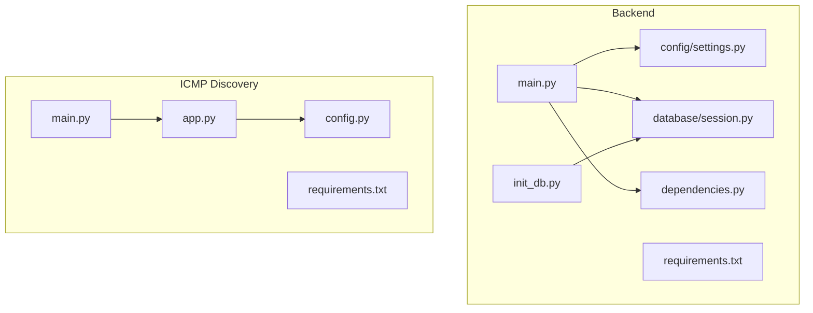
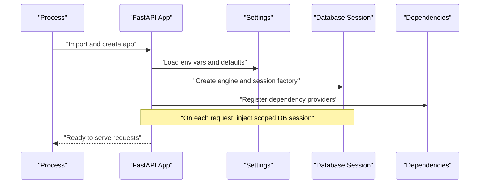
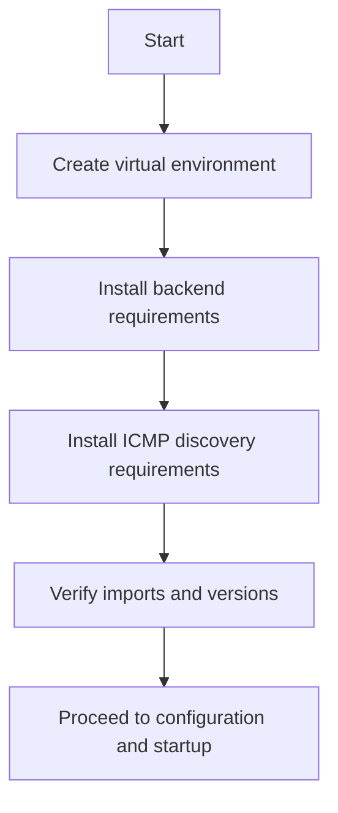

# Configuration & Setup

<cite>
**Referenced Files in This Document**
- [backend/main.py](file://backend/main.py)
- [backend/config/settings.py](file://backend/config/settings.py)
- [backend/database/session.py](file://backend/database/session.py)
- [backend/dependencies.py](file://backend/dependencies.py)
- [backend/init_db.py](file://backend/init_db.py)
- [backend/requirements.txt](file://backend/requirements.txt)
- [icmp_discovery/config.py](file://icmp_discovery/config.py)
- [icmp_discovery/app.py](file://icmp_discovery/app.py)
- [icmp_discovery/main.py](file://icmp_discovery/main.py)
- [icmp_discovery/requirements.txt](file://icmp_discovery/requirements.txt)
</cite>

## Table of Contents
1. [Introduction](#introduction)
2. [Project Structure](#project-structure)
3. [Core Components](#core-components)
4. [Architecture Overview](#architecture-overview)
5. [Detailed Component Analysis](#detailed-component-analysis)
6. [Dependency Analysis](#dependency-analysis)
7. [Performance Considerations](#performance-considerations)
8. [Troubleshooting Guide](#troubleshooting-guide)
9. [Conclusion](#conclusion)
10. [Appendices](#appendices)

## Introduction
This document explains the backend configuration system, environment setup, and initialization procedures for both the FastAPI-based backend and the ICMP discovery subsystem. It covers configuration file structure, environment variables, settings management, database connection setup, dependency installation, service startup, deployment considerations, environment-specific settings, validation, defaults, and security guidance.

## Project Structure
The repository contains two Python services:
- Backend (FastAPI): API server, configuration, database session, dependencies, and initialization scripts.
- ICMP Discovery: Discovery, monitoring, analytics, and scheduling modules with its own configuration and entry points.

**Diagram sources**
- [backend/main.py](file://backend/main.py)
- [backend/config/settings.py](file://backend/config/settings.py)
- [backend/database/session.py](file://backend/database/session.py)
- [backend/dependencies.py](file://backend/dependencies.py)
- [backend/init_db.py](file://backend/init_db.py)
- [icmp_discovery/app.py](file://icmp_discovery/app.py)
- [icmp_discovery/main.py](file://icmp_discovery/main.py)
- [icmp_discovery/config.py](file://icmp_discovery/config.py)

**Section sources**
- [backend/main.py](file://backend/main.py)
- [backend/config/settings.py](file://backend/config/settings.py)
- [backend/database/session.py](file://backend/database/session.py)
- [backend/dependencies.py](file://backend/dependencies.py)
- [backend/init_db.py](file://backend/init_db.py)
- [icmp_discovery/app.py](file://icmp_discovery/app.py)
- [icmp_discovery/main.py](file://icmp_discovery/main.py)
- [icmp_discovery/config.py](file://icmp_discovery/config.py)

## Core Components
- Settings and configuration loading
  - Centralized settings module for the backend that loads environment variables and provides typed access to configuration values.
  - ICMP discovery configuration module for discovery and monitoring parameters.
- Database session management
  - Engine and session factory creation, lifecycle management, and dependency injection for request-scoped sessions.
- Application entry points
  - FastAPI application initialization and middleware setup.
  - ICMP discovery main entry point and app assembly.
- Initialization utilities
  - Database schema initialization and seeding helpers.

Key responsibilities:
- Load and validate configuration from environment variables and optional config files.
- Provide default values for non-sensitive settings.
- Manage database connections and sessions safely.
- Expose dependency providers for route handlers and background tasks.

**Section sources**
- [backend/config/settings.py](file://backend/config/settings.py)
- [icmp_discovery/config.py](file://icmp_discovery/config.py)
- [backend/database/session.py](file://backend/database/session.py)
- [backend/main.py](file://backend/main.py)
- [icmp_discovery/app.py](file://icmp_discovery/app.py)
- [icmp_discovery/main.py](file://icmp_discovery/main.py)
- [backend/init_db.py](file://backend/init_db.py)

## Architecture Overview
The backend follows a layered architecture:
- Entry point initializes the FastAPI app and registers routes/middleware.
- Configuration is loaded once at startup and exposed via a settings object.
- Database engine and session are created and injected into routes/services.
- The ICMP discovery service runs independently with its own configuration and entry points.

**Diagram sources**
- [backend/main.py](file://backend/main.py)
- [backend/config/settings.py](file://backend/config/settings.py)
- [backend/database/session.py](file://backend/database/session.py)
- [backend/dependencies.py](file://backend/dependencies.py)

## Detailed Component Analysis

### Backend Settings and Environment Variables
- Purpose: Centralize all runtime configuration, including database URLs, feature flags, logging levels, and secrets.
- Behavior:
  - Reads environment variables with fallback defaults.
  - Validates critical fields (e.g., presence of required keys).
  - Exposes typed attributes for use across the application.
- Security:
  - Sensitive values should be provided via environment variables or secret managers.
  - Avoid hardcoding secrets; prefer .env files excluded from version control.

Recommended environment variables (examples):
- DATABASE_URL: Full database connection string.
- SECRET_KEY: Signing key for tokens/sessions.
- LOG_LEVEL: Logging verbosity.
- FEATURE_FLAGS: Comma-separated flags enabling/disabling features.

Validation and defaults:
- Required variables must be present; otherwise, startup fails early.
- Non-sensitive settings have sensible defaults.

**Section sources**
- [backend/config/settings.py](file://backend/config/settings.py)

### Database Connection and Session Management
- Purpose: Create and manage SQLAlchemy engine and session factories.
- Behavior:
  - Initializes engine using configuration.
  - Provides a function to yield request-scoped sessions.
  - Ensures proper session cleanup after requests.
- Usage:
  - Dependency injection into routes and services.
  - Initialization script can create tables and seed data.

Lifecycle:
- Engine created once at startup.
- Sessions created per request and closed automatically.

**Section sources**
- [backend/database/session.py](file://backend/database/session.py)
- [backend/init_db.py](file://backend/init_db.py)

### Dependencies and Injection
- Purpose: Provide reusable components such as database sessions, configuration objects, and external clients.
- Behavior:
  - FastAPI dependency functions return instances needed by routes.
  - Encapsulates error handling and retries where applicable.

Common dependencies:
- get_db: Yields a scoped database session.
- get_settings: Returns the centralized settings instance.

**Section sources**
- [backend/dependencies.py](file://backend/dependencies.py)

### Application Entry Point
- Purpose: Initialize the FastAPI application, configure middleware, and mount routes.
- Behavior:
  - Loads settings and database engine.
  - Registers CORS, logging, and other middleware.
  - Mounts API routes and health checks.

Startup sequence:
- Import app and dependencies.
- Apply configuration and initialize resources.
- Start the server on configured host/port.

**Section sources**
- [backend/main.py](file://backend/main.py)

### ICMP Discovery Configuration and Entry Points
- Purpose: Configure discovery intervals, targets, credentials, and monitoring options.
- Behavior:
  - Loads configuration from environment variables and/or config files.
  - Provides validated settings to discovery and monitoring modules.
- Entry points:
  - Main script orchestrates discovery and monitoring loops.
  - App module assembles components and schedules tasks.

Environment variables (examples):
- DISCOVERY_INTERVAL: Seconds between scans.
- TARGET_NETWORKS: Comma-separated networks to scan.
- SNMP_COMMUNITIES: List of community strings.
- SSH_CREDENTIALS_FILE: Path to SSH credentials.

**Section sources**
- [icmp_discovery/config.py](file://icmp_discovery/config.py)
- [icmp_discovery/app.py](file://icmp_discovery/app.py)
- [icmp_discovery/main.py](file://icmp_discovery/main.py)

## Dependency Analysis
External dependencies are declared in requirements files for each service. Install them within an isolated virtual environment to avoid conflicts.

- Backend dependencies include web framework, ORM, and utility libraries.
- ICMP discovery dependencies include networking, parsing, and scheduling libraries.

Installation steps:
- Create a virtual environment.
- Install requirements for the backend.
- Install requirements for the ICMP discovery service.

**Section sources**
- [backend/requirements.txt](file://backend/requirements.txt)
- [icmp_discovery/requirements.txt](file://icmp_discovery/requirements.txt)

## Performance Considerations
- Database pooling: Use connection pool size appropriate for workload and concurrency.
- Session scope: Ensure request-scoped sessions to prevent leaks and contention.
- Logging level: Set production-appropriate log levels to reduce overhead.
- Background tasks: Offload long-running operations to background workers.
- Caching: Cache frequently accessed data where safe and consistent.

[No sources needed since this section provides general guidance]

## Troubleshooting Guide
Common issues and resolutions:
- Missing environment variables:
  - Ensure all required variables are set before starting the service.
  - Validate with a startup check or explicit validation step.
- Database connection failures:
  - Verify DATABASE_URL correctness and network reachability.
  - Check credentials, ports, and firewall rules.
- Import errors:
  - Confirm all dependencies are installed in the active virtual environment.
  - Match Python interpreter used during install and execution.
- Port conflicts:
  - Change server port or stop conflicting processes.
- Permission issues:
  - Ensure read/write permissions for logs and data directories.

Validation tips:
- Run a minimal smoke test to verify endpoints and database connectivity.
- Use structured logging to capture startup diagnostics.

**Section sources**
- [backend/main.py](file://backend/main.py)
- [backend/database/session.py](file://backend/database/session.py)
- [backend/init_db.py](file://backend/init_db.py)

## Conclusion
This guide outlined the configuration system, environment setup, and initialization procedures for the backend and ICMP discovery services. By centralizing configuration, validating inputs, managing database sessions correctly, and following secure practices, you can reliably deploy and operate these services across environments.

[No sources needed since this section summarizes without analyzing specific files]

## Appendices

### Deployment Checklist
- Set environment variables for all services.
- Install dependencies in isolated environments.
- Initialize database schemas and seed data if required.
- Configure logging and monitoring.
- Test health endpoints and basic workflows.
- Review security settings for secrets and access controls.

[No sources needed since this section provides general guidance]