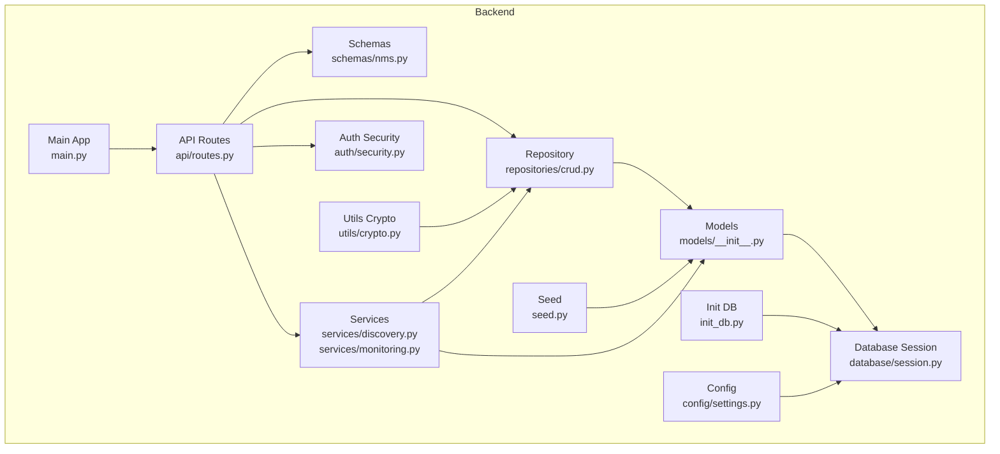
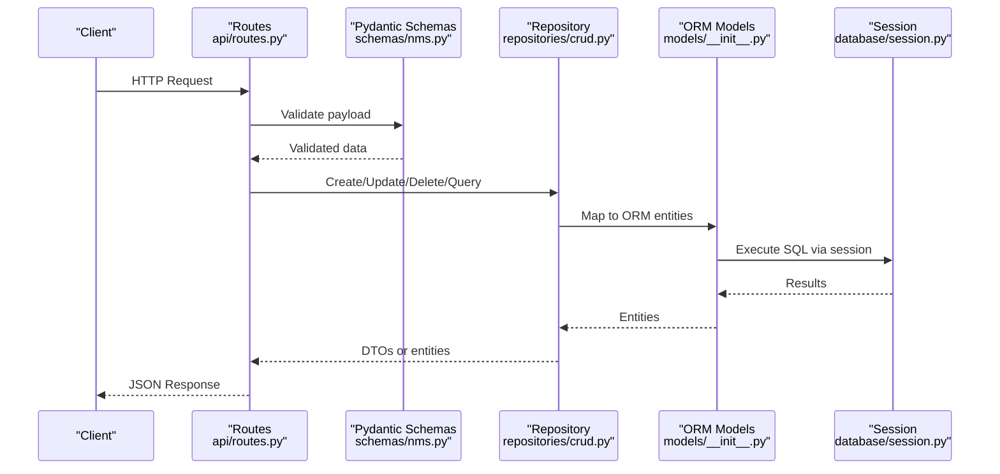
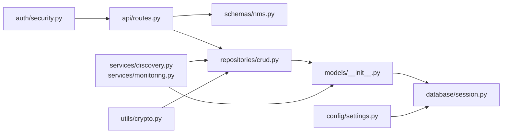

# Database Models & Schema

<cite>
**Referenced Files in This Document**
- [main.py](file://backend/main.py)
- [session.py](file://backend/database/session.py)
- [init_db.py](file://backend/init_db.py)
- [seed.py](file://backend/seed.py)
- [routes.py](file://backend/api/routes.py)
- [nms.py](file://backend/schemas/nms.py)
- [crud.py](file://backend/repositories/crud.py)
- [settings.py](file://backend/config/settings.py)
- [security.py](file://backend/auth/security.py)
- [discovery.py](file://backend/services/discovery.py)
- [monitoring.py](file://backend/services/monitoring.py)
- [crypto.py](file://backend/utils/crypto.py)
</cite>

## Table of Contents
1. [Introduction](#introduction)
2. [Project Structure](#project-structure)
3. [Core Components](#core-components)
4. [Architecture Overview](#architecture-overview)
5. [Detailed Component Analysis](#detailed-component-analysis)
6. [Dependency Analysis](#dependency-analysis)
7. [Performance Considerations](#performance-considerations)
8. [Troubleshooting Guide](#troubleshooting-guide)
9. [Conclusion](#conclusion)
10. [Appendices](#appendices)

## Introduction
This document provides comprehensive data model documentation for the backend’s database entities and Pydantic schemas. It covers entity relationships, field definitions, data types, constraints, primary and foreign keys, indexes, migrations, schema validation rules, serialization/deserialization patterns, data transformation logic, CRUD operations, query patterns, relationship handling, data integrity strategies, and performance optimization techniques. The goal is to make the data layer accessible to both technical and non-technical readers while ensuring accuracy grounded in the repository code.

## Project Structure
The backend organizes data-related concerns across several modules:
- Database session management and initialization
- Data models (entities) and their lifecycle
- Pydantic schemas for request/response validation and serialization
- Repository layer for CRUD and query operations
- API routes that consume schemas and repositories
- Configuration for database connectivity and environment settings
- Authentication utilities that may interact with user-related data
- Services that orchestrate domain logic using models and schemas
- Utilities for cryptographic operations affecting sensitive fields

**Diagram sources**
- [main.py](file://backend/main.py)
- [routes.py](file://backend/api/routes.py)
- [nms.py](file://backend/schemas/nms.py)
- [crud.py](file://backend/repositories/crud.py)
- [__init__.py](file://backend/models/__init__.py)
- [session.py](file://backend/database/session.py)
- [init_db.py](file://backend/init_db.py)
- [seed.py](file://backend/seed.py)
- [settings.py](file://backend/config/settings.py)
- [security.py](file://backend/auth/security.py)
- [discovery.py](file://backend/services/discovery.py)
- [monitoring.py](file://backend/services/monitoring.py)
- [crypto.py](file://backend/utils/crypto.py)

**Section sources**
- [main.py](file://backend/main.py)
- [session.py](file://backend/database/session.py)
- [init_db.py](file://backend/init_db.py)
- [seed.py](file://backend/seed.py)
- [routes.py](file://backend/api/routes.py)
- [nms.py](file://backend/schemas/nms.py)
- [crud.py](file://backend/repositories/crud.py)
- [settings.py](file://backend/config/settings.py)
- [security.py](file://backend/auth/security.py)
- [discovery.py](file://backend/services/discovery.py)
- [monitoring.py](file://backend/services/monitoring.py)
- [crypto.py](file://backend/utils/crypto.py)

## Core Components
- Database Session: Provides connection pooling and scoped sessions for ORM operations.
- Models: Define persistent entities, relationships, and constraints.
- Schemas: Pydantic models for input/output validation and serialization.
- Repository: Encapsulates CRUD and query logic against the database.
- API Routes: Expose endpoints that validate payloads via schemas and delegate to repositories.
- Configuration: Centralizes database URLs, drivers, and environment-specific settings.
- Auth Security: Handles authentication flows that may read/write user-related data.
- Services: Orchestrate business processes using models and schemas.
- Utils Crypto: Supports encryption/hashing for sensitive fields.

Key responsibilities:
- Enforce data integrity at multiple layers (schema validation, ORM constraints).
- Provide consistent serialization/deserialization patterns across the API.
- Abstract database interactions behind a repository interface for testability.
- Centralize configuration for database connectivity and behavior.

**Section sources**
- [session.py](file://backend/database/session.py)
- [__init__.py](file://backend/models/__init__.py)
- [nms.py](file://backend/schemas/nms.py)
- [crud.py](file://backend/repositories/crud.py)
- [routes.py](file://backend/api/routes.py)
- [settings.py](file://backend/config/settings.py)
- [security.py](file://backend/auth/security.py)
- [discovery.py](file://backend/services/discovery.py)
- [monitoring.py](file://backend/services/monitoring.py)
- [crypto.py](file://backend/utils/crypto.py)

## Architecture Overview
The data architecture follows a layered approach:
- API Layer validates requests using Pydantic schemas and returns validated responses.
- Service Layer orchestrates domain logic, invoking repositories and applying transformations.
- Repository Layer abstracts database operations, encapsulating queries and transactions.
- Model Layer defines entities, relationships, and constraints.
- Database Layer manages connections and sessions.

**Diagram sources**
- [routes.py](file://backend/api/routes.py)
- [nms.py](file://backend/schemas/nms.py)
- [crud.py](file://backend/repositories/crud.py)
- [__init__.py](file://backend/models/__init__.py)
- [session.py](file://backend/database/session.py)

## Detailed Component Analysis

### Database Session and Initialization
- Session Management: Establishes engine, sessionmaker, and scoped sessions for concurrent requests.
- Initialization: Creates tables based on models and ensures schema consistency.
- Seed Data: Populates initial records for development and testing.

Key considerations:
- Connection pooling parameters and timeouts.
- Transaction boundaries per request.
- Idempotent table creation and migration strategy.

**Section sources**
- [session.py](file://backend/database/session.py)
- [init_db.py](file://backend/init_db.py)
- [seed.py](file://backend/seed.py)

### Models (Entities)
- Entity Definitions: Represent core business objects with typed fields and constraints.
- Relationships: Define one-to-many, many-to-one, and many-to-many associations.
- Constraints: Enforce uniqueness, not-null, and referential integrity.
- Indexes: Optimize query performance on frequently filtered columns.

Best practices:
- Use descriptive column names and explicit types.
- Centralize default values and validators.
- Avoid circular dependencies between models.

**Section sources**
- [__init__.py](file://backend/models/__init__.py)

### Pydantic Schemas
- Input Validation: Enforce required fields, formats, ranges, and custom validators.
- Output Serialization: Control field inclusion/exclusion and formatting.
- Transformation Logic: Convert between database representations and API payloads.

Common patterns:
- Separate create/update/read schemas to reflect different constraints.
- Use computed fields for derived data.
- Apply validators for cross-field checks.

**Section sources**
- [nms.py](file://backend/schemas/nms.py)

### Repository Layer
- CRUD Operations: Implement create, read, update, delete methods with proper error handling.
- Query Patterns: Build efficient queries with filters, joins, and aggregations.
- Relationship Handling: Load related entities efficiently using eager loading strategies.

Optimization tips:
- Batch operations where possible.
- Use selective field loading to reduce payload size.
- Cache frequent reads when appropriate.

**Section sources**
- [crud.py](file://backend/repositories/crud.py)

### API Routes
- Endpoint Definition: Map HTTP methods to repository calls.
- Schema Integration: Validate inputs and serialize outputs consistently.
- Error Handling: Return standardized error responses.

Security considerations:
- Authenticate and authorize access to protected endpoints.
- Sanitize inputs before processing.

**Section sources**
- [routes.py](file://backend/api/routes.py)
- [security.py](file://backend/auth/security.py)

### Configuration
- Database Settings: URL, driver, pool size, and timeout configurations.
- Environment Variables: Securely manage secrets and feature flags.
- Runtime Overrides: Allow dynamic configuration changes.

**Section sources**
- [settings.py](file://backend/config/settings.py)

### Services
- Discovery Service: Orchestrates device discovery workflows using models and schemas.
- Monitoring Service: Manages monitoring tasks and updates entity states.

Integration points:
- Call repositories for persistence.
- Transform data between services and API layers.

**Section sources**
- [discovery.py](file://backend/services/discovery.py)
- [monitoring.py](file://backend/services/monitoring.py)

### Utilities
- Crypto Utility: Provides hashing and encryption functions for sensitive data.
- Usage: Applied to passwords, tokens, and confidential fields before storage.

**Section sources**
- [crypto.py](file://backend/utils/crypto.py)

## Dependency Analysis
The data layer exhibits clear separation of concerns:
- API depends on schemas and repositories.
- Repositories depend on models and database sessions.
- Services depend on repositories and models.
- Configuration influences all components through shared settings.

**Diagram sources**
- [routes.py](file://backend/api/routes.py)
- [nms.py](file://backend/schemas/nms.py)
- [crud.py](file://backend/repositories/crud.py)
- [__init__.py](file://backend/models/__init__.py)
- [session.py](file://backend/database/session.py)
- [discovery.py](file://backend/services/discovery.py)
- [monitoring.py](file://backend/services/monitoring.py)
- [settings.py](file://backend/config/settings.py)
- [security.py](file://backend/auth/security.py)
- [crypto.py](file://backend/utils/crypto.py)

**Section sources**
- [routes.py](file://backend/api/routes.py)
- [nms.py](file://backend/schemas/nms.py)
- [crud.py](file://backend/repositories/crud.py)
- [__init__.py](file://backend/models/__init__.py)
- [session.py](file://backend/database/session.py)
- [discovery.py](file://backend/services/discovery.py)
- [monitoring.py](file://backend/services/monitoring.py)
- [settings.py](file://backend/config/settings.py)
- [security.py](file://backend/auth/security.py)
- [crypto.py](file://backend/utils/crypto.py)

## Performance Considerations
- Connection Pooling: Tune pool size and checkout timeouts for high concurrency.
- Query Optimization: Use indexes on filter columns and avoid N+1 queries.
- Eager Loading: Preload related entities to minimize round trips.
- Pagination: Implement cursor-based pagination for large datasets.
- Caching: Cache frequent reads with appropriate invalidation strategies.
- Batch Operations: Group writes to reduce transaction overhead.

[No sources needed since this section provides general guidance]

## Troubleshooting Guide
Common issues and resolutions:
- Database Connection Errors: Verify connection strings, credentials, and network accessibility.
- Schema Validation Failures: Inspect Pydantic error messages and adjust input payloads.
- Integrity Constraint Violations: Check foreign key relationships and unique constraints.
- Slow Queries: Analyze execution plans and add missing indexes.
- Authentication Failures: Ensure token validity and correct secret configuration.

Debugging steps:
- Enable detailed logging for database operations.
- Use interactive shells to test queries directly.
- Validate schemas independently before API calls.

**Section sources**
- [session.py](file://backend/database/session.py)
- [nms.py](file://backend/schemas/nms.py)
- [security.py](file://backend/auth/security.py)

## Conclusion
The backend’s data layer is structured around clear separation of concerns, robust validation, and efficient database interactions. By adhering to the documented patterns for models, schemas, repositories, and services, teams can maintain data integrity, improve performance, and scale effectively. Continuous monitoring and iterative optimization are recommended to adapt to evolving requirements.

[No sources needed since this section summarizes without analyzing specific files]

## Appendices

### Example CRUD Operations
- Create: Validate input via Pydantic schema, persist through repository, return created entity.
- Read: Fetch by ID or filters, apply pagination, serialize response.
- Update: Validate partial updates, enforce constraints, handle conflicts.
- Delete: Soft delete or hard delete based on policy, cascade relationships.

[No sources needed since this section provides general guidance]

### Query Patterns
- Filtered Queries: Apply WHERE clauses with indexed columns.
- Joins: Use eager loading to fetch related entities efficiently.
- Aggregations: Leverage database functions for counts, sums, and averages.

[No sources needed since this section provides general guidance]

### Relationship Handling
- One-to-Many: Parent references child collections with lazy or eager loading.
- Many-to-Many: Use association tables with junction entities.
- Cascades: Configure delete/update cascades carefully to prevent data loss.

[No sources needed since this section provides general guidance]

### Data Integrity Strategies
- Constraints: Enforce NOT NULL, UNIQUE, CHECK constraints at the database level.
- Transactions: Wrap multi-step operations in atomic transactions.
- Auditing: Track changes with audit logs for compliance.

[No sources needed since this section provides general guidance]

### Migration Strategy
- Version Control: Store migration scripts alongside application code.
- Rollbacks: Test rollback procedures regularly.
- Zero-Downtime: Use additive changes and backfill strategies for production.

[No sources needed since this section provides general guidance]