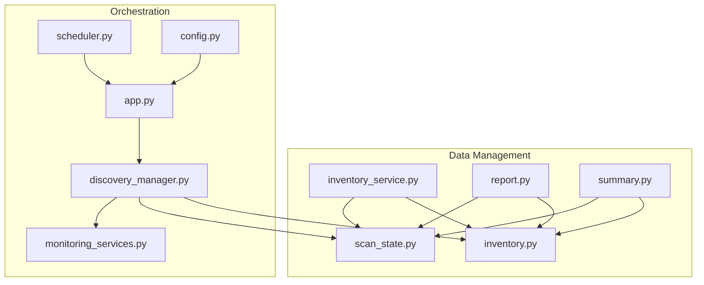
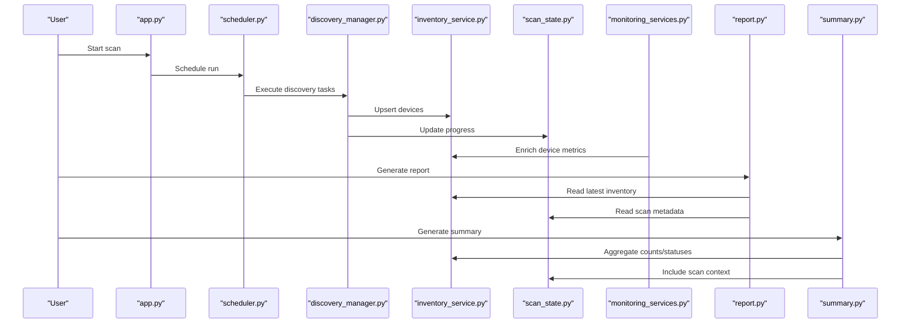
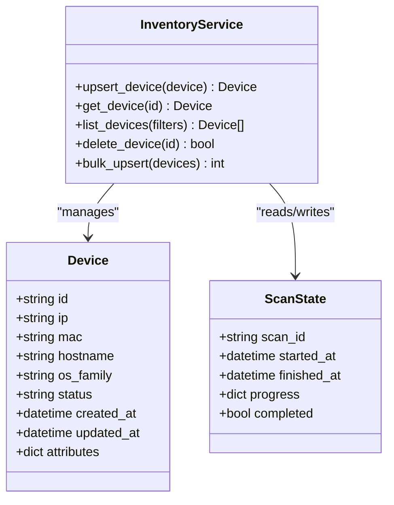
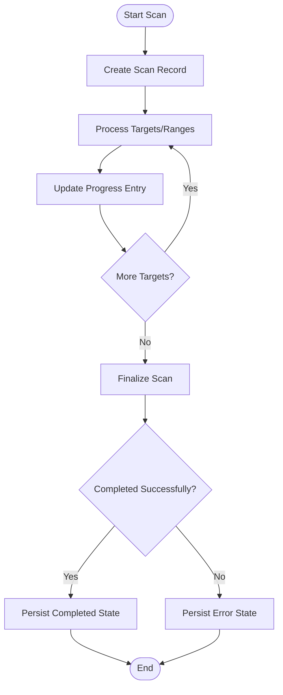
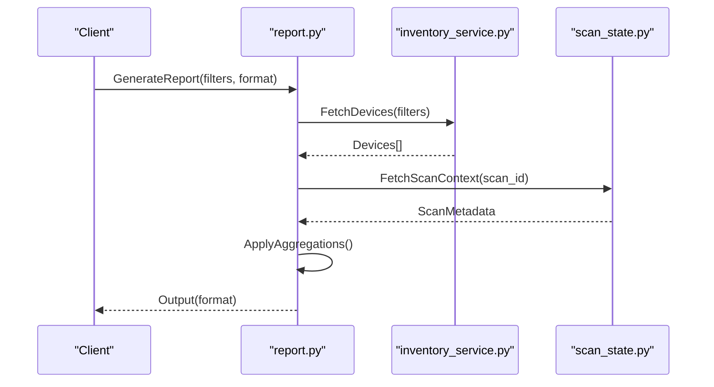
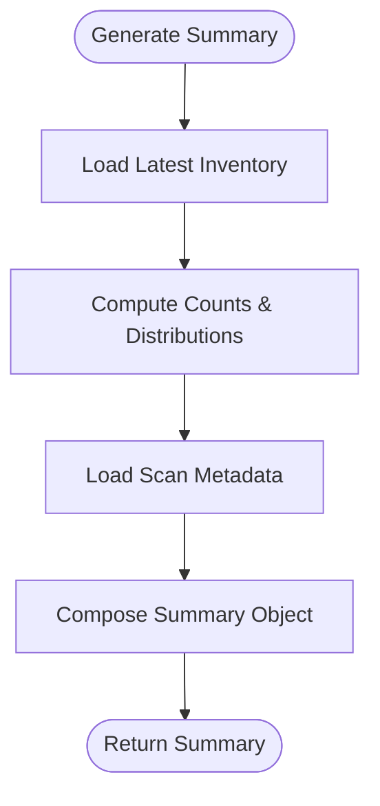
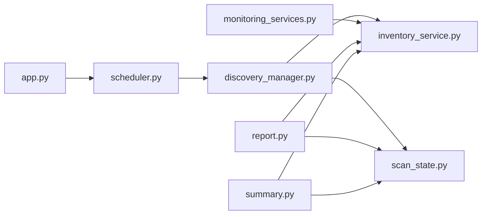

# Data Management

<cite>
**Referenced Files in This Document**
- [inventory.py](file://icmp_discovery/inventory.py)
- [inventory_service.py](file://icmp_discovery/inventory_service.py)
- [scan_state.py](file://icmp_discovery/scan_state.py)
- [report.py](file://icmp_discovery/report.py)
- [summary.py](file://icmp_discovery/summary.py)
- [app.py](file://icmp_discovery/app.py)
- [config.py](file://icmp_discovery/config.py)
- [discovery_manager.py](file://icmp_discovery/discovery_manager.py)
- [monitoring_services.py](file://icmp_discovery/monitoring_services.py)
- [scheduler.py](file://icmp_discovery/scheduler.py)
</cite>

## Table of Contents
1. [Introduction](#introduction)
2. [Project Structure](#project-structure)
3. [Core Components](#core-components)
4. [Architecture Overview](#architecture-overview)
5. [Detailed Component Analysis](#detailed-component-analysis)
6. [Dependency Analysis](#dependency-analysis)
7. [Performance Considerations](#performance-considerations)
8. [Troubleshooting Guide](#troubleshooting-guide)
9. [Conclusion](#conclusion)
10. [Appendices](#appendices)

## Introduction
This document explains the data management components that power device inventory, scan state persistence, reporting, and summarization. It covers how device records are maintained, how discovery progress is tracked across runs, how reports are generated for network analysis, and how concise summaries are produced for quick overviews. It also includes data model definitions, storage strategies, lifecycle management, examples of custom report formats, export/import procedures, and database optimization techniques for large inventories.

## Project Structure
The data management layer resides primarily under icmp_discovery with supporting modules for orchestration, configuration, and scheduling. Key files:
- Inventory and inventory service manage device records and their lifecycle.
- Scan state persists discovery progress to ensure resumption after interruptions.
- Report and summary modules generate outputs from inventory and monitoring data.
- App, config, discovery manager, monitoring services, and scheduler coordinate workflows and I/O.

**Diagram sources**
- [inventory.py](file://icmp_discovery/inventory.py)
- [inventory_service.py](file://icmp_discovery/inventory_service.py)
- [scan_state.py](file://icmp_discovery/scan_state.py)
- [report.py](file://icmp_discovery/report.py)
- [summary.py](file://icmp_discovery/summary.py)
- [app.py](file://icmp_discovery/app.py)
- [discovery_manager.py](file://icmp_discovery/discovery_manager.py)
- [monitoring_services.py](file://icmp_discovery/monitoring_services.py)
- [scheduler.py](file://icmp_discovery/scheduler.py)
- [config.py](file://icmp_discovery/config.py)

**Section sources**
- [inventory.py](file://icmp_discovery/inventory.py)
- [inventory_service.py](file://icmp_discovery/inventory_service.py)
- [scan_state.py](file://icmp_discovery/scan_state.py)
- [report.py](file://icmp_discovery/report.py)
- [summary.py](file://icmp_discovery/summary.py)
- [app.py](file://icmp_discovery/app.py)
- [discovery_manager.py](file://icmp_discovery/discovery_manager.py)
- [monitoring_services.py](file://icmp_discovery/monitoring_services.py)
- [scheduler.py](file://icmp_discovery/scheduler.py)
- [config.py](file://icmp_discovery/config.py)

## Core Components
- Device Inventory Service: Provides CRUD operations for devices, upserts discovered attributes, and maintains consistency across discovery cycles.
- Scan State Manager: Persists per-scan metadata (start/end times, ranges processed, last seen timestamps, status flags) to support resumable scans.
- Reporting System: Generates structured reports from inventory and monitoring data, supporting multiple output formats.
- Summary Engine: Produces concise overviews (counts, statuses, topologies, alerts) derived from inventory and scan state.

These components share a common data model for devices and scan artifacts, enabling consistent analytics and exports.

**Section sources**
- [inventory_service.py](file://icmp_discovery/inventory_service.py)
- [inventory.py](file://icmp_discovery/inventory.py)
- [scan_state.py](file://icmp_discovery/scan_state.py)
- [report.py](file://icmp_discovery/report.py)
- [summary.py](file://icmp_discovery/summary.py)

## Architecture Overview
The system integrates discovery, monitoring, and data management through an application entry point and scheduler. Discovery updates inventory; monitoring enriches it; reporting and summarization consume both.

**Diagram sources**
- [app.py](file://icmp_discovery/app.py)
- [scheduler.py](file://icmp_discovery/scheduler.py)
- [discovery_manager.py](file://icmp_discovery/discovery_manager.py)
- [inventory_service.py](file://icmp_discovery/inventory_service.py)
- [scan_state.py](file://icmp_discovery/scan_state.py)
- [monitoring_services.py](file://icmp_discovery/monitoring_services.py)
- [report.py](file://icmp_discovery/report.py)
- [summary.py](file://icmp_discovery/summary.py)

## Detailed Component Analysis

### Device Inventory Management
Responsibilities:
- Maintain canonical device records with identifiers, network attributes, OS/profile info, and timestamps.
- Support upsert semantics to merge new discovery data without duplication.
- Provide query interfaces for filtering by status, type, or tags.

Key behaviors:
- On discovery, inventory receives normalized device objects and merges them into persistent storage.
- Duplicate resolution uses unique keys such as IP/MAC combinations.
- Lifecycle transitions update last-seen timestamps and status fields based on monitoring feedback.

Storage strategy:
- Persistent store keyed by device identity; supports JSON file or relational backend depending on deployment.
- Indexes on frequently queried fields (IP, MAC, status).

Lifecycle:
- Create on first discovery.
- Update on subsequent scans and monitoring events.
- Archive or soft-delete on explicit administrative action.

**Diagram sources**
- [inventory_service.py](file://icmp_discovery/inventory_service.py)
- [inventory.py](file://icmp_discovery/inventory.py)
- [scan_state.py](file://icmp_discovery/scan_state.py)

**Section sources**
- [inventory_service.py](file://icmp_discovery/inventory_service.py)
- [inventory.py](file://icmp_discovery/inventory.py)

### Scan State Persistence
Responsibilities:
- Track per-scan metadata including start/end times, scanned ranges, and completion flags.
- Persist incremental progress to enable resuming interrupted scans.
- Expose read-only views for reporting and UI.

Key behaviors:
- Initialize a new scan record before discovery begins.
- Update progress entries as each range or target completes.
- Mark scan complete when all targets are processed or errors exceed thresholds.

Storage strategy:
- Append-friendly structure with indexed scan IDs.
- Optional compression for historical scans.

**Diagram sources**
- [scan_state.py](file://icmp_discovery/scan_state.py)

**Section sources**
- [scan_state.py](file://icmp_discovery/scan_state.py)

### Reporting System
Responsibilities:
- Aggregate inventory and scan state into human-readable and machine-parseable reports.
- Support multiple output formats (JSON, CSV, PDF-like text).
- Allow custom report templates and filters.

Key behaviors:
- Build report payloads from latest inventory snapshots and selected scan contexts.
- Apply filters (status, type, time window) and aggregations (counts, distributions).
- Export via file paths or streams.

Custom report formats:
- JSON: Structured arrays of devices with nested attributes and scan metadata.
- CSV: Flat rows with headers for quick import into spreadsheets.
- Text/PDF-like: Formatted sections for executive summaries and technical details.

**Diagram sources**
- [report.py](file://icmp_discovery/report.py)
- [inventory_service.py](file://icmp_discovery/inventory_service.py)
- [scan_state.py](file://icmp_discovery/scan_state.py)

**Section sources**
- [report.py](file://icmp_discovery/report.py)

### Summary Creation
Responsibilities:
- Produce concise overviews of network health and device distribution.
- Summarize key metrics: total devices, online/offline counts, OS distribution, alert highlights.
- Tie summaries to specific scans for temporal context.

Key behaviors:
- Aggregate counts and statuses from inventory.
- Incorporate scan metadata to bound the timeframe.
- Return lightweight structures suitable for dashboards.

**Diagram sources**
- [summary.py](file://icmp_discovery/summary.py)
- [inventory_service.py](file://icmp_discovery/inventory_service.py)
- [scan_state.py](file://icmp_discovery/scan_state.py)

**Section sources**
- [summary.py](file://icmp_discovery/summary.py)

## Dependency Analysis
Interactions among core components:
- Inventory service depends on device models and storage backends.
- Scan state is consumed by reporting and summarization to provide temporal context.
- Reporting reads from inventory and scan state; may be influenced by monitoring outputs.
- Orchestration (app, scheduler, discovery manager, monitoring) drives updates to inventory and scan state.

**Diagram sources**
- [app.py](file://icmp_discovery/app.py)
- [scheduler.py](file://icmp_discovery/scheduler.py)
- [discovery_manager.py](file://icmp_discovery/discovery_manager.py)
- [inventory_service.py](file://icmp_discovery/inventory_service.py)
- [scan_state.py](file://icmp_discovery/scan_state.py)
- [monitoring_services.py](file://icmp_discovery/monitoring_services.py)
- [report.py](file://icmp_discovery/report.py)
- [summary.py](file://icmp_discovery/summary.py)

**Section sources**
- [app.py](file://icmp_discovery/app.py)
- [scheduler.py](file://icmp_discovery/scheduler.py)
- [discovery_manager.py](file://icmp_discovery/discovery_manager.py)
- [inventory_service.py](file://icmp_discovery/inventory_service.py)
- [scan_state.py](file://icmp_discovery/scan_state.py)
- [monitoring_services.py](file://icmp_discovery/monitoring_services.py)
- [report.py](file://icmp_discovery/report.py)
- [summary.py](file://icmp_discovery/summary.py)

## Performance Considerations
- Batch upserts: Use bulk operations to reduce write overhead during large discovery runs.
- Indexing: Ensure indexes on device identity fields (IP, MAC) and status for fast queries.
- Pagination: Implement pagination for listing devices to avoid large payloads.
- Caching: Cache frequent read queries (e.g., summary metrics) with short TTLs.
- Compression: Compress historical scan state archives to save space.
- Concurrency: Limit concurrent discovery tasks to balance CPU/network usage.

[No sources needed since this section provides general guidance]

## Troubleshooting Guide
Common issues and resolutions:
- Duplicate device entries: Verify unique key logic and deduplication rules in inventory upserts.
- Incomplete scans: Check scan state progress entries and error logs; re-run partial ranges.
- Slow reports: Inspect query filters and consider pre-aggregated caches for heavy metrics.
- Data drift between inventory and monitoring: Reconcile timestamps and refresh monitoring data.

Operational checks:
- Validate inventory integrity by counting expected devices per subnet.
- Confirm scan state completeness by comparing scanned ranges vs configured targets.
- Review report generation logs for missing fields or formatting errors.

**Section sources**
- [inventory_service.py](file://icmp_discovery/inventory_service.py)
- [scan_state.py](file://icmp_discovery/scan_state.py)
- [report.py](file://icmp_discovery/report.py)

## Conclusion
The data management layer provides robust mechanisms for maintaining device inventories, persisting scan progress, generating reports, and producing summaries. By following the recommended storage strategies, lifecycle practices, and performance optimizations, the system can scale to large device inventories while delivering reliable insights for network analysis.

[No sources needed since this section summarizes without analyzing specific files]

## Appendices

### Data Model Definitions
- Device: Unique identity (IP/MAC), hostname, OS family, status, timestamps, and extensible attributes.
- Scan State: Scan identifier, start/end times, progress map, and completion flag.
- Report Payload: Aggregated device lists, scan context, and formatted content per requested format.
- Summary Object: High-level metrics and contextual scan metadata.

[No sources needed since this section defines conceptual models]

### Storage Strategies
- File-based JSON for small deployments; prefer relational databases for larger inventories.
- Partition scan state by date or scan batch to simplify cleanup.
- Normalize device attributes where possible to improve query efficiency.

[No sources needed since this section provides general guidance]

### Data Lifecycle Management
- Creation: First discovery creates device records; scan state initialized per run.
- Updates: Subsequent discoveries and monitoring events update attributes and timestamps.
- Archival: Historical scans archived; inactive devices marked for review.
- Deletion: Soft delete with retention policies; hard delete only after compliance checks.

[No sources needed since this section provides general guidance]

### Examples of Custom Report Formats
- JSON: Nested objects with device arrays and scan metadata.
- CSV: Flat rows with standardized headers for spreadsheet imports.
- Text/PDF-like: Sectioned text with executive summary and technical details.

[No sources needed since this section provides general guidance]

### Data Export/Import Procedures
- Export: Use report module to generate JSON/CSV with filters and scan context.
- Import: Parse exported files and use inventory service bulk upsert to reconcile.
- Validation: Run integrity checks post-import to detect duplicates or missing fields.

[No sources needed since this section provides general guidance]

### Database Optimization Techniques for Large Inventories
- Indexes: On IP, MAC, status, and timestamp fields.
- Partitioning: By subnet or date for faster scans and archival.
- Materialized Views: Precompute common aggregates for dashboards.
- Connection Pooling: Reduce overhead for high-frequency reads.
- Backups: Regular snapshots with incremental backups for recovery.

[No sources needed since this section provides general guidance]