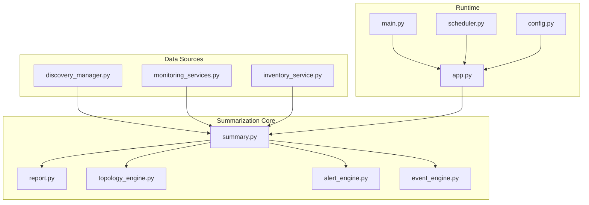
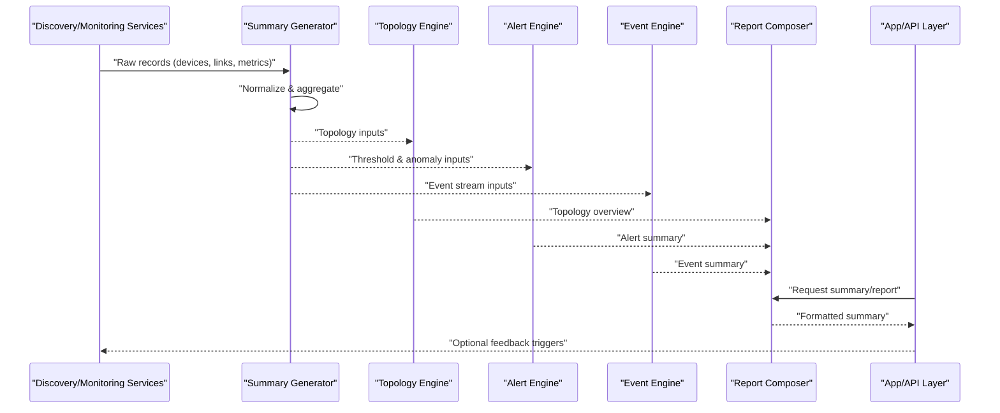
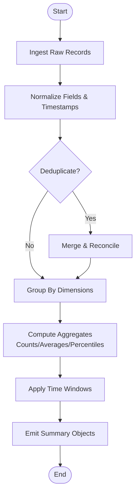
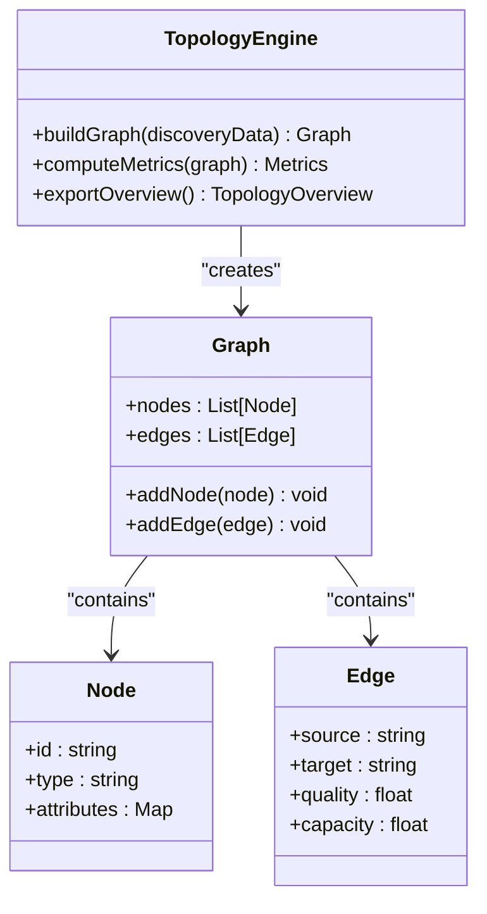
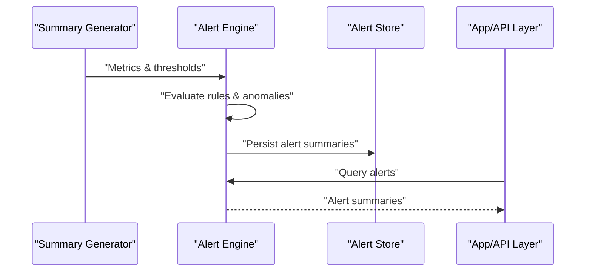
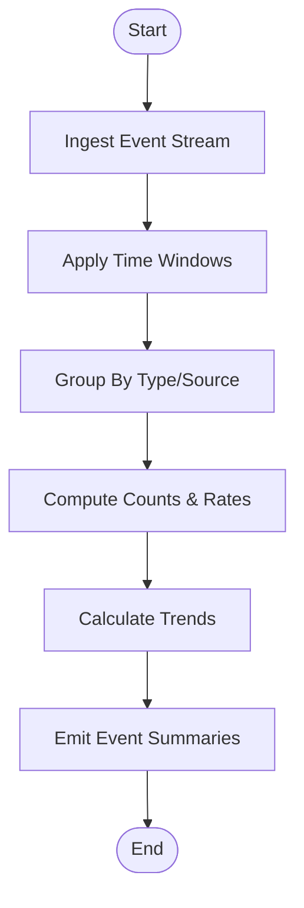
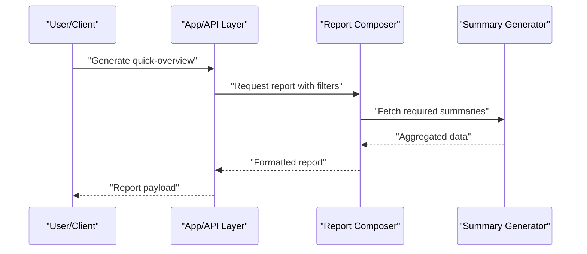
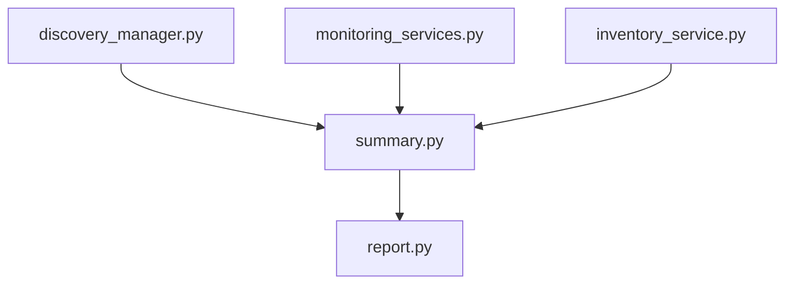
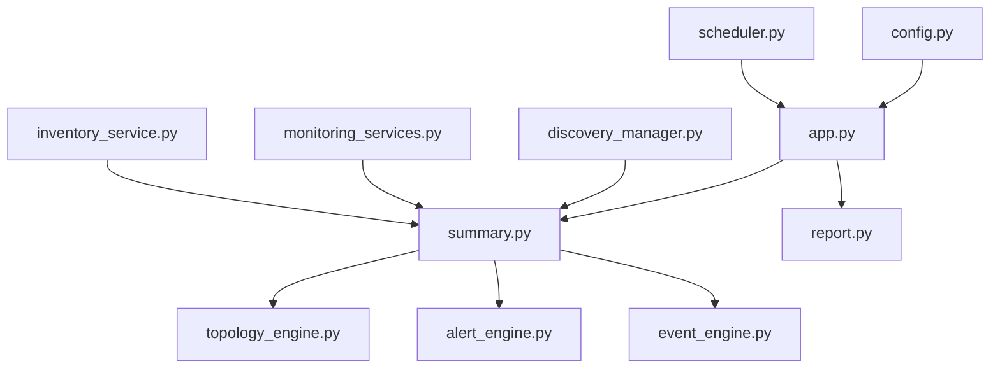

# Data Summarization Engine

<cite>
**Referenced Files in This Document**
- [summary.py](file://icmp_discovery/summary.py)
- [report.py](file://icmp_discovery/report.py)
- [analytics_modules/topology_engine.py](file://icmp_discovery/analytics_modules/topology_engine.py)
- [analytics_modules/alert_engine.py](file://icmp_discovery/analytics_modules/alert_engine.py)
- [analytics_modules/event_engine.py](file://icmp_discovery/analytics_modules/event_engine.py)
- [discovery_manager.py](file://icmp_discovery/discovery_manager.py)
- [monitoring_services.py](file://icmp_discovery/monitoring_services.py)
- [inventory_service.py](file://icmp_discovery/inventory_service.py)
- [app.py](file://icmp_discovery/app.py)
- [main.py](file://icmp_discovery/main.py)
- [config.py](file://icmp_discovery/config.py)
- [scheduler.py](file://icmp_discovery/scheduler.py)
- [test_summary.py](file://icmp_discovery/tests/test_summary.py)
</cite>

## Table of Contents
1. [Introduction](#introduction)
2. [Project Structure](#project-structure)
3. [Core Components](#core-components)
4. [Architecture Overview](#architecture-overview)
5. [Detailed Component Analysis](#detailed-component-analysis)
6. [Dependency Analysis](#dependency-analysis)
7. [Performance Considerations](#performance-considerations)
8. [Troubleshooting Guide](#troubleshooting-guide)
9. [Conclusion](#conclusion)
10. [Appendices](#appendices)

## Introduction
This document explains the data summarization engine that aggregates raw discovery and monitoring data into meaningful summaries and statistics. It covers summary types such as network topology overviews, device status summaries, and performance metrics aggregation. It also provides examples for generating quick-overview reports, custom summary calculations, and preparing real-time dashboard data. Finally, it details caching strategies and performance optimization techniques for large datasets.

## Project Structure
The summarization engine is implemented primarily within the icmp_discovery module. Key areas include:
- Summary generation and report composition
- Analytics engines for topology, alerts, and events
- Discovery and monitoring services feeding raw data
- Scheduling and application entry points
- Configuration and tests validating behavior

**Diagram sources**
- [summary.py](file://icmp_discovery/summary.py)
- [report.py](file://icmp_discovery/report.py)
- [analytics_modules/topology_engine.py](file://icmp_discovery/analytics_modules/topology_engine.py)
- [analytics_modules/alert_engine.py](file://icmp_discovery/analytics_modules/alert_engine.py)
- [analytics_modules/event_engine.py](file://icmp_discovery/analytics_modules/event_engine.py)
- [discovery_manager.py](file://icmp_discovery/discovery_manager.py)
- [monitoring_services.py](file://icmp_discovery/monitoring_services.py)
- [inventory_service.py](file://icmp_discovery/inventory_service.py)
- [app.py](file://icmp_discovery/app.py)
- [main.py](file://icmp_discovery/main.py)
- [scheduler.py](file://icmp_discovery/scheduler.py)
- [config.py](file://icmp_discovery/config.py)

**Section sources**
- [summary.py](file://icmp_discovery/summary.py)
- [report.py](file://icmp_discovery/report.py)
- [analytics_modules/topology_engine.py](file://icmp_discovery/analytics_modules/topology_engine.py)
- [analytics_modules/alert_engine.py](file://icmp_discovery/analytics_modules/alert_engine.py)
- [analytics_modules/event_engine.py](file://icmp_discovery/analytics_modules/event_engine.py)
- [discovery_manager.py](file://icmp_discovery/discovery_manager.py)
- [monitoring_services.py](file://icmp_discovery/monitoring_services.py)
- [inventory_service.py](file://icmp_discovery/inventory_service.py)
- [app.py](file://icmp_discovery/app.py)
- [main.py](file://icmp_discovery/main.py)
- [scheduler.py](file://icmp_discovery/scheduler.py)
- [config.py](file://icmp_discovery/config.py)

## Core Components
- Summary generator: Aggregates raw discovery and monitoring records into structured summaries (e.g., device status, connectivity, performance).
- Report composer: Formats summaries into human-readable or machine-consumable reports (quick-overview, detailed, exportable).
- Topology engine: Builds network topology overviews from discovery results and link information.
- Alert engine: Derives alert summaries based on thresholds and anomaly detection rules.
- Event engine: Aggregates and summarizes events for dashboards and logs.
- Integration with discovery/monitoring: Pulls raw data from discovery and monitoring modules to feed summarization.

Key responsibilities:
- Normalize heterogeneous inputs into a consistent schema for aggregation.
- Compute aggregate statistics (counts, rates, percentiles, trends).
- Provide query interfaces for time windows, filters, and grouping.
- Support incremental updates for near-real-time dashboards.

**Section sources**
- [summary.py](file://icmp_discovery/summary.py)
- [report.py](file://icmp_discovery/report.py)
- [analytics_modules/topology_engine.py](file://icmp_discovery/analytics_modules/topology_engine.py)
- [analytics_modules/alert_engine.py](file://icmp_discovery/analytics_modules/alert_engine.py)
- [analytics_modules/event_engine.py](file://icmp_discovery/analytics_modules/event_engine.py)
- [discovery_manager.py](file://icmp_discovery/discovery_manager.py)
- [monitoring_services.py](file://icmp_discovery/monitoring_services.py)

## Architecture Overview
The summarization pipeline ingests raw discovery and monitoring data, computes summaries, and exposes them via APIs and scheduled jobs.

**Diagram sources**
- [summary.py](file://icmp_discovery/summary.py)
- [analytics_modules/topology_engine.py](file://icmp_discovery/analytics_modules/topology_engine.py)
- [analytics_modules/alert_engine.py](file://icmp_discovery/analytics_modules/alert_engine.py)
- [analytics_modules/event_engine.py](file://icmp_discovery/analytics_modules/event_engine.py)
- [report.py](file://icmp_discovery/report.py)
- [app.py](file://icmp_discovery/app.py)

## Detailed Component Analysis

### Summary Generator
Responsibilities:
- Ingest raw discovery and monitoring records.
- Normalize fields and timestamps.
- Aggregate by dimensions (device, interface, protocol, time window).
- Produce summary objects for topology, alerts, and events.

Processing logic highlights:
- Deduplication and reconciliation of overlapping records.
- Rolling windows for metrics (e.g., latency, throughput).
- Group-by aggregations for counts, averages, percentiles.
- Incremental updates to avoid recomputing entire datasets.

**Diagram sources**
- [summary.py](file://icmp_discovery/summary.py)

**Section sources**
- [summary.py](file://icmp_discovery/summary.py)

### Topology Engine
Responsibilities:
- Build network topology overviews from discovered devices and links.
- Identify segments, hubs, and connectivity patterns.
- Provide adjacency lists and graph properties for visualization.

Key outputs:
- Node list with attributes (type, role, OS, vendor).
- Edge list with link quality and capacity indicators.
- Graph-level metrics (degree distribution, clustering coefficient).

**Diagram sources**
- [analytics_modules/topology_engine.py](file://icmp_discovery/analytics_modules/topology_engine.py)

**Section sources**
- [analytics_modules/topology_engine.py](file://icmp_discovery/analytics_modules/topology_engine.py)

### Alert Engine
Responsibilities:
- Evaluate thresholds and anomaly rules against summarized metrics.
- Generate alert summaries with severity, affected entities, and context.
- Support rule-based and statistical anomaly detection.

Outputs:
- Alert summaries grouped by category and severity.
- Trend indicators and historical context for each alert.

**Diagram sources**
- [analytics_modules/alert_engine.py](file://icmp_discovery/analytics_modules/alert_engine.py)

**Section sources**
- [analytics_modules/alert_engine.py](file://icmp_discovery/analytics_modules/alert_engine.py)

### Event Engine
Responsibilities:
- Aggregate event streams into summaries suitable for dashboards.
- Support time-windowed counts, event type breakdowns, and trend analysis.
- Provide filtering and grouping capabilities.

Outputs:
- Event summaries by source, type, and time range.
- Real-time counters and rolling statistics.

**Diagram sources**
- [analytics_modules/event_engine.py](file://icmp_discovery/analytics_modules/event_engine.py)

**Section sources**
- [analytics_modules/event_engine.py](file://icmp_discovery/analytics_modules/event_engine.py)

### Report Composer
Responsibilities:
- Compose summaries into quick-overview reports and detailed exports.
- Format outputs for UI dashboards, PDFs, JSON, or CSV.
- Support templating and customization.

Usage examples:
- Quick-overview report: device status counts, top alerts, key metrics.
- Custom summary calculation: user-defined aggregations and groupings.
- Dashboard preparation: lightweight, frequently updated summaries.

**Diagram sources**
- [report.py](file://icmp_discovery/report.py)
- [summary.py](file://icmp_discovery/summary.py)
- [app.py](file://icmp_discovery/app.py)

**Section sources**
- [report.py](file://icmp_discovery/report.py)

### Integration with Discovery and Monitoring
- Discovery manager feeds device and link data into the summary generator.
- Monitoring services provide metrics and health signals.
- Inventory service supplies baseline device attributes for enrichment.

**Diagram sources**
- [discovery_manager.py](file://icmp_discovery/discovery_manager.py)
- [monitoring_services.py](file://icmp_discovery/monitoring_services.py)
- [inventory_service.py](file://icmp_discovery/inventory_service.py)
- [summary.py](file://icmp_discovery/summary.py)
- [report.py](file://icmp_discovery/report.py)

**Section sources**
- [discovery_manager.py](file://icmp_discovery/discovery_manager.py)
- [monitoring_services.py](file://icmp_discovery/monitoring_services.py)
- [inventory_service.py](file://icmp_discovery/inventory_service.py)
- [summary.py](file://icmp_discovery/summary.py)
- [report.py](file://icmp_discovery/report.py)

## Dependency Analysis
The summarization engine depends on discovery, monitoring, and inventory services for raw data, and integrates with scheduling and configuration for runtime behavior.

**Diagram sources**
- [config.py](file://icmp_discovery/config.py)
- [scheduler.py](file://icmp_discovery/scheduler.py)
- [app.py](file://icmp_discovery/app.py)
- [summary.py](file://icmp_discovery/summary.py)
- [report.py](file://icmp_discovery/report.py)
- [analytics_modules/topology_engine.py](file://icmp_discovery/analytics_modules/topology_engine.py)
- [analytics_modules/alert_engine.py](file://icmp_discovery/analytics_modules/alert_engine.py)
- [analytics_modules/event_engine.py](file://icmp_discovery/analytics_modules/event_engine.py)
- [discovery_manager.py](file://icmp_discovery/discovery_manager.py)
- [monitoring_services.py](file://icmp_discovery/monitoring_services.py)
- [inventory_service.py](file://icmp_discovery/inventory_service.py)

**Section sources**
- [config.py](file://icmp_discovery/config.py)
- [scheduler.py](file://icmp_discovery/scheduler.py)
- [app.py](file://icmp_discovery/app.py)
- [summary.py](file://icmp_discovery/summary.py)
- [report.py](file://icmp_discovery/report.py)
- [analytics_modules/topology_engine.py](file://icmp_discovery/analytics_modules/topology_engine.py)
- [analytics_modules/alert_engine.py](file://icmp_discovery/analytics_modules/alert_engine.py)
- [analytics_modules/event_engine.py](file://icmp_discovery/analytics_modules/event_engine.py)
- [discovery_manager.py](file://icmp_discovery/discovery_manager.py)
- [monitoring_services.py](file://icmp_discovery/monitoring_services.py)
- [inventory_service.py](file://icmp_discovery/inventory_service.py)

## Performance Considerations
- Incremental aggregation: Update summaries incrementally rather than recomputing full datasets to reduce CPU and memory usage.
- Time-windowed processing: Use sliding windows for metrics to bound computation and memory footprint.
- Caching strategies:
  - Cache computed summaries keyed by filter parameters and time ranges.
  - Implement TTL-based expiration for stale data.
  - Use in-memory caches for hot paths and persistent caches for cross-process sharing.
- Parallelism:
  - Parallelize independent aggregations across device groups or time slices.
  - Use asynchronous I/O for ingestion and external calls.
- Indexing and partitioning:
  - Partition data by time and entity to speed up queries.
  - Maintain indexes on common filter fields (device ID, type, timestamp).
- Memory management:
  - Stream large datasets instead of loading entirely into memory.
  - Apply backpressure when ingestion exceeds processing capacity.

[No sources needed since this section provides general guidance]

## Troubleshooting Guide
Common issues and resolutions:
- Missing or inconsistent timestamps: Ensure normalization aligns all records to a single timezone and format.
- Duplicate records: Verify deduplication keys and reconcile overlapping entries.
- Stale cache data: Adjust TTL values and invalidate caches on upstream changes.
- High CPU/memory usage: Reduce window sizes, enable streaming, and parallelize where safe.
- Alert noise: Tune thresholds and add suppression rules to reduce false positives.

Validation and testing:
- Use unit tests to validate summary computations and edge cases.
- Run integration tests to ensure end-to-end flows from discovery/monitoring to reports.

**Section sources**
- [test_summary.py](file://icmp_discovery/tests/test_summary.py)

## Conclusion
The data summarization engine transforms raw discovery and monitoring data into actionable summaries and reports. It supports multiple summary types, including topology overviews, device status summaries, and performance metrics aggregation. With robust caching, incremental updates, and parallel processing, it scales to large datasets while maintaining responsiveness for real-time dashboards. Proper configuration, testing, and tuning ensure reliable operation under varying loads and data volumes.

[No sources needed since this section summarizes without analyzing specific files]

## Appendices

### Example Workflows

- Quick-overview report generation:
  - Request a summary with default filters and time window.
  - The report composer fetches aggregated device status, top alerts, and key metrics.
  - Return a concise overview suitable for dashboards.

- Custom summary calculations:
  - Define custom groupings (e.g., by site, device type).
  - Specify aggregations (count, average, percentile).
  - Generate tailored reports for specific use cases.

- Real-time dashboard data preparation:
  - Subscribe to incremental updates from the summary generator.
  - Cache frequently accessed summaries with short TTL.
  - Serve lightweight payloads optimized for frequent polling.

[No sources needed since this section provides conceptual guidance]