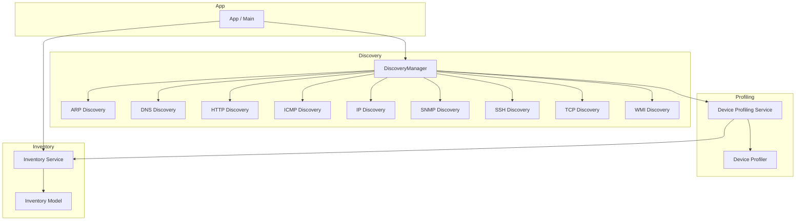
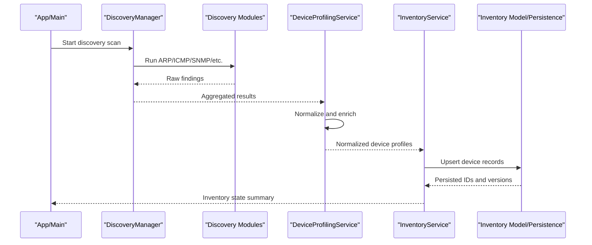
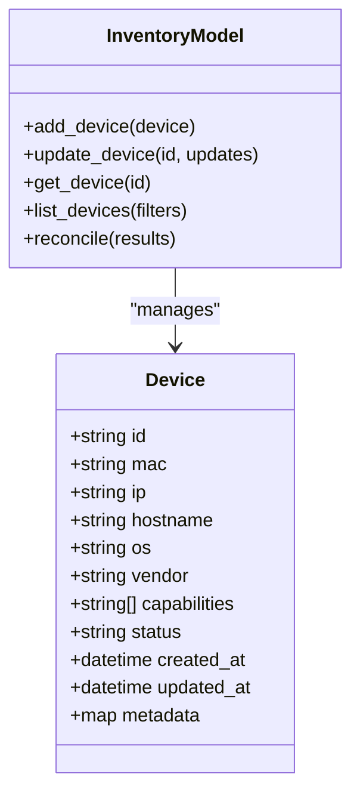
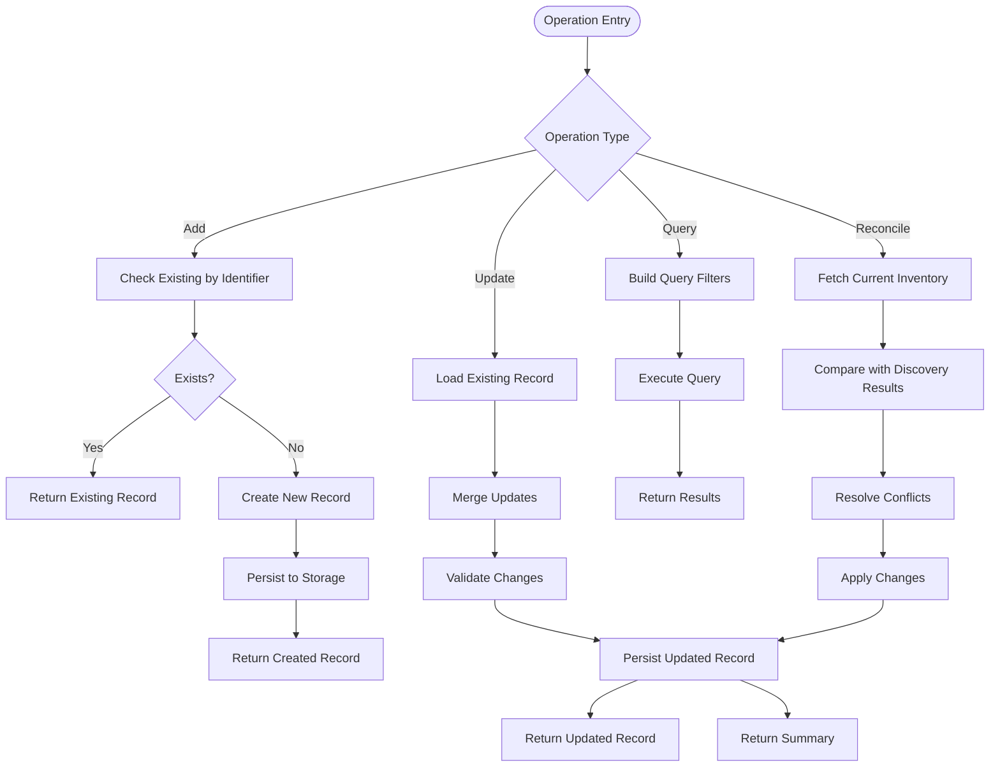
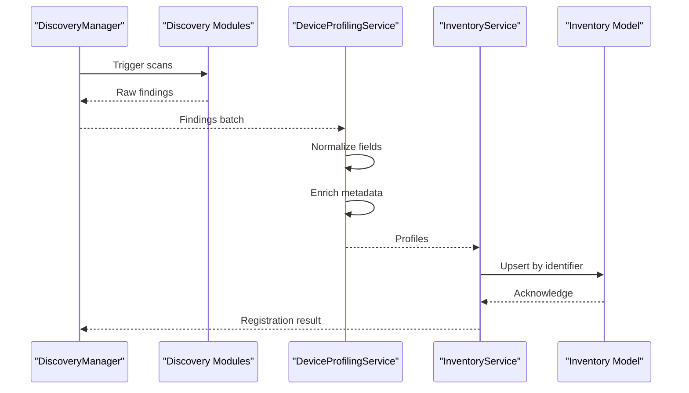
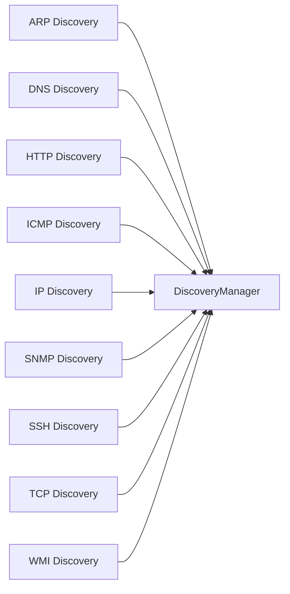
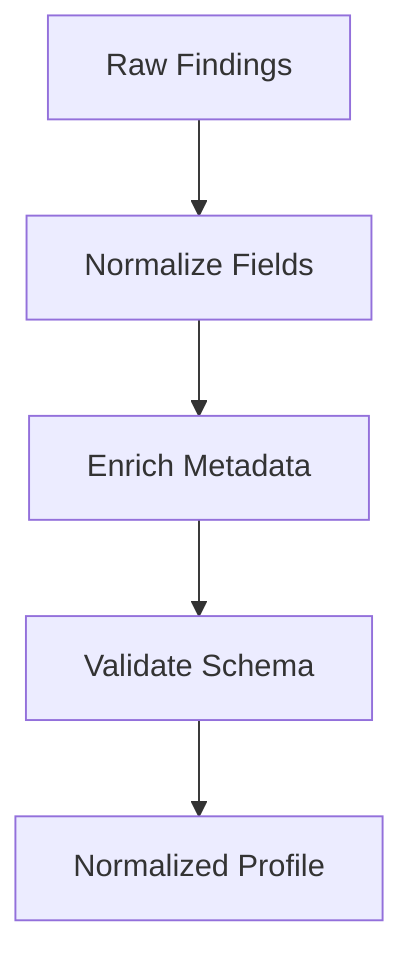
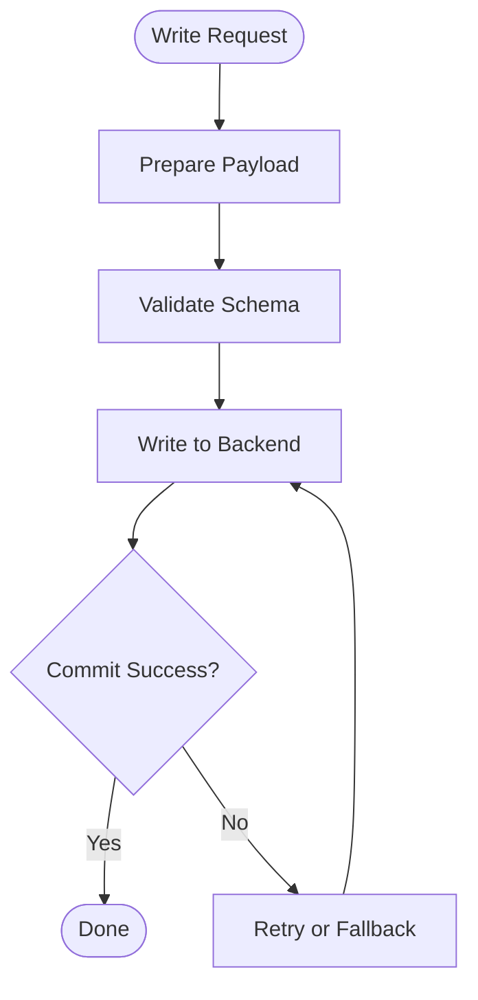
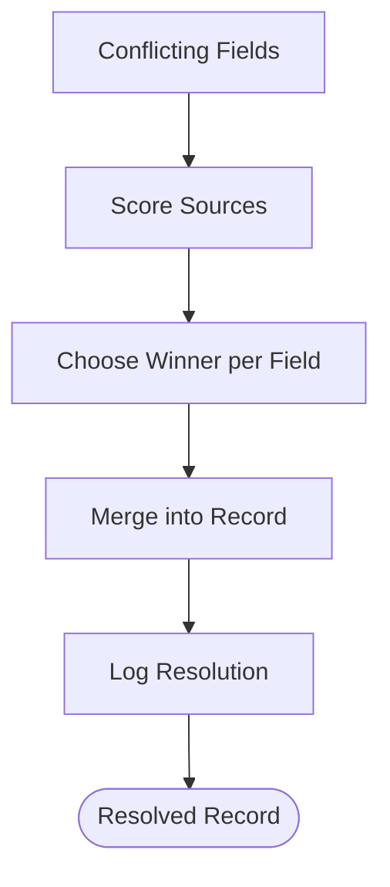
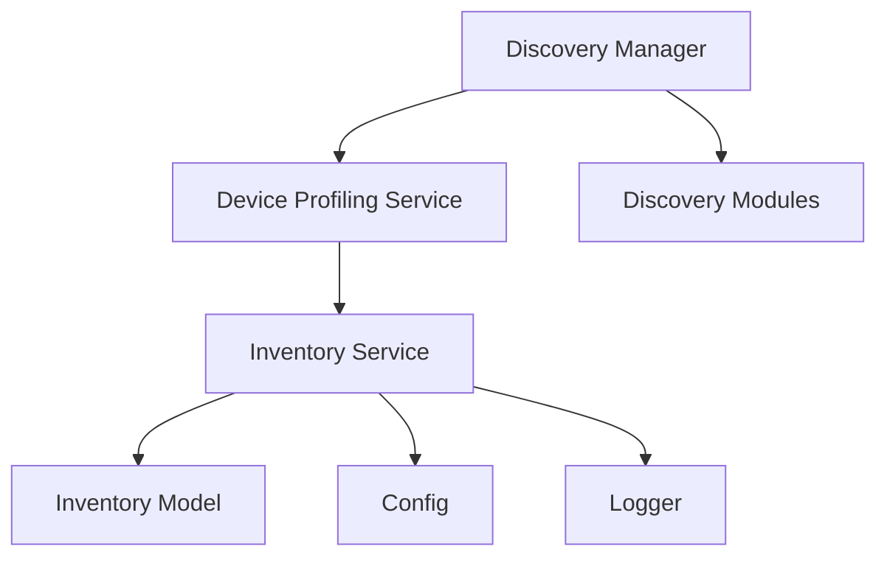

# Device Inventory Management

<cite>
**Referenced Files in This Document**
- [inventory.py](file://icmp_discovery/inventory.py)
- [inventory_service.py](file://icmp_discovery/inventory_service.py)
- [device_profiling_service.py](file://icmp_discovery/device_profiling_service.py)
- [discovery_manager.py](file://icmp_discovery/discovery_manager.py)
- [arp_discovery.py](file://icmp_discovery/discovery_modules/arp_discovery.py)
- [dns_discovery.py](file://icmp_discovery/discovery_modules/dns_discovery.py)
- [http_discovery.py](file://icmp_discovery/discovery_modules/http_discovery.py)
- [icmp_discovery.py](file://icmp_discovery/discovery_modules/icmp_discovery.py)
- [ip_discovery.py](file://icmp_discovery/discovery_modules/ip_discovery.py)
- [snmp_discovery.py](file://icmp_discovery/discovery_modules/snmp_discovery.py)
- [ssh_discovery.py](file://icmp_discovery/discovery_modules/ssh_discovery.py)
- [tcp_discovery.py](file://icmp_discovery/discovery_modules/tcp_discovery.py)
- [wmi_discovery.py](file://icmp_discovery/discovery_modules/wmi_discovery.py)
- [device_profiler.py](file://icmp_discovery/discovery_modules/device_profiler.py)
- [app.py](file://icmp_discovery/app.py)
- [main.py](file://icmp_discovery/main.py)
- [config.py](file://icmp_discovery/config.py)
- [parser.py](file://icmp_discovery/parser.py)
- [utils.py](file://icmp_discovery/utils.py)
- [logger.py](file://icmp_discovery/logger.py)
- [scan_state.py](file://icmp_discovery/scan_state.py)
- [scheduler.py](file://icmp_discovery/scheduler.py)
- [scheduler_loop.py](file://icmp_discovery/scheduler_loop.py)
- [report.py](file://icmp_discovery/report.py)
- [summary.py](file://icmp_discovery/summary.py)
- [analytics_modules/alert_engine.py](file://icmp_discovery/analytics_modules/alert_engine.py)
- [analytics_modules/event_engine.py](file://icmp_discovery/analytics_modules/event_engine.py)
- [analytics_modules/topology_engine.py](file://icmp_discovery/analytics_modules/topology_engine.py)
</cite>

## Table of Contents
1. Introduction
2. Project Structure
3. Core Components
4. Architecture Overview
5. Detailed Component Analysis
6. Dependency Analysis
7. Performance Considerations
8. Troubleshooting Guide
9. Conclusion
10. Appendices

## Introduction
This document explains the device inventory management system implemented in the repository. It covers the inventory data model, device registration process, and inventory service operations. It also details how devices are discovered, profiled, and stored; how attributes and metadata are handled; and how persistence is achieved. Examples are provided for adding new devices, updating existing records, and querying inventory data. The relationship between discovery results and inventory items is explained, including automatic updates and conflict resolution strategies.

## Project Structure
The inventory subsystem spans multiple modules:
- Discovery modules probe networks and endpoints to find devices and collect raw signals.
- A discovery manager orchestrates scanning and aggregation.
- A device profiling service enriches raw findings into structured profiles.
- An inventory module defines the data model and persistence.
- An inventory service provides CRUD operations and reconciliation with discovery results.
- Application entry points wire services together and expose APIs or CLI flows.

**Diagram sources**
- [discovery_manager.py](file://icmp_discovery/discovery_manager.py)
- [arp_discovery.py](file://icmp_discovery/discovery_modules/arp_discovery.py)
- [dns_discovery.py](file://icmp_discovery/discovery_modules/dns_discovery.py)
- [http_discovery.py](file://icmp_discovery/discovery_modules/http_discovery.py)
- [icmp_discovery.py](file://icmp_discovery/discovery_modules/icmp_discovery.py)
- [ip_discovery.py](file://icmp_discovery/discovery_modules/ip_discovery.py)
- [snmp_discovery.py](file://icmp_discovery/discovery_modules/snmp_discovery.py)
- [ssh_discovery.py](file://icmp_discovery/discovery_modules/ssh_discovery.py)
- [tcp_discovery.py](file://icmp_discovery/discovery_modules/tcp_discovery.py)
- [wmi_discovery.py](file://icmp_discovery/discovery_modules/wmi_discovery.py)
- [device_profiling_service.py](file://icmp_discovery/device_profiling_service.py)
- [device_profiler.py](file://icmp_discovery/discovery_modules/device_profiler.py)
- [inventory.py](file://icmp_discovery/inventory.py)
- [inventory_service.py](file://icmp_discovery/inventory_service.py)
- [app.py](file://icmp_discovery/app.py)
- [main.py](file://icmp_discovery/main.py)

**Section sources**
- [discovery_manager.py](file://icmp_discovery/discovery_manager.py)
- [inventory.py](file://icmp_discovery/inventory.py)
- [inventory_service.py](file://icmp_discovery/inventory_service.py)
- [device_profiling_service.py](file://icmp_discovery/device_profiling_service.py)
- [app.py](file://icmp_discovery/app.py)
- [main.py](file://icmp_discovery/main.py)

## Core Components
- Inventory Data Model: Defines device entities, attributes, and metadata structures used across the system.
- Inventory Service: Provides methods to add, update, query, and reconcile inventory items.
- Device Profiling Service: Transforms discovery outputs into normalized device profiles.
- Discovery Manager: Coordinates multiple discovery modules and aggregates results.
- Discovery Modules: Implement protocol-specific probing (ARP, DNS, HTTP, ICMP, IP, SNMP, SSH, TCP, WMI).
- Persistence Layer: Stores inventory data to disk or a database backend as configured.

Key responsibilities:
- Discover devices via multiple protocols and aggregate findings.
- Profile devices by extracting OS, vendor, capabilities, and other attributes.
- Persist inventory with unique identifiers and versioned metadata.
- Reconcile discovery results with existing inventory, handling conflicts deterministically.

**Section sources**
- [inventory.py](file://icmp_discovery/inventory.py)
- [inventory_service.py](file://icmp_discovery/inventory_service.py)
- [device_profiling_service.py](file://icmp_discovery/device_profiling_service.py)
- [discovery_manager.py](file://icmp_discovery/discovery_manager.py)
- [arp_discovery.py](file://icmp_discovery/discovery_modules/arp_discovery.py)
- [dns_discovery.py](file://icmp_discovery/discovery_modules/dns_discovery.py)
- [http_discovery.py](file://icmp_discovery/discovery_modules/http_discovery.py)
- [icmp_discovery.py](file://icmp_discovery/discovery_modules/icmp_discovery.py)
- [ip_discovery.py](file://icmp_discovery/discovery_modules/ip_discovery.py)
- [snmp_discovery.py](file://icmp_discovery/discovery_modules/snmp_discovery.py)
- [ssh_discovery.py](file://icmp_discovery/discovery_modules/ssh_discovery.py)
- [tcp_discovery.py](file://icmp_discovery/discovery_modules/tcp_discovery.py)
- [wmi_discovery.py](file://icmp_discovery/discovery_modules/wmi_discovery.py)

## Architecture Overview
The system follows a layered architecture:
- Presentation/Entry: App and main orchestrate workflows and expose interfaces.
- Services: DiscoveryManager, DeviceProfilingService, and InventoryService encapsulate business logic.
- Modules: Protocol-specific discovery modules feed raw signals upward.
- Data: Inventory model and persistence provide storage and retrieval.

**Diagram sources**
- [discovery_manager.py](file://icmp_discovery/discovery_manager.py)
- [device_profiling_service.py](file://icmp_discovery/device_profiling_service.py)
- [inventory_service.py](file://icmp_discovery/inventory_service.py)
- [inventory.py](file://icmp_discovery/inventory.py)
- [app.py](file://icmp_discovery/app.py)
- [main.py](file://icmp_discovery/main.py)

## Detailed Component Analysis

### Inventory Data Model
- Purpose: Define canonical device entity structure, attributes, and metadata schema.
- Typical fields include identifiers (e.g., MAC/IP), hostname, OS, vendor, capabilities, status, timestamps, and custom metadata.
- Validation rules ensure required fields and consistent types.
- Versioning supports incremental updates and auditability.

**Diagram sources**
- [inventory.py](file://icmp_discovery/inventory.py)

**Section sources**
- [inventory.py](file://icmp_discovery/inventory.py)

### Inventory Service Operations
- Add device: Create a new record if not present; otherwise return existing ID.
- Update device: Merge partial updates; preserve immutable fields; update timestamps.
- Query devices: Filter by attributes such as OS, vendor, status, or metadata keys.
- Reconcile with discovery: Merge new findings with existing records using conflict resolution rules.

**Diagram sources**
- [inventory_service.py](file://icmp_discovery/inventory_service.py)

**Section sources**
- [inventory_service.py](file://icmp_discovery/inventory_service.py)

### Device Registration Process
- Input: Discovery results from one or more modules.
- Normalization: Convert heterogeneous findings into a unified device profile.
- Enrichment: Attach metadata (timestamps, source modules, confidence scores).
- Registration: Upsert into inventory with conflict resolution.

**Diagram sources**
- [discovery_manager.py](file://icmp_discovery/discovery_manager.py)
- [device_profiling_service.py](file://icmp_discovery/device_profiling_service.py)
- [inventory_service.py](file://icmp_discovery/inventory_service.py)
- [inventory.py](file://icmp_discovery/inventory.py)

**Section sources**
- [discovery_manager.py](file://icmp_discovery/discovery_manager.py)
- [device_profiling_service.py](file://icmp_discovery/device_profiling_service.py)
- [inventory_service.py](file://icmp_discovery/inventory_service.py)

### Discovery Modules
Each module implements a specific probing strategy:
- ARP Discovery: Local network neighbor discovery via ARP tables.
- DNS Discovery: Reverse lookups and DNS records to identify hosts.
- HTTP Discovery: Probe web services to infer device type and capabilities.
- ICMP Discovery: Ping-based reachability and basic fingerprinting.
- IP Discovery: Subnet enumeration and address space mapping.
- SNMP Discovery: OID queries for detailed device information.
- SSH Discovery: Banner grabbing and capability detection over SSH.
- TCP Discovery: Port scanning and service identification.
- WMI Discovery: Windows host enumeration via WMI.

**Diagram sources**
- [arp_discovery.py](file://icmp_discovery/discovery_modules/arp_discovery.py)
- [dns_discovery.py](file://icmp_discovery/discovery_modules/dns_discovery.py)
- [http_discovery.py](file://icmp_discovery/discovery_modules/http_discovery.py)
- [icmp_discovery.py](file://icmp_discovery/discovery_modules/icmp_discovery.py)
- [ip_discovery.py](file://icmp_discovery/discovery_modules/ip_discovery.py)
- [snmp_discovery.py](file://icmp_discovery/discovery_modules/snmp_discovery.py)
- [ssh_discovery.py](file://icmp_discovery/discovery_modules/ssh_discovery.py)
- [tcp_discovery.py](file://icmp_discovery/discovery_modules/tcp_discovery.py)
- [wmi_discovery.py](file://icmp_discovery/discovery_modules/wmi_discovery.py)
- [discovery_manager.py](file://icmp_discovery/discovery_manager.py)

**Section sources**
- [arp_discovery.py](file://icmp_discovery/discovery_modules/arp_discovery.py)
- [dns_discovery.py](file://icmp_discovery/discovery_modules/dns_discovery.py)
- [http_discovery.py](file://icmp_discovery/discovery_modules/http_discovery.py)
- [icmp_discovery.py](file://icmp_discovery/discovery_modules/icmp_discovery.py)
- [ip_discovery.py](file://icmp_discovery/discovery_modules/ip_discovery.py)
- [snmp_discovery.py](file://icmp_discovery/discovery_modules/snmp_discovery.py)
- [ssh_discovery.py](file://icmp_discovery/discovery_modules/ssh_discovery.py)
- [tcp_discovery.py](file://icmp_discovery/discovery_modules/tcp_discovery.py)
- [wmi_discovery.py](file://icmp_discovery/discovery_modules/wmi_discovery.py)
- [discovery_manager.py](file://icmp_discovery/discovery_manager.py)

### Device Profiling
- Normalization: Map disparate fields to canonical attributes (hostname, OS, vendor).
- Enrichment: Attach provenance (source module), timestamps, confidence scores.
- Validation: Ensure required fields and consistent formats.
- Output: Structured device profiles ready for inventory upsert.

**Diagram sources**
- [device_profiling_service.py](file://icmp_discovery/device_profiling_service.py)
- [device_profiler.py](file://icmp_discovery/discovery_modules/device_profiler.py)

**Section sources**
- [device_profiling_service.py](file://icmp_discovery/device_profiling_service.py)
- [device_profiler.py](file://icmp_discovery/discovery_modules/device_profiler.py)

### Persistence Mechanisms
- Storage backends: File-based (JSON) or database-backed depending on configuration.
- Transactional writes: Batch upserts to maintain consistency.
- Versioning: Track changes via timestamps and optional version fields.
- Indexing: Optimize queries by common filters (OS, vendor, status).

**Diagram sources**
- [inventory.py](file://icmp_discovery/inventory.py)
- [config.py](file://icmp_discovery/config.py)

**Section sources**
- [inventory.py](file://icmp_discovery/inventory.py)
- [config.py](file://icmp_discovery/config.py)

### Conflict Resolution Strategies
- Identifier precedence: Prefer most reliable source (e.g., SNMP over ARP).
- Field-level merging: Keep latest non-null values; preserve immutable identifiers.
- Confidence scoring: Weight fields by source reliability and freshness.
- Audit trail: Log conflicts and resolutions for traceability.

**Diagram sources**
- [inventory_service.py](file://icmp_discovery/inventory_service.py)
- [inventory.py](file://icmp_discovery/inventory.py)

**Section sources**
- [inventory_service.py](file://icmp_discovery/inventory_service.py)
- [inventory.py](file://icmp_discovery/inventory.py)

### Examples

- Adding a new device
  - Use the inventory service to create a device record from a normalized profile.
  - If an identifier already exists, the service returns the existing record without duplication.
  - Example flow: normalize -> validate -> upsert -> persist.

- Updating an existing record
  - Provide partial updates; the service merges changes and updates timestamps.
  - Immutable fields (e.g., primary identifier) remain unchanged.
  - Example flow: load -> merge -> validate -> persist.

- Querying inventory data
  - Filter by attributes such as OS, vendor, status, or metadata keys.
  - Returns a list of matching devices with selected fields.
  - Example flow: build filter -> execute query -> return results.

**Section sources**
- [inventory_service.py](file://icmp_discovery/inventory_service.py)
- [inventory.py](file://icmp_discovery/inventory.py)

## Dependency Analysis
The inventory subsystem depends on discovery and profiling modules, and exposes operations through the inventory service.

**Diagram sources**
- [inventory.py](file://icmp_discovery/inventory.py)
- [inventory_service.py](file://icmp_discovery/inventory_service.py)
- [device_profiling_service.py](file://icmp_discovery/device_profiling_service.py)
- [discovery_manager.py](file://icmp_discovery/discovery_manager.py)
- [config.py](file://icmp_discovery/config.py)
- [logger.py](file://icmp_discovery/logger.py)

**Section sources**
- [inventory.py](file://icmp_discovery/inventory.py)
- [inventory_service.py](file://icmp_discovery/inventory_service.py)
- [device_profiling_service.py](file://icmp_discovery/device_profiling_service.py)
- [discovery_manager.py](file://icmp_discovery/discovery_manager.py)
- [config.py](file://icmp_discovery/config.py)
- [logger.py](file://icmp_discovery/logger.py)

## Performance Considerations
- Batch operations: Group upserts and queries to reduce I/O overhead.
- Caching: Cache frequent queries and device profiles where appropriate.
- Concurrency: Parallelize independent discovery modules while serializing writes.
- Indexing: Maintain indexes on frequently filtered fields (OS, vendor, status).
- Backpressure: Limit concurrent scans to avoid overwhelming targets.

[No sources needed since this section provides general guidance]

## Troubleshooting Guide
Common issues and remedies:
- Duplicate entries: Ensure consistent identifier normalization and deduplication logic.
- Missing attributes: Verify profiling enrichment steps and source module outputs.
- Persistence failures: Check backend connectivity and transaction rollback behavior.
- Slow queries: Review indexes and filter usage patterns.
- Logging: Enable detailed logs to trace discovery-to-inventory flows.

**Section sources**
- [logger.py](file://icmp_discovery/logger.py)
- [inventory_service.py](file://icmp_discovery/inventory_service.py)
- [inventory.py](file://icmp_discovery/inventory.py)

## Conclusion
The device inventory management system integrates multi-protocol discovery, robust device profiling, and a resilient inventory service with clear persistence and conflict resolution. By normalizing heterogeneous findings and applying deterministic reconciliation, it maintains an accurate, up-to-date inventory suitable for monitoring and analytics workflows.

[No sources needed since this section summarizes without analyzing specific files]

## Appendices

### Appendix A: API and CLI Interfaces
- App and main modules orchestrate discovery and inventory operations, exposing endpoints or CLI commands for scanning, registration, and querying.

**Section sources**
- [app.py](file://icmp_discovery/app.py)
- [main.py](file://icmp_discovery/main.py)

### Appendix B: Scheduling and Reporting
- Scheduler components can trigger periodic discovery and inventory reconciliation.
- Report and summary modules generate insights from inventory data.

**Section sources**
- [scheduler.py](file://icmp_discovery/scheduler.py)
- [scheduler_loop.py](file://icmp_discovery/scheduler_loop.py)
- [report.py](file://icmp_discovery/report.py)
- [summary.py](file://icmp_discovery/summary.py)

### Appendix C: Analytics Integration
- Alert, event, and topology engines consume inventory data for higher-level analytics and automation.

**Section sources**
- [analytics_modules/alert_engine.py](file://icmp_discovery/analytics_modules/alert_engine.py)
- [analytics_modules/event_engine.py](file://icmp_discovery/analytics_modules/event_engine.py)
- [analytics_modules/topology_engine.py](file://icmp_discovery/analytics_modules/topology_engine.py)