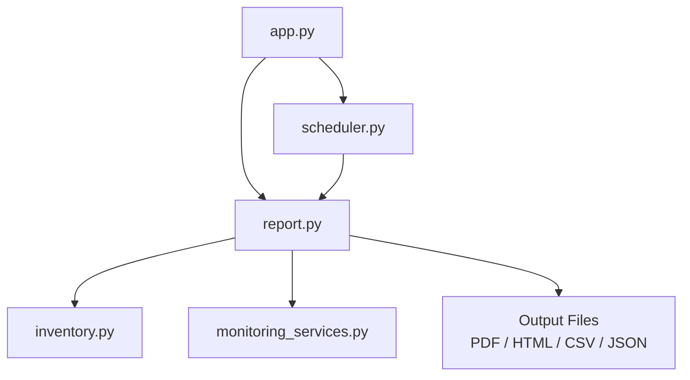
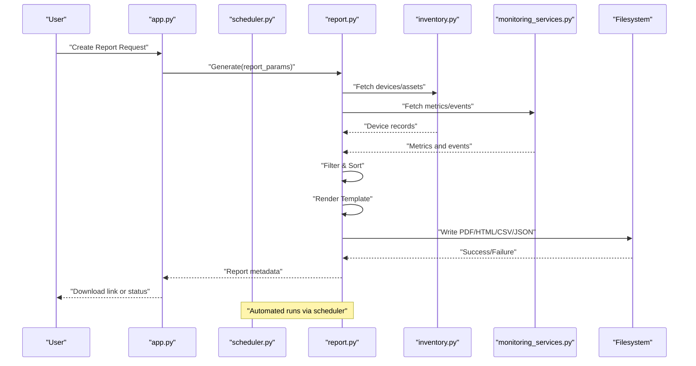
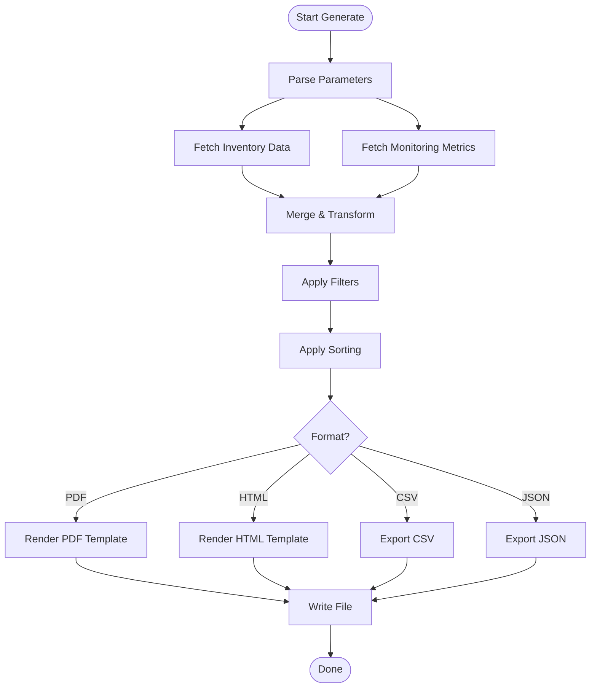
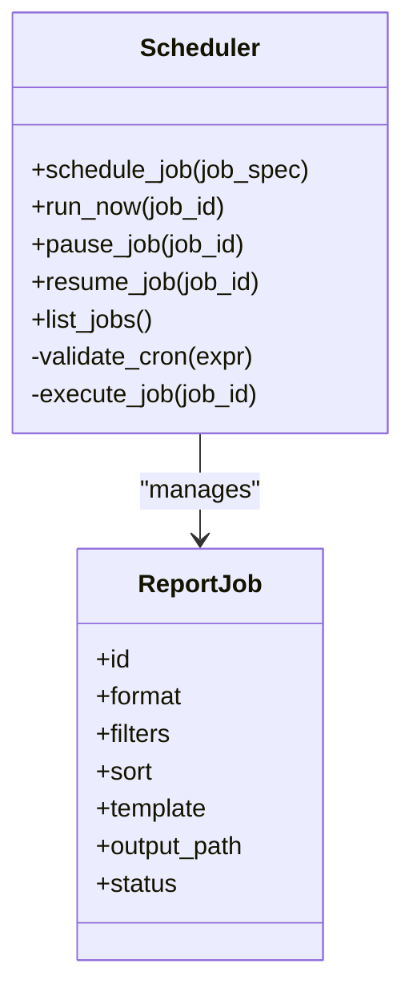
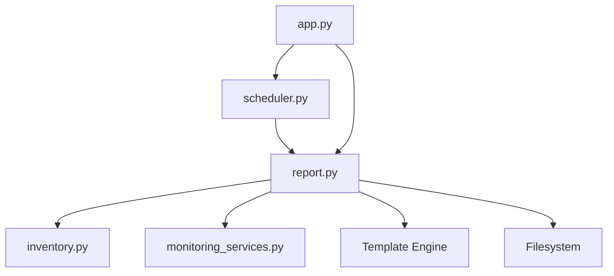

# Report Generation System

<cite>
**Referenced Files in This Document**
- [report.py](file://icmp_discovery/report.py)
- [scheduler.py](file://icmp_discovery/scheduler.py)
- [inventory.py](file://icmp_discovery/inventory.py)
- [monitoring_services.py](file://icmp_discovery/monitoring_services.py)
- [app.py](file://icmp_discovery/app.py)
- [config.py](file://icmp_discovery/config.py)
- [test_report.py](file://icmp_discovery/tests/test_report.py)
</cite>

## Table of Contents
1. [Introduction](#introduction)
2. [Project Structure](#project-structure)
3. [Core Components](#core-components)
4. [Architecture Overview](#architecture-overview)
5. [Detailed Component Analysis](#detailed-component-analysis)
6. [Dependency Analysis](#dependency-analysis)
7. [Performance Considerations](#performance-considerations)
8. [Troubleshooting Guide](#troubleshooting-guide)
9. [Conclusion](#conclusion)
10. [Appendices](#appendices)

## Introduction
This document explains the report generation system used to produce PDF, HTML, CSV, and JSON reports from inventory data, scan results, and monitoring metrics. It covers supported formats, template mechanisms, customization options, filtering and sorting, scheduling, and integration points with external tools. The goal is to enable both new users and advanced developers to understand how reports are created, customized, scheduled, and exported.

## Project Structure
The reporting subsystem resides primarily under icmp_discovery and integrates with inventory and monitoring services. Key files include:
- report.py: Core report generation logic, format selection, and output handling
- scheduler.py: Scheduling engine for automated report execution
- inventory.py: Inventory data source for device and asset information
- monitoring_services.py: Monitoring metrics and event sources
- app.py: Application entry point that wires services together
- config.py: Configuration for report settings and defaults
- tests/test_report.py: Tests validating report behavior and outputs

**Diagram sources**
- [app.py](file://icmp_discovery/app.py)
- [report.py](file://icmp_discovery/report.py)
- [scheduler.py](file://icmp_discovery/scheduler.py)
- [inventory.py](file://icmp_discovery/inventory.py)
- [monitoring_services.py](file://icmp_discovery/monitoring_services.py)

**Section sources**
- [report.py](file://icmp_discovery/report.py)
- [scheduler.py](file://icmp_discovery/scheduler.py)
- [inventory.py](file://icmp_discovery/inventory.py)
- [monitoring_services.py](file://icmp_discovery/monitoring_services.py)
- [app.py](file://icmp_discovery/app.py)
- [config.py](file://icmp_discovery/config.py)
- [test_report.py](file://icmp_discovery/tests/test_report.py)

## Core Components
- Report Generator: Orchestrates data collection, applies filters and sorting, renders templates, and writes outputs in multiple formats.
- Scheduler: Executes report jobs on a schedule or on-demand, supports recurring runs and job lifecycle management.
- Data Sources: Inventory service provides device and asset records; monitoring services provide metrics and events.
- Template Engine: Supports customizable layouts and content blocks for HTML and PDF rendering.
- Export Utilities: Convert internal data structures into CSV and JSON payloads.

Key responsibilities:
- Format selection and rendering pipeline
- Data aggregation and transformation
- Filtering and sorting operations
- Output file creation and storage
- Scheduling and error handling

**Section sources**
- [report.py](file://icmp_discovery/report.py)
- [scheduler.py](file://icmp_discovery/scheduler.py)
- [inventory.py](file://icmp_discovery/inventory.py)
- [monitoring_services.py](file://icmp_discovery/monitoring_services.py)

## Architecture Overview
The report generation system follows a layered architecture:
- API/Entry Layer: app.py exposes endpoints or triggers for report creation and scheduling.
- Service Layer: report.py coordinates data retrieval and rendering; scheduler.py manages job execution.
- Data Layer: inventory.py and monitoring_services.py supply raw data.
- Output Layer: Writes formatted files (PDF, HTML, CSV, JSON) to configured locations.

**Diagram sources**
- [app.py](file://icmp_discovery/app.py)
- [report.py](file://icmp_discovery/report.py)
- [scheduler.py](file://icmp_discovery/scheduler.py)
- [inventory.py](file://icmp_discovery/inventory.py)
- [monitoring_services.py](file://icmp_discovery/monitoring_services.py)

## Detailed Component Analysis

### Report Generator (report.py)
Responsibilities:
- Accepts parameters such as format, time range, filters, sort order, and template selection.
- Aggregates data from inventory and monitoring sources.
- Applies filtering (e.g., by device type, status, date range) and sorting (e.g., by name, timestamp).
- Renders templates for HTML and PDF; exports CSV and JSON directly.
- Handles errors and returns structured responses.

Supported formats:
- PDF: Rendered via template engine; suitable for printable reports.
- HTML: Web-friendly layout; can be viewed in browsers or converted to PDF.
- CSV: Tabular export for spreadsheets and analytics tools.
- JSON: Machine-readable payload for integrations and dashboards.

Customization options:
- Template selection and overrides for headers, footers, charts, and sections.
- Field mapping and column ordering for CSV/JSON.
- Styling and branding elements for HTML/PDF.

Data flow:
- Inputs: report parameters, selected filters, sort criteria, template ID.
- Processing: fetch data, transform, filter, sort, render.
- Outputs: generated file path, size, timestamp, and optional metadata.

**Diagram sources**
- [report.py](file://icmp_discovery/report.py)

**Section sources**
- [report.py](file://icmp_discovery/report.py)

### Scheduler (scheduler.py)
Responsibilities:
- Define and manage report jobs with cron-like expressions or intervals.
- Execute jobs at scheduled times or trigger them on demand.
- Persist job state and handle retries on failure.
- Integrate with logging and alerting for job outcomes.

Scheduling features:
- Recurring schedules (daily, weekly, monthly).
- One-time executions.
- Job dependencies and chaining.
- Configurable output paths and naming conventions.

**Diagram sources**
- [scheduler.py](file://icmp_discovery/scheduler.py)

**Section sources**
- [scheduler.py](file://icmp_discovery/scheduler.py)

### Data Sources (inventory.py, monitoring_services.py)
- inventory.py: Provides device and asset records including identifiers, attributes, and relationships. Used to build report tables and summaries.
- monitoring_services.py: Supplies metrics, events, and health statuses. Used to enrich reports with real-time or historical data.

Integration patterns:
- Report generator calls these services to retrieve datasets within specified time ranges.
- Data is normalized into common structures before filtering and sorting.
- Errors from data sources are captured and reported back to the caller.

**Section sources**
- [inventory.py](file://icmp_discovery/inventory.py)
- [monitoring_services.py](file://icmp_discovery/monitoring_services.py)

### Application Entry Point (app.py)
Responsibilities:
- Wires together report generation and scheduling components.
- Exposes endpoints or functions to create reports and schedule jobs.
- Validates inputs and returns standardized responses.

Typical usage:
- Create a report via an API call with parameters.
- Schedule a recurring report using job specifications.
- Retrieve generated files or their metadata.

**Section sources**
- [app.py](file://icmp_discovery/app.py)

### Configuration (config.py)
Responsibilities:
- Defines default report formats, output directories, and template paths.
- Sets thresholds for metrics inclusion and retention policies.
- Controls logging levels and error reporting behavior.

Common settings:
- Default output directory and naming pattern.
- Supported formats list and enabled exporters.
- Template registry and fallback templates.
- Scheduling defaults and retry policies.

**Section sources**
- [config.py](file://icmp_discovery/config.py)

### Testing (tests/test_report.py)
Purpose:
- Validates report generation across formats.
- Ensures filtering and sorting behave as expected.
- Checks output file integrity and metadata.

Coverage highlights:
- End-to-end report creation flows.
- Edge cases like empty datasets and invalid parameters.
- Integration with scheduler for automated runs.

**Section sources**
- [test_report.py](file://icmp_discovery/tests/test_report.py)

## Dependency Analysis
The report system depends on:
- Inventory and monitoring services for data.
- Template engine for HTML/PDF rendering.
- Filesystem utilities for writing outputs.
- Scheduler for automation.

**Diagram sources**
- [report.py](file://icmp_discovery/report.py)
- [inventory.py](file://icmp_discovery/inventory.py)
- [monitoring_services.py](file://icmp_discovery/monitoring_services.py)
- [scheduler.py](file://icmp_discovery/scheduler.py)
- [app.py](file://icmp_discovery/app.py)

**Section sources**
- [report.py](file://icmp_discovery/report.py)
- [scheduler.py](file://icmp_discovery/scheduler.py)
- [inventory.py](file://icmp_discovery/inventory.py)
- [monitoring_services.py](file://icmp_discovery/monitoring_services.py)
- [app.py](file://icmp_discovery/app.py)

## Performance Considerations
- Data fetching: Use pagination and time-range limits to reduce memory usage.
- Rendering: Prefer streaming for large CSV/JSON exports; cache rendered templates when possible.
- Scheduling: Avoid overlapping jobs; implement rate limiting and backoff strategies.
- I/O: Batch writes and use asynchronous tasks where applicable.
- Filtering/Sorting: Apply filters early to minimize dataset size before sorting.

[No sources needed since this section provides general guidance]

## Troubleshooting Guide
Common issues and resolutions:
- Missing data sources: Verify inventory and monitoring services are reachable and returning valid data.
- Template errors: Ensure template IDs exist and required variables are provided.
- Permission errors: Confirm write permissions for output directories.
- Scheduling failures: Check cron expressions and job states; review logs for retry attempts.
- Large outputs: Adjust chunk sizes and consider compression for PDF/HTML.

Diagnostic steps:
- Inspect logs for errors during data fetch, rendering, and file writes.
- Validate parameters passed to the report generator.
- Test with minimal datasets to isolate performance bottlenecks.

**Section sources**
- [report.py](file://icmp_discovery/report.py)
- [scheduler.py](file://icmp_discovery/scheduler.py)
- [config.py](file://icmp_discovery/config.py)

## Conclusion
The report generation system provides a flexible and extensible framework for producing PDF, HTML, CSV, and JSON reports from inventory and monitoring data. With robust filtering, sorting, templating, and scheduling capabilities, it supports both ad-hoc analysis and automated reporting workflows. By following the guidelines and leveraging the provided components, users can create customized reports and integrate them into broader operational toolchains.

[No sources needed since this section summarizes without analyzing specific files]

## Appendices

### Creating Custom Report Templates
- Define a template with placeholders for dynamic fields and sections.
- Register the template in configuration and reference it by ID.
- Map data fields to template variables for consistent rendering.
- Test templates with sample data to ensure correct output.

**Section sources**
- [report.py](file://icmp_discovery/report.py)
- [config.py](file://icmp_discovery/config.py)

### Scheduling Automated Reports
- Create a job specification including format, filters, sort, and template.
- Set a cron expression or interval for recurring runs.
- Configure output paths and naming conventions.
- Monitor job status and handle failures with retries.

**Section sources**
- [scheduler.py](file://icmp_discovery/scheduler.py)
- [app.py](file://icmp_discovery/app.py)

### Exporting Data in Various Formats
- Choose the desired format based on audience and downstream tools.
- For CSV/JSON, ensure field mappings align with consumer expectations.
- For PDF/HTML, verify template rendering and styling.
- Validate outputs for completeness and correctness.

**Section sources**
- [report.py](file://icmp_discovery/report.py)

### Report Filtering and Sorting
- Apply filters by device type, status, date range, or custom attributes.
- Sort by fields such as name, timestamp, or metric values.
- Combine multiple filters and sort orders for precise results.
- Validate filter expressions and sort keys to avoid errors.

**Section sources**
- [report.py](file://icmp_discovery/report.py)

### Integration with External Reporting Tools
- Export JSON for ingestion into dashboards or analytics platforms.
- Use CSV for spreadsheet analysis and BI tools.
- Embed HTML reports in portals or share via email.
- Trigger external processes upon successful report generation.

**Section sources**
- [report.py](file://icmp_discovery/report.py)
- [app.py](file://icmp_discovery/app.py)