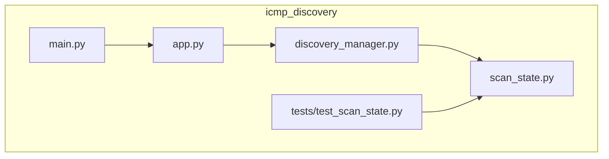
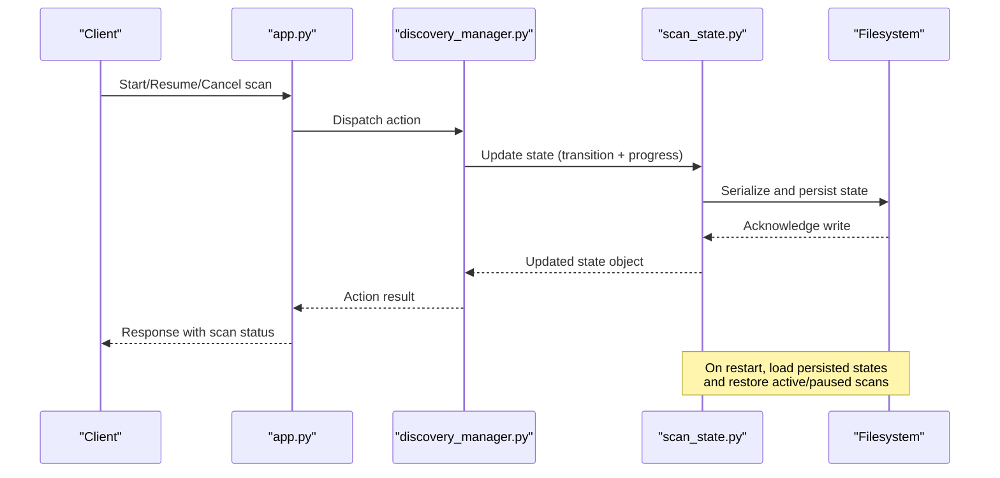
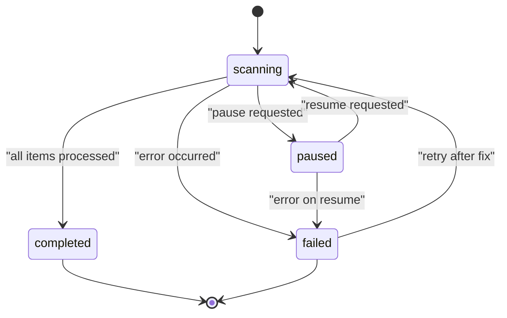
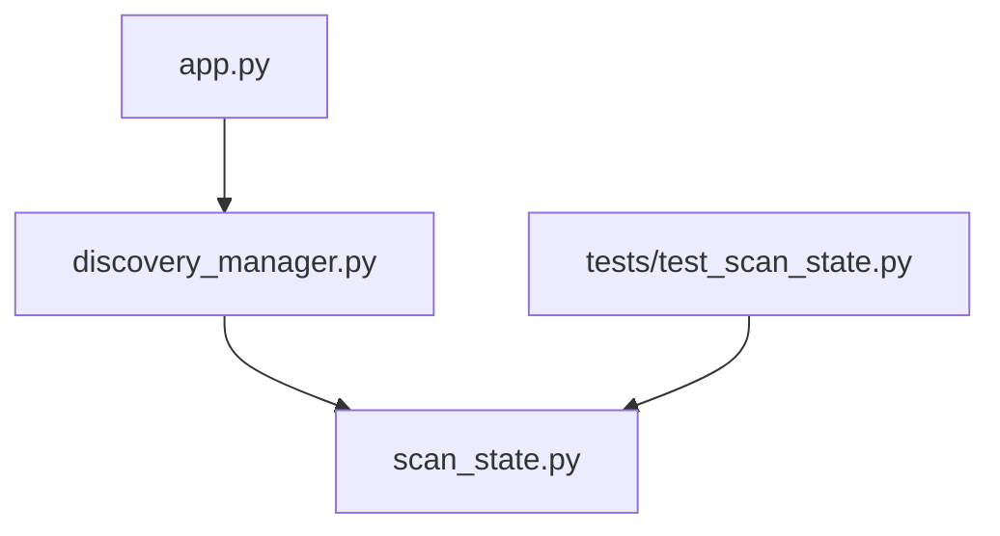

# Scan State Persistence

<cite>
**Referenced Files in This Document**
- [scan_state.py](file://icmp_discovery/scan_state.py)
- [discovery_manager.py](file://icmp_discovery/discovery_manager.py)
- [app.py](file://icmp_discovery/app.py)
- [main.py](file://icmp_discovery/main.py)
- [test_scan_state.py](file://icmp_discovery/tests/test_scan_state.py)
</cite>

## Table of Contents
1. [Introduction](#introduction)
2. [Project Structure](#project-structure)
3. [Core Components](#core-components)
4. [Architecture Overview](#architecture-overview)
5. [Detailed Component Analysis](#detailed-component-analysis)
6. [Dependency Analysis](#dependency-analysis)
7. [Performance Considerations](#performance-considerations)
8. [Troubleshooting Guide](#troubleshooting-guide)
9. [Conclusion](#conclusion)

## Introduction
This document explains the scan state management system for network discovery scans. It covers how scan progress is tracked, persisted, and restored across application restarts; the state machine governing discovery scans (including scanning, completed, paused, and failed); serialization format; crash recovery; and concurrent access handling. It also provides practical examples for starting new scans, resuming interrupted scans, and monitoring scan progress programmatically.

## Project Structure
The scan state system lives primarily in the icmp_discovery package:
- scan_state.py implements the state model, persistence, and lifecycle transitions.
- discovery_manager.py orchestrates discovery tasks and interacts with scan state.
- app.py exposes HTTP endpoints to control scans via REST APIs.
- main.py initializes the application and integrates components.
- tests/test_scan_state.py validates behavior and edge cases.

**Diagram sources**
- [app.py](file://icmp_discovery/app.py)
- [main.py](file://icmp_discovery/main.py)
- [discovery_manager.py](file://icmp_discovery/discovery_manager.py)
- [scan_state.py](file://icmp_discovery/scan_state.py)
- [test_scan_state.py](file://icmp_discovery/tests/test_scan_state.py)

**Section sources**
- [scan_state.py](file://icmp_discovery/scan_state.py)
- [discovery_manager.py](file://icmp_discovery/discovery_manager.py)
- [app.py](file://icmp_discovery/app.py)
- [main.py](file://icmp_discovery/main.py)
- [test_scan_state.py](file://icmp_discovery/tests/test_scan_state.py)

## Core Components
- ScanState model: Represents a single scan’s metadata, current state, progress counters, timestamps, error information, and identifiers.
- Persistence layer: Serializes and deserializes scan states to disk for durability across restarts and crashes.
- State machine: Enforces valid transitions between states such as scanning, completed, paused, and failed.
- DiscoveryManager: Coordinates discovery tasks, updates scan state during execution, and handles pause/resume semantics.
- API surface: Exposes endpoints to start, pause, resume, cancel, and query scan status.

Key responsibilities:
- Track per-scan progress and overall completion percentage.
- Persist state changes atomically to avoid corruption.
- Restore active or paused scans on startup to continue operation.
- Protect concurrent modifications using synchronization primitives.

**Section sources**
- [scan_state.py](file://icmp_discovery/scan_state.py)
- [discovery_manager.py](file://icmp_discovery/discovery_manager.py)
- [app.py](file://icmp_discovery/app.py)

## Architecture Overview
The scan state architecture combines an in-memory state machine with durable file-based persistence. The flow spans from API requests through the discovery manager to the scan state subsystem, which serializes changes to disk. On startup, the application restores any non-terminal scans to ensure continuity.

**Diagram sources**
- [app.py](file://icmp_discovery/app.py)
- [discovery_manager.py](file://icmp_discovery/discovery_manager.py)
- [scan_state.py](file://icmp_discovery/scan_state.py)

## Detailed Component Analysis

### Scan State Model and State Machine
The scan state model encapsulates:
- Unique identifier for each scan
- Current state (e.g., scanning, completed, paused, failed)
- Progress metrics (items processed, total items, percentages)
- Timestamps for creation, last update, and completion
- Error details when applicable
- Optional payload fields for configuration or context

Valid state transitions:
- scanning -> completed
- scanning -> paused
- scanning -> failed
- paused -> scanning
- paused -> failed
- failed -> scanning (restart after fix)

Transitions are enforced by the state machine to prevent invalid operations.

**Diagram sources**
- [scan_state.py](file://icmp_discovery/scan_state.py)

**Section sources**
- [scan_state.py](file://icmp_discovery/scan_state.py)

### Persistence and Serialization Format
Scan states are serialized to a structured format suitable for durability and portability. Typical considerations include:
- Stable schema with versioning to support future evolution
- Atomic writes using temporary files and rename to avoid partial writes
- Idempotent updates to handle retries safely
- Compact representation for frequent updates without excessive I/O

Common fields in the serialized form:
- id: unique scan identifier
- state: current state string
- progress: numeric counters and percentages
- timestamps: creation, last_update, completed_at
- error: optional error message and code
- metadata: additional context required by discovery modules

On application restart:
- Load all persisted states
- Filter for non-terminal states (scanning, paused)
- Restore them into memory and resume processing if appropriate

**Section sources**
- [scan_state.py](file://icmp_discovery/scan_state.py)

### Discovery Manager Integration
The discovery manager coordinates:
- Starting new scans with initial state set to scanning
- Updating progress incrementally as items are discovered
- Handling pause and resume by transitioning states accordingly
- Recording errors and transitioning to failed when necessary
- Ensuring thread safety around state updates

It interacts with scan state by:
- Calling transition methods that validate and apply state changes
- Persisting state snapshots at key checkpoints
- Querying current state for reporting and UI feedback

**Section sources**
- [discovery_manager.py](file://icmp_discovery/discovery_manager.py)
- [scan_state.py](file://icmp_discovery/scan_state.py)

### API Surface for Programmatic Control
The API exposes endpoints to:
- Start a new scan with parameters (targets, options)
- Pause an active scanning scan
- Resume a paused scan
- Cancel or abort a running scan
- Retrieve scan status and progress details

Typical request/response patterns:
- POST /scans: create and start a new scan
- POST /scans/{id}/pause: pause a scanning scan
- POST /scans/{id}/resume: resume a paused scan
- POST /scans/{id}/cancel: cancel a running scan
- GET /scans/{id}: return current state and progress

Responses include:
- Status codes indicating success or failure
- Body containing updated scan state and messages

**Section sources**
- [app.py](file://icmp_discovery/app.py)
- [discovery_manager.py](file://icmp_discovery/discovery_manager.py)
- [scan_state.py](file://icmp_discovery/scan_state.py)

### Crash Recovery and Restoration
Recovery steps:
- On startup, read persisted scan states from storage
- Identify scans in scanning or paused states
- Reinitialize internal structures and resume processing where possible
- Mark scans as failed if restoration cannot proceed due to missing dependencies

Safety measures:
- Validate persisted state integrity before restoring
- Use locks to prevent concurrent modification during recovery
- Log recovery actions for observability

**Section sources**
- [scan_state.py](file://icmp_discovery/scan_state.py)
- [discovery_manager.py](file://icmp_discovery/discovery_manager.py)

### Concurrent Access Handling
Concurrency safeguards:
- Per-scan locks to serialize state transitions and updates
- Global lock for startup/shutdown and bulk operations
- Optimistic checks to detect conflicting updates
- Retry logic for transient failures during persistence

Best practices:
- Minimize critical sections to reduce contention
- Batch updates where possible to reduce I/O
- Ensure atomicity of state writes

**Section sources**
- [scan_state.py](file://icmp_discovery/scan_state.py)
- [discovery_manager.py](file://icmp_discovery/discovery_manager.py)

### Examples: Starting, Resuming, and Monitoring Scans
- Start a new scan:
  - Call the start endpoint with target list and options
  - Receive immediate response with scan id and initial state scanning
  - Poll status endpoint to monitor progress until completed or failed

- Resume an interrupted scan:
  - Identify paused scan id
  - Call resume endpoint
  - Observe state transition back to scanning and continued progress

- Monitor progress programmatically:
  - Periodically query status endpoint
  - Parse progress fields to compute completion percentage
  - Handle terminal states gracefully

**Section sources**
- [app.py](file://icmp_discovery/app.py)
- [discovery_manager.py](file://icmp_discovery/discovery_manager.py)
- [scan_state.py](file://icmp_discovery/scan_state.py)

## Dependency Analysis
The scan state system has clear boundaries:
- app.py depends on discovery_manager.py for orchestration
- discovery_manager.py depends on scan_state.py for state management
- Tests depend on scan_state.py to validate behavior

**Diagram sources**
- [app.py](file://icmp_discovery/app.py)
- [discovery_manager.py](file://icmp_discovery/discovery_manager.py)
- [scan_state.py](file://icmp_discovery/scan_state.py)
- [test_scan_state.py](file://icmp_discovery/tests/test_scan_state.py)

**Section sources**
- [app.py](file://icmp_discovery/app.py)
- [discovery_manager.py](file://icmp_discovery/discovery_manager.py)
- [scan_state.py](file://icmp_discovery/scan_state.py)
- [test_scan_state.py](file://icmp_discovery/tests/test_scan_state.py)

## Performance Considerations
- Frequent persistence can degrade performance; use checkpointing strategies to balance durability and throughput.
- Prefer incremental updates and batched writes where feasible.
- Avoid holding locks across long-running operations to reduce contention.
- Monitor disk I/O and consider asynchronous persistence for high-frequency updates.

[No sources needed since this section provides general guidance]

## Troubleshooting Guide
Common issues and resolutions:
- Invalid state transitions:
  - Verify current state before attempting transitions
  - Check logs for transition validation errors

- Persistence failures:
  - Ensure filesystem permissions and available space
  - Validate serialized state integrity on load

- Stuck scans:
  - Inspect error fields in scan state
  - Restart or resume based on state and error context

- Concurrency conflicts:
  - Review locking strategy and critical sections
  - Increase retry timeouts and backoff intervals

**Section sources**
- [scan_state.py](file://icmp_discovery/scan_state.py)
- [discovery_manager.py](file://icmp_discovery/discovery_manager.py)

## Conclusion
The scan state management system provides robust tracking, persistence, and recovery for network discovery scans. By enforcing a strict state machine, ensuring atomic serialization, and handling concurrency safely, it supports reliable operation across restarts and crashes. The API surface enables programmatic control and monitoring, making it straightforward to integrate with automation and dashboards.

[No sources needed since this section summarizes without analyzing specific files]