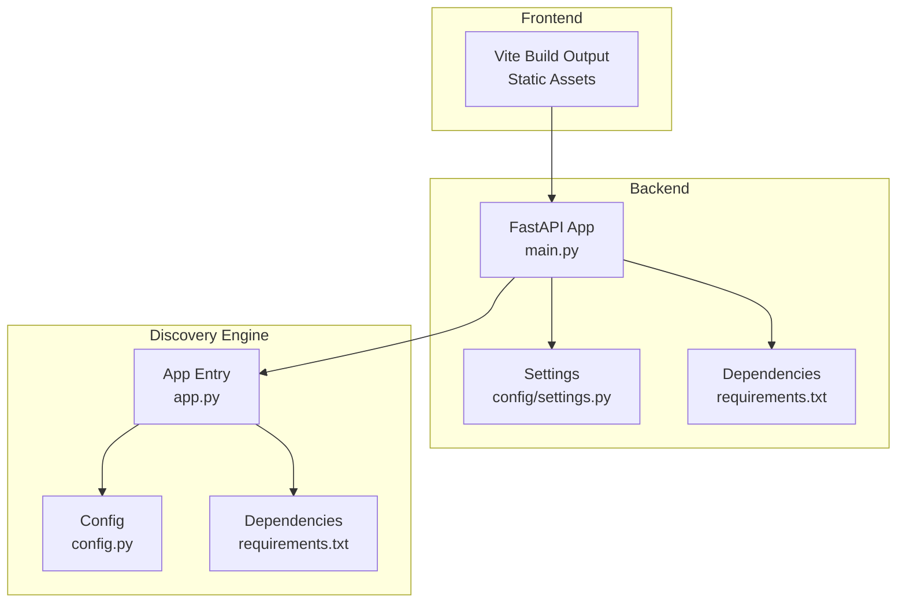
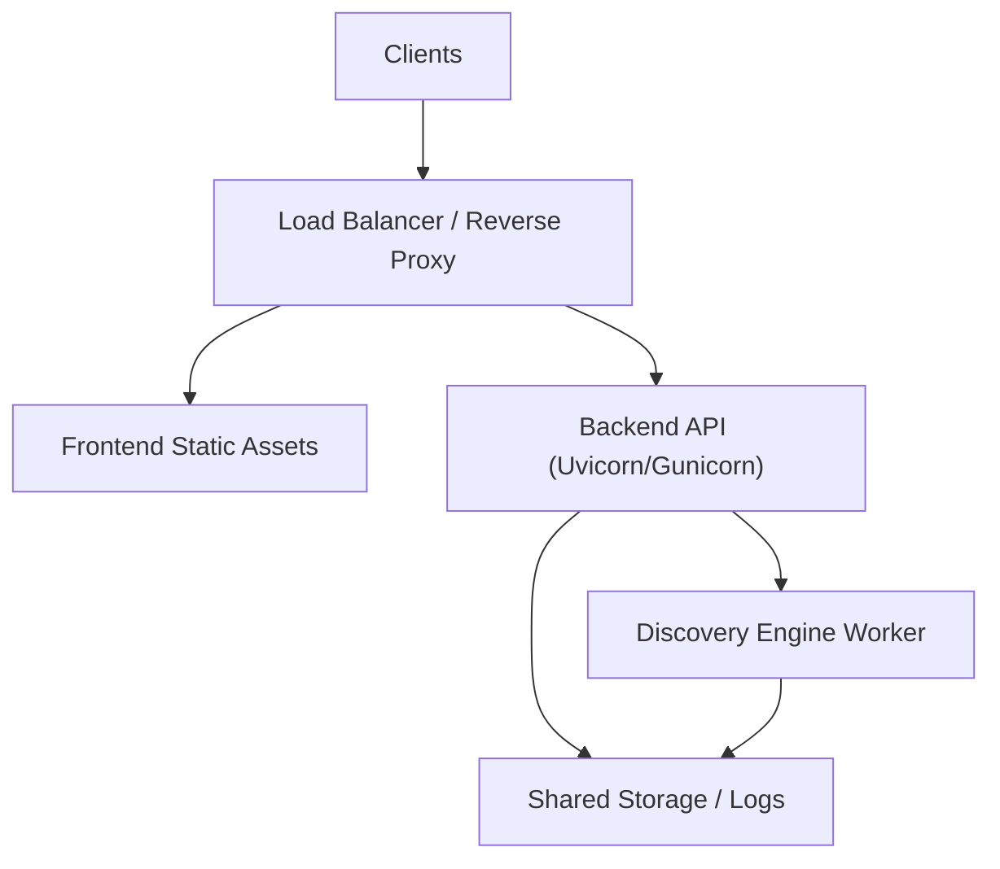
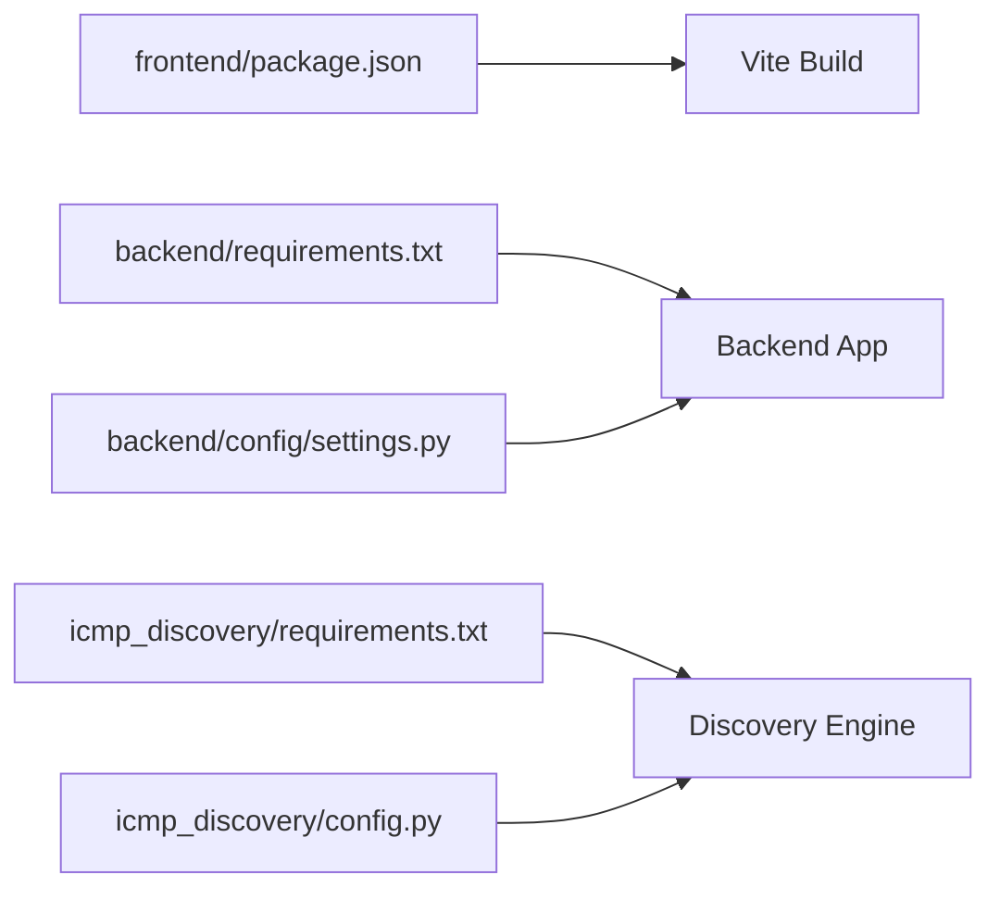

# Deployment Guide

<cite>
**Referenced Files in This Document**
- [backend/main.py](file://backend/main.py)
- [backend/config/settings.py](file://backend/config/settings.py)
- [backend/requirements.txt](file://backend/requirements.txt)
- [icmp_discovery/app.py](file://icmp_discovery/app.py)
- [icmp_discovery/config.py](file://icmp_discovery/config.py)
- [icmp_discovery/requirements.txt](file://icmp_discovery/requirements.txt)
- [frontend/package.json](file://frontend/package.json)
- [frontend/vite.config.js](file://frontend/vite.config.js)
</cite>

## Table of Contents
1. Introduction
2. Project Structure
3. Core Components
4. Architecture Overview
5. Detailed Component Analysis
6. Dependency Analysis
7. Performance Considerations
8. Troubleshooting Guide
9. Conclusion
10. Appendices

## Introduction
This deployment guide provides production-ready strategies for deploying the three components: Backend (FastAPI), ICMP Discovery Engine, and Frontend (Vite + React). It covers containerization with Docker, environment configuration, scaling, monitoring, deployment scripts, environment variable management, backups, cloud examples, load balancing, disaster recovery, performance tuning, resource requirements, and maintenance procedures.

## Project Structure
The repository contains three primary services:
- Backend API service (Python/FastAPI)
- ICMP Discovery Engine (Python)
- Frontend application (Vite + React)

**Diagram sources**
- [backend/main.py](file://backend/main.py)
- [backend/config/settings.py](file://backend/config/settings.py)
- [backend/requirements.txt](file://backend/requirements.txt)
- [icmp_discovery/app.py](file://icmp_discovery/app.py)
- [icmp_discovery/config.py](file://icmp_discovery/config.py)
- [icmp_discovery/requirements.txt](file://icmp_discovery/requirements.txt)

**Section sources**
- [backend/main.py](file://backend/main.py)
- [backend/config/settings.py](file://backend/config/settings.py)
- [backend/requirements.txt](file://backend/requirements.txt)
- [icmp_discovery/app.py](file://icmp_discovery/app.py)
- [icmp_discovery/config.py](file://icmp_discovery/config.py)
- [icmp_discovery/requirements.txt](file://icmp_discovery/requirements.txt)
- [frontend/package.json](file://frontend/package.json)
- [frontend/vite.config.js](file://frontend/vite.config.js)

## Core Components
- Backend API: FastAPI application serving REST endpoints, configuration via settings module, dependencies managed by requirements.txt.
- ICMP Discovery Engine: Standalone Python service responsible for discovery tasks, configured via config.py, dependencies via requirements.txt.
- Frontend: Vite-based React app producing static assets served by a web server or directly by the backend.

Key responsibilities:
- Backend: HTTP API, request validation, orchestration calls to discovery engine, configuration loading.
- Discovery Engine: Network scanning, device profiling, scheduling, and reporting.
- Frontend: User interface, asset bundling, build-time configuration.

**Section sources**
- [backend/main.py](file://backend/main.py)
- [backend/config/settings.py](file://backend/config/settings.py)
- [backend/requirements.txt](file://backend/requirements.txt)
- [icmp_discovery/app.py](file://icmp_discovery/app.py)
- [icmp_discovery/config.py](file://icmp_discovery/config.py)
- [icmp_discovery/requirements.txt](file://icmp_discovery/requirements.txt)
- [frontend/package.json](file://frontend/package.json)
- [frontend/vite.config.js](file://frontend/vite.config.js)

## Architecture Overview
Production architecture typically includes:
- Reverse proxy/load balancer (e.g., Nginx) terminating TLS and routing traffic.
- Backend API behind an ASGI server (e.g., Uvicorn/Gunicorn).
- Discovery Engine as a long-running worker process.
- Frontend static assets served via reverse proxy or CDN.

[No sources needed since this diagram shows conceptual workflow, not actual code structure]

## Detailed Component Analysis

### Backend Deployment
- Containerization: Use a multi-stage Docker build to install Python dependencies and serve with an ASGI server.
- Environment variables: Configure database URLs, secrets, logging levels, CORS, and external service endpoints via environment variables loaded by the settings module.
- Scaling: Run multiple replicas behind a load balancer; use health checks and readiness probes.
- Monitoring: Expose metrics endpoints if available; integrate structured logging and centralized log aggregation.
- Backups: If persisting state, back up databases and logs regularly.

Recommended steps:
- Build image using requirements.txt for dependency caching.
- Mount configuration via environment variables or secret mounts.
- Set resource limits and requests for CPU/memory.
- Enable graceful shutdown and rolling updates.

**Section sources**
- [backend/main.py](file://backend/main.py)
- [backend/config/settings.py](file://backend/config/settings.py)
- [backend/requirements.txt](file://backend/requirements.txt)

### ICMP Discovery Engine Deployment
- Containerization: Create a lightweight image with only runtime dependencies from requirements.txt.
- Configuration: Load settings from environment variables or config files; ensure network permissions for raw sockets where required.
- Scaling: Deploy horizontally based on scan workload; consider queue-based distribution for scans.
- Monitoring: Track scan durations, success/failure rates, and resource usage; centralize logs.
- Backups: Persist inventory and reports; schedule periodic backups.

Operational considerations:
- Ensure privileged access or capabilities for network operations if running containers.
- Tune concurrency and timeouts to match network conditions.
- Implement retry logic and circuit breakers for external services.

**Section sources**
- [icmp_discovery/app.py](file://icmp_discovery/app.py)
- [icmp_discovery/config.py](file://icmp_discovery/config.py)
- [icmp_discovery/requirements.txt](file://icmp_discovery/requirements.txt)

### Frontend Deployment
- Build: Use Vite to produce optimized static assets.
- Serving: Serve via Nginx or CDN; configure caching headers and compression.
- Environment: Use build-time variables for API base URL and feature flags.
- Security: Enable HTTPS, set security headers, and restrict access to sensitive paths.

Build and deploy steps:
- Install dependencies and run build script defined in package.json.
- Copy dist output into a static file server container or upload to CDN.
- Configure reverse proxy routes to forward API calls to the backend.

**Section sources**
- [frontend/package.json](file://frontend/package.json)
- [frontend/vite.config.js](file://frontend/vite.config.js)

## Dependency Analysis
- Backend depends on Python packages listed in requirements.txt and loads configuration from settings.py.
- Discovery Engine depends on its own requirements.txt and reads config from config.py.
- Frontend depends on Node modules specified in package.json and uses vite.config.js for build configuration.

**Diagram sources**
- [frontend/package.json](file://frontend/package.json)
- [backend/requirements.txt](file://backend/requirements.txt)
- [icmp_discovery/requirements.txt](file://icmp_discovery/requirements.txt)
- [backend/config/settings.py](file://backend/config/settings.py)
- [icmp_discovery/config.py](file://icmp_discovery/config.py)

**Section sources**
- [frontend/package.json](file://frontend/package.json)
- [backend/requirements.txt](file://backend/requirements.txt)
- [icmp_discovery/requirements.txt](file://icmp_discovery/requirements.txt)
- [backend/config/settings.py](file://backend/config/settings.py)
- [icmp_discovery/config.py](file://icmp_discovery/config.py)

## Performance Considerations
- Backend:
  - Use connection pooling for databases and external APIs.
  - Enable gzip/brotli compression at the reverse proxy.
  - Tune worker processes and threads based on CPU cores and I/O patterns.
  - Cache frequently accessed data where appropriate.
- Discovery Engine:
  - Adjust concurrency limits to avoid overwhelming target networks.
  - Batch scans and implement rate limiting to respect network policies.
  - Optimize parsing and profiling routines; profile hot paths.
- Frontend:
  - Minimize bundle size; enable code splitting and lazy loading.
  - Use CDN and cache busting for assets.
  - Compress responses and leverage browser caching.

[No sources needed since this section provides general guidance]

## Troubleshooting Guide
Common issues and resolutions:
- Backend startup failures:
  - Validate environment variables and secrets.
  - Check dependency installation and Python version compatibility.
  - Inspect logs for configuration errors and missing endpoints.
- Discovery Engine connectivity:
  - Verify network permissions and firewall rules.
  - Confirm target reachability and credentials.
  - Review scan logs for timeouts and retries.
- Frontend build/runtime:
  - Ensure correct Node version and clean installs.
  - Validate API base URL and CORS settings.
  - Check browser console for network errors.

Operational tips:
- Centralize logs and correlate traces across services.
- Implement health check endpoints and readiness probes.
- Use feature flags to toggle risky changes safely.

[No sources needed since this section provides general guidance]

## Conclusion
Adopt containerized deployments with clear separation of concerns, robust configuration management, and comprehensive monitoring. Scale each component independently based on workload characteristics, enforce security best practices, and maintain regular backups and disaster recovery drills.

[No sources needed since this section summarizes without analyzing specific files]

## Appendices

### Containerization Approaches
- Backend:
  - Multi-stage Dockerfile: install dependencies, copy source, run with ASGI server.
  - Use non-root user and minimal base images.
- Discovery Engine:
  - Minimal runtime image; include only necessary system libraries for network operations.
  - Handle privileges carefully; prefer capability-based access when possible.
- Frontend:
  - Build stage to generate static assets; serve via lightweight Nginx image.

[No sources needed since this section provides general guidance]

### Environment Configuration for Production
- Backend:
  - Database connection strings, secrets, logging level, CORS origins, external service endpoints.
  - Use secret managers or encrypted env files; never commit secrets.
- Discovery Engine:
  - Network ranges, credentials for protocols (SNMP, SSH, WMI), scheduling intervals, output paths.
- Frontend:
  - API base URL, feature flags, analytics keys.

[No sources needed since this section provides general guidance]

### Scaling Considerations
- Horizontal scaling:
  - Backend: multiple replicas behind load balancer; stateless design preferred.
  - Discovery Engine: scale workers per region or network segment; consider queues for task distribution.
- Vertical scaling:
  - Increase CPU/memory for compute-heavy scans or high-throughput API workloads.
- Auto-scaling:
  - Use metrics like CPU utilization, request latency, and queue depth to trigger scaling events.

[No sources needed since this section provides general guidance]

### Monitoring Setup
- Metrics:
  - Expose Prometheus-compatible endpoints if available; scrape via Prometheus.
- Logging:
  - Structured JSON logs; ship to centralized logging (ELK, Loki).
- Tracing:
  - Integrate distributed tracing for cross-service calls.
- Alerts:
  - Define thresholds for error rates, latency, and resource usage.

[No sources needed since this section provides general guidance]

### Deployment Scripts
- Build pipeline:
  - Lint, test, build frontend, build backend and discovery engine images.
- Deploy pipeline:
  - Push images to registry; update manifests; perform rolling updates.
- Health checks:
  - Probe readiness and liveness endpoints; rollback on failure.

[No sources needed since this section provides general guidance]

### Environment Variable Management
- Use platform-native secret stores (AWS Secrets Manager, Azure Key Vault, GCP Secret Manager).
- Inject variables at runtime; validate required variables on startup.
- Rotate secrets regularly and audit access.

[No sources needed since this section provides general guidance]

### Backup Procedures
- Data:
  - Schedule automated backups for databases and persistent volumes.
  - Encrypt backups and store offsite.
- Configuration:
  - Version control configurations; store secrets separately.
- Recovery:
  - Test restore procedures periodically; document RTO/RPO targets.

[No sources needed since this section provides general guidance]

### Cloud Deployment Examples
- AWS:
  - ECS/EKS for containers; ALB/NLB for load balancing; S3 for artifacts; CloudWatch for logs/metrics.
- Azure:
  - AKS for Kubernetes; Application Gateway for ingress; Key Vault for secrets; Log Analytics for observability.
- GCP:
  - GKE for Kubernetes; Cloud Load Balancing; Secret Manager; Cloud Logging/Monitoring.

[No sources needed since this section provides general guidance]

### Load Balancing Configurations
- Reverse proxy:
  - Terminate TLS; route /api to backend; serve static assets for frontend.
- Health checks:
  - Configure upstream health endpoints; failover on unhealthy instances.
- Caching:
  - Cache static assets; invalidate on deployments.

[No sources needed since this section provides general guidance]

### Disaster Recovery Planning
- Strategies:
  - Multi-region replication; active-passive or active-active depending on requirements.
- Testing:
  - Regularly simulate failures and verify recovery procedures.
- Documentation:
  - Maintain runbooks for common incidents and escalation paths.

[No sources needed since this section provides general guidance]

### Performance Tuning Parameters
- Backend:
  - Worker count, thread pool sizes, request timeouts, connection pool sizes.
- Discovery Engine:
  - Concurrency limits, scan timeouts, retry policies, rate limits.
- Frontend:
  - Bundle optimization, caching headers, CDN configuration.

[No sources needed since this section provides general guidance]

### Resource Requirements
- Backend:
  - Minimum CPU and memory for typical API workloads; scale based on concurrent requests.
- Discovery Engine:
  - Higher CPU for scanning; memory proportional to inventory size.
- Frontend:
  - Minimal resources for static serving; rely on CDN for scale.

[No sources needed since this section provides general guidance]

### Maintenance Procedures
- Updates:
  - Canary releases; blue-green deployments; rollback strategies.
- Housekeeping:
  - Rotate logs; prune unused images; update dependencies.
- Security:
  - Patch vulnerabilities; rotate secrets; audit access logs.

[No sources needed since this section provides general guidance]