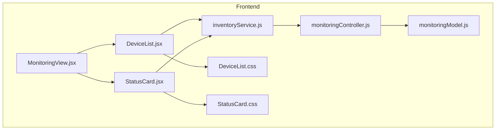
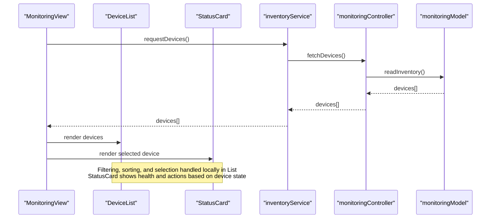
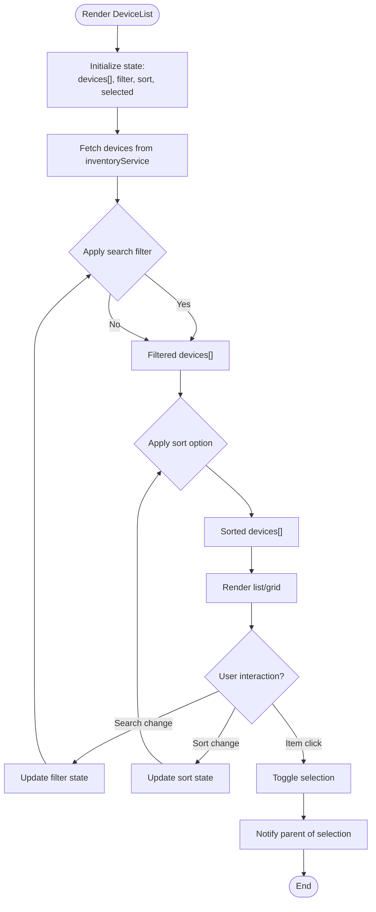
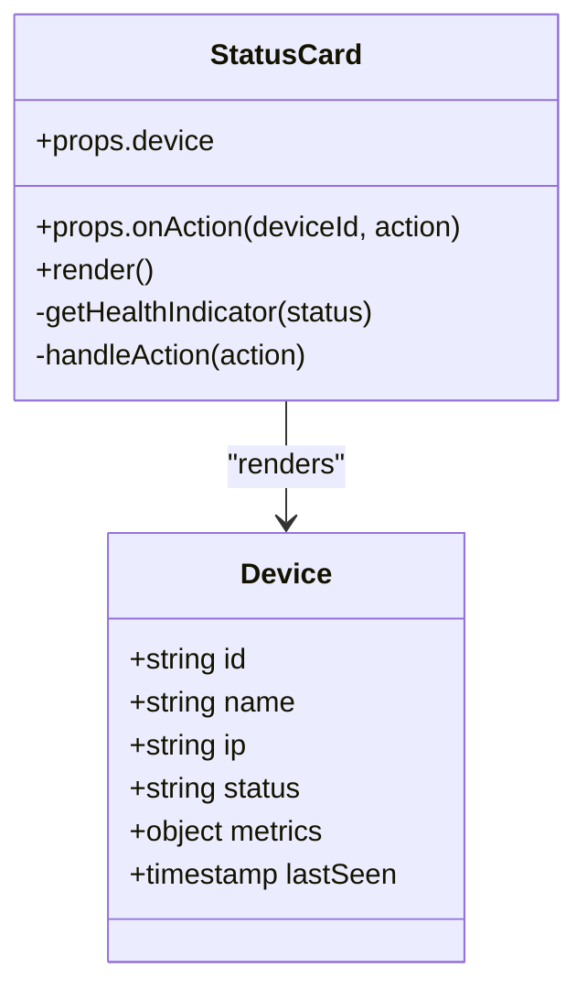
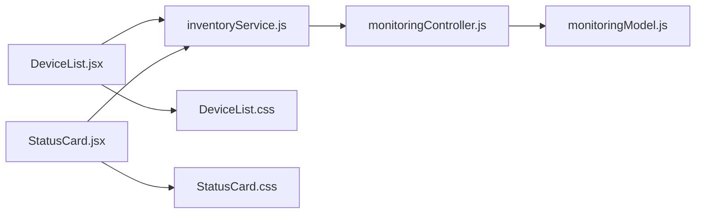

# Device Management Components

<cite>
**Referenced Files in This Document**
- [DeviceList.jsx](file://frontend/src/components/DeviceList.jsx)
- [StatusCard.jsx](file://frontend/src/components/StatusCard.jsx)
- [DeviceList.css](file://frontend/src/styles/DeviceList.css)
- [StatusCard.css](file://frontend/src/styles/StatusCard.css)
- [MonitoringView.jsx](file://frontend/src/views/MonitoringView.jsx)
- [inventoryService.js](file://frontend/src/services/inventoryService.js)
- [monitoringController.js](file://frontend/src/controllers/monitoringController.js)
- [monitoringModel.js](file://frontend/src/models/monitoringModel.js)
</cite>

## Table of Contents
1. [Introduction](#introduction)
2. [Project Structure](#project-structure)
3. [Core Components](#core-components)
4. [Architecture Overview](#architecture-overview)
5. [Detailed Component Analysis](#detailed-component-analysis)
6. [Dependency Analysis](#dependency-analysis)
7. [Performance Considerations](#performance-considerations)
8. [Troubleshooting Guide](#troubleshooting-guide)
9. [Conclusion](#conclusion)
10. [Appendices](#appendices)

## Introduction
This document provides comprehensive documentation for the device management components: DeviceList and StatusCard. It explains how DeviceList displays discovered devices, supports filtering, sorting, and selection, and how StatusCard presents individual device status with health indicators and interactive elements. The guide also covers styling approaches using CSS modules, responsive design patterns, accessibility features, and practical examples for extending device displays, adding custom status indicators, and implementing device-specific actions.

## Project Structure
The device management UI is implemented in the frontend directory under src/components and src/styles. DeviceList and StatusCard are React components that consume data from services and controllers to render device information and interact with users.

**Diagram sources**
- [MonitoringView.jsx](file://frontend/src/views/MonitoringView.jsx)
- [DeviceList.jsx](file://frontend/src/components/DeviceList.jsx)
- [StatusCard.jsx](file://frontend/src/components/StatusCard.jsx)
- [inventoryService.js](file://frontend/src/services/inventoryService.js)
- [monitoringController.js](file://frontend/src/controllers/monitoringController.js)
- [monitoringModel.js](file://frontend/src/models/monitoringModel.js)
- [DeviceList.css](file://frontend/src/styles/DeviceList.css)
- [StatusCard.css](file://frontend/src/styles/StatusCard.css)

**Section sources**
- [MonitoringView.jsx](file://frontend/src/views/MonitoringView.jsx)
- [DeviceList.jsx](file://frontend/src/components/DeviceList.jsx)
- [StatusCard.jsx](file://frontend/src/components/StatusCard.jsx)
- [inventoryService.js](file://frontend/src/services/inventoryService.js)
- [monitoringController.js](file://frontend/src/controllers/monitoringController.js)
- [monitoringModel.js](file://frontend/src/models/monitoringModel.js)
- [DeviceList.css](file://frontend/src/styles/DeviceList.css)
- [StatusCard.css](file://frontend/src/styles/StatusCard.css)

## Core Components
- DeviceList: A list component that renders discovered devices with search/filtering, sorting options, and selection behavior. It communicates with inventoryService to fetch or update device data and applies local state for filtering and sorting.
- StatusCard: A card component representing a single device’s status, health indicators, and interactive controls (e.g., details view, actions). It receives device data as props and exposes callbacks for user interactions.

Key responsibilities:
- Data binding: Both components bind to device objects provided by services.
- User interaction: DeviceList handles search input, filter toggles, sort selection, and item selection; StatusCard handles action clicks and detail toggles.
- Styling: Each component uses its own CSS module for encapsulated styles.
- Accessibility: Proper ARIA attributes and keyboard navigation support are applied where applicable.

**Section sources**
- [DeviceList.jsx](file://frontend/src/components/DeviceList.jsx)
- [StatusCard.jsx](file://frontend/src/components/StatusCard.jsx)
- [DeviceList.css](file://frontend/src/styles/DeviceList.css)
- [StatusCard.css](file://frontend/src/styles/StatusCard.css)

## Architecture Overview
The device management flow integrates UI components with service and controller layers to retrieve and display device information.

**Diagram sources**
- [MonitoringView.jsx](file://frontend/src/views/MonitoringView.jsx)
- [DeviceList.jsx](file://frontend/src/components/DeviceList.jsx)
- [StatusCard.jsx](file://frontend/src/components/StatusCard.jsx)
- [inventoryService.js](file://frontend/src/services/inventoryService.js)
- [monitoringController.js](file://frontend/src/controllers/monitoringController.js)
- [monitoringModel.js](file://frontend/src/models/monitoringModel.js)

## Detailed Component Analysis

### DeviceList Component
Responsibilities:
- Display discovered devices in a list or grid layout.
- Provide search input to filter devices by name, IP, or other fields.
- Offer sorting options (e.g., by name, status, last seen).
- Manage selection state for one or multiple devices.
- Render StatusCard for the selected device(s) via parent view.

Data flow:
- Receives devices array from MonitoringView or directly from inventoryService.
- Applies local filters and sorts before rendering.
- Emits selection events to parent for further actions.

Filtering and sorting:
- Search input updates a filter string used to match against device properties.
- Sort selector changes the order of the displayed list without mutating original data.

Selection mechanism:
- Clicking a device row/card toggles selection state.
- Selected device IDs are tracked in local state and communicated upward.

Accessibility:
- Keyboard navigation with arrow keys to move focus between items.
- ARIA roles such as listbox and option for screen readers.
- Focus indicators and labels for interactive elements.

Styling:
- Uses CSS modules for scoped styles.
- Responsive grid/list transitions based on viewport size.

Extensibility:
- Add new filter fields by extending the filter predicate.
- Implement custom sort comparators for additional device properties.
- Integrate custom actions by passing handlers to child elements.

**Diagram sources**
- [DeviceList.jsx](file://frontend/src/components/DeviceList.jsx)
- [inventoryService.js](file://frontend/src/services/inventoryService.js)

**Section sources**
- [DeviceList.jsx](file://frontend/src/components/DeviceList.jsx)
- [DeviceList.css](file://frontend/src/styles/DeviceList.css)
- [inventoryService.js](file://frontend/src/services/inventoryService.js)

### StatusCard Component
Responsibilities:
- Present a single device’s status, health indicators, and metadata.
- Provide interactive elements such as “Details”, “Refresh”, or device-specific actions.
- Reflect real-time or cached status updates when available.

Health indicators:
- Visual cues (color, icon, label) for online/offline, degraded, critical states.
- Optional badges or progress indicators for metrics like uptime or latency.

Interactivity:
- Action buttons trigger callbacks passed from parent or controller.
- Expandable sections for detailed device info.

Accessibility:
- Semantic HTML structure with proper headings and labels.
- ARIA attributes for status regions and live updates if applicable.
- Keyboard-accessible controls with clear focus states.

Styling:
- CSS modules ensure isolated styles.
- Responsive layout adapts to different screen sizes.

Extensibility:
- Add custom status indicators by extending the status mapping logic.
- Insert device-specific actions via props or configuration.

**Diagram sources**
- [StatusCard.jsx](file://frontend/src/components/StatusCard.jsx)

**Section sources**
- [StatusCard.jsx](file://frontend/src/components/StatusCard.jsx)
- [StatusCard.css](file://frontend/src/styles/StatusCard.css)

## Dependency Analysis
DeviceList and StatusCard depend on shared services and controllers for data retrieval and model operations.

**Diagram sources**
- [DeviceList.jsx](file://frontend/src/components/DeviceList.jsx)
- [StatusCard.jsx](file://frontend/src/components/StatusCard.jsx)
- [inventoryService.js](file://frontend/src/services/inventoryService.js)
- [monitoringController.js](file://frontend/src/controllers/monitoringController.js)
- [monitoringModel.js](file://frontend/src/models/monitoringModel.js)
- [DeviceList.css](file://frontend/src/styles/DeviceList.css)
- [StatusCard.css](file://frontend/src/styles/StatusCard.css)

**Section sources**
- [DeviceList.jsx](file://frontend/src/components/DeviceList.jsx)
- [StatusCard.jsx](file://frontend/src/components/StatusCard.jsx)
- [inventoryService.js](file://frontend/src/services/inventoryService.js)
- [monitoringController.js](file://frontend/src/controllers/monitoringController.js)
- [monitoringModel.js](file://frontend/src/models/monitoringModel.js)
- [DeviceList.css](file://frontend/src/styles/DeviceList.css)
- [StatusCard.css](file://frontend/src/styles/StatusCard.css)

## Performance Considerations
- Memoization: Use memoization for filtered/sorted lists to avoid unnecessary re-renders when inputs do not change.
- Virtualization: For large device inventories, consider virtual scrolling to improve performance.
- Debouncing: Debounce search input to reduce frequent filter recalculations.
- Lazy loading: Load device details only when expanded in StatusCard to minimize initial payload.
- Efficient updates: Batch state updates and avoid deep object mutations.

[No sources needed since this section provides general guidance]

## Troubleshooting Guide
Common issues and resolutions:
- Devices not appearing: Verify inventoryService returns valid data and check network requests in monitoringController.
- Filters not working: Ensure filter predicates match device property names and handle null/undefined values gracefully.
- Sorting incorrect: Validate comparator functions and ensure stable sort for equal keys.
- Selection not persisting: Confirm selection state is correctly managed and propagated to parent.
- StatusCard not updating: Check status mapping logic and ensure real-time updates are wired if required.

Debugging tips:
- Log device payloads at each layer (service, controller, model).
- Inspect CSS module classes to verify styles are applied.
- Use browser dev tools to test keyboard navigation and ARIA attributes.

**Section sources**
- [DeviceList.jsx](file://frontend/src/components/DeviceList.jsx)
- [StatusCard.jsx](file://frontend/src/components/StatusCard.jsx)
- [inventoryService.js](file://frontend/src/services/inventoryService.js)
- [monitoringController.js](file://frontend/src/controllers/monitoringController.js)
- [monitoringModel.js](file://frontend/src/models/monitoringModel.js)

## Conclusion
DeviceList and StatusCard form the core of the device management UI, providing robust listing, filtering, sorting, selection, and status visualization. With modular CSS styling, responsive layouts, and accessibility considerations, these components offer a solid foundation for extending device displays and integrating custom actions. Following the guidelines here will help maintain consistency, performance, and usability across the application.

[No sources needed since this section summarizes without analyzing specific files]

## Appendices

### Extending Device Displays
- Add new fields to device objects and expose them in DeviceList columns/cards.
- Implement custom renderers for specialized device types.
- Introduce new filter categories and sort comparators.

### Adding Custom Status Indicators
- Extend the status mapping in StatusCard to include new health states.
- Provide icons and labels for each status variant.
- Wire up real-time updates if supported by backend services.

### Implementing Device-Specific Actions
- Define action handlers in parent views or controllers.
- Pass callbacks to StatusCard for execution upon user interaction.
- Ensure proper error handling and feedback for asynchronous actions.

[No sources needed since this section provides general guidance]