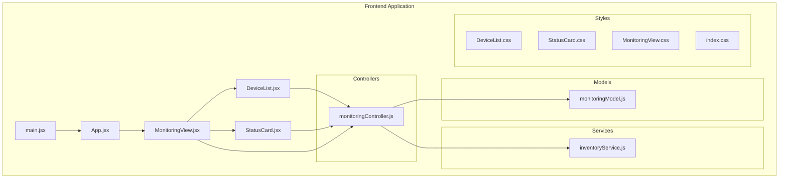
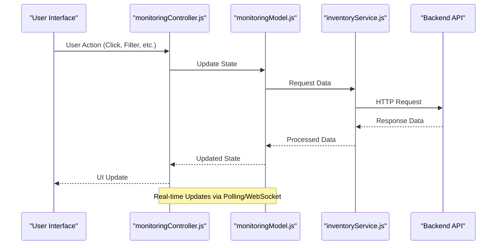
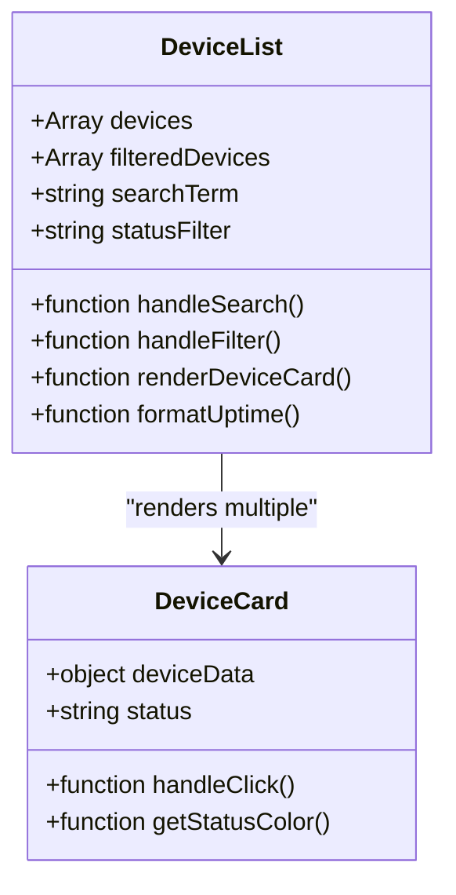
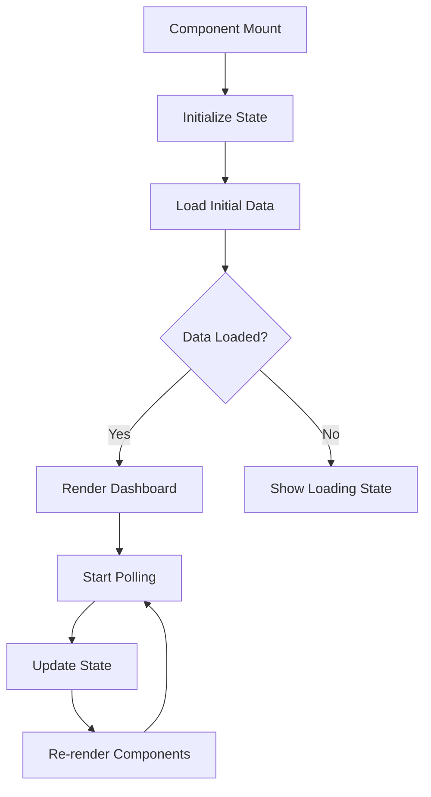
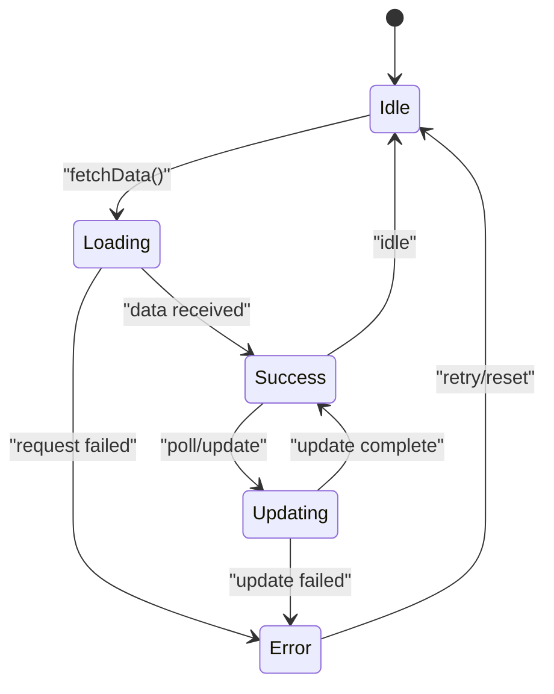
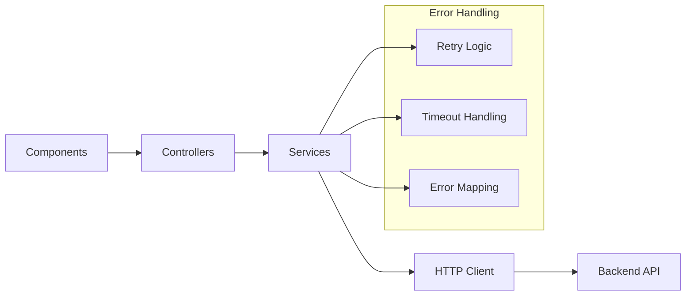
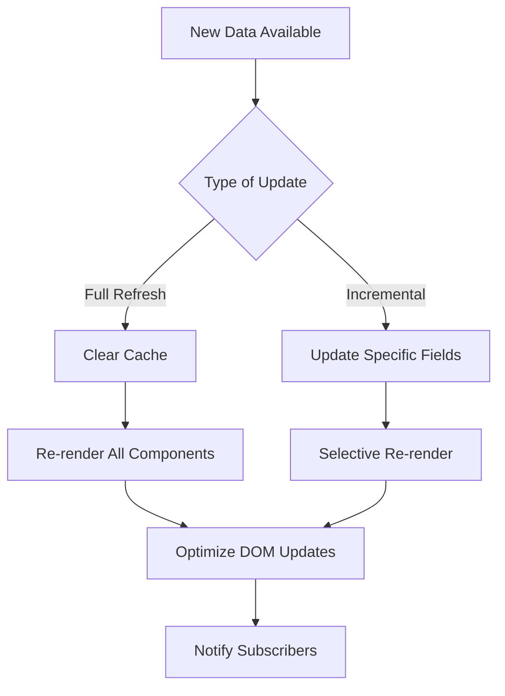
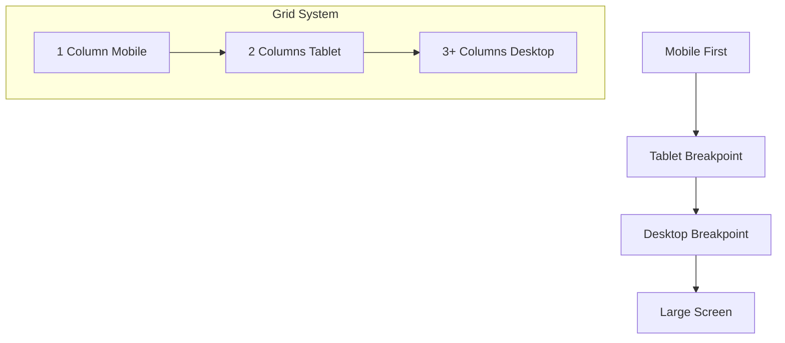

# Frontend Dashboard

<cite>
**Referenced Files in This Document**
- [DeviceList.jsx](file://frontend/src/components/DeviceList.jsx)
- [StatusCard.jsx](file://frontend/src/components/StatusCard.jsx)
- [MonitoringView.jsx](file://frontend/src/views/MonitoringView.jsx)
- [App.jsx](file://frontend/src/App.jsx)
- [main.jsx](file://frontend/src/main.jsx)
- [DeviceList.css](file://frontend/src/styles/DeviceList.css)
- [StatusCard.css](file://frontend/src/styles/StatusCard.css)
- [MonitoringView.css](file://frontend/src/styles/MonitoringView.css)
- [index.css](file://frontend/src/index.css)
- [monitoringController.js](file://frontend/src/controllers/monitoringController.js)
- [monitoringModel.js](file://frontend/src/models/monitoringModel.js)
- [inventoryService.js](file://frontend/src/services/inventoryService.js)
- [package.json](file://frontend/package.json)
- [vite.config.js](file://frontend/vite.config.js)
</cite>

## Table of Contents
1. [Introduction](#introduction)
2. [Project Structure](#project-structure)
3. [Core Components](#core-components)
4. [Architecture Overview](#architecture-overview)
5. [Detailed Component Analysis](#detailed-component-analysis)
6. [State Management Patterns](#state-management-patterns)
7. [API Integration](#api-integration)
8. [Real-time Monitoring Updates](#real-time-monitoring-updates)
9. [Styling and Design](#styling-and-design)
10. [Accessibility Considerations](#accessibility-considerations)
11. [Component Props and Events](#component-props-and-events)
12. [Customization Options](#customization-options)
13. [Extending the Dashboard](#extending-the-dashboard)
14. [Performance Considerations](#performance-considerations)
15. [Troubleshooting Guide](#troubleshooting-guide)
16. [Conclusion](#conclusion)

## Introduction

The Frontend Dashboard is a React-based monitoring application designed to provide real-time visibility into network devices and their status. The dashboard follows modern React patterns with component-based architecture, state management, and responsive design principles. It serves as the primary user interface for network administrators to monitor device health, connectivity, and performance metrics.

The application is built with Vite as the build tool, providing fast development experience and optimized production builds. The dashboard integrates with backend services through RESTful APIs and supports real-time updates for live monitoring scenarios.

## Project Structure

The frontend application follows a modular architecture with clear separation of concerns:

**Diagram sources**
- [main.jsx](file://frontend/src/main.jsx)
- [App.jsx](file://frontend/src/App.jsx)
- [MonitoringView.jsx](file://frontend/src/views/MonitoringView.jsx)
- [DeviceList.jsx](file://frontend/src/components/DeviceList.jsx)
- [StatusCard.jsx](file://frontend/src/components/StatusCard.jsx)

**Section sources**
- [package.json](file://frontend/package.json)
- [vite.config.js](file://frontend/vite.config.js)

## Core Components

The dashboard consists of three primary React components that work together to provide a comprehensive monitoring interface:

### DeviceList Component
The DeviceList component is responsible for rendering a collection of network devices with their current status indicators. It handles device discovery display, filtering capabilities, and provides interactive elements for device selection and detailed viewing.

### StatusCard Component  
The StatusCard component displays individual device information including connection status, uptime metrics, and key performance indicators. It provides visual feedback through color-coded status indicators and supports hover interactions for additional details.

### MonitoringView Component
The MonitoringView component serves as the main dashboard container, orchestrating the overall layout and data flow between child components. It manages global state, handles API communications, and coordinates real-time updates across all monitoring views.

**Section sources**
- [DeviceList.jsx](file://frontend/src/components/DeviceList.jsx)
- [StatusCard.jsx](file://frontend/src/components/StatusCard.jsx)
- [MonitoringView.jsx](file://frontend/src/views/MonitoringView.jsx)

## Architecture Overview

The dashboard follows a unidirectional data flow pattern typical of React applications:

**Diagram sources**
- [monitoringController.js](file://frontend/src/controllers/monitoringController.js)
- [monitoringModel.js](file://frontend/src/models/monitoringModel.js)
- [inventoryService.js](file://frontend/src/services/inventoryService.js)

The architecture emphasizes separation of concerns with clear boundaries between presentation components (React), business logic (controllers), data management (models), and external communication (services).

## Detailed Component Analysis

### DeviceList Component Analysis

The DeviceList component implements a responsive grid layout for displaying network devices with advanced filtering and search capabilities.

#### Key Features:
- **Dynamic Rendering**: Renders device cards based on filtered data
- **Search Functionality**: Real-time search across device names and IP addresses
- **Status Filtering**: Filter devices by connection status (online, offline, warning)
- **Responsive Grid**: Adapts layout based on screen size
- **Loading States**: Handles asynchronous data loading gracefully

#### Component Structure:

**Diagram sources**
- [DeviceList.jsx](file://frontend/src/components/DeviceList.jsx)
- [DeviceList.css](file://frontend/src/styles/DeviceList.css)

### StatusCard Component Analysis

The StatusCard component provides detailed information about individual network devices with rich visual indicators and interactive features.

#### Key Features:
- **Status Indicators**: Visual representation of device health (green/yellow/red)
- **Metrics Display**: Shows uptime, response time, and availability percentages
- **Interactive Elements**: Clickable cards with expandable details
- **Animation Support**: Smooth transitions and hover effects
- **Accessibility**: Proper ARIA labels and keyboard navigation

#### Component Props:
- `device`: Device data object containing all relevant information
- `onStatusChange`: Callback function for status updates
- `showDetails`: Boolean flag for expanded view
- `theme`: Theme configuration object for customization

**Section sources**
- [StatusCard.jsx](file://frontend/src/components/StatusCard.jsx)
- [StatusCard.css](file://frontend/src/styles/StatusCard.css)

### MonitoringView Component Analysis

The MonitoringView component serves as the main dashboard container, managing overall application state and coordinating between different monitoring views.

#### Key Responsibilities:
- **Global State Management**: Maintains application-wide state
- **API Integration**: Handles communication with backend services
- **Real-time Updates**: Implements polling or WebSocket connections
- **Layout Management**: Coordinates child component positioning
- **Error Handling**: Centralized error handling and user feedback

#### State Management:

**Diagram sources**
- [MonitoringView.jsx](file://frontend/src/views/MonitoringView.jsx)
- [MonitoringView.css](file://frontend/src/styles/MonitoringView.css)

**Section sources**
- [MonitoringView.jsx](file://frontend/src/views/MonitoringView.jsx)

## State Management Patterns

The dashboard implements a combination of local component state and global state management patterns:

### Local Component State
Each component maintains its own local state for UI-specific concerns:
- Search input values
- Filter selections
- Modal visibility states
- Form validation states

### Global State Management
The application uses a centralized approach for shared state:
- Device inventory data
- Connection status information
- User preferences and settings
- Error messages and notifications

### State Flow Pattern

**Diagram sources**
- [monitoringController.js](file://frontend/src/controllers/monitoringController.js)
- [monitoringModel.js](file://frontend/src/models/monitoringModel.js)

**Section sources**
- [monitoringController.js](file://frontend/src/controllers/monitoringController.js)
- [monitoringModel.js](file://frontend/src/models/monitoringModel.js)

## API Integration

The dashboard integrates with backend services through a well-defined service layer that abstracts API communications:

### Service Layer Architecture

**Diagram sources**
- [inventoryService.js](file://frontend/src/services/inventoryService.js)
- [monitoringController.js](file://frontend/src/controllers/monitoringController.js)

### API Endpoints Used
- `/api/devices` - Device inventory and status
- `/api/metrics` - Performance metrics and statistics
- `/api/alerts` - System alerts and notifications
- `/api/config` - Configuration management

### Error Handling Strategy
The service layer implements comprehensive error handling:
- Network error detection and retry mechanisms
- Timeout handling with configurable limits
- Graceful degradation when services are unavailable
- User-friendly error messages and recovery options

**Section sources**
- [inventoryService.js](file://frontend/src/services/inventoryService.js)
- [monitoringController.js](file://frontend/src/controllers/monitoringController.js)

## Real-time Monitoring Updates

The dashboard supports real-time monitoring through multiple strategies:

### Polling Mechanism
- Configurable polling intervals (default: 5 seconds)
- Debounced updates to prevent excessive re-renders
- Incremental updates for better performance
- Automatic retry on failed requests

### WebSocket Integration
- Real-time bidirectional communication
- Event-driven updates for immediate feedback
- Connection health monitoring and auto-reconnect
- Message queuing during disconnections

### Update Optimization

**Diagram sources**
- [monitoringController.js](file://frontend/src/controllers/monitoringController.js)
- [monitoringModel.js](file://frontend/src/models/monitoringModel.js)

**Section sources**
- [monitoringController.js](file://frontend/src/controllers/monitoringController.js)
- [monitoringModel.js](file://frontend/src/models/monitoringModel.js)

## Styling and Design

The dashboard employs CSS Modules for component-scoped styling with a mobile-first responsive design approach:

### CSS Modules Implementation
- Component-specific styles with automatic naming
- Shared design tokens and variables
- Consistent spacing and typography scales
- Dark/light theme support

### Responsive Design Patterns

**Diagram sources**
- [DeviceList.css](file://frontend/src/styles/DeviceList.css)
- [StatusCard.css](file://frontend/src/styles/StatusCard.css)
- [MonitoringView.css](file://frontend/src/styles/MonitoringView.css)

### Design System
- Color palette with semantic color usage
- Typography scale for consistent text hierarchy
- Spacing system using rem units
- Animation and transition guidelines
- Iconography standards

**Section sources**
- [DeviceList.css](file://frontend/src/styles/DeviceList.css)
- [StatusCard.css](file://frontend/src/styles/StatusCard.css)
- [MonitoringView.css](file://frontend/src/styles/MonitoringView.css)
- [index.css](file://frontend/src/index.css)

## Accessibility Considerations

The dashboard prioritizes accessibility compliance with WCAG 2.1 AA standards:

### Keyboard Navigation
- Full keyboard operability for all interactive elements
- Logical tab order following visual layout
- Focus indicators with high contrast
- Skip links for navigation efficiency

### Screen Reader Support
- Semantic HTML structure with proper heading hierarchy
- ARIA labels and descriptions for complex components
- Live regions for dynamic content updates
- Alt text for images and icons

### Color and Contrast
- Minimum 4.5:1 contrast ratio for normal text
- Color-independent status indicators
- Focus indicators visible without color
- High contrast mode support

### Interactive Elements
- Button and link semantics preserved
- Form inputs with proper labels
- Error messages announced to screen readers
- Loading states communicated appropriately

**Section sources**
- [DeviceList.jsx](file://frontend/src/components/DeviceList.jsx)
- [StatusCard.jsx](file://frontend/src/components/StatusCard.jsx)
- [MonitoringView.jsx](file://frontend/src/views/MonitoringView.jsx)

## Component Props and Events

### DeviceList Component Props
- `devices`: Array of device objects to display
- `onDeviceSelect`: Callback when device is selected
- `searchTerm`: Current search filter value
- `statusFilter`: Current status filter value
- `loading`: Boolean indicating loading state
- `error`: Error message string for display

### StatusCard Component Props
- `device`: Device data object with status information
- `onStatusChange`: Callback for status updates
- `showDetails`: Boolean for expanded view
- `compact`: Boolean for compact display mode
- `theme`: Theme configuration object

### Event Handlers
- `handleSearch`: Search input change handler
- `handleFilter`: Filter selection change handler
- `handleRefresh`: Manual data refresh trigger
- `handleError`: Error handling callback

**Section sources**
- [DeviceList.jsx](file://frontend/src/components/DeviceList.jsx)
- [StatusCard.jsx](file://frontend/src/components/StatusCard.jsx)

## Customization Options

### Theme Configuration
The dashboard supports extensive theming through configuration objects:
- Color schemes (light/dark/custom)
- Typography settings
- Spacing and sizing parameters
- Animation preferences

### Layout Customization
- Grid column configurations
- Card density settings
- Sidebar toggle options
- Widget arrangement preferences

### Feature Toggles
- Real-time update frequency
- Data retention policies
- Alert notification settings
- Performance optimization flags

**Section sources**
- [MonitoringView.jsx](file://frontend/src/views/MonitoringView.jsx)
- [index.css](file://frontend/src/index.css)

## Extending the Dashboard

### Adding New Monitoring Views
To extend the dashboard with new monitoring capabilities:

1. **Create New Component**: Follow existing component patterns
2. **Implement Data Fetching**: Use established service layer
3. **Add Routing**: Configure navigation and URL paths
4. **Style Consistency**: Apply design system guidelines
5. **Testing**: Add unit and integration tests

### Extending Device Status Displays
For additional device metrics and status indicators:

1. **Update Data Models**: Extend device data structures
2. **Modify StatusCard**: Add new metric displays
3. **Implement Calculations**: Add derived metrics
4. **Update Styling**: Create appropriate visualizations
5. **Test Integration**: Verify data flow and rendering

### Integrating Additional Network Metrics
For new network monitoring capabilities:

1. **Service Extension**: Add new API endpoints
2. **Data Processing**: Implement metric calculations
3. **UI Components**: Create visualization components
4. **Real-time Updates**: Configure polling/WebSocket
5. **Alert Integration**: Add threshold monitoring

**Section sources**
- [monitoringController.js](file://frontend/src/controllers/monitoringController.js)
- [inventoryService.js](file://frontend/src/services/inventoryService.js)

## Performance Considerations

### Component Optimization
- React.memo for expensive component renders
- useMemo for calculated values
- useCallback for stable function references
- Lazy loading for heavy components

### Data Management
- Efficient state updates with minimal re-renders
- Pagination for large device lists
- Virtual scrolling for long lists
- Caching strategies for repeated queries

### Bundle Optimization
- Code splitting by route and feature
- Tree shaking for unused dependencies
- Asset optimization and compression
- CDN deployment for static assets

### Memory Management
- Cleanup of event listeners and timers
- Proper disposal of WebSocket connections
- Memory leak prevention in async operations
- Efficient garbage collection practices

**Section sources**
- [DeviceList.jsx](file://frontend/src/components/DeviceList.jsx)
- [MonitoringView.jsx](file://frontend/src/views/MonitoringView.jsx)

## Troubleshooting Guide

### Common Issues and Solutions

#### Connection Problems
- **Symptom**: Devices show as offline when online
- **Solution**: Check network connectivity and API endpoint availability
- **Debug**: Enable verbose logging and check browser console

#### Performance Issues
- **Symptom**: Dashboard becomes slow with many devices
- **Solution**: Implement pagination or virtual scrolling
- **Debug**: Use React DevTools Profiler to identify bottlenecks

#### Real-time Update Failures
- **Symptom**: Status updates not reflecting in UI
- **Solution**: Verify WebSocket connection and polling intervals
- **Debug**: Check network tab for failed requests

#### Styling Problems
- **Symptom**: Components not displaying correctly on mobile
- **Solution**: Review responsive breakpoints and media queries
- **Debug**: Use browser developer tools responsive mode

### Debugging Tools
- React Developer Tools for component inspection
- Network tab for API call analysis
- Console logging for state debugging
- Performance profiling for optimization

**Section sources**
- [monitoringController.js](file://frontend/src/controllers/monitoringController.js)
- [inventoryService.js](file://frontend/src/services/inventoryService.js)

## Conclusion

The Frontend Dashboard provides a comprehensive, scalable, and maintainable solution for network device monitoring. The component-based architecture ensures modularity and reusability, while the separation of concerns promotes code organization and testability.

Key strengths of the implementation include:
- **Modular Architecture**: Clear separation between presentation, business logic, and data layers
- **Responsive Design**: Mobile-first approach ensuring compatibility across devices
- **Real-time Capabilities**: Flexible update mechanisms supporting both polling and WebSocket connections
- **Accessibility Compliance**: WCAG 2.1 AA standards for inclusive user experience
- **Performance Optimization**: Efficient rendering and data management strategies

The dashboard serves as a solid foundation for network monitoring applications, with extensible architecture supporting future enhancements and customizations. The documented patterns and best practices enable developers to confidently extend functionality while maintaining code quality and user experience standards.