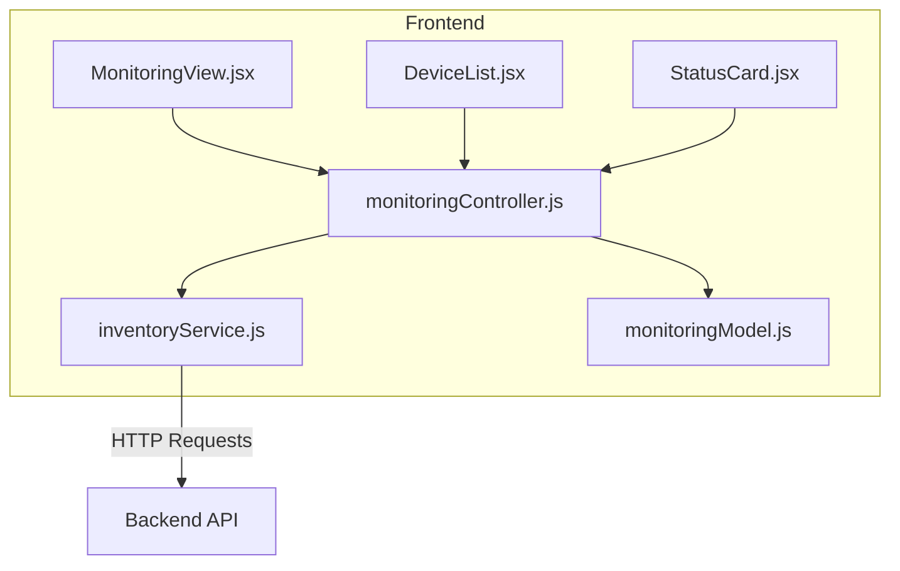
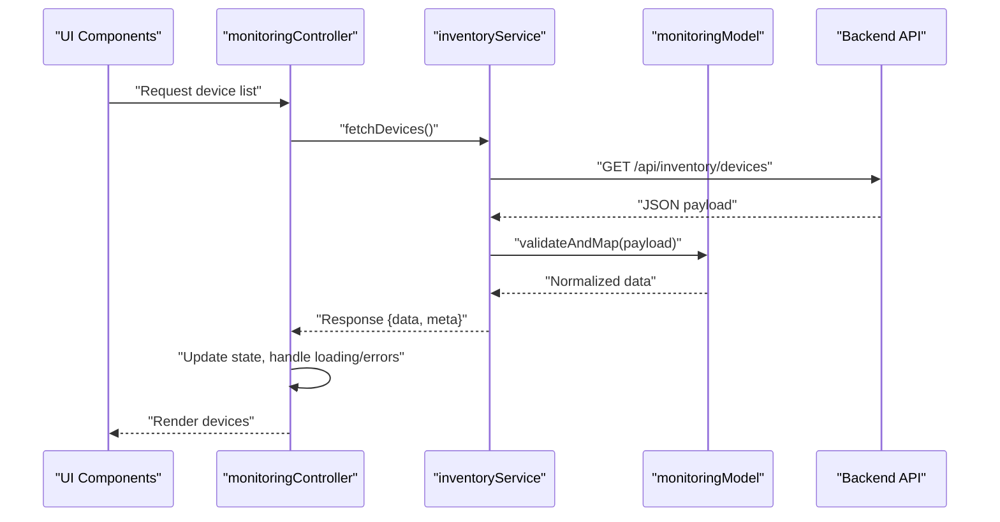
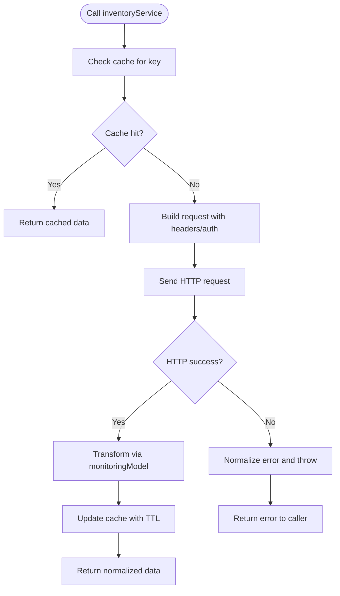
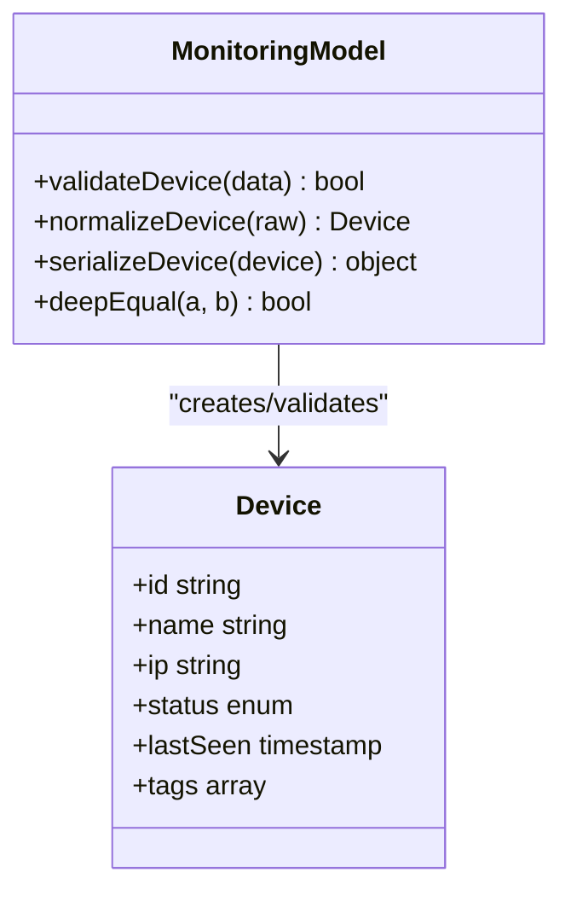
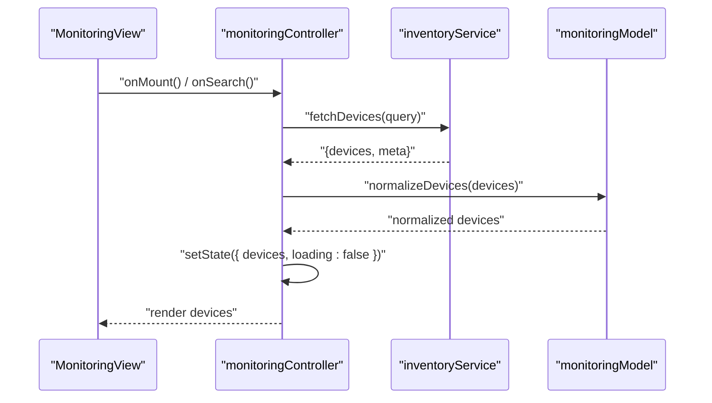
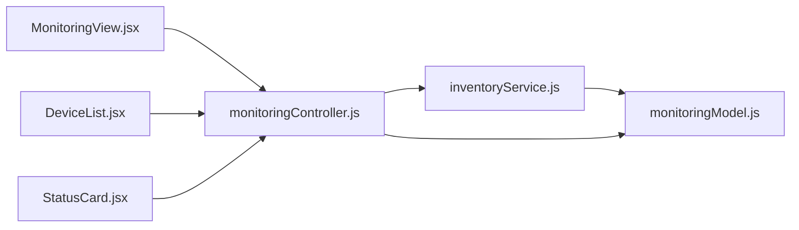

# Frontend Service Layer

<cite>
**Referenced Files in This Document**
- [inventoryService.js](file://frontend/src/services/inventoryService.js)
- [monitoringModel.js](file://frontend/src/models/monitoringModel.js)
- [monitoringController.js](file://frontend/src/controllers/monitoringController.js)
- [MonitoringView.jsx](file://frontend/src/views/MonitoringView.jsx)
- [DeviceList.jsx](file://frontend/src/components/DeviceList.jsx)
- [StatusCard.jsx](file://frontend/src/components/StatusCard.jsx)
- [package.json](file://frontend/package.json)
- [vite.config.js](file://frontend/vite.config.js)
</cite>

## Table of Contents
1. [Introduction](#introduction)
2. [Project Structure](#project-structure)
3. [Core Components](#core-components)
4. [Architecture Overview](#architecture-overview)
5. [Detailed Component Analysis](#detailed-component-analysis)
6. [Dependency Analysis](#dependency-analysis)
7. [Performance Considerations](#performance-considerations)
8. [Troubleshooting Guide](#troubleshooting-guide)
9. [Conclusion](#conclusion)
10. [Appendices](#appendices)

## Introduction
This document explains the frontend service layer responsible for API communication and data management. It focuses on:
- inventoryService: the primary client for device inventory operations, including request/response handling, error management, caching, retries, and authentication flows.
- monitoringModel: data structure definitions, validation rules, and state synchronization patterns used across controllers and views.
- Integration points with controllers and UI components to ensure consistent data flow and user experience.

The goal is to provide a clear understanding of how services interact with backend endpoints, how data is modeled and validated, and how performance and reliability are achieved through caching, retry strategies, and error handling.

## Project Structure
The frontend organizes functionality into layers:
- Services: HTTP clients and business logic for API calls (e.g., inventoryService).
- Models: Data structures and validation utilities (e.g., monitoringModel).
- Controllers: Orchestration between services and UI state (e.g., monitoringController).
- Views and Components: React-based UI that consumes controller outputs and renders device lists and status cards.

**Diagram sources**
- [MonitoringView.jsx](file://frontend/src/views/MonitoringView.jsx)
- [DeviceList.jsx](file://frontend/src/components/DeviceList.jsx)
- [StatusCard.jsx](file://frontend/src/components/StatusCard.jsx)
- [monitoringController.js](file://frontend/src/controllers/monitoringController.js)
- [inventoryService.js](file://frontend/src/services/inventoryService.js)
- [monitoringModel.js](file://frontend/src/models/monitoringModel.js)

**Section sources**
- [package.json](file://frontend/package.json)
- [vite.config.js](file://frontend/vite.config.js)

## Core Components
- inventoryService: Centralized HTTP client for inventory-related endpoints. Handles base URL configuration, headers (including authentication), request/response transformations, error normalization, retry policies, and optional caching.
- monitoringModel: Defines schemas for monitoring and inventory data, provides validation helpers, and standardizes field names and types consumed by controllers and UI.
- monitoringController: Bridges UI state and service calls, manages loading/error states, and coordinates data transformations before rendering.

Key responsibilities:
- Request lifecycle: build requests, attach auth tokens, handle timeouts, normalize errors.
- Response handling: parse payloads, map to model shapes, update local caches or state.
- Error management: network errors, HTTP status codes, validation failures, and user-friendly messages.
- Performance: caching responses, debounced queries, and retry/backoff strategies.

**Section sources**
- [inventoryService.js](file://frontend/src/services/inventoryService.js)
- [monitoringModel.js](file://frontend/src/models/monitoringModel.js)
- [monitoringController.js](file://frontend/src/controllers/monitoringController.js)

## Architecture Overview
The service layer follows a layered architecture:
- UI components call the controller with user actions.
- The controller invokes the service to perform API operations.
- The service constructs requests, handles authentication, applies retries/caching, and returns normalized data.
- The model ensures data consistency and validates payloads.

**Diagram sources**
- [monitoringController.js](file://frontend/src/controllers/monitoringController.js)
- [inventoryService.js](file://frontend/src/services/inventoryService.js)
- [monitoringModel.js](file://frontend/src/models/monitoringModel.js)

## Detailed Component Analysis

### inventoryService
Responsibilities:
- Base configuration: base URL, default headers, timeout, and interceptors for auth.
- Endpoints: CRUD-like methods for device inventory (list, get, create, update, delete).
- Authentication: token injection, refresh flow, and unauthorized error handling.
- Retry and backoff: exponential backoff with configurable attempts and delay.
- Caching: in-memory cache keyed by endpoint parameters, with TTL and invalidation hooks.
- Error normalization: unify network, HTTP, and validation errors into a consistent shape.

Common usage pattern:
- Call service method with parameters.
- Check cache; if miss, perform HTTP request.
- Validate and transform response via model.
- Update cache and return result.
- Handle errors consistently and surface to caller.

**Diagram sources**
- [inventoryService.js](file://frontend/src/services/inventoryService.js)

Implementation highlights:
- Auth flow: attach Authorization header from storage; refresh token on 401; retry once after refresh.
- Retry policy: exponential backoff with jitter; max attempts configurable per endpoint.
- Caching: simple in-memory store with keys derived from method + params; TTL-based expiration; manual invalidation for mutations.
- Error handling: wrap fetch errors, parse JSON errors, and map to standardized error objects with message, code, and details.

**Section sources**
- [inventoryService.js](file://frontend/src/services/inventoryService.js)

### monitoringModel
Responsibilities:
- Define data schemas for devices, statuses, and related entities.
- Provide validation functions to ensure incoming payloads match expected shapes.
- Normalize fields across API versions and provide safe defaults.
- Export helper utilities for serialization/deserialization and deep equality checks.

Validation rules:
- Required fields presence checks.
- Type enforcement (string, number, boolean, arrays, nested objects).
- Enum constraints for status fields.
- Custom validators for IDs, timestamps, and IP addresses.

State synchronization patterns:
- Immutable updates using shallow/deep clones.
- Normalization of lists by ID to avoid duplication.
- Selectors for derived data (filtered/sorted views).

**Diagram sources**
- [monitoringModel.js](file://frontend/src/models/monitoringModel.js)

**Section sources**
- [monitoringModel.js](file://frontend/src/models/monitoringModel.js)

### monitoringController
Responsibilities:
- Coordinate UI state (loading, error, data) based on service results.
- Trigger service methods on user actions or lifecycle events.
- Apply model transformations before updating UI state.
- Manage side effects like polling or debouncing.

Typical flow:
- On mount or action, call inventoryService to fetch devices.
- Update local state with normalized data.
- Handle errors by setting error state and notifying users.
- Debounce search/filter inputs to reduce API calls.

**Diagram sources**
- [monitoringController.js](file://frontend/src/controllers/monitoringController.js)
- [inventoryService.js](file://frontend/src/services/inventoryService.js)
- [monitoringModel.js](file://frontend/src/models/monitoringModel.js)

**Section sources**
- [monitoringController.js](file://frontend/src/controllers/monitoringController.js)

### UI Components
- MonitoringView.jsx: Orchestrates controller interactions, displays global loading/error states, and delegates rendering to child components.
- DeviceList.jsx: Renders a list of devices with filtering and sorting options; consumes normalized data from controller.
- StatusCard.jsx: Displays individual device status and metadata; reacts to prop changes efficiently.

Best practices:
- Keep components presentational; rely on controller for state and side effects.
- Use memoization to avoid unnecessary re-renders.
- Provide meaningful accessibility labels and error messages.

**Section sources**
- [MonitoringView.jsx](file://frontend/src/views/MonitoringView.jsx)
- [DeviceList.jsx](file://frontend/src/components/DeviceList.jsx)
- [StatusCard.jsx](file://frontend/src/components/StatusCard.jsx)

## Dependency Analysis
- inventoryService depends on:
  - Environment configuration for base URLs and timeouts.
  - Storage utilities for tokens and cache persistence.
  - monitoringModel for validation and transformation.
- monitoringController depends on:
  - inventoryService for API calls.
  - monitoringModel for data normalization.
  - UI framework hooks for state and lifecycle.
- UI components depend on:
  - monitoringController for data and actions.
  - monitoringModel indirectly via controller outputs.

**Diagram sources**
- [inventoryService.js](file://frontend/src/services/inventoryService.js)
- [monitoringModel.js](file://frontend/src/models/monitoringModel.js)
- [monitoringController.js](file://frontend/src/controllers/monitoringController.js)
- [MonitoringView.jsx](file://frontend/src/views/MonitoringView.jsx)
- [DeviceList.jsx](file://frontend/src/components/DeviceList.jsx)
- [StatusCard.jsx](file://frontend/src/components/StatusCard.jsx)

**Section sources**
- [inventoryService.js](file://frontend/src/services/inventoryService.js)
- [monitoringModel.js](file://frontend/src/models/monitoringModel.js)
- [monitoringController.js](file://frontend/src/controllers/monitoringController.js)

## Performance Considerations
- Caching strategy:
  - In-memory cache keyed by endpoint and query parameters.
  - TTL-based expiration to balance freshness and performance.
  - Manual invalidation after mutations to keep cache consistent.
- Retry mechanisms:
  - Exponential backoff with jitter to mitigate transient failures.
  - Configurable max attempts per endpoint based on criticality.
- Request optimization:
  - Debounce search/filter inputs to reduce redundant calls.
  - Cancel in-flight requests on unmount or new queries.
- State efficiency:
  - Normalize lists by ID to minimize duplication.
  - Use selectors to compute derived data without recomputation.
- Memory management:
  - Clear cache entries when no longer needed.
  - Avoid storing large payloads in component state; prefer normalized stores.

[No sources needed since this section provides general guidance]

## Troubleshooting Guide
Common issues and resolutions:
- Network errors:
  - Check connectivity and proxy settings.
  - Inspect error logs for timeout or DNS resolution failures.
- Unauthorized access:
  - Ensure tokens are present and valid.
  - Implement token refresh flow and retry failed requests post-refresh.
- Validation errors:
  - Verify payload shapes against monitoringModel schemas.
  - Log detailed field-level errors for quick fixes.
- Stale data:
  - Invalidate cache after mutations.
  - Adjust TTL values based on data volatility.
- Performance bottlenecks:
  - Add caching for frequently accessed endpoints.
  - Debounce high-frequency inputs and paginate large datasets.

**Section sources**
- [inventoryService.js](file://frontend/src/services/inventoryService.js)
- [monitoringModel.js](file://frontend/src/models/monitoringModel.js)

## Conclusion
The frontend service layer provides a robust foundation for API communication and data management. inventoryService centralizes HTTP operations, authentication, retries, and caching, while monitoringModel ensures data integrity and consistency. monitoringController orchestrates UI state and integrates services with components. By following the patterns outlined here, you can extend endpoints, implement custom transformations, and optimize performance effectively.

[No sources needed since this section summarizes without analyzing specific files]

## Appendices

### Adding a New API Endpoint
Steps:
- Define the endpoint method in inventoryService with appropriate parameters and headers.
- Implement request building, error handling, and retry policies.
- Add validation and transformation in monitoringModel if needed.
- Expose a controller method to call the service and manage UI state.
- Wire up UI components to trigger the new operation.

**Section sources**
- [inventoryService.js](file://frontend/src/services/inventoryService.js)
- [monitoringModel.js](file://frontend/src/models/monitoringModel.js)
- [monitoringController.js](file://frontend/src/controllers/monitoringController.js)

### Implementing Custom Data Transformations
Approach:
- Extend monitoringModel with new validation and mapping functions.
- Integrate transformations within inventoryService response handlers.
- Ensure backward compatibility by providing default values and graceful degradation.

**Section sources**
- [monitoringModel.js](file://frontend/src/models/monitoringModel.js)
- [inventoryService.js](file://frontend/src/services/inventoryService.js)

### Handling Authentication Flows
Flow:
- Attach Authorization header from secure storage.
- On 401, attempt token refresh and retry the original request once.
- Handle refresh failures by redirecting to login and clearing sensitive state.

**Section sources**
- [inventoryService.js](file://frontend/src/services/inventoryService.js)

### Caching Strategies
Recommendations:
- Use in-memory cache with TTL for read-heavy endpoints.
- Persist critical cache entries to localStorage/sessionStorage with versioning.
- Invalidate cache on write operations and stale data detection.

**Section sources**
- [inventoryService.js](file://frontend/src/services/inventoryService.js)

### Retry Mechanisms
Guidelines:
- Configure exponential backoff with jitter for transient errors.
- Limit retries for idempotent operations only.
- Surface retry counts and errors to users for transparency.

**Section sources**
- [inventoryService.js](file://frontend/src/services/inventoryService.js)

### Performance Optimization Techniques
Practices:
- Debounce user inputs and throttle frequent updates.
- Paginate large datasets and virtualize long lists.
- Memoize expensive computations and selectors.

**Section sources**
- [monitoringController.js](file://frontend/src/controllers/monitoringController.js)
- [DeviceList.jsx](file://frontend/src/components/DeviceList.jsx)