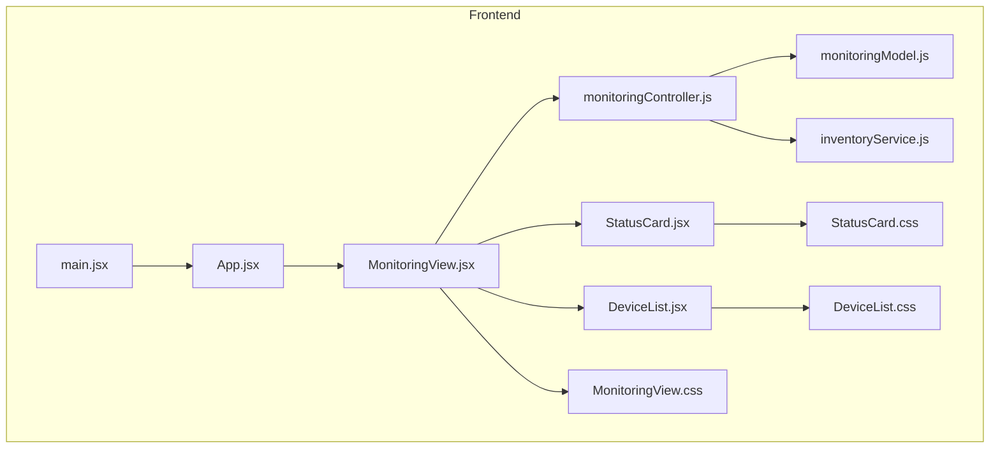
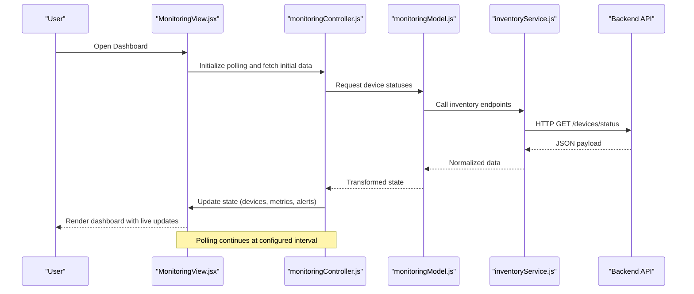
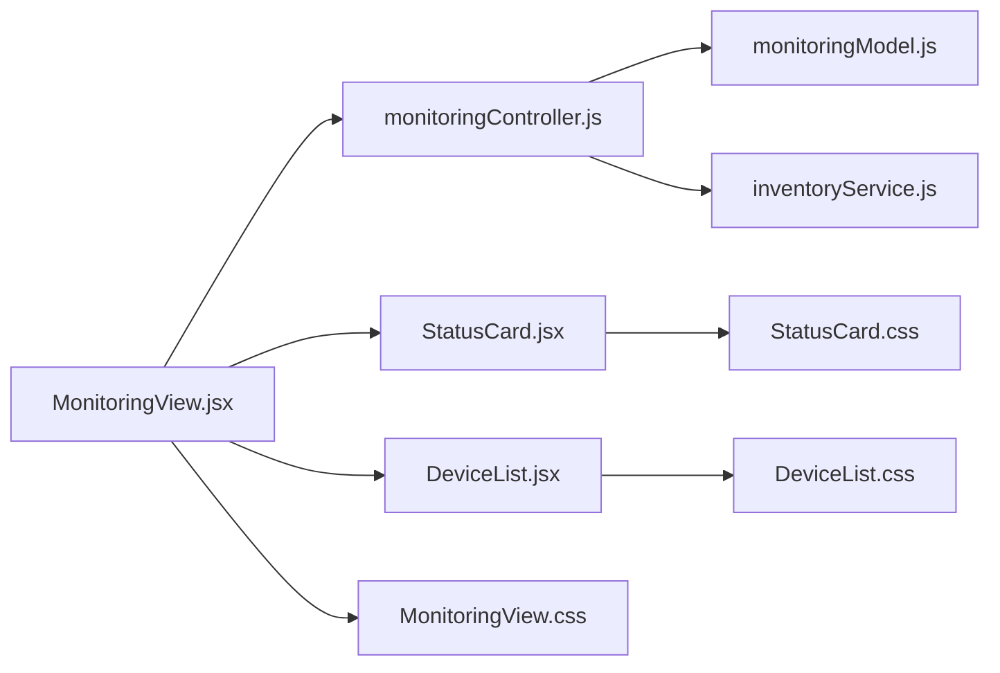

# Monitoring Dashboard View

<cite>
**Referenced Files in This Document**
- [MonitoringView.jsx](file://frontend/src/views/MonitoringView.jsx)
- [monitoringController.js](file://frontend/src/controllers/monitoringController.js)
- [monitoringModel.js](file://frontend/src/models/monitoringModel.js)
- [inventoryService.js](file://frontend/src/services/inventoryService.js)
- [StatusCard.jsx](file://frontend/src/components/StatusCard.jsx)
- [DeviceList.jsx](file://frontend/src/components/DeviceList.jsx)
- [MonitoringView.css](file://frontend/src/styles/MonitoringView.css)
- [StatusCard.css](file://frontend/src/styles/StatusCard.css)
- [DeviceList.css](file://frontend/src/styles/DeviceList.css)
- [App.jsx](file://frontend/src/App.jsx)
- [main.jsx](file://frontend/src/main.jsx)
</cite>

## Table of Contents
1. [Introduction](#introduction)
2. [Project Structure](#project-structure)
3. [Core Components](#core-components)
4. [Architecture Overview](#architecture-overview)
5. [Detailed Component Analysis](#detailed-component-analysis)
6. [Dependency Analysis](#dependency-analysis)
7. [Performance Considerations](#performance-considerations)
8. [Troubleshooting Guide](#troubleshooting-guide)
9. [Conclusion](#conclusion)
10. [Appendices](#appendices)

## Introduction
This document provides comprehensive documentation for the MonitoringView component, which serves as the main dashboard interface for real-time monitoring. It explains the view’s architecture, state management patterns, and how it orchestrates data flow between controllers and models. It also covers real-time updates, polling mechanisms, error handling strategies, backend API integration, device status change handling, user interactions, and customization guidance for layout, widgets, and alert notifications.

## Project Structure
The frontend is organized into clear layers:
- Views: UI components that render dashboards and orchestrate user interactions
- Controllers: Business logic and event coordination
- Models: Data access and transformation
- Services: External integrations (e.g., inventory service)
- Components: Reusable UI elements (cards, lists)
- Styles: CSS modules for each component/view

**Diagram sources**
- [App.jsx](file://frontend/src/App.jsx)
- [main.jsx](file://frontend/src/main.jsx)
- [MonitoringView.jsx](file://frontend/src/views/MonitoringView.jsx)
- [monitoringController.js](file://frontend/src/controllers/monitoringController.js)
- [monitoringModel.js](file://frontend/src/models/monitoringModel.js)
- [inventoryService.js](file://frontend/src/services/inventoryService.js)
- [StatusCard.jsx](file://frontend/src/components/StatusCard.jsx)
- [DeviceList.jsx](file://frontend/src/components/DeviceList.jsx)
- [MonitoringView.css](file://frontend/src/styles/MonitoringView.css)
- [StatusCard.css](file://frontend/src/styles/StatusCard.css)
- [DeviceList.css](file://frontend/src/styles/DeviceList.css)

**Section sources**
- [MonitoringView.jsx](file://frontend/src/views/MonitoringView.jsx)
- [monitoringController.js](file://frontend/src/controllers/monitoringController.js)
- [monitoringModel.js](file://frontend/src/models/monitoringModel.js)
- [inventoryService.js](file://frontend/src/services/inventoryService.js)
- [StatusCard.jsx](file://frontend/src/components/StatusCard.jsx)
- [DeviceList.jsx](file://frontend/src/components/DeviceList.jsx)
- [MonitoringView.css](file://frontend/src/styles/MonitoringView.css)
- [StatusCard.css](file://frontend/src/styles/StatusCard.css)
- [DeviceList.css](file://frontend/src/styles/DeviceList.css)
- [App.jsx](file://frontend/src/App.jsx)
- [main.jsx](file://frontend/src/main.jsx)

## Core Components
- MonitoringView: The main dashboard view that renders the overall layout, integrates StatusCard and DeviceList, manages local state, and coordinates with the controller for data fetching and updates.
- monitoringController: Orchestrates business logic such as polling intervals, error handling, and state synchronization between model and view.
- monitoringModel: Encapsulates data operations like fetching device statuses and transforming responses into a normalized structure for the UI.
- inventoryService: Provides external integration for inventory-related data used by the monitoring system.
- StatusCard: Displays individual device or metric status with interactive controls.
- DeviceList: Renders a list of devices with filtering/sorting capabilities.

Key responsibilities:
- State management: Centralized in MonitoringView via React state hooks; controller handles side effects and timers.
- Data flow: Controller calls Model to fetch data, transforms results, and updates view state.
- Real-time updates: Polling mechanism managed by controller with configurable intervals.
- Error handling: Network errors, timeouts, and invalid payloads are caught and surfaced to the UI.

**Section sources**
- [MonitoringView.jsx](file://frontend/src/views/MonitoringView.jsx)
- [monitoringController.js](file://frontend/src/controllers/monitoringController.js)
- [monitoringModel.js](file://frontend/src/models/monitoringModel.js)
- [inventoryService.js](file://frontend/src/services/inventoryService.js)
- [StatusCard.jsx](file://frontend/src/components/StatusCard.jsx)
- [DeviceList.jsx](file://frontend/src/components/DeviceList.jsx)

## Architecture Overview
The MonitoringView follows a layered architecture:
- View layer (MonitoringView) renders UI and captures user events.
- Controller layer (monitoringController) handles business logic, polling, and state synchronization.
- Model layer (monitoringModel) abstracts data access and transformations.
- Service layer (inventoryService) encapsulates external integrations.

**Diagram sources**
- [MonitoringView.jsx](file://frontend/src/views/MonitoringView.jsx)
- [monitoringController.js](file://frontend/src/controllers/monitoringController.js)
- [monitoringModel.js](file://frontend/src/models/monitoringModel.js)
- [inventoryService.js](file://frontend/src/services/inventoryService.js)

## Detailed Component Analysis

### MonitoringView Component
Responsibilities:
- Renders the dashboard layout using grid/flex structures defined in styles.
- Integrates StatusCard and DeviceList components.
- Manages local UI state (selected filters, active tabs, modal visibility).
- Subscribes to controller-provided state updates and triggers actions on user interactions.

State management patterns:
- Uses React state hooks for UI state (filters, selections).
- Delegates data state to controller, which returns normalized objects for rendering.
- Implements effect hooks to subscribe to controller events and manage lifecycle.

Real-time monitoring updates:
- Controller sets up polling intervals to refresh device statuses and metrics.
- View re-renders automatically when controller updates state.

Error handling:
- Displays error banners or fallback states when data fetch fails.
- Retries failed requests with exponential backoff controlled by controller.

User interactions:
- Click handlers for device selection, filter changes, and widget toggles.
- Debounced search input for DeviceList performance.

Customization examples:
- Layout: Adjust grid columns and spacing in MonitoringView.css.
- Widgets: Add new StatusCard variants by extending props and styling.
- Alerts: Integrate custom notification logic via controller callbacks.

**Section sources**
- [MonitoringView.jsx](file://frontend/src/views/MonitoringView.jsx)
- [MonitoringView.css](file://frontend/src/styles/MonitoringView.css)

### monitoringController
Responsibilities:
- Initializes and manages polling intervals for real-time updates.
- Coordinates data fetching through monitoringModel and inventoryService.
- Handles error scenarios and retry logic.
- Exposes methods to update view state and trigger actions.

Polling mechanisms:
- Configurable intervals per data source (device status, metrics, alerts).
- Debounces rapid successive requests to avoid overload.

Error handling:
- Catches network errors and parses response codes.
- Updates global error state and notifies view for user feedback.

Integration points:
- Calls inventoryService for external data.
- Emits events to view for UI updates.

**Section sources**
- [monitoringController.js](file://frontend/src/controllers/monitoringController.js)
- [monitoringModel.js](file://frontend/src/models/monitoringModel.js)
- [inventoryService.js](file://frontend/src/services/inventoryService.js)

### monitoringModel
Responsibilities:
- Abstracts data operations for device statuses and metrics.
- Normalizes backend responses into consistent shapes for UI consumption.
- Implements caching strategies to reduce redundant requests.

Data structures:
- Device object with fields: id, name, status, lastSeen, metrics.
- Metrics object with fields: cpu, memory, disk, network.
- Alert object with fields: severity, message, timestamp.

Complexity analysis:
- Normalization runs in O(n) where n is number of devices.
- Caching uses hash maps for O(1) lookups by device id.

Optimization opportunities:
- Implement pagination for large device lists.
- Use memoization for derived metrics calculations.

**Section sources**
- [monitoringModel.js](file://frontend/src/models/monitoringModel.js)

### inventoryService
Responsibilities:
- Encapsulates HTTP requests to backend APIs.
- Handles authentication headers and error responses.
- Provides retry logic and timeout configuration.

API integration:
- GET /devices/status: Returns current device statuses.
- GET /metrics: Returns system metrics.
- POST /alerts: Submits alert configurations.

Error handling:
- Parses HTTP status codes and throws descriptive errors.
- Implements exponential backoff for transient failures.

**Section sources**
- [inventoryService.js](file://frontend/src/services/inventoryService.js)

### StatusCard Component
Responsibilities:
- Displays individual device status with visual indicators.
- Supports click-to-expand details and quick actions.
- Responds to hover and focus states for accessibility.

Styling:
- Uses CSS variables for theme consistency.
- Responsive design adapts to different screen sizes.

Interactions:
- Toggle expand/collapse for detailed metrics.
- Trigger refresh action for specific device.

**Section sources**
- [StatusCard.jsx](file://frontend/src/components/StatusCard.jsx)
- [StatusCard.css](file://frontend/src/styles/StatusCard.css)

### DeviceList Component
Responsibilities:
- Renders a scrollable list of devices with search and filter capabilities.
- Supports sorting by name, status, and last seen time.
- Implements virtual scrolling for large datasets.

Features:
- Debounced search input to optimize performance.
- Multi-select for batch operations.
- Pagination or infinite scroll for scalability.

**Section sources**
- [DeviceList.jsx](file://frontend/src/components/DeviceList.jsx)
- [DeviceList.css](file://frontend/src/styles/DeviceList.css)

## Dependency Analysis
The MonitoringView depends on several internal modules and services:

**Diagram sources**
- [MonitoringView.jsx](file://frontend/src/views/MonitoringView.jsx)
- [monitoringController.js](file://frontend/src/controllers/monitoringController.js)
- [monitoringModel.js](file://frontend/src/models/monitoringModel.js)
- [inventoryService.js](file://frontend/src/services/inventoryService.js)
- [StatusCard.jsx](file://frontend/src/components/StatusCard.jsx)
- [DeviceList.jsx](file://frontend/src/components/DeviceList.jsx)
- [MonitoringView.css](file://frontend/src/styles/MonitoringView.css)
- [StatusCard.css](file://frontend/src/styles/StatusCard.css)
- [DeviceList.css](file://frontend/src/styles/DeviceList.css)

**Section sources**
- [MonitoringView.jsx](file://frontend/src/views/MonitoringView.jsx)
- [monitoringController.js](file://frontend/src/controllers/monitoringController.js)
- [monitoringModel.js](file://frontend/src/models/monitoringModel.js)
- [inventoryService.js](file://frontend/src/services/inventoryService.js)
- [StatusCard.jsx](file://frontend/src/components/StatusCard.jsx)
- [DeviceList.jsx](file://frontend/src/components/DeviceList.jsx)
- [MonitoringView.css](file://frontend/src/styles/MonitoringView.css)
- [StatusCard.css](file://frontend/src/styles/StatusCard.css)
- [DeviceList.css](file://frontend/src/styles/DeviceList.css)

## Performance Considerations
- Memoization: Use React.memo for StatusCard and DeviceList to prevent unnecessary re-renders.
- Virtualization: Implement windowing for large device lists to maintain smooth scrolling.
- Debouncing: Apply debouncing to search inputs and rapid user interactions.
- Caching: Leverage localStorage or in-memory caches for frequently accessed data.
- Polling optimization: Adjust intervals based on data volatility and network conditions.
- Bundle splitting: Lazy load non-critical components to reduce initial bundle size.

[No sources needed since this section provides general guidance]

## Troubleshooting Guide
Common issues and solutions:
- Network errors: Check connectivity and verify API endpoints. Review error logs in browser console.
- Stale data: Clear cache and restart polling. Verify controller interval settings.
- UI not updating: Ensure controller properly emits state updates and view subscribes correctly.
- Performance degradation: Monitor memory usage and implement virtualization for large datasets.
- Authentication failures: Verify token validity and refresh mechanisms.

Debugging tips:
- Enable verbose logging in controller for request/response tracking.
- Use React DevTools to inspect component state and props.
- Test API endpoints directly using curl or Postman.

**Section sources**
- [monitoringController.js](file://frontend/src/controllers/monitoringController.js)
- [inventoryService.js](file://frontend/src/services/inventoryService.js)

## Conclusion
The MonitoringView component provides a robust dashboard interface for real-time monitoring through a well-architected separation of concerns. The layered approach with distinct view, controller, model, and service layers ensures maintainability and scalability. Proper state management, polling mechanisms, and error handling strategies contribute to a reliable user experience. Customization options allow for flexible dashboard layouts and widget implementations.

[No sources needed since this section summarizes without analyzing specific files]

## Appendices

### Customizing Dashboard Layout
- Modify grid configurations in MonitoringView.css to adjust column counts and spacing.
- Create new widget components following the StatusCard pattern for consistency.
- Implement responsive breakpoints for mobile and tablet views.

### Adding New Monitoring Widgets
- Extend StatusCard component with additional props for custom metrics.
- Register new widget types in the controller's widget registry.
- Update styles to match the existing design system.

### Implementing Custom Alert Notifications
- Create alert notification component with dismiss functionality.
- Integrate with controller's alert management system.
- Configure notification preferences and routing rules.

[No sources needed since this section provides general guidance]