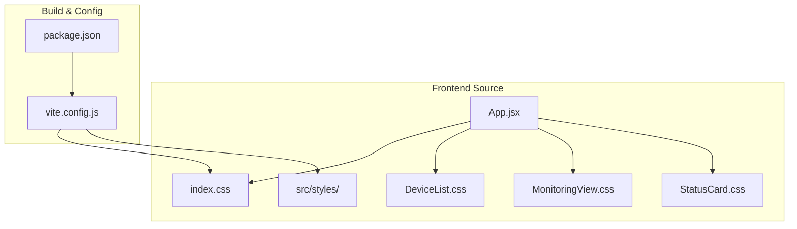
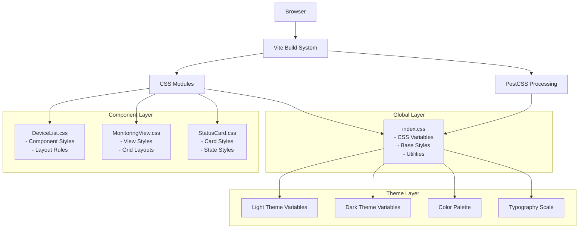
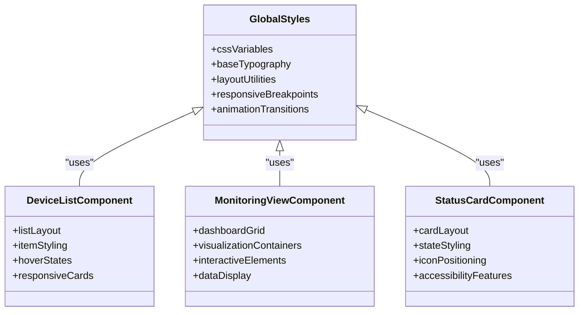
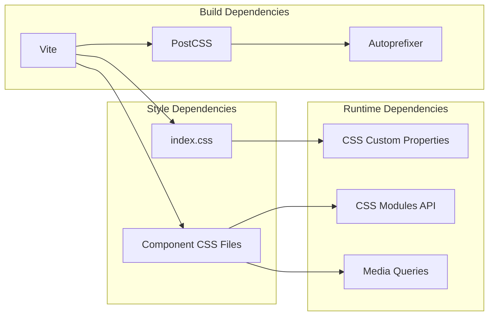

# Styling and Theming System

<cite>
**Referenced Files in This Document**
- [index.css](file://frontend/src/index.css)
- [DeviceList.css](file://frontend/src/styles/DeviceList.css)
- [MonitoringView.css](file://frontend/src/styles/MonitoringView.css)
- [StatusCard.css](file://frontend/src/styles/StatusCard.css)
- [App.jsx](file://frontend/src/App.jsx)
- [package.json](file://frontend/package.json)
- [vite.config.js](file://frontend/vite.config.js)
</cite>

## Table of Contents
1. [Introduction](#introduction)
2. [Project Structure](#project-structure)
3. [Core Components](#core-components)
4. [Architecture Overview](#architecture-overview)
5. [Detailed Component Analysis](#detailed-component-analysis)
6. [Dependency Analysis](#dependency-analysis)
7. [Performance Considerations](#performance-considerations)
8. [Troubleshooting Guide](#troubleshooting-guide)
9. [Conclusion](#conclusion)
10. [Appendices](#appendices)

## Introduction

This document explains the styling architecture and theming system used throughout the frontend application. It covers CSS organization strategy, component-specific styles using CSS modules, global styling patterns, responsive design approach, mobile-first considerations, cross-browser compatibility strategies, guidelines for creating consistent visual themes, implementing dark/light mode support, and maintaining design system consistency. It also provides examples of adding new component styles, customizing existing themes, and implementing responsive layouts for different screen sizes.

## Project Structure

The frontend uses a modular CSS organization with:
- Global styles defined in index.css
- Component-scoped styles in dedicated CSS files under src/styles
- React components importing their respective styles
- Vite-based build configuration supporting CSS modules and modern tooling

**Diagram sources**
- [App.jsx:1-50](file://frontend/src/App.jsx#L1-L50)
- [index.css:1-100](file://frontend/src/index.css#L1-L100)
- [package.json:1-50](file://frontend/package.json#L1-L50)
- [vite.config.js:1-50](file://frontend/vite.config.js#L1-L50)

**Section sources**
- [index.css:1-100](file://frontend/src/index.css#L1-L100)
- [package.json:1-50](file://frontend/package.json#L1-L50)
- [vite.config.js:1-50](file://frontend/vite.config.js#L1-L50)

## Core Components

The styling system is built around three core principles:

### Global Styles (index.css)
- CSS custom properties for theming
- Base typography and layout resets
- CSS Grid and Flexbox utilities
- Responsive breakpoints and media queries
- Dark/light mode variables

### Component Styles (CSS Modules)
- Scoped styling per component
- BEM-like naming conventions
- Reusable utility classes
- Theme-aware color systems

### Build Configuration
- Vite integration for CSS processing
- CSS modules support
- PostCSS plugins for autoprefixing
- Minification and optimization

**Section sources**
- [index.css:1-100](file://frontend/src/index.css#L1-L100)
- [DeviceList.css:1-50](file://frontend/src/styles/DeviceList.css#L1-L50)
- [MonitoringView.css:1-50](file://frontend/src/styles/MonitoringView.css#L1-L50)
- [StatusCard.css:1-50](file://frontend/src/styles/StatusCard.css#L1-L50)

## Architecture Overview

The styling architecture follows a layered approach with clear separation of concerns:

**Diagram sources**
- [index.css:1-100](file://frontend/src/index.css#L1-L100)
- [DeviceList.css:1-50](file://frontend/src/styles/DeviceList.css#L1-L50)
- [MonitoringView.css:1-50](file://frontend/src/styles/MonitoringView.css#L1-L50)
- [StatusCard.css:1-50](file://frontend/src/styles/StatusCard.css#L1-L50)
- [vite.config.js:1-50](file://frontend/vite.config.js#L1-L50)

## Detailed Component Analysis

### Global Styling System (index.css)

The global stylesheet establishes the foundation for the entire application's visual language:

#### CSS Custom Properties Architecture
- Design tokens for colors, spacing, typography
- Theme-aware variable definitions
- CSS Grid and Flexbox utility classes
- Responsive breakpoint definitions
- Animation and transition utilities

#### Mobile-First Responsive Strategy
- Base styles target mobile devices
- Progressive enhancement for larger screens
- Fluid typography and spacing
- Touch-friendly interaction patterns

#### Cross-Browser Compatibility
- Autoprefixer integration via PostCSS
- Vendor prefix handling
- Fallbacks for older browsers
- Feature detection utilities

### Component-Specific Styling Pattern

Each component follows a consistent pattern for styling:

#### DeviceList Component
- List layout with grid/flexbox
- Item hover states and transitions
- Responsive card layouts
- Status indicators and badges

#### MonitoringView Component  
- Dashboard-style grid layout
- Real-time data visualization containers
- Chart and graph styling
- Interactive element states

#### StatusCard Component
- Card-based UI pattern
- State-dependent styling
- Icon and badge positioning
- Accessibility-focused contrast ratios

**Diagram sources**
- [index.css:1-100](file://frontend/src/index.css#L1-L100)
- [DeviceList.css:1-50](file://frontend/src/styles/DeviceList.css#L1-L50)
- [MonitoringView.css:1-50](file://frontend/src/styles/MonitoringView.css#L1-L50)
- [StatusCard.css:1-50](file://frontend/src/styles/StatusCard.css#L1-L50)

**Section sources**
- [index.css:1-100](file://frontend/src/index.css#L1-L100)
- [DeviceList.css:1-50](file://frontend/src/styles/DeviceList.css#L1-L50)
- [MonitoringView.css:1-50](file://frontend/src/styles/MonitoringView.css#L1-L50)
- [StatusCard.css:1-50](file://frontend/src/styles/StatusCard.css#L1-L50)

## Dependency Analysis

The styling dependencies follow a clear hierarchy:

**Diagram sources**
- [package.json:1-50](file://frontend/package.json#L1-L50)
- [vite.config.js:1-50](file://frontend/vite.config.js#L1-L50)
- [index.css:1-100](file://frontend/src/index.css#L1-L100)

**Section sources**
- [package.json:1-50](file://frontend/package.json#L1-L50)
- [vite.config.js:1-50](file://frontend/vite.config.js#L1-L50)

## Performance Considerations

### CSS Optimization Strategies
- CSS modules for scoped styling and reduced specificity conflicts
- Tree shaking for unused CSS during build process
- Critical CSS extraction for above-the-fold content
- CSS minification and compression

### Responsive Design Performance
- Mobile-first approach reduces unnecessary CSS for mobile devices
- Efficient media query usage to minimize reflows
- CSS Grid and Flexbox for optimal layout performance
- Avoidance of expensive CSS properties like box-shadow where possible

### Theme Switching Performance
- CSS custom properties enable instant theme switching
- No JavaScript overhead for theme changes
- Cached CSS assets reduce load times
- Minimal DOM manipulation for theme updates

## Troubleshooting Guide

### Common Styling Issues and Solutions

#### CSS Module Import Problems
- Ensure proper import syntax in React components
- Verify CSS module configuration in vite.config.js
- Check for naming conflicts between CSS and JS files

#### Theme Variable Not Applying
- Verify CSS custom property scope and specificity
- Check if theme variables are properly defined in index.css
- Ensure theme context is correctly passed to components

#### Responsive Layout Issues
- Validate media query breakpoints match design specifications
- Check for conflicting CSS rules affecting layout
- Test across different viewport sizes and devices

#### Cross-Browser Compatibility
- Review browser support matrix in package.json
- Check for unsupported CSS features
- Use feature detection for advanced CSS capabilities

**Section sources**
- [index.css:1-100](file://frontend/src/index.css#L1-L100)
- [vite.config.js:1-50](file://frontend/vite.config.js#L1-L50)

## Conclusion

The styling architecture provides a robust, scalable foundation for the frontend application. The combination of CSS modules, custom properties, and modern build tools creates a maintainable system that supports responsive design, theming, and cross-browser compatibility. The modular approach ensures that styles remain organized and predictable as the application grows.

Key strengths include:
- Clear separation between global and component styles
- Flexible theming system using CSS custom properties
- Mobile-first responsive design approach
- Modern build pipeline with CSS optimization
- Consistent patterns for component styling

## Appendices

### Adding New Component Styles

1. Create a new CSS file in `src/styles/` following the naming convention
2. Import the CSS file in your React component
3. Use CSS modules for scoped styling
4. Follow established naming patterns and conventions
5. Test responsive behavior across breakpoints

### Customizing Existing Themes

1. Modify CSS custom properties in index.css
2. Update color palette variables for brand consistency
3. Adjust spacing and typography scales
4. Test theme changes across all components
5. Verify accessibility contrast ratios

### Implementing Responsive Layouts

1. Start with mobile-first base styles
2. Add progressive enhancements for larger screens
3. Use fluid typography and spacing
4. Test on actual devices when possible
5. Validate touch interactions and gestures

[No sources needed since this section provides general guidance]