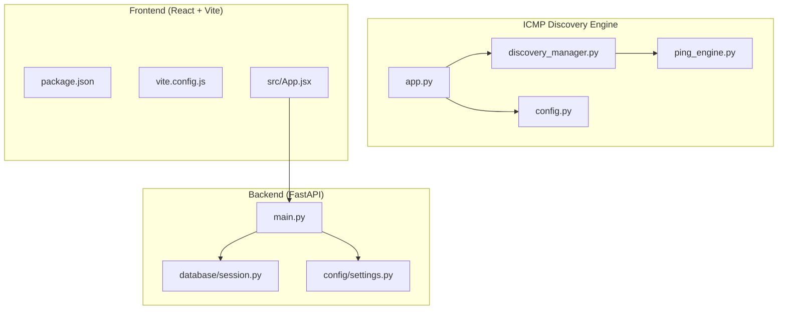
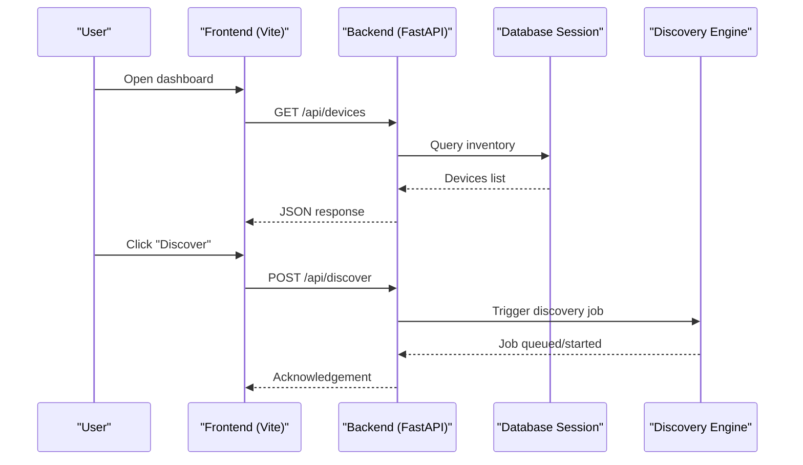
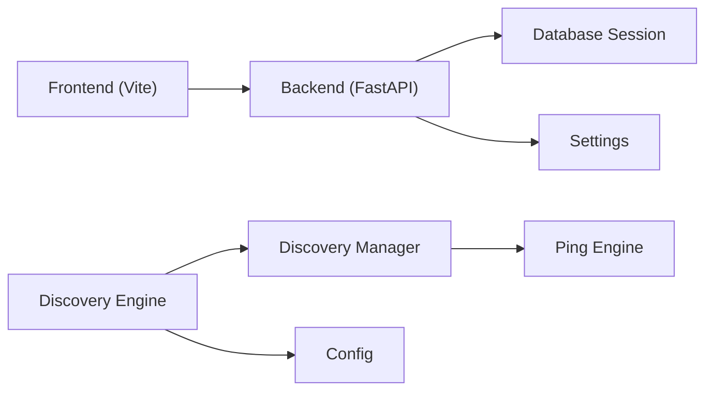

# Getting Started

<cite>
**Referenced Files in This Document**
- [backend/main.py](file://backend/main.py)
- [backend/requirements.txt](file://backend/requirements.txt)
- [backend/config/settings.py](file://backend/config/settings.py)
- [backend/database/session.py](file://backend/database/session.py)
- [backend/init_db.py](file://backend/init_db.py)
- [icmp_discovery/app.py](file://icmp_discovery/app.py)
- [icmp_discovery/requirements.txt](file://icmp_discovery/requirements.txt)
- [icmp_discovery/config.py](file://icmp_discovery/config.py)
- [icmp_discovery/discovery_manager.py](file://icmp_discovery/discovery_manager.py)
- [icmp_discovery/ping_engine.py](file://icmp_discovery/ping_engine.py)
- [frontend/package.json](file://frontend/package.json)
- [frontend/vite.config.js](file://frontend/vite.config.js)
- [frontend/src/App.jsx](file://frontend/src/App.jsx)
</cite>

## Table of Contents
1. [Introduction](#introduction)
2. [Project Structure](#project-structure)
3. [Core Components](#core-components)
4. [Architecture Overview](#architecture-overview)
5. [Detailed Component Analysis](#detailed-component-analysis)
6. [Dependency Analysis](#dependency-analysis)
7. [Performance Considerations](#performance-considerations)
8. [Troubleshooting Guide](#troubleshooting-guide)
9. [Conclusion](#conclusion)
10. [Appendices](#appendices)

## Introduction
This guide helps you set up and run the Network Management System (NMS) from scratch. The system consists of three main parts:
- ICMP Discovery Engine: Discovers devices on your network using ICMP and other protocols, then exposes results via an API.
- Backend (FastAPI): Provides APIs for device inventory, monitoring status, and configuration management.
- Frontend (React + Vite): A web dashboard to visualize discovered devices and their health.

You will learn how to install dependencies, configure each component, initialize the database, and perform your first discovery and monitoring tasks.

## Project Structure
The repository is organized into three primary modules:
- backend: FastAPI application with routes, services, models, and database setup.
- icmp_discovery: Python-based discovery engine with ping and protocol scanners, scheduling, and reporting.
- frontend: React application built with Vite for the monitoring dashboard.

**Diagram sources**
- [icmp_discovery/app.py](file://icmp_discovery/app.py)
- [icmp_discovery/discovery_manager.py](file://icmp_discovery/discovery_manager.py)
- [icmp_discovery/ping_engine.py](file://icmp_discovery/ping_engine.py)
- [icmp_discovery/config.py](file://icmp_discovery/config.py)
- [backend/main.py](file://backend/main.py)
- [backend/database/session.py](file://backend/database/session.py)
- [backend/config/settings.py](file://backend/config/settings.py)
- [frontend/package.json](file://frontend/package.json)
- [frontend/vite.config.js](file://frontend/vite.config.js)
- [frontend/src/App.jsx](file://frontend/src/App.jsx)

**Section sources**
- [backend/main.py](file://backend/main.py)
- [icmp_discovery/app.py](file://icmp_discovery/app.py)
- [frontend/package.json](file://frontend/package.json)

## Core Components
- ICMP Discovery Engine
  - Entry point and orchestration for discovery tasks.
  - Uses a discovery manager to coordinate multiple discovery modules.
  - Relies on a ping engine for reachability checks and basic profiling.
  - Configuration is centralized for network ranges, timeouts, and credentials.

- Backend (FastAPI)
  - Application entry point that wires routes, middleware, and lifecycle events.
  - Database session management for persistent storage of inventory and monitoring data.
  - Settings module for environment-driven configuration.

- Frontend (React + Vite)
  - Web UI for browsing devices and viewing monitoring status.
  - Built with Vite; configured to proxy API calls to the backend.

**Section sources**
- [icmp_discovery/app.py](file://icmp_discovery/app.py)
- [icmp_discovery/discovery_manager.py](file://icmp_discovery/discovery_manager.py)
- [icmp_discovery/ping_engine.py](file://icmp_discovery/ping_engine.py)
- [icmp_discovery/config.py](file://icmp_discovery/config.py)
- [backend/main.py](file://backend/main.py)
- [backend/database/session.py](file://backend/database/session.py)
- [backend/config/settings.py](file://backend/config/settings.py)
- [frontend/src/App.jsx](file://frontend/src/App.jsx)

## Architecture Overview
High-level flow:
- The discovery engine scans networks, profiles devices, and stores results.
- The backend exposes APIs for querying inventory and monitoring state.
- The frontend consumes backend APIs to render dashboards and controls.

**Diagram sources**
- [backend/main.py](file://backend/main.py)
- [backend/database/session.py](file://backend/database/session.py)
- [icmp_discovery/app.py](file://icmp_discovery/app.py)
- [icmp_discovery/discovery_manager.py](file://icmp_discovery/discovery_manager.py)
- [frontend/src/App.jsx](file://frontend/src/App.jsx)

## Detailed Component Analysis

### Installation Prerequisites
- Python 3.x recommended (use a virtual environment).
- Node.js LTS recommended for the frontend build toolchain.
- OS-level tools:
  - Windows: PowerShell or Command Prompt with administrative privileges for certain network operations.
  - Linux/macOS: Standard terminal access; may require sudo for raw socket operations.

**Section sources**
- [backend/requirements.txt](file://backend/requirements.txt)
- [icmp_discovery/requirements.txt](file://icmp_discovery/requirements.txt)
- [frontend/package.json](file://frontend/package.json)

### Install and Configure the ICMP Discovery Engine
Steps:
1. Create and activate a Python virtual environment.
2. Install requirements from the discovery engine’s requirements file.
3. Review and adjust configuration values such as network ranges, timeouts, and credentials.
4. Run the discovery engine to start scanning and exposing endpoints.

Key files:
- Entry point and orchestration: [icmp_discovery/app.py](file://icmp_discovery/app.py)
- Discovery coordination: [icmp_discovery/discovery_manager.py](file://icmp_discovery/discovery_manager.py)
- Ping/reachability logic: [icmp_discovery/ping_engine.py](file://icmp_discovery/ping_engine.py)
- Configuration: [icmp_discovery/config.py](file://icmp_discovery/config.py)
- Dependencies: [icmp_discovery/requirements.txt](file://icmp_discovery/requirements.txt)

Tips:
- Ensure firewall rules allow outbound ICMP and any required ports for additional discovery modules.
- On restricted networks, consider running with elevated privileges if needed by your OS policy.

**Section sources**
- [icmp_discovery/app.py](file://icmp_discovery/app.py)
- [icmp_discovery/discovery_manager.py](file://icmp_discovery/discovery_manager.py)
- [icmp_discovery/ping_engine.py](file://icmp_discovery/ping_engine.py)
- [icmp_discovery/config.py](file://icmp_discovery/config.py)
- [icmp_discovery/requirements.txt](file://icmp_discovery/requirements.txt)

### Install and Configure the Backend (FastAPI)
Steps:
1. Create and activate a Python virtual environment.
2. Install requirements from the backend’s requirements file.
3. Configure settings (e.g., database URL, secrets, CORS, host/port).
4. Initialize the database schema and seed initial data if provided.
5. Start the FastAPI server.

Key files:
- Application entry point: [backend/main.py](file://backend/main.py)
- Database session management: [backend/database/session.py](file://backend/database/session.py)
- Settings/configuration: [backend/config/settings.py](file://backend/config/settings.py)
- Database initialization script: [backend/init_db.py](file://backend/init_db.py)
- Dependencies: [backend/requirements.txt](file://backend/requirements.txt)

Notes:
- Ensure the database service is reachable and credentials are correct.
- For development, enable hot-reload and debug logging as appropriate.

**Section sources**
- [backend/main.py](file://backend/main.py)
- [backend/database/session.py](file://backend/database/session.py)
- [backend/config/settings.py](file://backend/config/settings.py)
- [backend/init_db.py](file://backend/init_db.py)
- [backend/requirements.txt](file://backend/requirements.txt)

### Install and Configure the Frontend (React + Vite)
Steps:
1. Navigate to the frontend directory.
2. Install Node.js dependencies.
3. Configure the development server to proxy API requests to the backend.
4. Start the development server and open the local URL.

Key files:
- Package manifest and scripts: [frontend/package.json](file://frontend/package.json)
- Vite configuration: [frontend/vite.config.js](file://frontend/vite.config.js)
- Application root: [frontend/src/App.jsx](file://frontend/src/App.jsx)

Notes:
- Ensure the dev server proxies to the same host and port where the backend runs.
- Build artifacts are generated under the dist directory for production deployment.

**Section sources**
- [frontend/package.json](file://frontend/package.json)
- [frontend/vite.config.js](file://frontend/vite.config.js)
- [frontend/src/App.jsx](file://frontend/src/App.jsx)

### Environment Setup: Development vs Production
- Development
  - Use local virtual environments for Python components.
  - Enable verbose logging and hot reload for faster iteration.
  - Proxy frontend requests to the backend dev server.

- Production
  - Pin dependency versions and use containerization if applicable.
  - Set secure secrets and restrict network exposure.
  - Serve static frontend assets through a web server or CDN.

[No sources needed since this section provides general guidance]

### Initial Configuration Examples
- Discovery Engine
  - Define target subnets, scan intervals, and credential templates.
  - Adjust timeouts and concurrency limits based on network size.

- Backend
  - Provide database connection string and secret keys.
  - Configure CORS origins to include your frontend domain.

- Frontend
  - Set the API base URL to match your backend host and port.
  - Configure feature flags or theme options as needed.

[No sources needed since this section provides general guidance]

### Database Setup Instructions
- Ensure the database service is running and accessible.
- Run the database initialization script to create tables and seed data.
- Verify connectivity from the backend process.

Key files:
- Initialization script: [backend/init_db.py](file://backend/init_db.py)
- Session configuration: [backend/database/session.py](file://backend/database/session.py)

**Section sources**
- [backend/init_db.py](file://backend/init_db.py)
- [backend/database/session.py](file://backend/database/session.py)

### First-Time Run Procedures
- Start the discovery engine and let it discover devices.
- Initialize the backend database and start the FastAPI server.
- Launch the frontend dev server and navigate to the dashboard.
- Trigger a discovery job from the UI or API and verify results.

**Section sources**
- [icmp_discovery/app.py](file://icmp_discovery/app.py)
- [backend/main.py](file://backend/main.py)
- [frontend/src/App.jsx](file://frontend/src/App.jsx)

### Quick Start: Discover Devices and Access Dashboard
- From the frontend, click the “Discover” action to initiate a scan.
- Wait for the discovery engine to complete and the backend to persist results.
- View device inventory and status on the dashboard.

**Section sources**
- [icmp_discovery/discovery_manager.py](file://icmp_discovery/discovery_manager.py)
- [icmp_discovery/ping_engine.py](file://icmp_discovery/ping_engine.py)
- [backend/main.py](file://backend/main.py)
- [frontend/src/App.jsx](file://frontend/src/App.jsx)

## Dependency Analysis
Component relationships and key dependencies:

**Diagram sources**
- [frontend/package.json](file://frontend/package.json)
- [backend/main.py](file://backend/main.py)
- [backend/database/session.py](file://backend/database/session.py)
- [backend/config/settings.py](file://backend/config/settings.py)
- [icmp_discovery/app.py](file://icmp_discovery/app.py)
- [icmp_discovery/discovery_manager.py](file://icmp_discovery/discovery_manager.py)
- [icmp_discovery/ping_engine.py](file://icmp_discovery/ping_engine.py)
- [icmp_discovery/config.py](file://icmp_discovery/config.py)

**Section sources**
- [backend/main.py](file://backend/main.py)
- [icmp_discovery/app.py](file://icmp_discovery/app.py)
- [frontend/package.json](file://frontend/package.json)

## Performance Considerations
- Tune discovery concurrency and timeouts to match network scale.
- Use pagination and filtering on backend endpoints when listing large inventories.
- Cache frequent queries at the backend layer if appropriate.
- Minimize payload sizes in frontend responses and leverage lazy loading.

[No sources needed since this section provides general guidance]

## Troubleshooting Guide
Common issues and resolutions:
- Cannot connect to database
  - Verify connection string, credentials, and network reachability.
  - Check that the database service is running and accepting connections.

- Discovery returns no devices
  - Confirm target subnets and firewall rules allow ICMP and required ports.
  - Increase timeouts and retry counts for slow networks.

- Frontend cannot reach backend
  - Ensure CORS allows your frontend origin.
  - Validate proxy configuration in Vite points to the correct backend host/port.

- Permission errors during discovery
  - Run with elevated privileges if required by your OS for raw sockets.

**Section sources**
- [backend/database/session.py](file://backend/database/session.py)
- [icmp_discovery/config.py](file://icmp_discovery/config.py)
- [icmp_discovery/ping_engine.py](file://icmp_discovery/ping_engine.py)
- [frontend/vite.config.js](file://frontend/vite.config.js)

## Conclusion
You now have the essential steps to install, configure, and run all three components of the NMS. Start with the discovery engine to populate your network inventory, then launch the backend and frontend to explore and monitor devices through the dashboard.

[No sources needed since this section summarizes without analyzing specific files]

## Appendices

### Appendix A: File Reference Map
- Backend
  - Entry point: [backend/main.py](file://backend/main.py)
  - Database session: [backend/database/session.py](file://backend/database/session.py)
  - Settings: [backend/config/settings.py](file://backend/config/settings.py)
  - Init script: [backend/init_db.py](file://backend/init_db.py)
  - Requirements: [backend/requirements.txt](file://backend/requirements.txt)

- Discovery Engine
  - Entry point: [icmp_discovery/app.py](file://icmp_discovery/app.py)
  - Discovery manager: [icmp_discovery/discovery_manager.py](file://icmp_discovery/discovery_manager.py)
  - Ping engine: [icmp_discovery/ping_engine.py](file://icmp_discovery/ping_engine.py)
  - Config: [icmp_discovery/config.py](file://icmp_discovery/config.py)
  - Requirements: [icmp_discovery/requirements.txt](file://icmp_discovery/requirements.txt)

- Frontend
  - Package manifest: [frontend/package.json](file://frontend/package.json)
  - Vite config: [frontend/vite.config.js](file://frontend/vite.config.js)
  - App root: [frontend/src/App.jsx](file://frontend/src/App.jsx)

[No sources needed since this section lists references already cited above]