# Auto Detector

<cite>
**Referenced Files in This Document**
- [auto_detector.py](file://icmp_discovery/auto_detector.py)
- [os_detector.py](file://icmp_discovery/os_detector.py)
- [device_profiling_service.py](file://icmp_discovery/device_profiling_service.py)
- [discovery_manager.py](file://icmp_discovery/discovery_manager.py)
- [arp_discovery.py](file://icmp_discovery/discovery_modules/arp_discovery.py)
- [dns_discovery.py](file://icmp_discovery/discovery_modules/dns_discovery.py)
- [http_discovery.py](file://icmp_discovery/discovery_modules/http_discovery.py)
- [icmp_discovery.py](file://icmp_discovery/discovery_modules/icmp_discovery.py)
- [snmp_discovery.py](file://icmp_discovery/discovery_modules/snmp_discovery.py)
- [ssh_discovery.py](file://icmp_discovery/discovery_modules/ssh_discovery.py)
- [tcp_discovery.py](file://icmp_discovery/discovery_modules/tcp_discovery.py)
- [wmi_discovery.py](file://icmp_discovery/discovery_modules/wmi_discovery.py)
- [device_profiler.py](file://icmp_discovery/discovery_modules/device_profiler.py)
- [test_auto_detector.py](file://icmp_discovery/tests/test_auto_detector.py)
- [test_os_detector.py](file://icmp_discovery/tests/test_os_detector.py)
</cite>

## Table of Contents
1. [Introduction](#introduction)
2. [Project Structure](#project-structure)
3. [Core Components](#core-components)
4. [Architecture Overview](#architecture-overview)
5. [Detailed Component Analysis](#detailed-component-analysis)
6. [Detection Algorithms](#detection-algorithms)
7. [Signature Matching System](#signature-matching-system)
8. [Heuristic Analysis](#heuristic-analysis)
9. [Confidence Scoring](#confidence-scoring)
10. [Adding New Device Signatures](#adding-new-device-signatures)
11. [Custom Detection Rules](#custom-detection-rules)
12. [Integration with OS Detection](#integration-with-os-detection)
13. [Device Profiling Services](#device-profiling-services)
14. [Troubleshooting Guide](#troubleshooting-guide)
15. [Performance Considerations](#performance-considerations)
16. [Conclusion](#conclusion)

## Introduction

The Auto Detector system is a sophisticated network device identification engine that automatically identifies device types and characteristics from network responses. It employs multiple detection strategies including signature matching, heuristic analysis, and confidence scoring to accurately classify devices such as routers, switches, servers, and IoT devices. The system integrates seamlessly with OS detection and device profiling services to provide comprehensive network inventory management.

## Project Structure

The Auto Detector system is part of a larger ICMP discovery and monitoring framework organized into modular components:

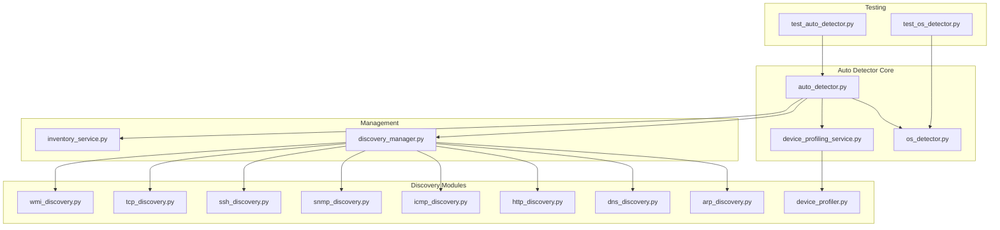

**Diagram sources**
- [auto_detector.py](file://icmp_discovery/auto_detector.py)
- [discovery_manager.py](file://icmp_discovery/discovery_manager.py)
- [device_profiling_service.py](file://icmp_discovery/device_profiling_service.py)

**Section sources**
- [auto_detector.py](file://icmp_discovery/auto_detector.py)
- [discovery_manager.py](file://icmp_discovery/discovery_manager.py)

## Core Components

The Auto Detector system consists of several core components that work together to provide comprehensive device detection capabilities:

### Auto Detector Engine
The main detection engine that orchestrates the entire device identification process. It coordinates between different discovery modules and applies various detection algorithms.

### OS Detection Module
Specialized component for operating system fingerprinting based on network protocol behaviors and response patterns.

### Device Profiling Service
Manages device profiles and maintains metadata about detected devices including capabilities, vendor information, and configuration details.

### Discovery Manager
Coordinates multiple discovery protocols and manages the lifecycle of network scanning operations.

**Section sources**
- [auto_detector.py](file://icmp_discovery/auto_detector.py)
- [os_detector.py](file://icmp_discovery/os_detector.py)
- [device_profiling_service.py](file://icmp_discovery/device_profiling_service.py)
- [discovery_manager.py](file://icmp_discovery/discovery_manager.py)

## Architecture Overview

The Auto Detector follows a modular architecture pattern with clear separation of concerns:

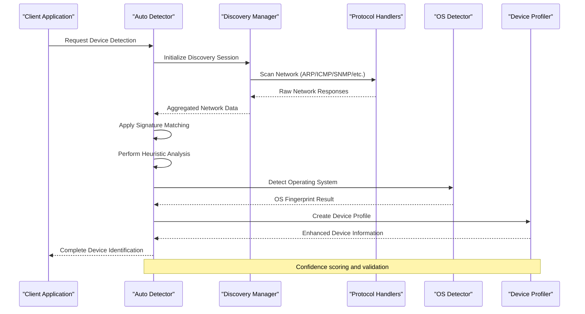

**Diagram sources**
- [auto_detector.py](file://icmp_discovery/auto_detector.py)
- [discovery_manager.py](file://icmp_discovery/discovery_manager.py)
- [os_detector.py](file://icmp_discovery/os_detector.py)
- [device_profiling_service.py](file://icmp_discovery/device_profiling_service.py)

## Detailed Component Analysis

### Auto Detector Engine

The Auto Detector engine serves as the central coordinator for all device detection activities. It implements a multi-stage detection pipeline that processes network responses through various classification algorithms.

#### Key Responsibilities:
- Orchestrate discovery module execution
- Apply signature-based detection algorithms
- Execute heuristic analysis for ambiguous cases
- Calculate confidence scores for detections
- Coordinate with OS detection and profiling services

#### Detection Pipeline:
1. **Data Collection**: Gather raw network responses from discovery modules
2. **Preprocessing**: Normalize and validate input data
3. **Signature Matching**: Compare against known device signatures
4. **Heuristic Analysis**: Apply rule-based reasoning for uncertain cases
5. **OS Fingerprinting**: Identify operating system characteristics
6. **Profile Enhancement**: Enrich device information with profiling data
7. **Confidence Scoring**: Calculate detection reliability metrics

**Section sources**
- [auto_detector.py](file://icmp_discovery/auto_detector.py)
- [test_auto_detector.py](file://icmp_discovery/tests/test_auto_detector.py)

### OS Detection Module

The OS detection module specializes in identifying operating systems through network protocol analysis and response pattern matching.

#### Detection Methods:
- **TCP Stack Fingerprinting**: Analyzes TCP/IP stack behavior
- **ICMP Response Analysis**: Examines ICMP message handling
- **Service Banner Grabbing**: Extracts OS information from service responses
- **Protocol Behavior Analysis**: Studies how different OS handle network protocols

#### Supported Operating Systems:
- Windows variants (Server, Desktop, Embedded)
- Linux distributions (Ubuntu, CentOS, Debian, etc.)
- Network device firmware (Cisco IOS, Juniper Junos, etc.)
- IoT device operating systems

**Section sources**
- [os_detector.py](file://icmp_discovery/os_detector.py)
- [test_os_detector.py](file://icmp_discovery/tests/test_os_detector.py)

### Device Profiling Service

The device profiling service manages comprehensive device profiles and maintains detailed metadata about detected network devices.

#### Profile Management:
- **Device Metadata**: Vendor, model, serial number, firmware version
- **Capability Mapping**: Supported protocols, features, and limitations
- **Configuration Templates**: Default and custom configuration baselines
- **Historical Tracking**: Change history and configuration drift detection

#### Integration Points:
- Real-time profile updates during device detection
- Configuration template application
- Compliance checking and reporting
- Asset management integration

**Section sources**
- [device_profiling_service.py](file://icmp_discovery/device_profiling_service.py)
- [device_profiler.py](file://icmp_discovery/discovery_modules/device_profiler.py)

## Detection Algorithms

The Auto Detector employs multiple detection algorithms tailored for different device categories:

### Router Detection Algorithm

Routers are identified through specific network behavior patterns and protocol implementations:

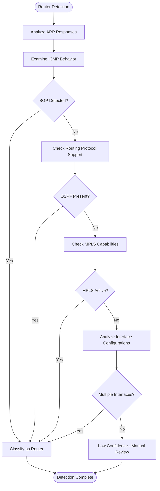

**Diagram sources**
- [auto_detector.py](file://icmp_discovery/auto_detector.py)
- [arp_discovery.py](file://icmp_discovery/discovery_modules/arp_discovery.py)
- [icmp_discovery.py](file://icmp_discovery/discovery_modules/icmp_discovery.py)

### Switch Detection Algorithm

Network switches are identified through MAC address table analysis and Layer 2 protocol support:

#### Key Indicators:
- **MAC Address Learning**: Dynamic MAC address table population
- **VLAN Support**: VLAN tagging and configuration capabilities
- **STP Implementation**: Spanning Tree Protocol participation
- **Port Security Features**: Access control and port security mechanisms

### Server Detection Algorithm

Servers are classified based on service exposure and system characteristics:

#### Detection Criteria:
- **Service Enumeration**: Web servers, database engines, application servers
- **System Headers**: HTTP headers, SSH banners, SNMP community strings
- **Resource Consumption**: CPU, memory, and disk usage patterns
- **Security Posture**: Firewall rules, authentication mechanisms

### IoT Device Detection Algorithm

IoT devices present unique challenges due to limited functionality and proprietary protocols:

#### Specialized Detection:
- **MQTT/CoAP Support**: Lightweight protocol implementation
- **Limited Port Exposure**: Minimal service surface area
- **Vendor-Specific Signatures**: Proprietary communication patterns
- **Power Consumption Patterns**: Sleep/wake cycle analysis

**Section sources**
- [auto_detector.py](file://icmp_discovery/auto_detector.py)
- [tcp_discovery.py](file://icmp_discovery/discovery_modules/tcp_discovery.py)
- [snmp_discovery.py](file://icmp_discovery/discovery_modules/snmp_discovery.py)

## Signature Matching System

The signature matching system is the primary mechanism for device identification, using pattern recognition against known device fingerprints.

### Signature Database Structure

Signatures are organized hierarchically by device category and include multiple matching criteria:

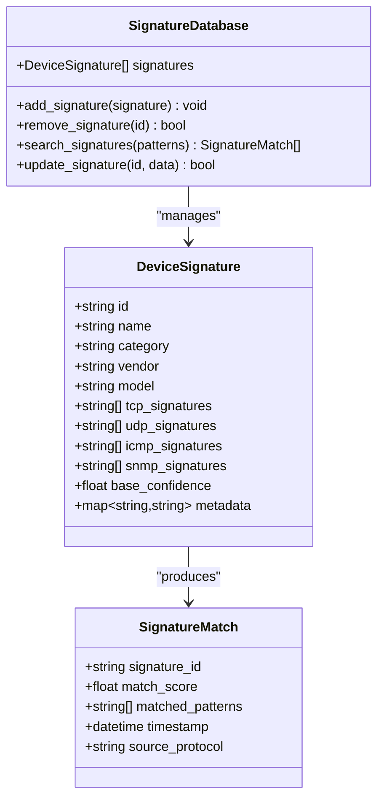

**Diagram sources**
- [auto_detector.py](file://icmp_discovery/auto_detector.py)

### Pattern Matching Algorithms

The system employs multiple pattern matching strategies:

#### Exact String Matching
- Direct string comparison against known signatures
- Case-insensitive matching for flexibility
- Wildcard support for variable components

#### Regular Expression Matching
- Complex pattern definitions for flexible matching
- Group extraction for parameter capture
- Performance-optimized regex compilation

#### Fuzzy Matching
- Levenshtein distance for typo tolerance
- Partial matching for incomplete signatures
- Context-aware pattern recognition

### Signature Categories

Signatures are categorized by device type and detection method:

| Category | Description | Examples |
|----------|-------------|----------|
| Network Infrastructure | Routers, switches, firewalls | Cisco IOS, Juniper Junos, Palo Alto PAN-OS |
| Servers | Physical and virtual servers | Windows Server, Linux distributions, VMware ESXi |
| Storage Devices | NAS, SAN, storage arrays | NetApp ONTAP, Dell EMC Unity, HPE 3PAR |
| IoT Devices | Smart devices, sensors, controllers | Zigbee gateways, Modbus controllers, MQTT brokers |
| Security Appliances | IDS/IPS, VPN concentrators | Fortinet FortiOS, Check Point Gaia, SonicWall OS |

**Section sources**
- [auto_detector.py](file://icmp_discovery/auto_detector.py)
- [http_discovery.py](file://icmp_discovery/discovery_modules/http_discovery.py)
- [ssh_discovery.py](file://icmp_discovery/discovery_modules/ssh_discovery.py)

## Heuristic Analysis

When signature matching fails or produces ambiguous results, the heuristic analysis engine applies rule-based reasoning to make informed decisions.

### Rule-Based Decision Trees

The heuristic system uses decision trees to evaluate multiple factors:

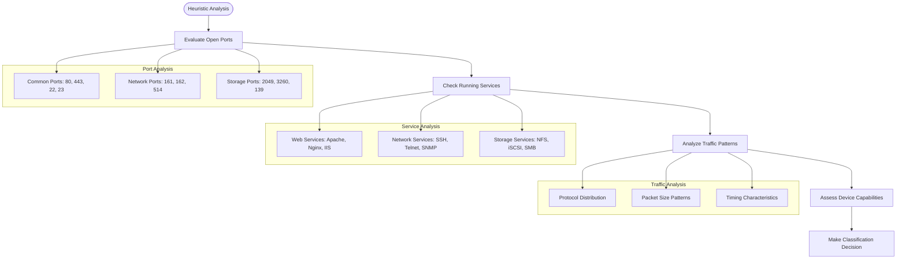

**Diagram sources**
- [auto_detector.py](file://icmp_discovery/auto_detector.py)
- [tcp_discovery.py](file://icmp_discovery/discovery_modules/tcp_discovery.py)

### Behavioral Analysis

The system analyzes device behavior patterns to infer device type and capabilities:

#### Network Behavior Patterns:
- **Response Timing**: Latency characteristics and jitter patterns
- **Packet Size Distribution**: Typical payload sizes and fragmentation
- **Protocol Usage**: Preferred protocols and port utilization
- **Connection Patterns**: Connection frequency and duration

#### Resource Utilization Patterns:
- **CPU Usage Profiles**: Processing intensity and burst patterns
- **Memory Footprint**: Memory allocation and garbage collection behavior
- **Disk I/O Patterns**: Read/write ratios and access patterns
- **Network Bandwidth**: Throughput characteristics and congestion handling

### Context-Aware Reasoning

The heuristic engine considers contextual information to improve accuracy:

#### Network Context:
- **Subnet Location**: VLAN membership and network segment
- **Topological Position**: Network role based on connectivity
- **Neighbor Relationships**: Connected device types and roles
- **Traffic Flow Direction**: Inbound vs outbound traffic patterns

#### Temporal Context:
- **Time-of-Day Patterns**: Business hours vs off-hours activity
- **Seasonal Variations**: Holiday and maintenance window effects
- **Event Correlation**: Relationship to network events and changes

**Section sources**
- [auto_detector.py](file://icmp_discovery/auto_detector.py)
- [icmp_discovery.py](file://icmp_discovery/discovery_modules/icmp_discovery.py)

## Confidence Scoring

The confidence scoring system provides quantitative measures of detection reliability, enabling automated decision-making and manual review prioritization.

### Scoring Methodology

Confidence scores are calculated using a weighted combination of multiple factors:

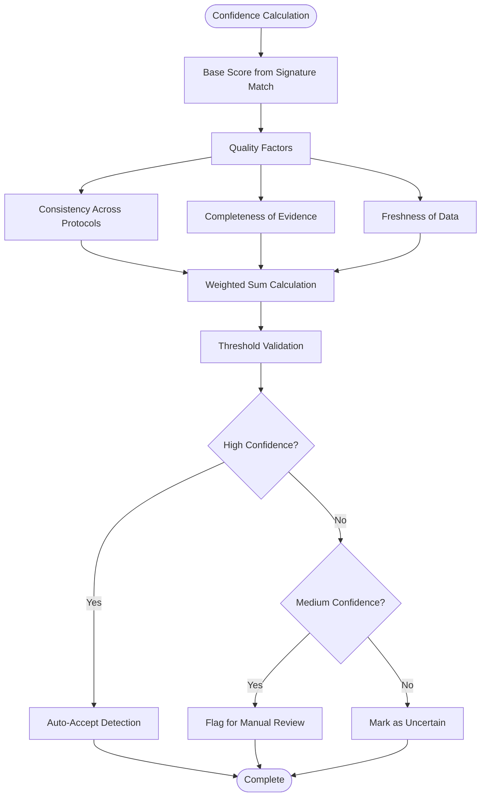

**Diagram sources**
- [auto_detector.py](file://icmp_discovery/auto_detector.py)

### Score Components

#### Base Confidence Score
- **Signature Match Strength**: Exact vs partial matches
- **Number of Matching Indicators**: Count of supporting evidence
- **Signature Reliability**: Historical accuracy of the signature

#### Quality Adjustment Factors
- **Protocol Consistency**: Agreement across multiple protocols
- **Data Freshness**: Recency of collected information
- **Collection Completeness**: Coverage of available detection methods
- **Environmental Context**: Network topology and expected device types

#### Penalty Factors
- **Contradictory Evidence**: Conflicting signals from different sources
- **Unusual Patterns**: Deviations from expected behavior
- **Incomplete Data**: Missing critical information for classification

### Confidence Levels

| Level | Range | Action |
|-------|-------|--------|
| High | 0.8 - 1.0 | Auto-accept, update inventory immediately |
| Medium | 0.5 - 0.8 | Flag for review, schedule verification scan |
| Low | 0.3 - 0.5 | Mark as uncertain, require manual confirmation |
| Very Low | 0.0 - 0.3 | Discard or request additional data collection |

### Adaptive Scoring

The system learns from user feedback and historical accuracy to improve scoring over time:

#### Feedback Integration:
- **User Corrections**: Manual overrides and corrections
- **Verification Results**: Outcome of follow-up investigations
- **Change Detection**: Accuracy based on subsequent device changes
- **Context Updates**: Improved scoring based on network evolution

**Section sources**
- [auto_detector.py](file://icmp_discovery/auto_detector.py)
- [inventory_service.py](file://icmp_discovery/inventory_service.py)

## Adding New Device Signatures

Adding new device signatures involves extending the signature database with patterns that uniquely identify target devices.

### Signature Creation Process

#### Step 1: Device Analysis
Collect comprehensive network data from the target device using all available discovery methods:

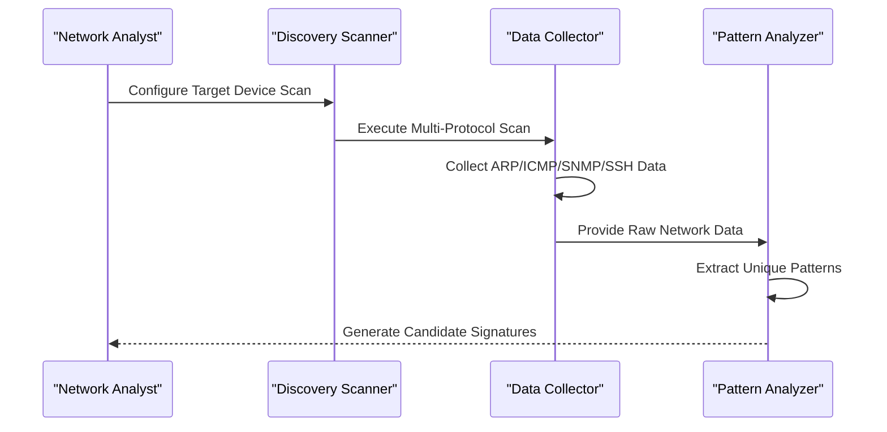

**Diagram sources**
- [auto_detector.py](file://icmp_discovery/auto_detector.py)
- [discovery_manager.py](file://icmp_discovery/discovery_manager.py)

#### Step 2: Pattern Extraction
Identify unique identifiers and behavioral patterns:

- **Protocol Signatures**: Specific byte sequences in protocol responses
- **Service Banners**: Version strings and vendor identifiers
- **Behavioral Patterns**: Timing, size, and frequency characteristics
- **Configuration Artifacts**: Unique configuration elements or defaults

#### Step 3: Signature Definition
Create structured signature definitions with appropriate matching criteria:

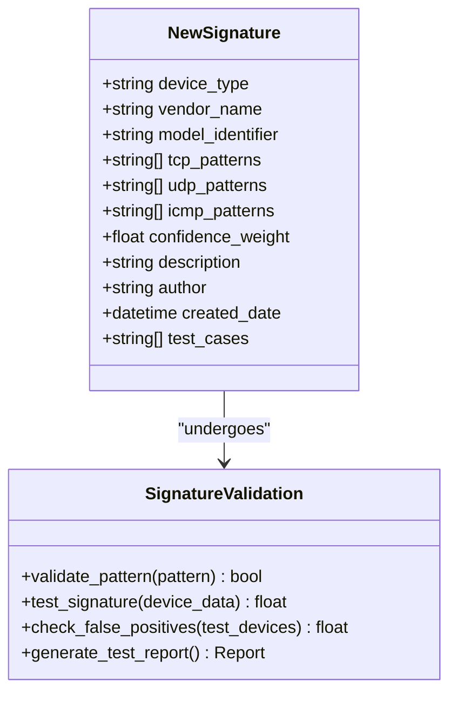

**Diagram sources**
- [auto_detector.py](file://icmp_discovery/auto_detector.py)

#### Step 4: Testing and Validation
Validate signatures against known device samples:

- **Positive Testing**: Confirm detection on target device types
- **Negative Testing**: Ensure no false positives on other devices
- **Performance Testing**: Verify signature matching efficiency
- **Regression Testing**: Confirm existing signatures remain accurate

### Signature Best Practices

#### Pattern Design Guidelines
- **Specificity Balance**: Enough specificity to avoid false positives while maintaining flexibility
- **Case Insensitivity**: Handle case variations in protocol responses
- **Version Independence**: Accommodate different software versions when possible
- **Encoding Handling**: Support various character encodings and formats

#### Performance Optimization
- **Early Exit Patterns**: Place most distinctive patterns first
- **Compiled Regex**: Use pre-compiled regular expressions for performance
- **Caching Strategies**: Cache frequently matched patterns
- **Parallel Processing**: Distribute signature matching across cores

**Section sources**
- [auto_detector.py](file://icmp_discovery/auto_detector.py)
- [test_auto_detector.py](file://icmp_discovery/tests/test_auto_detector.py)

## Custom Detection Rules

Beyond signature matching, the system supports custom detection rules for specialized scenarios and organizational requirements.

### Rule Engine Architecture

The custom rule engine provides a flexible framework for implementing detection logic:

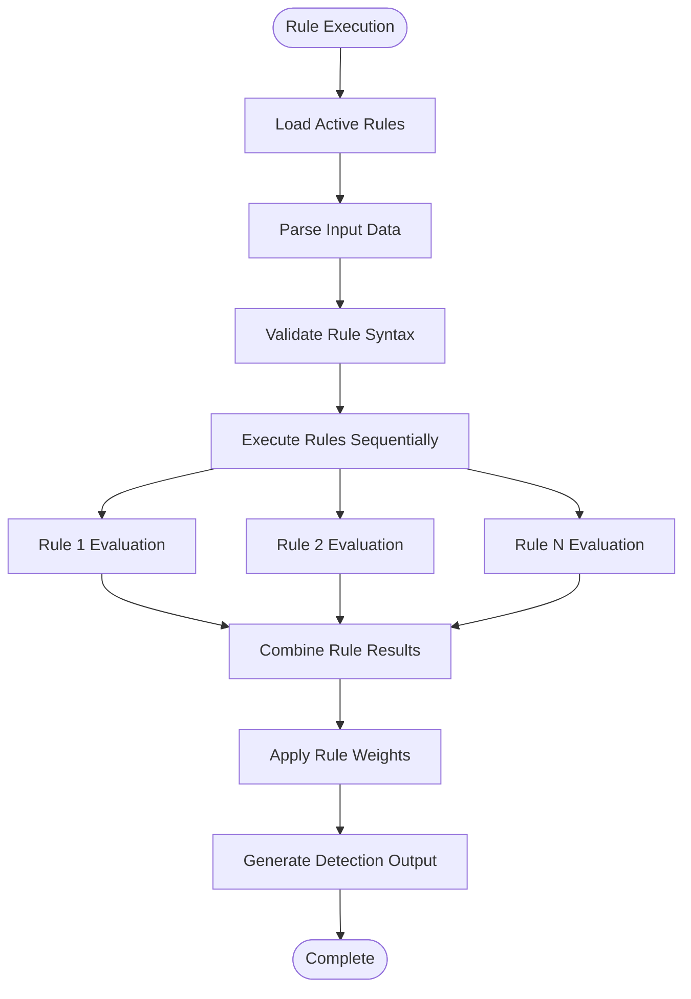

**Diagram sources**
- [auto_detector.py](file://icmp_discovery/auto_detector.py)

### Rule Types and Capabilities

#### Protocol-Specific Rules
Rules targeting specific network protocols:

- **HTTP/HTTPS Rules**: Analyze web server responses and headers
- **SNMP Rules**: Interpret SNMP OIDs and community strings
- **SSH Rules**: Parse SSH banners and key exchange messages
- **DNS Rules**: Examine DNS query/response patterns

#### Behavioral Rules
Rules based on device behavior and network interaction:

- **Traffic Analysis**: Monitor packet flow and timing patterns
- **Resource Usage**: Track CPU, memory, and I/O consumption
- **Connection Patterns**: Analyze connection establishment and teardown
- **Error Handling**: Study error response patterns and retry logic

#### Contextual Rules
Rules that consider network context and environment:

- **Topology Awareness**: Factor in network position and connectivity
- **Temporal Patterns**: Account for time-based behavior variations
- **Policy Compliance**: Enforce organizational detection policies
- **Risk Assessment**: Evaluate security implications of device types

### Rule Development Workflow

#### Creating Custom Rules
1. **Requirement Analysis**: Define detection objectives and constraints
2. **Data Collection**: Gather representative network samples
3. **Rule Implementation**: Write detection logic using supported APIs
4. **Testing Framework**: Develop comprehensive test cases
5. **Deployment Strategy**: Plan rollout and monitoring approach

#### Rule Testing and Validation
- **Unit Testing**: Individual rule functionality verification
- **Integration Testing**: Rule interaction and conflict resolution
- **Performance Testing**: Impact on overall detection performance
- **Accuracy Testing**: False positive and false negative rates

**Section sources**
- [auto_detector.py](file://icmp_discovery/auto_detector.py)
- [config.py](file://icmp_discovery/config.py)

## Integration with OS Detection

The Auto Detector integrates closely with the OS detection module to provide comprehensive device identification that includes both hardware and software characteristics.

### OS Detection Integration Points

#### Data Exchange Mechanisms
The integration between Auto Detector and OS detection operates through well-defined interfaces:

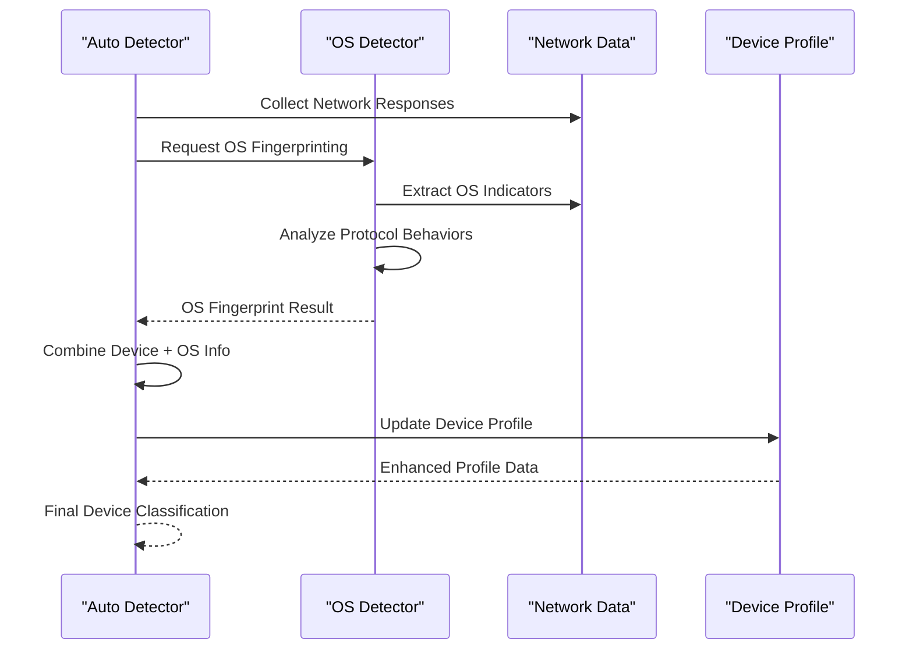

**Diagram sources**
- [auto_detector.py](file://icmp_discovery/auto_detector.py)
- [os_detector.py](file://icmp_discovery/os_detector.py)

#### OS Fingerprinting Techniques
The OS detector employs multiple techniques for accurate identification:

- **TCP Stack Fingerprinting**: Analyzes TCP/IP stack implementation differences
- **ICMP Message Handling**: Examines ICMP response patterns and options
- **Service Banner Analysis**: Extracts OS information from service responses
- **Protocol Behavior Analysis**: Studies how different OS implement protocols

### Cross-Platform Compatibility

The integration supports multiple operating systems and platforms:

#### Supported Host Operating Systems
- **Linux Distributions**: Ubuntu, CentOS, Debian, Red Hat Enterprise Linux
- **Windows Versions**: Server 2012+, Windows 10/11, Windows Server 2016+
- **macOS**: Modern macOS versions with required networking libraries
- **BSD Variants**: FreeBSD, OpenBSD for specialized environments

#### Container and Virtualization Support
- **Docker Containers**: Network namespace isolation and interface detection
- **Virtual Machines**: VM-specific network adapter identification
- **Cloud Platforms**: AWS, Azure, GCP instance type detection
- **Hypervisors**: VMware, Hyper-V, KVM host identification

### OS Profile Integration

Operating system information enriches device profiles with software characteristics:

#### Software Inventory
- **Kernel Version**: Operating system kernel and patch level
- **Installed Packages**: Critical software and library versions
- **Security Patches**: Current security update status
- **Configuration Baseline**: Standard configuration parameters

#### Capability Mapping
- **Supported Protocols**: Network protocol implementation status
- **Security Features**: Authentication and encryption capabilities
- **Performance Limits**: Hardware and software resource constraints
- **Management Interfaces**: Available administrative access methods

**Section sources**
- [os_detector.py](file://icmp_discovery/os_detector.py)
- [device_profiling_service.py](file://icmp_discovery/device_profiling_service.py)

## Device Profiling Services

The device profiling services provide comprehensive device characterization and management capabilities beyond basic type detection.

### Profile Architecture

The profiling system maintains detailed device information through a hierarchical profile structure:

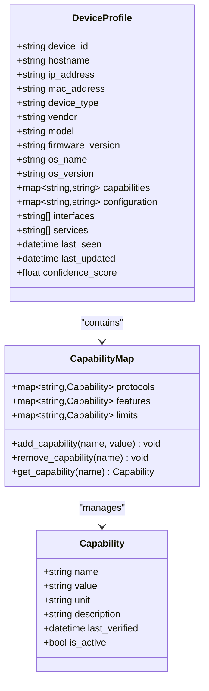

**Diagram sources**
- [device_profiling_service.py](file://icmp_discovery/device_profiling_service.py)

### Profile Lifecycle Management

#### Profile Creation and Updates
The system manages device profiles throughout their lifecycle:

1. **Initial Discovery**: Create baseline profile from first detection
2. **Incremental Updates**: Update profile with new information
3. **Periodic Refresh**: Schedule regular profile validation
4. **Change Detection**: Track configuration and capability changes
5. **Profile Archival**: Maintain historical profile versions

#### Profile Synchronization
Profiles are synchronized across system components:

- **Real-time Updates**: Immediate propagation of profile changes
- **Conflict Resolution**: Handle conflicting information from multiple sources
- **Version Control**: Maintain profile history and rollback capability
- **Backup and Recovery**: Preserve profile data during system changes

### Advanced Profiling Features

#### Behavioral Profiling
Beyond static characteristics, the system captures dynamic device behavior:

- **Usage Patterns**: Network usage trends and peak times
- **Performance Metrics**: Response times, throughput, and error rates
- **Reliability Indicators**: Uptime statistics and failure patterns
- **Security Posture**: Vulnerability assessment and compliance status

#### Predictive Analytics
The profiling system supports predictive capabilities:

- **Capacity Planning**: Forecast resource utilization and scaling needs
- **Failure Prediction**: Identify potential device failures before they occur
- **Trend Analysis**: Detect gradual changes in device behavior
- **Anomaly Detection**: Identify unusual device behavior patterns

**Section sources**
- [device_profiling_service.py](file://icmp_discovery/device_profiling_service.py)
- [device_profiler.py](file://icmp_discovery/discovery_modules/device_profiler.py)

## Troubleshooting Guide

This section provides comprehensive troubleshooting guidance for common Auto Detector issues and their resolutions.

### Common Detection Issues

#### False Positives and Negatives

**Symptoms:**
- Incorrect device classification
- Missing device detections
- Inconsistent detection results

**Diagnostic Steps:**
1. **Review Signature Database**: Verify signature accuracy and completeness
2. **Analyze Network Data**: Examine raw network responses for anomalies
3. **Check Configuration**: Validate detection thresholds and parameters
4. **Monitor Performance**: Ensure adequate resources for processing

**Resolution Strategies:**
- Update or refine device signatures
- Adjust detection thresholds and confidence levels
- Add custom rules for edge cases
- Implement manual override mechanisms

#### Performance Issues

**Symptoms:**
- Slow detection response times
- High CPU or memory usage
- Network bandwidth saturation

**Optimization Approaches:**
- Implement intelligent scanning strategies
- Optimize signature matching algorithms
- Enable parallel processing where possible
- Configure appropriate timeout values

#### Integration Problems

**Symptoms:**
- Failed OS detection calls
- Profile synchronization errors
- API connectivity issues

**Troubleshooting Steps:**
1. **Verify Dependencies**: Check required libraries and services
2. **Test Connectivity**: Validate network connections and ports
3. **Review Logs**: Analyze error logs for specific failure points
4. **Check Permissions**: Ensure proper access rights and credentials

### Debugging Tools and Techniques

#### Logging and Monitoring
The system provides comprehensive logging capabilities:

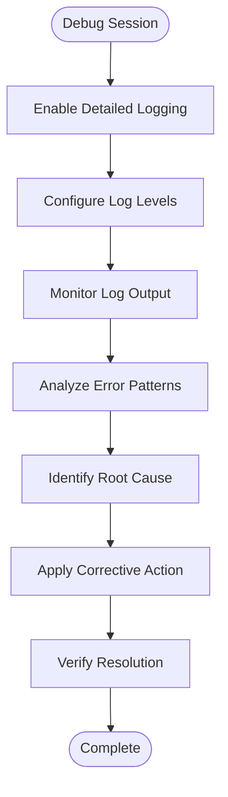

**Diagram sources**
- [logger.py](file://icmp_discovery/logger.py)

#### Network Analysis Tools
- **Packet Capture**: Use Wireshark or tcpdump for deep packet inspection
- **Protocol Analysis**: Examine protocol-specific interactions
- **Timing Analysis**: Measure response times and latency
- **Bandwidth Monitoring**: Track network utilization patterns

#### Configuration Validation
- **Schema Validation**: Verify configuration file syntax and structure
- **Dependency Checking**: Ensure all required components are available
- **Permission Verification**: Confirm proper file and network permissions
- **Resource Availability**: Check system resources and limits

### Recovery Procedures

#### Emergency Recovery
For critical system failures:

1. **Stop Detection Services**: Halt ongoing scans to prevent further issues
2. **Preserve State**: Backup current system state and logs
3. **Rollback Changes**: Revert recent configuration or code changes
4. **Restart Services**: Gracefully restart affected components
5. **Verify Recovery**: Test core functionality before resuming normal operations

#### Data Recovery
For data corruption or loss:

1. **Restore from Backup**: Recover device profiles and signatures
2. **Rebuild Indexes**: Reconstruct internal data structures
3. **Validate Integrity**: Verify restored data consistency
4. **Sync with Sources**: Reconcile with external data sources

**Section sources**
- [logger.py](file://icmp_discovery/logger.py)
- [config.py](file://icmp_discovery/config.py)

## Performance Considerations

The Auto Detector system is designed for high-performance operation in large network environments with minimal impact on network resources.

### Scalability Architecture

#### Horizontal Scaling
The system supports horizontal scaling through distributed processing:

- **Worker Pool Architecture**: Parallel processing of network scans
- **Load Balancing**: Even distribution of detection tasks
- **Stateless Processing**: Enable easy replication and scaling
- **Message Queuing**: Asynchronous task processing and result aggregation

#### Resource Optimization
Efficient resource utilization strategies:

- **Memory Management**: Optimized data structures and garbage collection
- **CPU Affinity**: Bind processing threads to specific CPU cores
- **I/O Optimization**: Buffered I/O operations and connection pooling
- **Network Efficiency**: Batch requests and connection reuse

### Performance Tuning Guidelines

#### Configuration Parameters
Key parameters affecting performance:

- **Scan Concurrency**: Number of simultaneous network probes
- **Timeout Values**: Appropriate timeouts for different protocols
- **Cache Settings**: Memory and disk cache configuration
- **Thread Pool Sizes**: Worker thread allocation for processing

#### Monitoring and Metrics
Comprehensive performance monitoring:

- **Detection Latency**: Time from request to completion
- **Throughput**: Number of devices processed per second
- **Resource Utilization**: CPU, memory, and network usage
- **Error Rates**: Failure and retry statistics

### Capacity Planning

#### Resource Requirements
Estimated resource needs based on network size:

| Network Size | Devices | CPU Cores | RAM | Network Bandwidth |
|--------------|---------|-----------|-----|-------------------|
| Small (<100) | 50-100 | 2-4 | 4-8 GB | 100 Mbps |
| Medium (100-1000) | 500-1000 | 4-8 | 8-16 GB | 1 Gbps |
| Large (1000+) | 1000+ | 8-16 | 16-32 GB | 10 Gbps |

#### Scaling Considerations
Factors affecting scalability:

- **Network Topology**: Flat vs hierarchical network design
- **Device Diversity**: Variety of device types and vendors
- **Update Frequency**: How often device information changes
- **Concurrent Users**: Number of simultaneous users accessing data

**Section sources**
- [auto_detector.py](file://icmp_discovery/auto_detector.py)
- [config.py](file://icmp_discovery/config.py)

## Conclusion

The Auto Detector system represents a comprehensive solution for automated network device identification and profiling. Through its sophisticated combination of signature matching, heuristic analysis, and confidence scoring, it provides accurate device classification across diverse network environments.

### Key Achievements

#### Technical Excellence
- **Multi-Algorithm Approach**: Combines signature matching with heuristic reasoning
- **Adaptive Learning**: Improves accuracy through feedback and historical data
- **Scalable Architecture**: Supports large networks with distributed processing
- **Extensible Design**: Facilitates custom rules and signature development

#### Operational Benefits
- **Reduced Manual Effort**: Automates device identification and profiling
- **Improved Accuracy**: Minimizes human error through systematic analysis
- **Enhanced Visibility**: Provides comprehensive network inventory
- **Proactive Management**: Enables predictive maintenance and capacity planning

### Future Enhancements

#### Machine Learning Integration
- **Pattern Recognition**: Advanced ML algorithms for improved detection accuracy
- **Anomaly Detection**: Automated identification of unusual device behavior
- **Predictive Analytics**: Forecast device lifecycle and replacement needs
- **Natural Language Processing**: Simplified signature creation through text analysis

#### Cloud and Edge Computing
- **Hybrid Deployment**: Support for cloud-based and edge computing environments
- **Containerization**: Docker and Kubernetes deployment options
- **API-First Design**: Comprehensive RESTful APIs for integration
- **Microservices Architecture**: Modular components for independent scaling

### Best Practices Summary

#### Implementation Recommendations
- **Start Small**: Begin with core device types and expand gradually
- **Monitor Performance**: Continuously track system performance and adjust parameters
- **Maintain Signatures**: Regularly update device signatures and detection rules
- **Train Staff**: Ensure proper training for administrators and operators

#### Maintenance Procedures
- **Regular Updates**: Keep signatures and detection algorithms current
- **Performance Reviews**: Periodic assessment of system effectiveness
- **Security Audits**: Regular security reviews and vulnerability assessments
- **Backup Strategies**: Comprehensive backup and recovery procedures

The Auto Detector system provides a solid foundation for modern network management, enabling organizations to maintain accurate, up-to-date knowledge of their network infrastructure while reducing operational overhead and improving overall network visibility and control.