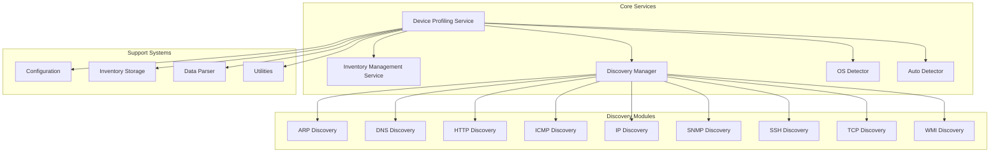
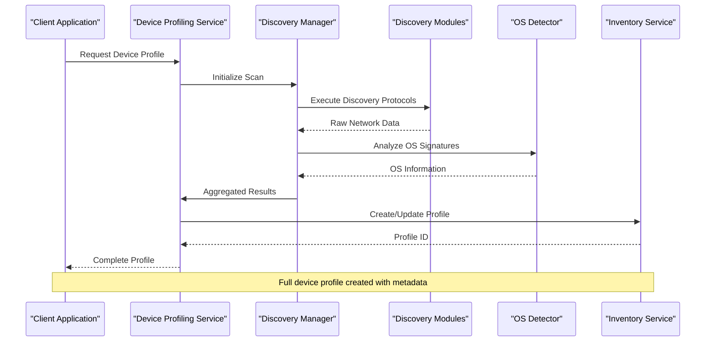
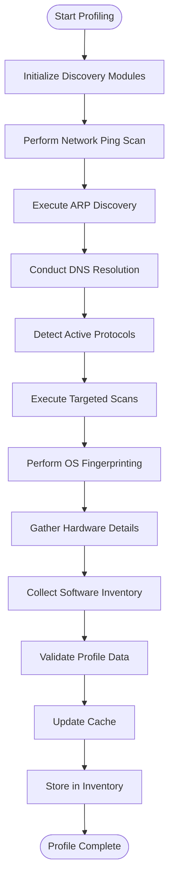
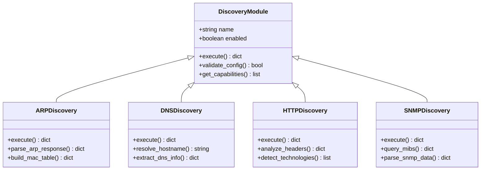
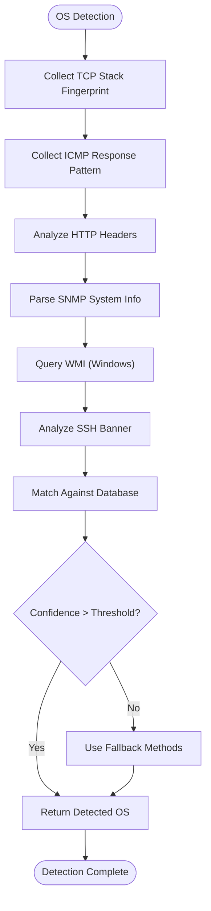
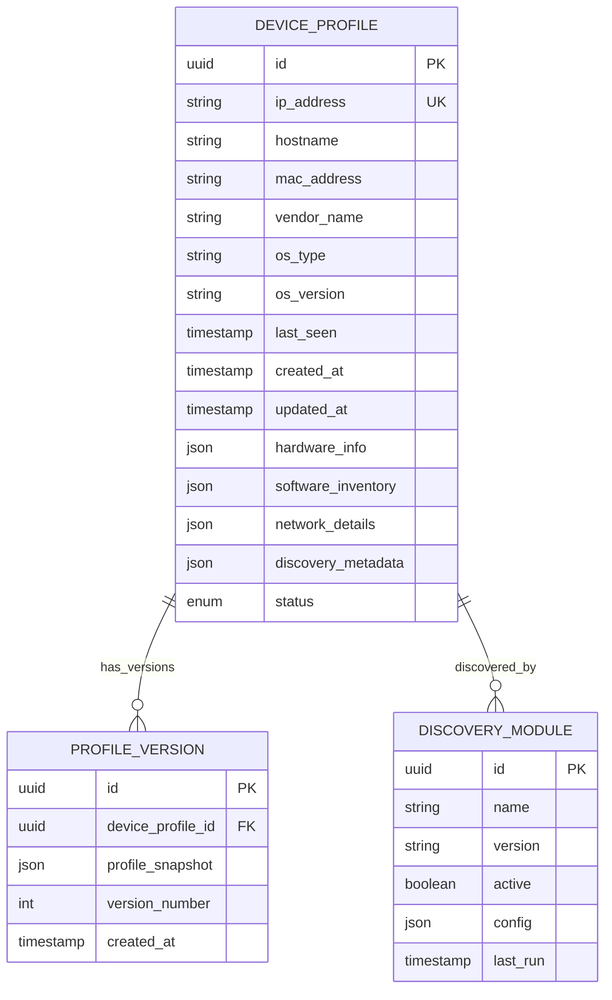
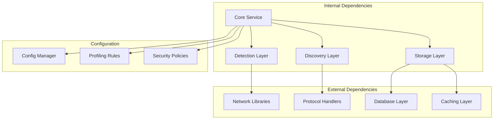

# Device Profiling Service

<cite>
**Referenced Files in This Document**
- [device_profiling_service.py](file://icmp_discovery/device_profiling_service.py)
- [device_profiler.py](file://icmp_discovery/discovery_modules/device_profiler.py)
- [os_detector.py](file://icmp_discovery/os_detector.py)
- [auto_detector.py](file://icmp_discovery/auto_detector.py)
- [inventory_service.py](file://icmp_discovery/inventory_service.py)
- [discovery_manager.py](file://icmp_discovery/discovery_manager.py)
- [arp_discovery.py](file://icmp_discovery/discovery_modules/arp_discovery.py)
- [dns_discovery.py](file://icmp_discovery/discovery_modules/dns_discovery.py)
- [http_discovery.py](file://icmp_discovery/discovery_modules/http_discovery.py)
- [icmp_discovery.py](file://icmp_discovery/discovery_modules/icmp_discovery.py)
- [ip_discovery.py](file://icmp_discovery/discovery_modules/ip_discovery.py)
- [snmp_discovery.py](file://icmp_discovery/discovery_modules/snmp_discovery.py)
- [ssh_discovery.py](file://icmp_discovery/discovery_modules/ssh_discovery.py)
- [tcp_discovery.py](file://icmp_discovery/discovery_modules/tcp_discovery.py)
- [wmi_discovery.py](file://icmp_discovery/discovery_modules/wmi_discovery.py)
- [config.py](file://icmp_discovery/config.py)
- [inventory.py](file://icmp_discovery/inventory.py)
- [parser.py](file://icmp_discovery/parser.py)
- [utils.py](file://icmp_discovery/utils.py)
</cite>

## Table of Contents
1. [Introduction](#introduction)
2. [Project Structure](#project-structure)
3. [Core Components](#core-components)
4. [Architecture Overview](#architecture-overview)
5. [Detailed Component Analysis](#detailed-component-analysis)
6. [Dependency Analysis](#dependency-analysis)
7. [Performance Considerations](#performance-considerations)
8. [Troubleshooting Guide](#troubleshooting-guide)
9. [Conclusion](#conclusion)
9. [Appendices](#appendices)

## Introduction

The Device Profiling Service is a comprehensive network discovery and profiling system designed to automatically gather detailed information about devices connected to a network. The service employs multiple discovery protocols and detection mechanisms to create complete device profiles, including operating system identification, hardware specifications, software inventory, and network connectivity details.

This system serves as a critical component for network management, security monitoring, and infrastructure planning by providing real-time visibility into network assets and their characteristics.

## Project Structure

The Device Profiling Service follows a modular architecture with clear separation of concerns:



**Diagram sources**
- [device_profiling_service.py](file://icmp_discovery/device_profiling_service.py)
- [discovery_manager.py](file://icmp_discovery/discovery_manager.py)
- [inventory_service.py](file://icmp_discovery/inventory_service.py)

**Section sources**
- [device_profiling_service.py](file://icmp_discovery/device_profiling_service.py)
- [discovery_manager.py](file://icmp_discovery/discovery_manager.py)

## Core Components

### Device Profiling Service
The central orchestrator that coordinates all profiling activities, manages the lifecycle of device profiles, and ensures data consistency across the system.

### Discovery Manager
Responsible for managing multiple discovery modules, handling concurrent scans, and aggregating results from various network protocols.

### OS Detection Engine
Specialized component for identifying operating systems through fingerprinting techniques, protocol analysis, and signature matching.

### Auto-Detection System
Intelligent system that determines the most appropriate discovery methods based on device characteristics and network conditions.

### Inventory Management Service
Handles persistence, caching, and retrieval of device profiles with support for versioning and change tracking.

**Section sources**
- [device_profiling_service.py](file://icmp_discovery/device_profiling_service.py)
- [discovery_manager.py](file://icmp_discovery/discovery_manager.py)
- [os_detector.py](file://icmp_discovery/os_detector.py)
- [auto_detector.py](file://icmp_discovery/auto_detector.py)
- [inventory_service.py](file://icmp_discovery/inventory_service.py)

## Architecture Overview

The Device Profiling Service implements a layered architecture with clear separation between data collection, processing, and storage layers:



**Diagram sources**
- [device_profiling_service.py](file://icmp_discovery/device_profiling_service.py)
- [discovery_manager.py](file://icmp_discovery/discovery_manager.py)
- [inventory_service.py](file://icmp_discovery/inventory_service.py)

## Detailed Component Analysis

### Device Profiling Workflow

The profiling workflow follows a systematic approach to ensure comprehensive data collection:



**Diagram sources**
- [device_profiling_service.py](file://icmp_discovery/device_profiling_service.py)
- [discovery_manager.py](file://icmp_discovery/discovery_manager.py)

### Discovery Module Integration

Each discovery module implements a standardized interface for seamless integration:



**Diagram sources**
- [arp_discovery.py](file://icmp_discovery/discovery_modules/arp_discovery.py)
- [dns_discovery.py](file://icmp_discovery/discovery_modules/dns_discovery.py)
- [http_discovery.py](file://icmp_discovery/discovery_modules/http_discovery.py)
- [snmp_discovery.py](file://icmp_discovery/discovery_modules/snmp_discovery.py)

### OS Detection Strategy

The OS detection system employs multiple fingerprinting techniques:



**Diagram sources**
- [os_detector.py](file://icmp_discovery/os_detector.py)
- [auto_detector.py](file://icmp_discovery/auto_detector.py)

### Profile Structure and Schema

Device profiles follow a comprehensive schema that captures all relevant device attributes:



**Diagram sources**
- [inventory.py](file://icmp_discovery/inventory.py)
- [device_profiler.py](file://icmp_discovery/discovery_modules/device_profiler.py)

**Section sources**
- [device_profiling_service.py](file://icmp_discovery/device_profiling_service.py)
- [device_profiler.py](file://icmp_discovery/discovery_modules/device_profiler.py)
- [os_detector.py](file://icmp_discovery/os_detector.py)
- [inventory.py](file://icmp_discovery/inventory.py)

## Dependency Analysis

The Device Profiling Service maintains well-defined dependencies between components:



**Diagram sources**
- [config.py](file://icmp_discovery/config.py)
- [device_profiling_service.py](file://icmp_discovery/device_profiling_service.py)

**Section sources**
- [config.py](file://icmp_discovery/config.py)
- [device_profiling_service.py](file://icmp_discovery/device_profiling_service.py)

## Performance Considerations

### Large Network Scanning Optimization

For efficient scanning of large networks, the service implements several optimization strategies:

- **Parallel Processing**: Concurrent execution of discovery modules with configurable thread pools
- **Incremental Scanning**: Only re-profiling devices that have changed since last scan
- **Intelligent Caching**: Multi-level caching strategy with TTL-based expiration
- **Resource Throttling**: Configurable rate limiting to prevent network congestion
- **Memory Management**: Streaming processing for large datasets with garbage collection triggers

### Caching Mechanisms

The service employs a multi-tier caching approach:

1. **L1 Cache**: In-memory cache for frequently accessed device profiles
2. **L2 Cache**: Distributed cache layer for cross-instance sharing
3. **L3 Cache**: Persistent cache with database-backed storage
4. **TTL Management**: Configurable time-to-live policies per data type

### Profile Update Strategies

- **Delta Updates**: Only update changed fields to minimize database writes
- **Version Control**: Maintain historical versions of device profiles
- **Conflict Resolution**: Automatic resolution of concurrent updates
- **Batch Operations**: Group multiple updates for improved performance

**Section sources**
- [device_profiling_service.py](file://icmp_discovery/device_profiling_service.py)
- [inventory_service.py](file://icmp_discovery/inventory_service.py)

## Troubleshooting Guide

### Common Issues and Solutions

#### Discovery Module Failures
- **Symptoms**: Missing device information or incomplete profiles
- **Causes**: Network connectivity issues, protocol timeouts, permission problems
- **Solutions**: Check module configuration, verify network access, review error logs

#### OS Detection Accuracy
- **Symptoms**: Incorrect OS identification or low confidence scores
- **Causes**: Custom OS configurations, firewalls blocking probes, outdated signatures
- **Solutions**: Update fingerprint database, adjust detection thresholds, add custom rules

#### Performance Degradation
- **Symptoms**: Slow profiling times, high memory usage, network saturation
- **Causes**: Large network segments, insufficient resources, inefficient queries
- **Solutions**: Optimize scan parameters, increase resources, implement pagination

#### Data Consistency Issues
- **Symptoms**: Duplicate profiles, missing updates, conflicting information
- **Causes**: Race conditions, network partitions, manual interventions
- **Solutions**: Enable conflict resolution, implement reconciliation jobs, audit changes

### Debugging Tools and Techniques

- **Logging Levels**: Configure appropriate log levels for different environments
- **Metrics Collection**: Monitor key performance indicators and error rates
- **Health Checks**: Implement endpoint health monitoring for all components
- **Trace Propagation**: Track requests across service boundaries for debugging

**Section sources**
- [device_profiling_service.py](file://icmp_discovery/device_profiling_service.py)
- [inventory_service.py](file://icmp_discovery/inventory_service.py)

## Conclusion

The Device Profiling Service provides a robust, scalable solution for comprehensive device discovery and profiling in enterprise networks. Its modular architecture, intelligent detection capabilities, and optimized performance characteristics make it suitable for networks of varying sizes and complexity.

Key strengths include:
- Comprehensive multi-protocol discovery support
- Intelligent OS and application detection
- Scalable architecture with parallel processing
- Robust caching and persistence mechanisms
- Extensible plugin architecture for custom discovery methods

The service successfully addresses the challenges of modern network management by providing accurate, timely, and detailed device information that supports security, compliance, and operational requirements.

## Appendices

### Configuration Examples

#### Basic Configuration
```json
{
  "profiling": {
    "scan_interval": 3600,
    "max_concurrent_scans": 10,
    "timeout_per_device": 30,
    "retry_attempts": 3
  },
  "discovery": {
    "modules": ["arp", "dns", "http", "snmp"],
    "parallel_execution": true,
    "rate_limiting": true
  },
  "caching": {
    "enabled": true,
    "ttl_seconds": 300,
    "max_entries": 10000
  }
}
```

#### Custom Profiling Rules
```json
{
  "rules": [
    {
      "name": "server_detection",
      "conditions": {
        "ports": [80, 443, 8080],
        "protocols": ["http", "https"]
      },
      "actions": {
        "set_category": "web_server",
        "priority": "high"
      }
    }
  ]
}
```

### API Reference

#### Profile Creation Endpoint
- **Method**: POST
- **Path**: `/api/v1/profiles`
- **Request Body**: Device discovery parameters
- **Response**: Created profile with metadata
- **Status Codes**: 201 (Created), 400 (Bad Request), 500 (Server Error)

#### Profile Retrieval Endpoint
- **Method**: GET
- **Path**: `/api/v1/profiles/{device_id}`
- **Parameters**: Include history, validation status
- **Response**: Complete device profile
- **Status Codes**: 200 (OK), 404 (Not Found), 500 (Server Error)

**Section sources**
- [config.py](file://icmp_discovery/config.py)
- [device_profiling_service.py](file://icmp_discovery/device_profiling_service.py)