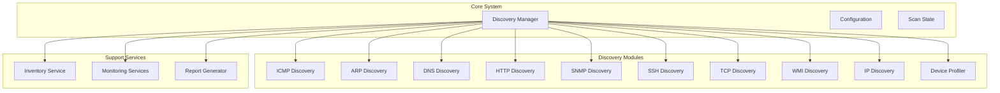
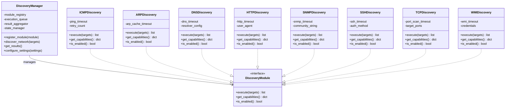
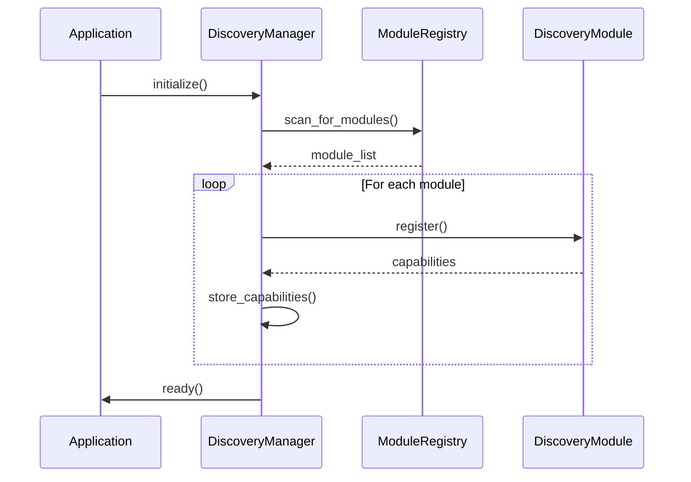
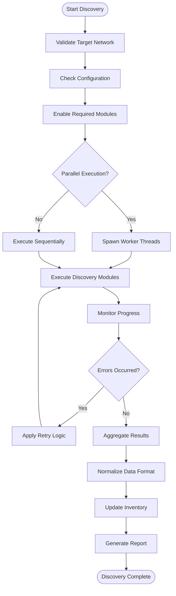
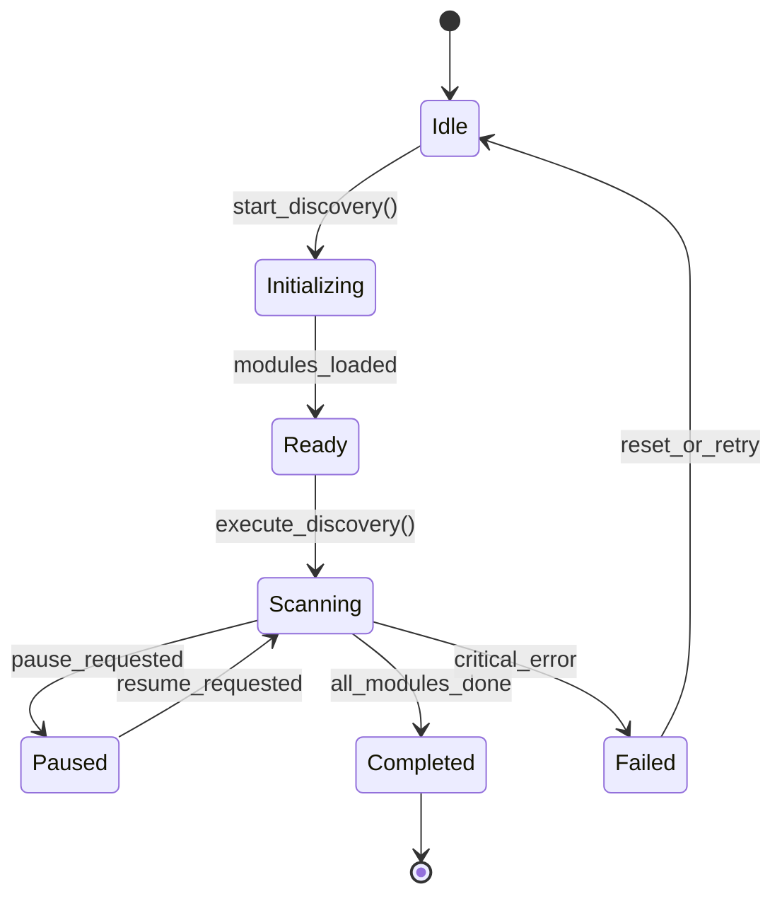
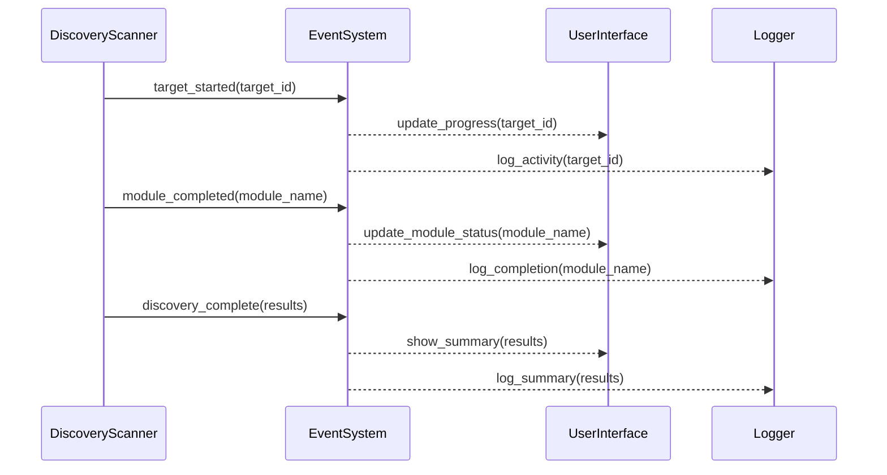

# Discovery Manager

<cite>
**Referenced Files in This Document**
- [discovery_manager.py](file://icmp_discovery/discovery_manager.py)
- [config.py](file://icmp_discovery/config.py)
- [scan_state.py](file://icmp_discovery/scan_state.py)
- [arp_discovery.py](file://icmp_discovery/discovery_modules/arp_discovery.py)
- [dns_discovery.py](file://icmp_discovery/discovery_modules/dns_discovery.py)
- [http_discovery.py](file://icmp_discovery/discovery_modules/http_discovery.py)
- [icmp_discovery.py](file://icmp_discovery/discovery_modules/icmp_discovery.py)
- [ip_discovery.py](file://icmp_discovery/discovery_modules/ip_discovery.py)
- [snmp_discovery.py](file://icmp_discovery/discovery_modules/snmp_discovery.py)
- [ssh_discovery.py](file://icmp_discovery/discovery_modules/ssh_discovery.py)
- [tcp_discovery.py](file://icmp_discovery/discovery_modules/tcp_discovery.py)
- [wmi_discovery.py](file://icmp_discovery/discovery_modules/wmi_discovery.py)
- [device_profiler.py](file://icmp_discovery/discovery_modules/device_profiler.py)
- [main.py](file://icmp_discovery/main.py)
- [app.py](file://icmp_discovery/app.py)
</cite>

## Table of Contents
1. [Introduction](#introduction)
2. [Project Structure](#project-structure)
3. [Core Components](#core-components)
4. [Architecture Overview](#architecture-overview)
5. [Detailed Component Analysis](#detailed-component-analysis)
6. [Discovery Module Registration System](#discovery-module-registration-system)
7. [Discovery Workflow Orchestration](#discovery-workflow-orchestration)
8. [Result Aggregation Mechanisms](#result-aggregation-mechanisms)
9. [Configuration Options](#configuration-options)
10. [Parallel Execution Parameters](#parallel-execution-parameters)
11. [Custom Discovery Module Integration](#custom-discovery-module-integration)
12. [Error Handling Strategies](#error-handling-strategies)
13. [Discovery State Management](#discovery-state-management)
14. [Progress Tracking Capabilities](#progress-tracking-capabilities)
15. [Performance Considerations](#performance-considerations)
16. [Troubleshooting Guide](#troubleshooting-guide)
17. [Conclusion](#conclusion)

## Introduction

The Discovery Manager is a central orchestration component responsible for coordinating multiple network discovery protocols to identify and profile devices across network infrastructure. It serves as the core engine that manages ICMP, ARP, DNS, HTTP, SNMP, SSH, TCP, and WMI discovery modules, providing a unified interface for comprehensive network device discovery and profiling.

The system implements a modular architecture where each discovery protocol operates as an independent module while being coordinated by the central Discovery Manager. This design enables flexible configuration, parallel execution, and robust error handling across all discovery methods.

## Project Structure

The Discovery Manager is part of a larger network management system organized into distinct functional areas:



**Diagram sources**
- [discovery_manager.py](file://icmp_discovery/discovery_manager.py)
- [config.py](file://icmp_discovery/config.py)
- [scan_state.py](file://icmp_discovery/scan_state.py)

**Section sources**
- [main.py](file://icmp_discovery/main.py)
- [app.py](file://icmp_discovery/app.py)

## Core Components

The Discovery Manager system consists of several key components working together to provide comprehensive network discovery capabilities:

### Discovery Manager Core
The central orchestrator that coordinates all discovery activities, manages module registration, handles workflow execution, and aggregates results from multiple discovery protocols.

### Configuration Management
Handles system-wide settings including timeout configurations, parallel execution parameters, and module enable/disable flags.

### State Management
Tracks the current state of discovery operations, progress indicators, and operational status across all discovery modules.

### Module Registry
Maintains the registry of available discovery modules and their capabilities.

**Section sources**
- [discovery_manager.py](file://icmp_discovery/discovery_manager.py)
- [config.py](file://icmp_discovery/config.py)
- [scan_state.py](file://icmp_discovery/scan_state.py)

## Architecture Overview

The Discovery Manager implements a modular, event-driven architecture that enables flexible coordination of multiple discovery protocols:



**Diagram sources**
- [discovery_manager.py](file://icmp_discovery/discovery_manager.py)
- [icmp_discovery.py](file://icmp_discovery/discovery_modules/icmp_discovery.py)
- [arp_discovery.py](file://icmp_discovery/discovery_modules/arp_discovery.py)
- [dns_discovery.py](file://icmp_discovery/discovery_modules/dns_discovery.py)
- [http_discovery.py](file://icmp_discovery/discovery_modules/http_discovery.py)
- [snmp_discovery.py](file://icmp_discovery/discovery_modules/snmp_discovery.py)
- [ssh_discovery.py](file://icmp_discovery/discovery_modules/ssh_discovery.py)
- [tcp_discovery.py](file://icmp_discovery/discovery_modules/tcp_discovery.py)
- [wmi_discovery.py](file://icmp_discovery/discovery_modules/wmi_discovery.py)

## Detailed Component Analysis

### Discovery Manager Implementation

The Discovery Manager serves as the central orchestrator for all discovery activities. It maintains a registry of discovery modules, manages their execution lifecycle, and aggregates results from multiple protocols.

Key responsibilities include:
- Module registration and lifecycle management
- Discovery workflow orchestration
- Result aggregation and normalization
- Error handling and recovery mechanisms
- Progress tracking and state management

### Module Registration System

The module registration system provides a standardized interface for discovering and registering new discovery protocols. Each module must implement a common interface that defines its capabilities and execution behavior.



**Diagram sources**
- [discovery_manager.py](file://icmp_discovery/discovery_manager.py)
- [discovery_modules/__init__.py](file://icmp_discovery/discovery_modules/__init__.py)

### Discovery Workflow Orchestration

The discovery workflow follows a structured process that ensures reliable and efficient network scanning:



**Diagram sources**
- [discovery_manager.py](file://icmp_discovery/discovery_manager.py)
- [scan_state.py](file://icmp_discovery/scan_state.py)

### Result Aggregation Mechanisms

The result aggregation system consolidates findings from multiple discovery protocols into a unified format. It handles data normalization, conflict resolution, and deduplication of discovered devices.

Key features include:
- Multi-source data fusion
- Confidence scoring for discovered attributes
- Conflict resolution strategies
- Historical comparison and change detection

**Section sources**
- [discovery_manager.py](file://icmp_discovery/discovery_manager.py)
- [inventory_service.py](file://icmp_discovery/inventory_service.py)

## Discovery Module Registration System

The module registration system provides a flexible framework for adding and managing discovery protocols. Each discovery module implements a standard interface that allows the Discovery Manager to uniformly interact with different protocols.

### Module Interface Requirements

All discovery modules must implement the following interface:

| Method | Description | Return Type |
|--------|-------------|-------------|
| `execute(targets)` | Execute discovery against target network | List[Device] |
| `get_capabilities()` | Return module capabilities and supported features | Dict |
| `is_enabled()` | Check if module is enabled in configuration | Boolean |
| `configure(settings)` | Apply configuration settings | None |

### Built-in Discovery Modules

The system includes several built-in discovery modules:

#### ICMP Discovery Module
Implements ping-based host discovery using ICMP echo requests. Supports configurable timeouts, retry counts, and broadcast vs unicast scanning modes.

#### ARP Discovery Module  
Performs local network discovery using ARP requests. Effective for Layer 2 device discovery within the same subnet.

#### DNS Discovery Module
Utilizes DNS queries to discover network devices through reverse DNS lookups and service discovery.

#### HTTP Discovery Module
Scans for web servers and HTTP services, extracting device information from HTTP headers and response content.

#### SNMP Discovery Module
Uses SNMP protocols to query network devices for detailed system information and inventory data.

#### SSH Discovery Module
Connects to SSH-enabled devices to gather system information and perform remote discovery tasks.

#### TCP Discovery Module
Performs port scanning and service detection using TCP connection attempts to common ports.

#### WMI Discovery Module
Leverages Windows Management Instrumentation for comprehensive Windows device discovery and profiling.

**Section sources**
- [icmp_discovery.py](file://icmp_discovery/discovery_modules/icmp_discovery.py)
- [arp_discovery.py](file://icmp_discovery/discovery_modules/arp_discovery.py)
- [dns_discovery.py](file://icmp_discovery/discovery_modules/dns_discovery.py)
- [http_discovery.py](file://icmp_discovery/discovery_modules/http_discovery.py)
- [snmp_discovery.py](file://icmp_discovery/discovery_modules/snmp_discovery.py)
- [ssh_discovery.py](file://icmp_discovery/discovery_modules/ssh_discovery.py)
- [tcp_discovery.py](file://icmp_discovery/discovery_modules/tcp_discovery.py)
- [wmi_discovery.py](file://icmp_discovery/discovery_modules/wmi_discovery.py)

## Discovery Workflow Orchestration

The discovery workflow orchestration system manages the execution of multiple discovery protocols in a coordinated manner. It handles task scheduling, resource allocation, and inter-module communication.

### Execution Pipeline

The orchestration follows a multi-stage pipeline:

1. **Preparation Phase**: Validates targets, loads configuration, and initializes modules
2. **Execution Phase**: Runs discovery modules with appropriate concurrency controls
3. **Aggregation Phase**: Consolidates results and resolves conflicts
4. **Post-processing Phase**: Updates inventory and generates reports

### Concurrency Control

The system supports both sequential and parallel execution modes:

- **Sequential Mode**: Executes modules one after another for deterministic results
- **Parallel Mode**: Runs multiple modules concurrently for improved performance
- **Hybrid Mode**: Groups related modules for optimal resource utilization

**Section sources**
- [discovery_manager.py](file://icmp_discovery/discovery_manager.py)
- [scheduler.py](file://icmp_discovery/scheduler.py)

## Result Aggregation Mechanisms

The result aggregation system processes outputs from multiple discovery protocols to create a unified device inventory. It handles data normalization, conflict resolution, and quality assessment.

### Data Normalization

Each discovery module returns data in its native format. The aggregation system normalizes this data into a common schema:

| Field | Source Modules | Normalization Strategy |
|-------|----------------|----------------------|
| IP Address | All modules | Standardized IPv4/IPv6 format |
| Hostname | DNS, HTTP, SNMP | Fallback chain with validation |
| MAC Address | ARP, SNMP | Format standardization |
| Device Type | HTTP, SNMP, WMI | Classification mapping |
| Operating System | SNMP, WMI, SSH | OS fingerprinting |
| Services | HTTP, TCP, SSH | Service enumeration |

### Conflict Resolution

When multiple modules report conflicting information, the system applies resolution strategies:

- **Priority-based**: Higher-priority modules override lower ones
- **Confidence-based**: Most confident results are selected
- **Temporal-based**: Most recent data takes precedence
- **Consensus-based**: Multiple sources required for critical fields

**Section sources**
- [discovery_manager.py](file://icmp_discovery/discovery_manager.py)
- [inventory_service.py](file://icmp_discovery/inventory_service.py)

## Configuration Options

The Discovery Manager supports extensive configuration options to customize discovery behavior and module activation.

### Global Settings

| Setting | Type | Default | Description |
|---------|------|---------|-------------|
| `max_concurrent_scans` | Integer | 5 | Maximum number of parallel discovery operations |
| `scan_timeout` | Integer | 300 | Overall scan timeout in seconds |
| `retry_attempts` | Integer | 3 | Number of retry attempts for failed operations |
| `log_level` | String | INFO | Logging verbosity level |
| `output_format` | String | JSON | Default output format for results |

### Module-Specific Configuration

Each discovery module has specific configuration options:

#### ICMP Configuration
- `timeout`: Ping timeout in milliseconds (default: 1000)
- `retry_count`: Number of retry attempts (default: 3)
- `broadcast_ping`: Use broadcast ping for subnet scanning (default: False)

#### SNMP Configuration
- `community_string`: SNMP community string (default: public)
- `version`: SNMP version (v2c or v3)
- `timeout`: SNMP request timeout (default: 5000ms)

#### SSH Configuration
- `username`: Default username for SSH connections
- `password`: Default password for SSH authentication
- `key_file`: Path to SSH private key file
- `timeout`: SSH connection timeout (default: 10000ms)

#### HTTP Configuration
- `user_agent`: Custom User-Agent string
- `timeout`: HTTP request timeout (default: 10000ms)
- `follow_redirects`: Follow HTTP redirects (default: True)

**Section sources**
- [config.py](file://icmp_discovery/config.py)
- [icmp_discovery.py](file://icmp_discovery/discovery_modules/icmp_discovery.py)
- [snmp_discovery.py](file://icmp_discovery/discovery_modules/snmp_discovery.py)
- [ssh_discovery.py](file://icmp_discovery/discovery_modules/ssh_discovery.py)
- [http_discovery.py](file://icmp_discovery/discovery_modules/http_discovery.py)

## Parallel Execution Parameters

The Discovery Manager supports sophisticated parallel execution strategies to optimize discovery performance while managing system resources.

### Thread Pool Configuration

| Parameter | Description | Default Value |
|-----------|-------------|---------------|
| `max_workers` | Maximum number of worker threads | CPU count × 2 |
| `queue_size` | Maximum queue size for pending tasks | 1000 |
| `worker_timeout` | Timeout for individual worker tasks | 300 seconds |
| `memory_limit` | Memory limit per worker process | 512MB |

### Execution Strategies

The system supports multiple execution strategies:

1. **Round-Robin**: Distributes tasks evenly across workers
2. **Priority-Based**: Prioritizes critical discovery tasks
3. **Resource-Aware**: Considers system load and resource availability
4. **Adaptive**: Dynamically adjusts concurrency based on performance metrics

### Load Balancing

Automatic load balancing ensures optimal resource utilization:

- Dynamic worker scaling based on workload
- Task affinity for related discovery operations
- Graceful degradation under high load conditions
- Resource cleanup and leak prevention

**Section sources**
- [discovery_manager.py](file://icmp_discovery/discovery_manager.py)
- [scheduler.py](file://icmp_discovery/scheduler.py)

## Custom Discovery Module Integration

The modular architecture allows easy integration of custom discovery modules. Here's how to create and integrate a new discovery protocol:

### Module Template Structure

```python
class CustomDiscoveryModule(DiscoveryModule):
    def __init__(self, config=None):
        super().__init__()
        self.config = config or {}
        
    def execute(self, targets):
        """Implement discovery logic here"""
        results = []
        for target in targets:
            # Discovery implementation
            device_info = self.discover_device(target)
            if device_info:
                results.append(device_info)
        return results
        
    def get_capabilities(self):
        return {
            'protocol': 'custom',
            'supported_features': ['device_detection', 'service_enumeration'],
            'network_layers': ['layer2', 'layer3']
        }
        
    def is_enabled(self):
        return self.config.get('enabled', False)
```

### Registration Process

1. Implement the `DiscoveryModule` interface
2. Add module to the package `__init__.py`
3. Configure module-specific settings
4. Register with the Discovery Manager

### Best Practices

- Implement proper error handling and logging
- Support configuration validation
- Provide meaningful capability descriptions
- Ensure thread safety for concurrent execution
- Implement graceful shutdown mechanisms

**Section sources**
- [discovery_modules/__init__.py](file://icmp_discovery/discovery_modules/__init__.py)
- [device_profiler.py](file://icmp_discovery/discovery_modules/device_profiler.py)

## Error Handling Strategies

The Discovery Manager implements comprehensive error handling strategies to ensure robust operation across diverse network environments.

### Error Categories

| Category | Examples | Handling Strategy |
|----------|----------|-------------------|
| Network Errors | Connection timeouts, unreachable hosts | Retry with exponential backoff |
| Protocol Errors | Invalid responses, malformed packets | Skip and log with details |
| Authentication Errors | Invalid credentials, permission denied | Skip module or use fallback |
| Resource Errors | Memory limits, file descriptor exhaustion | Graceful degradation |
| Configuration Errors | Invalid settings, missing dependencies | Fail fast with clear messages |

### Recovery Mechanisms

1. **Automatic Retry**: Configurable retry logic with exponential backoff
2. **Fallback Protocols**: Alternative discovery methods when primary fails
3. **Partial Results**: Continue processing despite individual failures
4. **State Preservation**: Maintain progress across restarts
5. **Health Monitoring**: Continuous system health checks

### Logging and Diagnostics

Comprehensive logging captures:
- Discovery operations and outcomes
- Error conditions and recovery actions
- Performance metrics and bottlenecks
- Configuration changes and module states

**Section sources**
- [logger.py](file://icmp_discovery/logger.py)
- [discovery_manager.py](file://icmp_discovery/discovery_manager.py)

## Discovery State Management

The state management system tracks the current state of discovery operations, enabling monitoring, debugging, and recovery capabilities.

### State Model



### State Persistence

States are persisted to enable:
- Resume functionality after interruptions
- Historical analysis of discovery patterns
- Performance monitoring and optimization
- Audit trails for compliance requirements

### Progress Tracking

Real-time progress tracking provides:
- Per-module completion percentages
- Overall discovery progress indicators
- Estimated time remaining calculations
- Bottleneck identification and reporting

**Section sources**
- [scan_state.py](file://icmp_discovery/scan_state.py)
- [discovery_manager.py](file://icmp_discovery/discovery_manager.py)

## Progress Tracking Capabilities

The progress tracking system provides comprehensive visibility into discovery operations through multiple interfaces.

### Real-time Metrics

| Metric | Description | Update Frequency |
|--------|-------------|------------------|
| Total Targets | Number of targets to scan | Initial |
| Scanned Targets | Successfully scanned targets | Per target |
| Failed Targets | Targets that failed to scan | Per target |
| Active Modules | Currently executing modules | Continuous |
| Queue Depth | Pending discovery tasks | Continuous |
| Memory Usage | Current memory consumption | Periodic |
| CPU Utilization | System CPU usage | Periodic |

### Event System

An event-driven architecture enables real-time updates:



**Diagram sources**
- [discovery_manager.py](file://icmp_discovery/discovery_manager.py)
- [scan_state.py](file://icmp_discovery/scan_state.py)

### Reporting Interfaces

Multiple interfaces provide progress information:
- REST API endpoints for programmatic access
- WebSocket connections for real-time updates
- File-based logs for offline analysis
- Database storage for historical trends

**Section sources**
- [scan_state.py](file://icmp_discovery/scan_state.py)
- [report.py](file://icmp_discovery/report.py)

## Performance Considerations

The Discovery Manager is designed for high-performance network discovery with careful attention to resource utilization and scalability.

### Optimization Strategies

1. **Connection Pooling**: Reuse network connections to reduce overhead
2. **Lazy Loading**: Load modules only when needed
3. **Memory Management**: Efficient memory usage with garbage collection tuning
4. **I/O Multiplexing**: Non-blocking I/O operations for better throughput
5. **Caching**: Cache frequently accessed data and DNS resolutions

### Scalability Features

- Horizontal scaling support for large networks
- Distributed discovery capabilities
- Adaptive concurrency based on network conditions
- Resource-aware task scheduling

### Monitoring and Tuning

Built-in monitoring provides insights into:
- Discovery performance metrics
- Resource utilization patterns
- Bottleneck identification
- Capacity planning recommendations

## Troubleshooting Guide

Common issues and their solutions when working with the Discovery Manager:

### Network Connectivity Issues

**Problem**: Discovery modules fail to connect to targets
**Solutions**:
- Verify network connectivity and firewall rules
- Check timeout configurations
- Validate routing and DNS resolution
- Test with manual network tools

### Performance Problems

**Problem**: Slow discovery performance or high resource usage
**Solutions**:
- Adjust concurrent execution parameters
- Optimize timeout settings
- Review module configurations
- Monitor system resource utilization

### Module Registration Failures

**Problem**: Custom modules not loading or registering
**Solutions**:
- Verify module interface implementation
- Check Python path and imports
- Validate configuration syntax
- Review error logs for specific issues

### Memory Leaks

**Problem**: Increasing memory usage over time
**Solutions**:
- Enable memory profiling
- Review module cleanup code
- Check for circular references
- Monitor garbage collection activity

### Configuration Issues

**Problem**: Invalid or conflicting configuration settings
**Solutions**:
- Validate configuration files
- Check for deprecated settings
- Review module compatibility matrices
- Use configuration validation tools

**Section sources**
- [logger.py](file://icmp_discovery/logger.py)
- [config.py](file://icmp_discovery/config.py)

## Conclusion

The Discovery Manager provides a comprehensive, extensible framework for network device discovery and profiling. Its modular architecture enables flexible integration of multiple discovery protocols while maintaining consistent interfaces and behaviors.

Key strengths include:
- **Extensibility**: Easy addition of custom discovery modules
- **Reliability**: Robust error handling and recovery mechanisms
- **Performance**: Optimized for large-scale network discovery
- **Flexibility**: Configurable execution strategies and parameters
- **Visibility**: Comprehensive monitoring and progress tracking

The system successfully addresses the complexity of modern network environments by providing a unified interface to multiple discovery protocols while maintaining operational simplicity and reliability. Future enhancements could include machine learning-based device classification, enhanced security scanning capabilities, and integration with cloud discovery services.