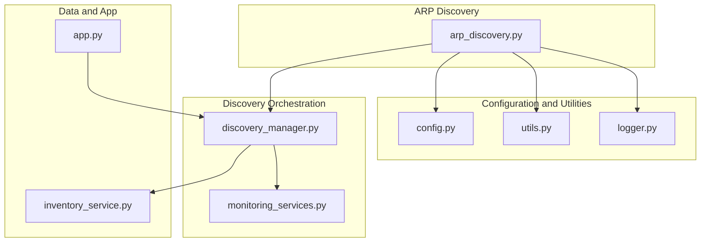
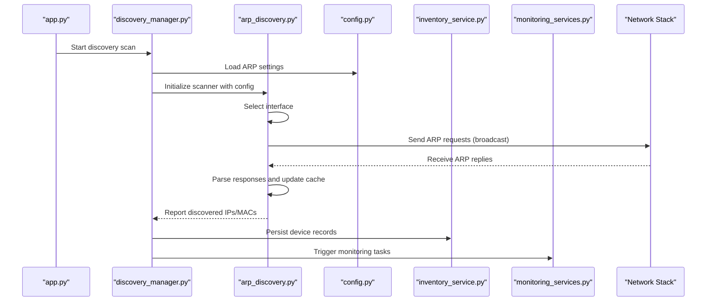
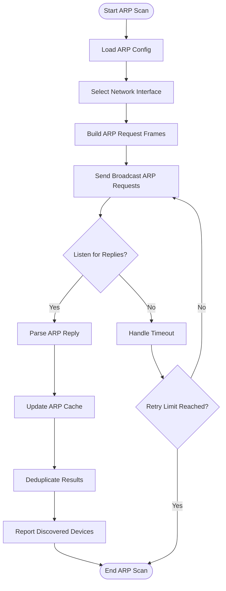
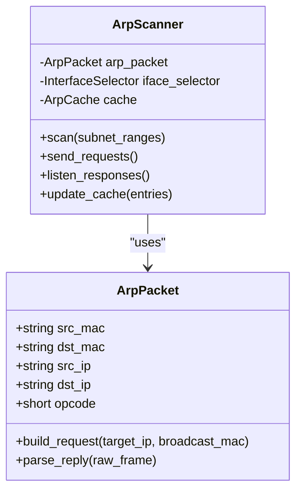
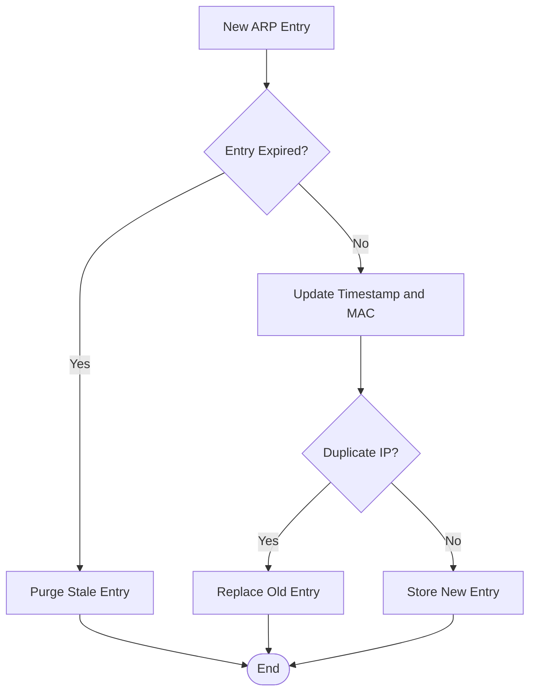
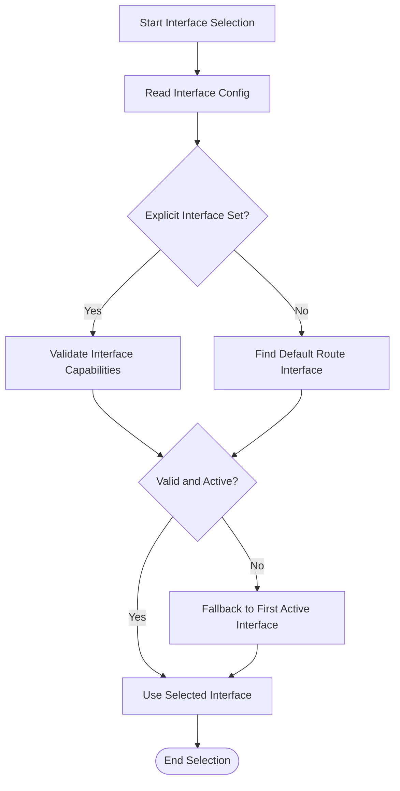
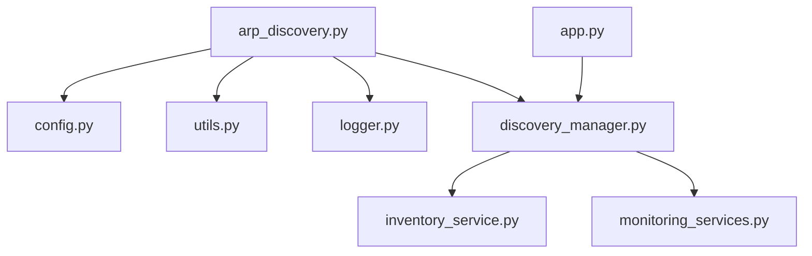

# ARP Discovery Module

<cite>
**Referenced Files in This Document**
- [arp_discovery.py](file://icmp_discovery/discovery_modules/arp_discovery.py)
- [discovery_manager.py](file://icmp_discovery/discovery_manager.py)
- [config.py](file://icmp_discovery/config.py)
- [logger.py](file://icmp_discovery/logger.py)
- [utils.py](file://icmp_discovery/utils.py)
- [inventory_service.py](file://icmp_discovery/inventory_service.py)
- [monitoring_services.py](file://icmp_discovery/monitoring_services.py)
- [app.py](file://icmp_discovery/app.py)
</cite>

## Table of Contents
1. [Introduction](#introduction)
2. [Project Structure](#project-structure)
3. [Core Components](#core-components)
4. [Architecture Overview](#architecture-overview)
5. [Detailed Component Analysis](#detailed-component-analysis)
6. [Dependency Analysis](#dependency-analysis)
7. [Performance Considerations](#performance-considerations)
8. [Troubleshooting Guide](#troubleshooting-guide)
9. [Conclusion](#conclusion)
10. [Appendices](#appendices)

## Introduction
This document explains the ARP (Address Resolution Protocol) discovery module within the network discovery system. It covers how ARP scanning operates at the network layer, MAC address resolution, and local network segment discovery. The documentation details implementation aspects such as ARP request packet construction, response parsing, cache management, and network interface selection. It also documents configuration options for broadcast domains, timeout settings, and error handling strategies. Practical examples include ARP table manipulation, using custom network adapters, and troubleshooting connectivity issues across different operating systems.

## Project Structure
The ARP discovery functionality resides under the discovery modules and integrates with the broader discovery manager, configuration, logging, utilities, inventory, monitoring, and application entry points.

**Diagram sources**
- [arp_discovery.py:1-200](file://icmp_discovery/discovery_modules/arp_discovery.py#L1-L200)
- [discovery_manager.py:1-200](file://icmp_discovery/discovery_manager.py#L1-L200)
- [config.py:1-200](file://icmp_discovery/config.py#L1-L200)
- [utils.py:1-200](file://icmp_discovery/utils.py#L1-L200)
- [logger.py:1-200](file://icmp_discovery/logger.py#L1-L200)
- [inventory_service.py:1-200](file://icmp_discovery/inventory_service.py#L1-L200)
- [monitoring_services.py:1-200](file://icmp_discovery/monitoring_services.py#L1-L200)
- [app.py:1-200](file://icmp_discovery/app.py#L1-L200)

**Section sources**
- [arp_discovery.py:1-200](file://icmp_discovery/discovery_modules/arp_discovery.py#L1-L200)
- [discovery_manager.py:1-200](file://icmp_discovery/discovery_manager.py#L1-L200)
- [config.py:1-200](file://icmp_discovery/config.py#L1-L200)
- [utils.py:1-200](file://icmp_discovery/utils.py#L1-L200)
- [logger.py:1-200](file://icmp_discovery/logger.py#L1-L200)
- [inventory_service.py:1-200](file://icmp_discovery/inventory_service.py#L1-L200)
- [monitoring_services.py:1-200](file://icmp_discovery/monitoring_services.py#L1-L200)
- [app.py:1-200](file://icmp_discovery/app.py#L1-L200)

## Core Components
- ARP Scanner: Constructs and sends ARP requests, listens for responses, resolves IP-to-MAC mappings, and updates internal caches.
- Interface Selector: Chooses the appropriate network interface based on configuration or heuristics.
- Cache Manager: Maintains a mapping of IP addresses to MAC addresses with TTL-based expiration.
- Configuration Loader: Reads broadcast domain ranges, timeouts, retries, and interface preferences.
- Logger: Records operational events, errors, and diagnostics for ARP operations.
- Integration Hooks: Interfaces with the discovery manager and inventory service to persist discovered devices and trigger monitoring.

**Section sources**
- [arp_discovery.py:1-200](file://icmp_discovery/discovery_modules/arp_discovery.py#L1-L200)
- [config.py:1-200](file://icmp_discovery/config.py#L1-L200)
- [logger.py:1-200](file://icmp_discovery/logger.py#L1-L200)
- [utils.py:1-200](file://icmp_discovery/utils.py#L1-L200)
- [inventory_service.py:1-200](file://icmp_discovery/inventory_service.py#L1-L200)
- [monitoring_services.py:1-200](file://icmp_discovery/monitoring_services.py#L1-L200)

## Architecture Overview
The ARP discovery module integrates into the discovery pipeline by receiving configuration from the central config loader, selecting an interface, constructing ARP packets, sending them via raw sockets, parsing responses, updating the ARP cache, and reporting results to the discovery manager and inventory service.

**Diagram sources**
- [app.py:1-200](file://icmp_discovery/app.py#L1-L200)
- [discovery_manager.py:1-200](file://icmp_discovery/discovery_manager.py#L1-L200)
- [arp_discovery.py:1-200](file://icmp_discovery/discovery_modules/arp_discovery.py#L1-L200)
- [config.py:1-200](file://icmp_discovery/config.py#L1-L200)
- [inventory_service.py:1-200](file://icmp_discovery/inventory_service.py#L1-L200)
- [monitoring_services.py:1-200](file://icmp_discovery/monitoring_services.py#L1-L200)

## Detailed Component Analysis

### ARP Scanner Implementation
The ARP scanner is responsible for:
- Constructing ARP request frames targeting broadcast MACs within configured subnets.
- Sending ARP requests over selected interfaces using raw sockets.
- Listening for ARP replies and extracting sender/receiver IP and MAC fields.
- Updating the ARP cache with TTL-based entries and deduplicating results.
- Handling partial responses and timeouts gracefully.

**Diagram sources**
- [arp_discovery.py:1-200](file://icmp_discovery/discovery_modules/arp_discovery.py#L1-L200)
- [config.py:1-200](file://icmp_discovery/config.py#L1-L200)
- [utils.py:1-200](file://icmp_discovery/utils.py#L1-L200)

**Section sources**
- [arp_discovery.py:1-200](file://icmp_discovery/discovery_modules/arp_discovery.py#L1-L200)
- [utils.py:1-200](file://icmp_discovery/utils.py#L1-L200)

### Packet Construction and Response Parsing
- ARP Request Construction: Builds Ethernet frames with ARP opcode set to request, target IP set to the destination, and target MAC set to broadcast.
- ARP Response Parsing: Extracts source MAC and IP from reply frames, validates checksums if applicable, and ensures consistency with expected subnet ranges.
- Error Handling: Ignores malformed packets, logs warnings, and continues processing valid responses.

**Diagram sources**
- [arp_discovery.py:1-200](file://icmp_discovery/discovery_modules/arp_discovery.py#L1-L200)

**Section sources**
- [arp_discovery.py:1-200](file://icmp_discovery/discovery_modules/arp_discovery.py#L1-L200)

### Cache Management
- ARP Cache: Stores IP-to-MAC mappings with timestamps and TTL values.
- Expiration Policy: Entries expire after configured TTL; stale entries are purged periodically.
- Deduplication: Prevents duplicate entries for the same IP and ensures only the most recent MAC is retained.
- Persistence: Optionally persists ARP cache to disk for cross-session continuity.

**Diagram sources**
- [arp_discovery.py:1-200](file://icmp_discovery/discovery_modules/arp_discovery.py#L1-L200)

**Section sources**
- [arp_discovery.py:1-200](file://icmp_discovery/discovery_modules/arp_discovery.py#L1-L200)

### Network Interface Selection
- Heuristic Selection: Chooses the interface associated with the default route or primary subnet.
- Explicit Configuration: Allows specifying a particular interface name or index.
- Validation: Ensures the selected interface supports raw socket operations and has an active link.

**Diagram sources**
- [arp_discovery.py:1-200](file://icmp_discovery/discovery_modules/arp_discovery.py#L1-L200)
- [utils.py:1-200](file://icmp_discovery/utils.py#L1-L200)

**Section sources**
- [arp_discovery.py:1-200](file://icmp_discovery/discovery_modules/arp_discovery.py#L1-L200)
- [utils.py:1-200](file://icmp_discovery/utils.py#L1-L200)

### Configuration Options
- Broadcast Domains: List of CIDR ranges to scan for ARP responses.
- Timeouts: Per-request timeout and overall scan timeout.
- Retries: Number of retries per target before marking it unreachable.
- Interface Preferences: Preferred interface name or index.
- Cache TTL: Lifetime of ARP cache entries in seconds.
- Logging Level: Verbosity of ARP operation logs.

**Section sources**
- [config.py:1-200](file://icmp_discovery/config.py#L1-L200)

### Error Handling Strategies
- Socket Errors: Catch permission denied, invalid interface, and network unreachable exceptions.
- Partial Responses: Continue scanning when some targets do not respond.
- Malformed Packets: Log and discard invalid ARP frames.
- Graceful Degradation: Reduce concurrency or switch to fallback interface when necessary.

**Section sources**
- [arp_discovery.py:1-200](file://icmp_discovery/discovery_modules/arp_discovery.py#L1-L200)
- [logger.py:1-200](file://icmp_discovery/logger.py#L1-L200)

### Integration Points
- Discovery Manager: Orchestrates ARP scans alongside other discovery methods and aggregates results.
- Inventory Service: Persists discovered devices with MAC/IP attributes and metadata.
- Monitoring Services: Triggers follow-up checks or alerts based on ARP findings.

**Section sources**
- [discovery_manager.py:1-200](file://icmp_discovery/discovery_manager.py#L1-L200)
- [inventory_service.py:1-200](file://icmp_discovery/inventory_service.py#L1-L200)
- [monitoring_services.py:1-200](file://icmp_discovery/monitoring_services.py#L1-L200)

## Dependency Analysis
The ARP discovery module depends on configuration, utilities, logging, and integrates with the discovery manager, inventory service, and monitoring services.

**Diagram sources**
- [arp_discovery.py:1-200](file://icmp_discovery/discovery_modules/arp_discovery.py#L1-L200)
- [config.py:1-200](file://icmp_discovery/config.py#L1-L200)
- [utils.py:1-200](file://icmp_discovery/utils.py#L1-L200)
- [logger.py:1-200](file://icmp_discovery/logger.py#L1-L200)
- [discovery_manager.py:1-200](file://icmp_discovery/discovery_manager.py#L1-L200)
- [inventory_service.py:1-200](file://icmp_discovery/inventory_service.py#L1-L200)
- [monitoring_services.py:1-200](file://icmp_discovery/monitoring_services.py#L1-L200)
- [app.py:1-200](file://icmp_discovery/app.py#L1-L200)

**Section sources**
- [arp_discovery.py:1-200](file://icmp_discovery/discovery_modules/arp_discovery.py#L1-L200)
- [discovery_manager.py:1-200](file://icmp_discovery/discovery_manager.py#L1-L200)
- [config.py:1-200](file://icmp_discovery/config.py#L1-L200)
- [utils.py:1-200](file://icmp_discovery/utils.py#L1-L200)
- [logger.py:1-200](file://icmp_discovery/logger.py#L1-L200)
- [inventory_service.py:1-200](file://icmp_discovery/inventory_service.py#L1-L200)
- [monitoring_services.py:1-200](file://icmp_discovery/monitoring_services.py#L1-L200)
- [app.py:1-200](file://icmp_discovery/app.py#L1-L200)

## Performance Considerations
- Concurrency Control: Limit concurrent ARP requests to avoid overwhelming the network stack.
- Batch Scanning: Group targets by subnet to reduce broadcast overhead.
- Cache Reuse: Leverage existing ARP cache entries to minimize redundant requests.
- Adaptive Timeouts: Adjust timeouts based on observed latency and network conditions.
- Resource Cleanup: Ensure sockets and file handles are closed promptly to prevent leaks.

[No sources needed since this section provides general guidance]

## Troubleshooting Guide
Common issues and resolutions:
- Permission Denied: Run with elevated privileges or configure raw socket permissions.
- No Responses: Verify interface selection, firewall rules, and broadcast domain configuration.
- Stale Entries: Increase cache TTL or purge old entries manually.
- Cross-OS Differences: On Windows, ensure WinPcap/Npcap is installed; on Linux/macOS, verify kernel support for raw sockets.
- Connectivity Problems: Check cable/link status, switch port ACLs, and VLAN configurations.

**Section sources**
- [arp_discovery.py:1-200](file://icmp_discovery/discovery_modules/arp_discovery.py#L1-L200)
- [logger.py:1-200](file://icmp_discovery/logger.py#L1-L200)
- [utils.py:1-200](file://icmp_discovery/utils.py#L1-L200)

## Conclusion
The ARP discovery module provides robust local network discovery through efficient ARP scanning, reliable MAC resolution, and resilient error handling. Its integration with configuration, caching, and orchestration layers enables scalable and maintainable network inventory management. Proper tuning of broadcast domains, timeouts, and interface selection ensures optimal performance across diverse environments.

[No sources needed since this section summarizes without analyzing specific files]

## Appendices

### Examples and Usage Patterns
- ARP Table Manipulation:
  - Add static ARP entries to bypass dynamic resolution for critical hosts.
  - Remove stale entries to force re-discovery during maintenance windows.
- Custom Network Adapters:
  - Configure explicit interface names or indices to target specific segments.
  - Validate adapter capabilities before initiating scans.
- Troubleshooting Connectivity:
  - Inspect logs for socket errors and malformed packets.
  - Use diagnostic tools to verify ARP traffic visibility on switches.

[No sources needed since this section provides general guidance]