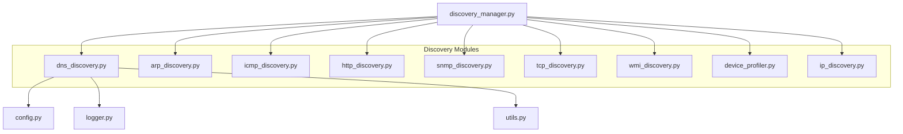
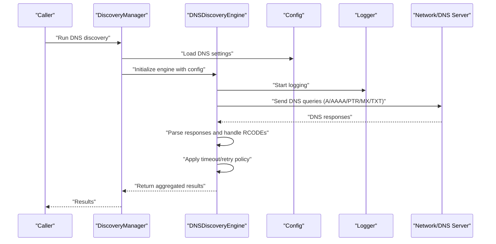
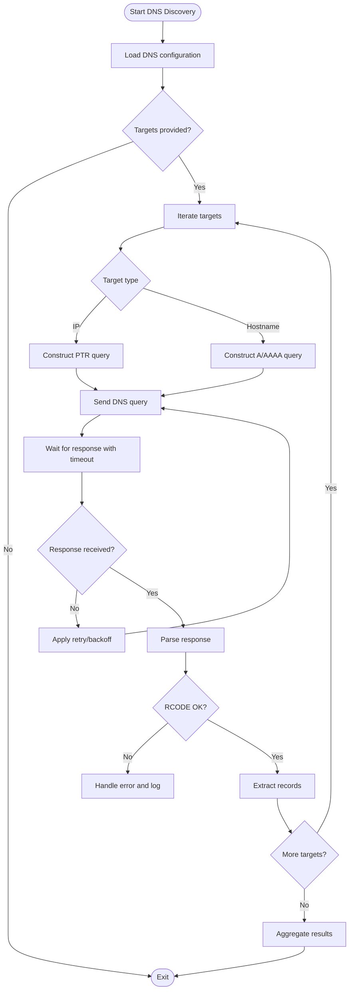
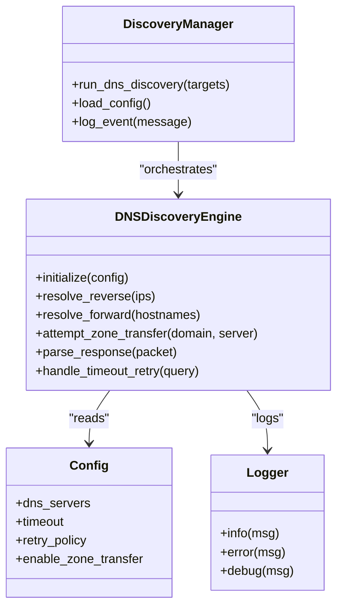
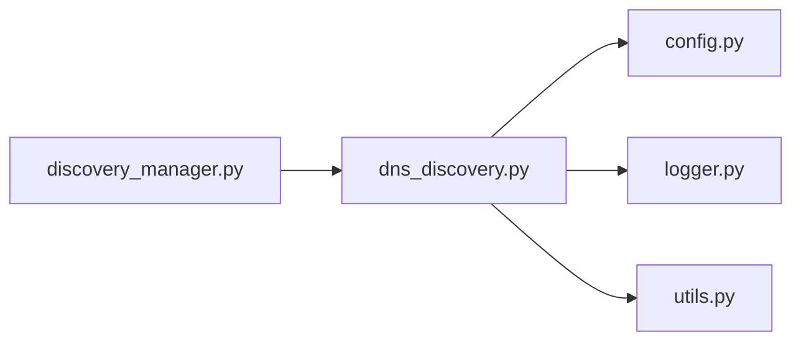

# DNS Discovery Module

<cite>
**Referenced Files in This Document**
- [dns_discovery.py](file://icmp_discovery/discovery_modules/dns_discovery.py)
- [discovery_manager.py](file://icmp_discovery/discovery_manager.py)
- [config.py](file://icmp_discovery/config.py)
- [logger.py](file://icmp_discovery/logger.py)
- [utils.py](file://icmp_discovery/utils.py)
</cite>

## Table of Contents
1. [Introduction](#introduction)
2. [Project Structure](#project-structure)
3. [Core Components](#core-components)
4. [Architecture Overview](#architecture-overview)
5. [Detailed Component Analysis](#detailed-component-analysis)
6. [Dependency Analysis](#dependency-analysis)
7. [Performance Considerations](#performance-considerations)
8. [Troubleshooting Guide](#troubleshooting-guide)
9. [Conclusion](#conclusion)

## Introduction
This document explains the DNS discovery module that performs network enumeration using DNS-based techniques. It covers reverse DNS lookups, forward DNS queries, and zone transfer attempts, along with how DNS queries are constructed, responses parsed, timeouts handled, and retries implemented. It also provides guidance on configuring DNS servers, handling DNSSEC, working with custom domain names, interpreting DNS response codes, and addressing security considerations, rate limiting, and troubleshooting across different network environments.

## Project Structure
The DNS discovery functionality resides within the discovery modules package and is orchestrated by the discovery manager. Configuration and logging utilities support robust operation.

**Diagram sources**
- [dns_discovery.py](file://icmp_discovery/discovery_modules/dns_discovery.py)
- [discovery_manager.py](file://icmp_discovery/discovery_manager.py)
- [config.py](file://icmp_discovery/config.py)
- [logger.py](file://icmp_discovery/logger.py)
- [utils.py](file://icmp_discovery/utils.py)

**Section sources**
- [dns_discovery.py](file://icmp_discovery/discovery_modules/dns_discovery.py)
- [discovery_manager.py](file://icmp_discovery/discovery_manager.py)
- [config.py](file://icmp_discovery/config.py)
- [logger.py](file://icmp_discovery/logger.py)
- [utils.py](file://icmp_discovery/utils.py)

## Core Components
- DNS Discovery Engine: Implements reverse DNS lookups, forward DNS queries, and optional zone transfer attempts. It constructs DNS messages, parses responses, handles timeouts and retries, and aggregates results for inventory or monitoring pipelines.
- Discovery Manager: Orchestrates running DNS discovery alongside other discovery modules, manages configuration, and coordinates execution flow.
- Configuration: Provides DNS server lists, timeouts, retry policies, and feature toggles (e.g., enabling zone transfers).
- Logging: Centralized logging for DNS operations, errors, and performance metrics.
- Utilities: Helper functions for name/IP normalization, query formatting, and result mapping.

Key responsibilities:
- Constructing DNS queries for A/AAAA/PTR/MX/TXT records and AXFR/IXFR requests when applicable.
- Parsing DNS responses to extract relevant fields and handle various RCODEs.
- Implementing timeout and retry logic with exponential backoff where appropriate.
- Aggregating discovered hostnames, IPs, and service hints into a structured output.

**Section sources**
- [dns_discovery.py](file://icmp_discovery/discovery_modules/dns_discovery.py)
- [discovery_manager.py](file://icmp_discovery/discovery_manager.py)
- [config.py](file://icmp_discovery/config.py)
- [logger.py](file://icmp_discovery/logger.py)
- [utils.py](file://icmp_discovery/utils.py)

## Architecture Overview
The DNS discovery module integrates with the broader discovery framework through the discovery manager. It reads configuration, executes DNS operations against configured servers, and returns structured results.

**Diagram sources**
- [discovery_manager.py](file://icmp_discovery/discovery_manager.py)
- [dns_discovery.py](file://icmp_discovery/discovery_modules/dns_discovery.py)
- [config.py](file://icmp_discovery/config.py)
- [logger.py](file://icmp_discovery/logger.py)

## Detailed Component Analysis

### DNS Discovery Engine
Responsibilities:
- Reverse DNS lookups: Given an IP range or list, perform PTR queries to resolve hostnames.
- Forward DNS queries: Given hostnames or domains, resolve A/AAAA records; optionally retrieve MX/TXT for service hints.
- Zone transfer attempts: Optionally attempt AXFR/IXFR against authoritative servers if permitted by configuration and policy.
- Query construction: Build DNS request packets with appropriate record types and flags.
- Response parsing: Extract answer sections, authority, and additional records; interpret RCODEs and EDNS behavior.
- Timeout and retry: Enforce per-query timeouts and implement retry strategies with backoff.
- Result aggregation: Normalize outputs into consistent structures for downstream use.

Operational flow:
- Initialize with configuration (servers, timeouts, retries, features).
- For each target (IPs or hostnames), construct and send queries.
- Parse responses, handle errors, and apply retry rules.
- Aggregate results and log outcomes.

**Diagram sources**
- [dns_discovery.py](file://icmp_discovery/discovery_modules/dns_discovery.py)
- [config.py](file://icmp_discovery/config.py)
- [logger.py](file://icmp_discovery/logger.py)

**Section sources**
- [dns_discovery.py](file://icmp_discovery/discovery_modules/dns_discovery.py)

### Discovery Manager Integration
Responsibilities:
- Coordinate execution of DNS discovery with other discovery modules.
- Provide configuration context and ensure consistent logging.
- Manage lifecycle events and error propagation.

Integration points:
- Reads global configuration for DNS settings.
- Invokes DNS discovery engine with target sets.
- Collects and merges results into the overall discovery output.

**Diagram sources**
- [discovery_manager.py](file://icmp_discovery/discovery_manager.py)
- [dns_discovery.py](file://icmp_discovery/discovery_modules/dns_discovery.py)
- [config.py](file://icmp_discovery/config.py)
- [logger.py](file://icmp_discovery/logger.py)

**Section sources**
- [discovery_manager.py](file://icmp_discovery/discovery_manager.py)

### Configuration and Utilities
Configuration options typically include:
- DNS server list: Primary and secondary resolvers.
- Timeouts: Per-query and overall session timeouts.
- Retry policy: Number of retries and backoff strategy.
- Feature toggles: Enable/disable zone transfers, specific record types.

Utilities provide:
- Name/IP normalization helpers.
- Query formatting and validation.
- Result mapping and deduplication.

**Section sources**
- [config.py](file://icmp_discovery/config.py)
- [utils.py](file://icmp_discovery/utils.py)

## Dependency Analysis
The DNS discovery module depends on configuration, logging, and utility modules. The discovery manager orchestrates its usage alongside other discovery components.

**Diagram sources**
- [dns_discovery.py](file://icmp_discovery/discovery_modules/dns_discovery.py)
- [discovery_manager.py](file://icmp_discovery/discovery_manager.py)
- [config.py](file://icmp_discovery/config.py)
- [logger.py](file://icmp_discovery/logger.py)
- [utils.py](file://icmp_discovery/utils.py)

**Section sources**
- [dns_discovery.py](file://icmp_discovery/discovery_modules/dns_discovery.py)
- [discovery_manager.py](file://icmp_discovery/discovery_manager.py)
- [config.py](file://icmp_discovery/config.py)
- [logger.py](file://icmp_discovery/logger.py)
- [utils.py](file://icmp_discovery/utils.py)

## Performance Considerations
- Concurrency: Use asynchronous or parallel query execution to reduce total scan time while respecting server limits.
- Rate limiting: Throttle queries per server to avoid overwhelming resolvers and triggering anti-abuse mechanisms.
- Caching: Cache successful resolutions and negative responses with TTL-aware expiration to minimize redundant queries.
- Record selection: Limit record types to those necessary for the task to reduce payload size and processing overhead.
- Timeout tuning: Adjust timeouts based on network latency characteristics to balance responsiveness and reliability.

[No sources needed since this section provides general guidance]

## Troubleshooting Guide
Common issues and resolutions:
- No responses or timeouts:
  - Verify DNS server reachability and firewall rules.
  - Increase timeouts and retry counts cautiously.
  - Check for EDNS0 compatibility and MTU issues.
- Incorrect or missing records:
  - Confirm record types requested match expected data.
  - Validate domain names and reverse zones exist.
- Zone transfer failures:
  - Ensure AXFR/IXFR is allowed by the authoritative server.
  - Review access control lists and ACL configurations.
- DNSSEC validation errors:
  - Enable DNSSEC validation if supported by the resolver.
  - Inspect RRSIG, DNSKEY, DS records for chain validity.
- High error rates:
  - Apply rate limiting and exponential backoff.
  - Monitor resolver logs for throttling or blocking.

Interpreting DNS response codes:
- NOERROR: Successful query; examine answer section.
- NXDOMAIN: Domain does not exist; skip further queries for that name.
- SERVFAIL: Resolver failure; retry with alternate server or adjust configuration.
- REFUSED: Access denied; check permissions or ACLs.
- FORMERR: Malformed query; validate packet construction.
- NOTIMP: Not implemented; fallback to alternative methods.

Security considerations:
- Avoid unauthorized zone transfers; only attempt when explicitly permitted.
- Sanitize inputs to prevent DNS amplification or injection.
- Respect rate limits and organizational policies.
- Prefer secure resolvers and enable DNSSEC validation where possible.

**Section sources**
- [dns_discovery.py](file://icmp_discovery/discovery_modules/dns_discovery.py)
- [logger.py](file://icmp_discovery/logger.py)
- [config.py](file://icmp_discovery/config.py)

## Conclusion
The DNS discovery module provides robust DNS-based enumeration capabilities integrated into the broader discovery framework. By implementing careful query construction, response parsing, timeout and retry handling, and security-conscious practices, it enables reliable network discovery across diverse environments. Proper configuration, rate limiting, and troubleshooting strategies ensure optimal performance and compliance with operational policies.

[No sources needed since this section summarizes without analyzing specific files]