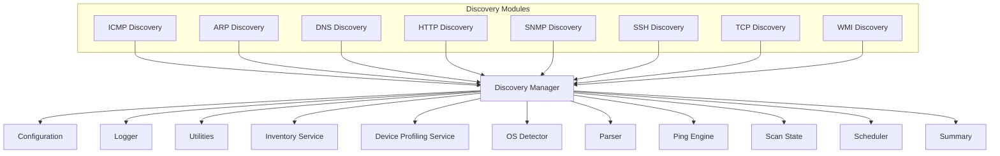
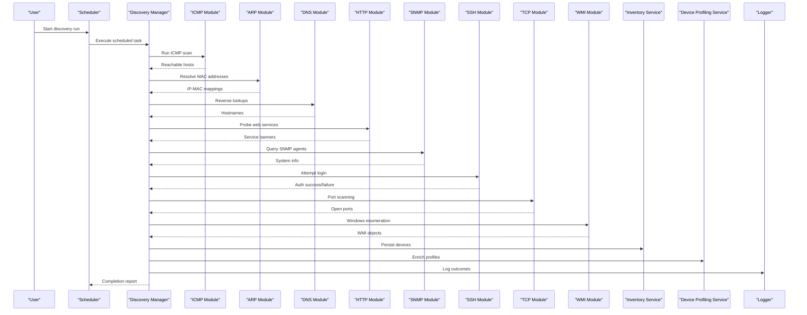
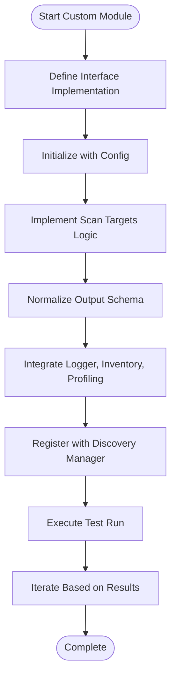

# Discovery Modules

<cite>
**Referenced Files in This Document**
- [icmp_discovery.py](file://icmp_discovery/discovery_modules/icmp_discovery.py)
- [arp_discovery.py](file://icmp_discovery/discovery_modules/arp_discovery.py)
- [dns_discovery.py](file://icmp_discovery/discovery_modules/dns_discovery.py)
- [http_discovery.py](file://icmp_discovery/discovery_modules/http_discovery.py)
- [snmp_discovery.py](file://icmp_discovery/discovery_modules/snmp_discovery.py)
- [ssh_discovery.py](file://icmp_discovery/discovery_modules/ssh_discovery.py)
- [tcp_discovery.py](file://icmp_discovery/discovery_modules/tcp_discovery.py)
- [wmi_discovery.py](file://icmp_discovery/discovery_modules/wmi_discovery.py)
- [discovery_manager.py](file://icmp_discovery/discovery_manager.py)
- [config.py](file://icmp_discovery/config.py)
- [utils.py](file://icmp_discovery/utils.py)
- [logger.py](file://icmp_discovery/logger.py)
- [inventory_service.py](file://icmp_discovery/inventory_service.py)
- [device_profiling_service.py](file://icmp_discovery/device_profiling_service.py)
- [os_detector.py](file://icmp_discovery/os_detector.py)
- [parser.py](file://icmp_discovery/parser.py)
- [ping_engine.py](file://icmp_discovery/ping_engine.py)
- [scan_state.py](file://icmp_discovery/scan_state.py)
- [scheduler.py](file://icmp_discovery/scheduler.py)
- [summary.py](file://icmp_discovery/summary.py)
</cite>

## Table of Contents
1. [Introduction](#introduction)
2. [Project Structure](#project-structure)
3. [Core Components](#core-components)
4. [Architecture Overview](#architecture-overview)
5. [Detailed Component Analysis](#detailed-component-analysis)
6. [Dependency Analysis](#dependency-analysis)
7. [Performance Considerations](#performance-considerations)
8. [Troubleshooting Guide](#troubleshooting-guide)
9. [Conclusion](#conclusion)
10. [Appendices](#appendices)

## Introduction
This document provides comprehensive documentation for all discovery protocol modules implemented in the project, covering ICMP, ARP, DNS, HTTP, SNMP, SSH, TCP, and WMI scanning. It explains implementation details, authentication requirements, data extraction methods, error handling strategies, and configuration parameters specific to each protocol. It also documents the common interface that discovery modules must implement, performance considerations, examples for creating custom discovery modules, protocol-specific optimizations, and troubleshooting guidance for common connection issues.

## Project Structure
The discovery functionality is organized under a dedicated package with clear separation of concerns:
- Discovery modules implement per-protocol scanning logic.
- A discovery manager orchestrates module execution and results aggregation.
- Configuration, logging, utilities, inventory, profiling, OS detection, parsing, ping engine, scan state, scheduler, and summary components support the overall workflow.

**Diagram sources**
- [discovery_manager.py](file://icmp_discovery/discovery_manager.py)
- [config.py](file://icmp_discovery/config.py)
- [logger.py](file://icmp_discovery/logger.py)
- [utils.py](file://icmp_discovery/utils.py)
- [inventory_service.py](file://icmp_discovery/inventory_service.py)
- [device_profiling_service.py](file://icmp_discovery/device_profiling_service.py)
- [os_detector.py](file://icmp_discovery/os_detector.py)
- [parser.py](file://icmp_discovery/parser.py)
- [ping_engine.py](file://icmp_discovery/ping_engine.py)
- [scan_state.py](file://icmp_discovery/scan_state.py)
- [scheduler.py](file://icmp_discovery/scheduler.py)
- [summary.py](file://icmp_discovery/summary.py)

**Section sources**
- [discovery_manager.py](file://icmp_discovery/discovery_manager.py)
- [config.py](file://icmp_discovery/config.py)
- [logger.py](file://icmp_discovery/logger.py)
- [utils.py](file://icmp_discovery/utils.py)
- [inventory_service.py](file://icmp_discovery/inventory_service.py)
- [device_profiling_service.py](file://icmp_discovery/device_profiling_service.py)
- [os_detector.py](file://icmp_discovery/os_detector.py)
- [parser.py](file://icmp_discovery/parser.py)
- [ping_engine.py](file://icmp_discovery/ping_engine.py)
- [scan_state.py](file://icmp_discovery/scan_state.py)
- [scheduler.py](file://icmp_discovery/scheduler.py)
- [summary.py](file://icmp_discovery/summary.py)

## Core Components
The core components supporting discovery include:
- Discovery Manager: Orchestrates discovery runs, manages concurrency, and aggregates results.
- Configuration: Provides centralized settings for timeouts, retries, credentials, and protocol-specific options.
- Logger: Centralized logging for consistent diagnostics across modules.
- Utilities: Common helpers for networking, parsing, and data normalization.
- Inventory Service: Persists discovered devices and attributes.
- Device Profiling Service: Enriches device records with OS and capability profiles.
- OS Detector: Identifies operating systems based on responses or metadata.
- Parser: Parses raw outputs into structured device information.
- Ping Engine: Low-level ICMP operations for reachability checks.
- Scan State: Tracks ongoing scans and their progress.
- Scheduler: Schedules periodic discovery tasks.
- Summary: Aggregates statistics and reports.

These components are used by each discovery module to ensure consistent behavior, reliability, and observability.

**Section sources**
- [discovery_manager.py](file://icmp_discovery/discovery_manager.py)
- [config.py](file://icmp_discovery/config.py)
- [logger.py](file://icmp_discovery/logger.py)
- [utils.py](file://icmp_discovery/utils.py)
- [inventory_service.py](file://icmp_discovery/inventory_service.py)
- [device_profiling_service.py](file://icmp_discovery/device_profiling_service.py)
- [os_detector.py](file://icmp_discovery/os_detector.py)
- [parser.py](file://icmp_discovery/parser.py)
- [ping_engine.py](file://icmp_discovery/ping_engine.py)
- [scan_state.py](file://icmp_discovery/scan_state.py)
- [scheduler.py](file://icmp_discovery/scheduler.py)
- [summary.py](file://icmp_discovery/summary.py)

## Architecture Overview
The discovery architecture follows a modular design where each protocol implements a standardized interface. The discovery manager coordinates execution, handles errors, and integrates with shared services.

**Diagram sources**
- [discovery_manager.py](file://icmp_discovery/discovery_manager.py)
- [icmp_discovery.py](file://icmp_discovery/discovery_modules/icmp_discovery.py)
- [arp_discovery.py](file://icmp_discovery/discovery_modules/arp_discovery.py)
- [dns_discovery.py](file://icmp_discovery/discovery_modules/dns_discovery.py)
- [http_discovery.py](file://icmp_discovery/discovery_modules/http_discovery.py)
- [snmp_discovery.py](file://icmp_discovery/discovery_modules/snmp_discovery.py)
- [ssh_discovery.py](file://icmp_discovery/discovery_modules/ssh_discovery.py)
- [tcp_discovery.py](file://icmp_discovery/discovery_modules/tcp_discovery.py)
- [wmi_discovery.py](file://icmp_discovery/discovery_modules/wmi_discovery.py)
- [inventory_service.py](file://icmp_discovery/inventory_service.py)
- [device_profiling_service.py](file://icmp_discovery/device_profiling_service.py)
- [logger.py](file://icmp_discovery/logger.py)

## Detailed Component Analysis

### Common Interface for Discovery Modules
All discovery modules implement a unified interface to ensure consistency across protocols. Typical responsibilities include:
- Initialization with configuration parameters
- Scanning method to discover devices and attributes
- Error handling and retry policies
- Logging and metrics reporting
- Integration with inventory and profiling services

Key interface elements commonly expected:
- Constructor accepting configuration (timeouts, credentials, concurrency)
- Method to execute discovery over target ranges or lists
- Return structure containing discovered entities and metadata
- Exception handling for network failures and authentication errors

**Section sources**
- [discovery_manager.py](file://icmp_discovery/discovery_manager.py)
- [config.py](file://icmp_discovery/config.py)
- [logger.py](file://icmp_discovery/logger.py)
- [utils.py](file://icmp_discovery/utils.py)

### ICMP Discovery
Implementation details:
- Uses low-level ICMP echo requests to determine host reachability.
- Supports configurable timeouts and retries.
- Integrates with the ping engine for efficient packet sending.
- Normalizes results into a standard device record format.

Authentication requirements:
- No authentication required; relies on network reachability.

Data extraction methods:
- Extracts IP addresses and basic reachability status.
- May collect TTL values and latency metrics.

Error handling:
- Handles packet loss, firewall drops, and unreachable targets.
- Logs warnings for partial failures and continues scanning.

Configuration parameters:
- Timeout per probe
- Number of retries
- Concurrent probes limit
- Target subnet or host list

Performance considerations:
- Use concurrent probing with rate limiting to avoid overwhelming networks.
- Adjust timeout values based on network characteristics.

**Section sources**
- [icmp_discovery.py](file://icmp_discovery/discovery_modules/icmp_discovery.py)
- [ping_engine.py](file://icmp_discovery/ping_engine.py)
- [config.py](file://icmp_discovery/config.py)
- [logger.py](file://icmp_discovery/logger.py)

### ARP Discovery
Implementation details:
- Performs local network ARP requests to resolve IP-to-MAC mappings.
- Useful for discovering devices within the same broadcast domain.

Authentication requirements:
- No authentication required; operates at link layer.

Data extraction methods:
- Returns IP addresses paired with MAC addresses and interface names.

Error handling:
- Handles cases where ARP replies are not received due to filtering or isolation.

Configuration parameters:
- Target subnet range
- Interface selection
- Timeout for ARP resolution

Performance considerations:
- Limit scope to relevant subnets to reduce unnecessary traffic.
- Avoid excessive concurrent ARP requests on large networks.

**Section sources**
- [arp_discovery.py](file://icmp_discovery/discovery_modules/arp_discovery.py)
- [config.py](file://icmp_discovery/config.py)
- [logger.py](file://icmp_discovery/logger.py)

### DNS Discovery
Implementation details:
- Performs reverse DNS lookups to resolve hostnames from IP addresses.
- Can optionally perform forward lookups to validate hostnames.

Authentication requirements:
- No authentication required; depends on DNS server access.

Data extraction methods:
- Maps IPs to hostnames and validates PTR records.

Error handling:
- Handles NXDOMAIN, SERVFAIL, and timeout conditions gracefully.

Configuration parameters:
- DNS server address
- Timeout for queries
- Retry policy

Performance considerations:
- Cache DNS responses to reduce repeated queries.
- Use parallel queries with controlled concurrency.

**Section sources**
- [dns_discovery.py](file://icmp_discovery/discovery_modules/dns_discovery.py)
- [config.py](file://icmp_discovery/config.py)
- [logger.py](file://icmp_discovery/logger.py)

### HTTP Discovery
Implementation details:
- Probes HTTP endpoints to identify web services and gather banners.
- Supports GET requests to common paths for service detection.

Authentication requirements:
- Optional credentials for protected endpoints if configured.

Data extraction methods:
- Captures HTTP status codes, headers, and response bodies for analysis.

Error handling:
- Handles connection refused, timeouts, SSL errors, and invalid responses.

Configuration parameters:
- Target URLs or base paths
- Request timeout
- Headers customization
- Authentication tokens if needed

Performance considerations:
- Limit concurrent requests to avoid server overload.
- Implement request deduplication and caching.

**Section sources**
- [http_discovery.py](file://icmp_discovery/discovery_modules/http_discovery.py)
- [config.py](file://icmp_discovery/config.py)
- [logger.py](file://icmp_discovery/logger.py)

### SNMP Discovery
Implementation details:
- Queries SNMP agents using community strings or v3 security models.
- Retrieves system information, interfaces, and OID-based metrics.

Authentication requirements:
- Requires valid community string (v1/v2c) or credentials (v3).

Data extraction methods:
- Parses SNMP responses into structured device attributes.

Error handling:
- Handles authentication failures, timeouts, and unsupported OIDs.

Configuration parameters:
- SNMP version
- Community string or v3 credentials
- Timeout and retries
- OID filters

Performance considerations:
- Batch OID requests where possible.
- Use asynchronous polling for large device sets.

**Section sources**
- [snmp_discovery.py](file://icmp_discovery/discovery_modules/snmp_discovery.py)
- [config.py](file://icmp_discovery/config.py)
- [logger.py](file://icmp_discovery/logger.py)

### SSH Discovery
Implementation details:
- Attempts SSH connections to authenticate and enumerate devices.
- Supports key-based and password-based authentication.

Authentication requirements:
- Requires valid username/password or SSH keys.

Data extraction methods:
- Collects banner information and executes allowed commands for discovery.

Error handling:
- Handles authentication failures, connection timeouts, and command execution errors.

Configuration parameters:
- SSH port
- Credentials or key paths
- Command whitelist
- Timeout and retries

Performance considerations:
- Limit concurrent SSH sessions to prevent resource exhaustion.
- Use non-blocking I/O where supported.

**Section sources**
- [ssh_discovery.py](file://icmp_discovery/discovery_modules/ssh_discovery.py)
- [config.py](file://icmp_discovery/config.py)
- [logger.py](file://icmp_discovery/logger.py)

### TCP Discovery
Implementation details:
- Performs TCP port scanning to detect open services.
- Supports SYN scans or full connect scans depending on privileges.

Authentication requirements:
- No authentication required for port scanning.

Data extraction methods:
- Records open ports and inferred service types.

Error handling:
- Handles filtered ports, firewall rules, and connection resets.

Configuration parameters:
- Port ranges
- Scan type (SYN vs connect)
- Timeout per port
- Concurrency limits

Performance considerations:
- Use SYN scans for speed when permitted.
- Throttle scans to avoid triggering IDS/IPS alerts.

**Section sources**
- [tcp_discovery.py](file://icmp_discovery/discovery_modules/tcp_discovery.py)
- [config.py](file://icmp_discovery/config.py)
- [logger.py](file://icmp_discovery/logger.py)

### WMI Discovery
Implementation details:
- Enumerates Windows devices via WMI queries.
- Retrieves system information, installed software, and hardware details.

Authentication requirements:
- Requires valid Windows credentials with appropriate permissions.

Data extraction methods:
- Parses WMI object properties into structured device records.

Error handling:
- Handles access denied, RPC errors, and WMI provider failures.

Configuration parameters:
- Target machine names or IPs
- Credentials and domain
- WMI namespace and query filters
- Timeout and retries

Performance considerations:
- Limit concurrent WMI sessions per host.
- Optimize queries to retrieve only necessary attributes.

**Section sources**
- [wmi_discovery.py](file://icmp_discovery/discovery_modules/wmi_discovery.py)
- [config.py](file://icmp_discovery/config.py)
- [logger.py](file://icmp_discovery/logger.py)

### Creating Custom Discovery Modules
To create a custom discovery module:
- Implement the common interface expected by the discovery manager.
- Provide initialization with configuration parameters.
- Implement a scanning method that returns standardized device records.
- Integrate with logger for diagnostics and error reporting.
- Handle exceptions and return meaningful error states.

Example steps:
- Define a class with constructor accepting config.
- Implement a method to execute discovery over targets.
- Normalize output into a consistent schema.
- Register the module with the discovery manager.

**Section sources**
- [discovery_manager.py](file://icmp_discovery/discovery_manager.py)
- [config.py](file://icmp_discovery/config.py)
- [logger.py](file://icmp_discovery/logger.py)

### Protocol-Specific Optimizations
- ICMP: Tune probe intervals and batch sizes for optimal throughput.
- ARP: Scope to local subnets and use interface-aware resolution.
- DNS: Enable caching and parallel queries with backoff.
- HTTP: Use keep-alive connections and header optimization.
- SNMP: Aggregate OID requests and use async polling.
- SSH: Reuse sessions and minimize command executions.
- TCP: Prefer SYN scans and throttle to avoid detection.
- WMI: Narrow queries and limit concurrent sessions.

**Section sources**
- [icmp_discovery.py](file://icmp_discovery/discovery_modules/icmp_discovery.py)
- [arp_discovery.py](file://icmp_discovery/discovery_modules/arp_discovery.py)
- [dns_discovery.py](file://icmp_discovery/discovery_modules/dns_discovery.py)
- [http_discovery.py](file://icmp_discovery/discovery_modules/http_discovery.py)
- [snmp_discovery.py](file://icmp_discovery/discovery_modules/snmp_discovery.py)
- [ssh_discovery.py](file://icmp_discovery/discovery_modules/ssh_discovery.py)
- [tcp_discovery.py](file://icmp_discovery/discovery_modules/tcp_discovery.py)
- [wmi_discovery.py](file://icmp_discovery/discovery_modules/wmi_discovery.py)

## Dependency Analysis
The discovery modules depend on shared services for configuration, logging, utilities, inventory, profiling, OS detection, parsing, ping engine, scan state, scheduler, and summary.

```mermaid
graph TB
ICMP["ICMP Module"] --> Config["Config"]
ICMP --> Logger["Logger"]
ICMP --> Utils["Utils"]
ICMP --> Inventory["Inventory Service"]
ICMP --> Profiling["Profiling Service"]
ICMP --> OSDetector["OS Detector"]
ICMP --> Parser["Parser"]
ICMP --> PingEngine["Ping Engine"]
ICMP --> ScanState["Scan State"]
ICMP --> Scheduler["Scheduler"]
ICMP --> Summary["Summary"]
ARP["ARP Module"] --> Config
ARP --> Logger
ARP --> Utils
ARP --> Inventory
ARP --> Profiling
ARP --> OSDetector
ARP --> Parser
ARP --> ScanState
ARP --> Scheduler
ARP --> Summary
DNS["DNS Module"] --> Config
DNS --> Logger
DNS --> Utils
DNS --> Inventory
DNS --> Profiling
DNS --> OSDetector
DNS --> Parser
DNS --> ScanState
DNS --> Scheduler
DNS --> Summary
HTTP["HTTP Module"] --> Config
HTTP --> Logger
HTTP --> Utils
HTTP --> Inventory
HTTP --> Profiling
HTTP --> OSDetector
HTTP --> Parser
HTTP --> ScanState
HTTP --> Scheduler
HTTP --> Summary
SNMP["SNMP Module"] --> Config
SNMP --> Logger
SNMP --> Utils
SNMP --> Inventory
SNMP --> Profiling
SNMP --> OSDetector
SNMP --> Parser
SNMP --> ScanState
SNMP --> Scheduler
SNMP --> Summary
SSH["SSH Module"] --> Config
SSH --> Logger
SSH --> Utils
SSH --> Inventory
SSH --> Profiling
SSH --> OSDetector
SSH --> Parser
SSH --> ScanState
SSH --> Scheduler
SSH --> Summary
TCP["TCP Module"] --> Config
TCP --> Logger
TCP --> Utils
TCP --> Inventory
TCP --> Profiling
TCP --> OSDetector
TCP --> Parser
TCP --> ScanState
TCP --> Scheduler
TCP --> Summary
WMI["WMI Module"] --> Config
WMI --> Logger
WMI --> Utils
WMI --> Inventory
WMI --> Profiling
WMI --> OSDetector
WMI --> Parser
WMI --> ScanState
WMI --> Scheduler
WMI --> Summary
```

**Diagram sources**
- [icmp_discovery.py](file://icmp_discovery/discovery_modules/icmp_discovery.py)
- [arp_discovery.py](file://icmp_discovery/discovery_modules/arp_discovery.py)
- [dns_discovery.py](file://icmp_discovery/discovery_modules/dns_discovery.py)
- [http_discovery.py](file://icmp_discovery/discovery_modules/http_discovery.py)
- [snmp_discovery.py](file://icmp_discovery/discovery_modules/snmp_discovery.py)
- [ssh_discovery.py](file://icmp_discovery/discovery_modules/ssh_discovery.py)
- [tcp_discovery.py](file://icmp_discovery/discovery_modules/tcp_discovery.py)
- [wmi_discovery.py](file://icmp_discovery/discovery_modules/wmi_discovery.py)
- [config.py](file://icmp_discovery/config.py)
- [logger.py](file://icmp_discovery/logger.py)
- [utils.py](file://icmp_discovery/utils.py)
- [inventory_service.py](file://icmp_discovery/inventory_service.py)
- [device_profiling_service.py](file://icmp_discovery/device_profiling_service.py)
- [os_detector.py](file://icmp_discovery/os_detector.py)
- [parser.py](file://icmp_discovery/parser.py)
- [ping_engine.py](file://icmp_discovery/ping_engine.py)
- [scan_state.py](file://icmp_discovery/scan_state.py)
- [scheduler.py](file://icmp_discovery/scheduler.py)
- [summary.py](file://icmp_discovery/summary.py)

**Section sources**
- [discovery_manager.py](file://icmp_discovery/discovery_manager.py)
- [config.py](file://icmp_discovery/config.py)
- [logger.py](file://icmp_discovery/logger.py)
- [utils.py](file://icmp_discovery/utils.py)
- [inventory_service.py](file://icmp_discovery/inventory_service.py)
- [device_profiling_service.py](file://icmp_discovery/device_profiling_service.py)
- [os_detector.py](file://icmp_discovery/os_detector.py)
- [parser.py](file://icmp_discovery/parser.py)
- [ping_engine.py](file://icmp_discovery/ping_engine.py)
- [scan_state.py](file://icmp_discovery/scan_state.py)
- [scheduler.py](file://icmp_discovery/scheduler.py)
- [summary.py](file://icmp_discovery/summary.py)

## Performance Considerations
- Concurrency control: Limit parallel operations per protocol to balance speed and stability.
- Timeouts and retries: Configure appropriate values to handle slow or unreliable networks.
- Caching: Cache DNS, HTTP, and SNMP responses to reduce redundant work.
- Rate limiting: Throttle requests to avoid triggering network protections.
- Resource management: Close connections promptly and reuse where possible.
- Monitoring: Track metrics like success rates, latencies, and error counts.

[No sources needed since this section provides general guidance]

## Troubleshooting Guide
Common issues and resolutions:
- Network connectivity: Verify routing, firewalls, and ACLs.
- Authentication failures: Check credentials, permissions, and account status.
- Timeouts: Increase timeouts or reduce concurrency for slow networks.
- Protocol restrictions: Ensure required ports and services are enabled.
- Logging: Review logs for detailed error messages and stack traces.

Diagnostic steps:
- Enable verbose logging for the affected module.
- Test connectivity manually using native tools.
- Validate configuration parameters against target environments.
- Isolate issues by running single-protocol scans.

**Section sources**
- [logger.py](file://icmp_discovery/logger.py)
- [config.py](file://icmp_discovery/config.py)
- [icmp_discovery.py](file://icmp_discovery/discovery_modules/icmp_discovery.py)
- [snmp_discovery.py](file://icmp_discovery/discovery_modules/snmp_discovery.py)
- [ssh_discovery.py](file://icmp_discovery/discovery_modules/ssh_discovery.py)
- [wmi_discovery.py](file://icmp_discovery/discovery_modules/wmi_discovery.py)

## Conclusion
The discovery modules provide a robust, extensible framework for multi-protocol network discovery. By adhering to a common interface and leveraging shared services, the system ensures consistent behavior, reliable error handling, and scalable performance. Proper configuration, monitoring, and troubleshooting practices enable effective operation across diverse network environments.

[No sources needed since this section summarizes without analyzing specific files]

## Appendices

### Example Workflow for Custom Module Development

[No sources needed since this diagram shows conceptual workflow, not actual code structure]