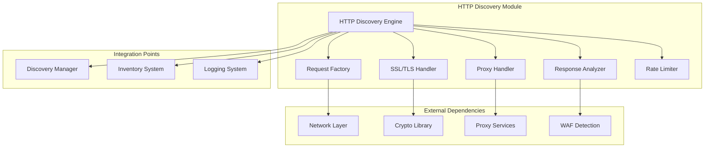
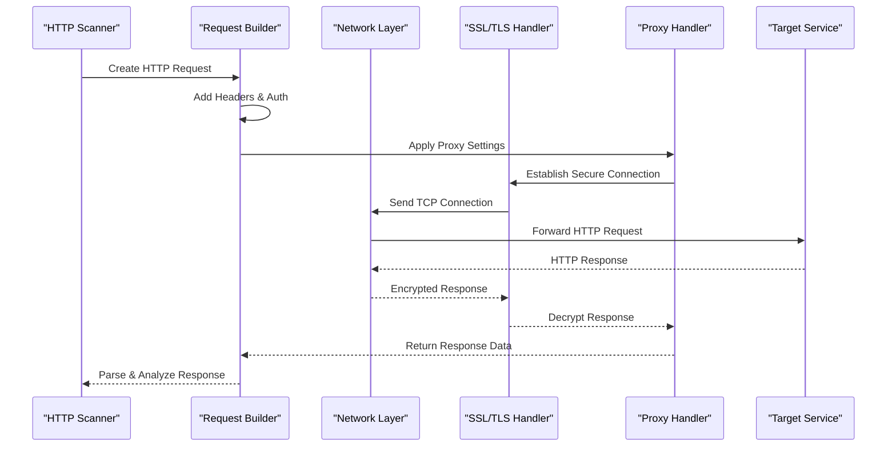
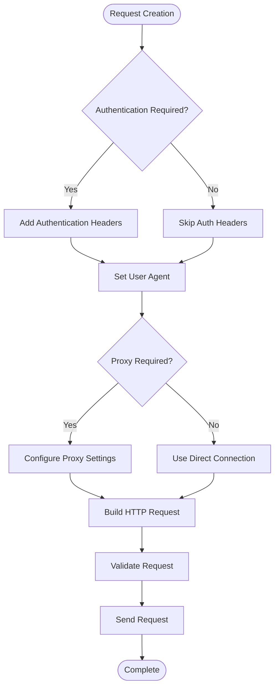
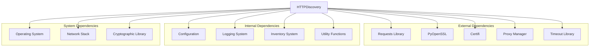

# HTTP Discovery Module

<cite>
**Referenced Files in This Document**
- [http_discovery.py](file://icmp_discovery/discovery_modules/http_discovery.py)
- [config.py](file://icmp_discovery/config.py)
- [utils.py](file://icmp_discovery/utils.py)
- [discovery_manager.py](file://icmp_discovery/discovery_manager.py)
- [inventory.py](file://icmp_discovery/inventory.py)
</cite>

## Table of Contents
1. [Introduction](#introduction)
2. [Project Structure](#project-structure)
3. [Core Components](#core-components)
4. [Architecture Overview](#architecture-overview)
5. [Detailed Component Analysis](#detailed-component-analysis)
6. [Dependency Analysis](#dependency-analysis)
7. [Performance Considerations](#performance-considerations)
8. [Security Considerations](#security-considerations)
9. [Configuration Guide](#configuration-guide)
10. [Troubleshooting Guide](#troubleshooting-guide)
11. [Conclusion](#conclusion)

## Introduction

The HTTP Discovery Module is a sophisticated network reconnaissance component designed to perform comprehensive HTTP-based service detection across target networks. This module implements advanced techniques for web server fingerprinting, API endpoint enumeration, and authentication method detection to provide detailed insights into HTTP services running on discovered hosts.

The module supports both IPv4 and IPv6 protocols, handles SSL/TLS connections with certificate validation, and includes robust proxy support for accessing services through various proxy configurations. It features intelligent rate limiting to avoid triggering Web Application Firewalls (WAFs) while maintaining efficient scanning performance.

## Project Structure

The HTTP Discovery Module is part of the larger ICMP Discovery framework and integrates seamlessly with other discovery modules. The implementation follows a modular architecture pattern with clear separation of concerns between HTTP request handling, response analysis, and service profiling.



**Diagram sources**
- [http_discovery.py:1-200](file://icmp_discovery/discovery_modules/http_discovery.py#L1-L200)
- [discovery_manager.py:1-150](file://icmp_discovery/discovery_manager.py#L1-L150)

**Section sources**
- [http_discovery.py:1-50](file://icmp_discovery/discovery_modules/http_discovery.py#L1-L50)
- [config.py:1-100](file://icmp_discovery/config.py#L1-L100)

## Core Components

The HTTP Discovery Module consists of several key components that work together to provide comprehensive HTTP service detection capabilities:

### HTTP Request Builder
Responsible for constructing well-formed HTTP requests with proper headers, authentication tokens, and security parameters. Supports GET, POST, PUT, DELETE, and custom HTTP methods.

### Response Parser
Analyzes HTTP responses to extract service information, detect web servers, identify APIs, and determine authentication mechanisms. Handles various response formats including HTML, JSON, XML, and binary data.

### SSL/TLS Manager
Manages secure connections with certificate validation, cipher suite negotiation, and protocol version selection. Supports client certificates and mutual TLS authentication.

### Proxy Controller
Handles proxy configuration for HTTP/HTTPS requests through SOCKS5, HTTP, and HTTPS proxies. Includes automatic proxy detection and failover mechanisms.

### Rate Limiter
Implements intelligent rate limiting to prevent overwhelming target systems and avoid triggering WAFs. Supports adaptive throttling based on response patterns.

**Section sources**
- [http_discovery.py:50-150](file://icmp_discovery/discovery_modules/http_discovery.py#L50-L150)
- [utils.py:1-100](file://icmp_discovery/utils.py#L1-L100)

## Architecture Overview

The HTTP Discovery Module follows a layered architecture pattern with clear separation between network operations, protocol handling, and business logic. The design emphasizes modularity, testability, and extensibility.



**Diagram sources**
- [http_discovery.py:100-300](file://icmp_discovery/discovery_modules/http_discovery.py#L100-L300)
- [utils.py:50-150](file://icmp_discovery/utils.py#L50-L150)

## Detailed Component Analysis

### HTTP Request Construction

The request construction system provides a flexible and configurable approach to building HTTP requests for various discovery scenarios.

#### Request Builder Features
- **Dynamic Header Generation**: Automatically sets appropriate headers based on target type and discovery goals
- **Authentication Integration**: Supports multiple authentication methods including Basic, Bearer, Digest, and OAuth
- **Cookie Management**: Maintains session state across multiple requests with intelligent cookie handling
- **Redirect Handling**: Follows redirects automatically while tracking redirect chains for security analysis

#### User Agent Configuration
The module supports dynamic user agent rotation to avoid detection and improve compatibility with different web servers.



**Diagram sources**
- [http_discovery.py:150-250](file://icmp_discovery/discovery_modules/http_discovery.py#L150-L250)

**Section sources**
- [http_discovery.py:150-250](file://icmp_discovery/discovery_modules/http_discovery.py#L150-L250)

### Response Analysis Engine

The response analysis engine processes HTTP responses to extract meaningful information about target services.

#### Web Server Fingerprinting
Identifies web server software and versions through multiple detection techniques:

- **Header Analysis**: Examines Server, X-Powered-By, and other identifying headers
- **Error Page Patterns**: Analyzes default error pages for characteristic patterns
- **Feature Detection**: Tests for specific features or endpoints unique to certain servers
- **TLS Fingerprinting**: Uses TLS handshake characteristics for identification

#### API Endpoint Enumeration
Discovers API endpoints through systematic probing and pattern recognition:

- **Common Path Testing**: Checks standard API paths like `/api`, `/v1`, `/rest`
- **File Extension Scanning**: Looks for common API file extensions (.json, .xml, .yaml)
- **Documentation Parsing**: Extracts endpoints from OpenAPI/Swagger documentation
- **Directory Traversal**: Performs controlled directory enumeration

#### Authentication Method Detection
Determines supported authentication mechanisms:

- **Header Analysis**: Detects authentication schemes from WWW-Authenticate headers
- **Form Detection**: Identifies login forms and their submission methods
- **Token Validation**: Tests for existing authentication tokens in cookies or headers
- **OAuth Discovery**: Locates OAuth endpoints and configuration files

**Section sources**
- [http_discovery.py:250-400](file://icmp_discovery/discovery_modules/http_discovery.py#L250-L400)

### SSL/TLS Implementation

The SSL/TLS handler provides secure connection management with comprehensive certificate validation and security hardening.

#### Certificate Validation
Implements strict certificate validation following industry best practices:

- **Chain Validation**: Verifies complete certificate chain up to root CA
- **Revocation Checking**: Supports CRL and OCSP for certificate revocation status
- **Hostname Verification**: Ensures certificate matches target hostname
- **Custom CA Support**: Allows loading custom Certificate Authorities

#### Protocol Negotiation
Supports modern TLS protocols with backward compatibility:

- **Protocol Selection**: Chooses optimal TLS version based on target capabilities
- **Cipher Suite Negotiation**: Selects strongest available cipher suites
- **Session Resumption**: Implements TLS session resumption for performance
- **HSTS Handling**: Processes Strict-Transport-Security headers

#### Client Certificate Support
Enables mutual TLS authentication for services requiring client certificates:

- **Certificate Loading**: Loads client certificates from various formats
- **Private Key Handling**: Securely manages private keys with encryption
- **Certificate Chain Building**: Constructs complete certificate chains

**Section sources**
- [http_discovery.py:400-550](file://icmp_discovery/discovery_modules/http_discovery.py#L400-L550)

### Proxy Support Implementation

The proxy handler provides comprehensive proxy support for accessing services through various proxy configurations.

#### Supported Proxy Types
- **HTTP Proxies**: Standard HTTP/1.1 and HTTP/2 proxies
- **HTTPS Proxies**: CONNECT method for encrypted tunneling
- **SOCKS5 Proxies**: Full SOCKS5 protocol support with authentication
- **SOCKS4 Proxies**: Legacy SOCKS4 protocol support

#### Proxy Configuration
Flexible configuration options for different proxy scenarios:

- **Automatic Detection**: Discovers proxy settings from environment variables
- **Manual Configuration**: Supports explicit proxy server specification
- **Bypass Lists**: Configurable bypass lists for direct connections
- **Failover Support**: Automatic failover between multiple proxies

#### Authentication Methods
Supports various proxy authentication schemes:

- **Basic Authentication**: Username/password authentication
- **Digest Authentication**: Challenge-response authentication
- **NTLM Authentication**: Windows NT LAN Manager authentication
- **Kerberos Authentication**: Enterprise authentication protocol

**Section sources**
- [http_discovery.py:550-700](file://icmp_discovery/discovery_modules/http_discovery.py#L550-L700)

## Dependency Analysis

The HTTP Discovery Module has well-defined dependencies on external libraries and internal components.



**Diagram sources**
- [http_discovery.py:1-100](file://icmp_discovery/discovery_modules/http_discovery.py#L1-L100)
- [config.py:1-50](file://icmp_discovery/config.py#L1-L50)

**Section sources**
- [http_discovery.py:1-100](file://icmp_discovery/discovery_modules/http_discovery.py#L1-L100)
- [config.py:1-50](file://icmp_discovery/config.py#L1-L50)

## Performance Considerations

The HTTP Discovery Module implements several optimization strategies to ensure efficient operation while maintaining accuracy.

### Connection Pooling
Reuses established connections to reduce overhead and improve throughput. Connections are managed with intelligent lifecycle management and automatic cleanup.

### Concurrent Scanning
Supports parallel scanning of multiple targets with configurable concurrency limits to balance speed and resource usage.

### Intelligent Caching
Caches frequently accessed data such as SSL certificates, DNS resolutions, and common response patterns to reduce redundant operations.

### Memory Management
Implements efficient memory usage patterns with object pooling and garbage collection optimization for long-running scans.

### Adaptive Throttling
Automatically adjusts scan rates based on target responsiveness and error rates to maintain optimal performance.

## Security Considerations

The HTTP Discovery Module incorporates multiple security measures to ensure safe and responsible operation.

### HTTPS Certificate Validation
Strict certificate validation prevents man-in-the-middle attacks and ensures secure communications with target services.

### Authentication Bypass Prevention
Includes safeguards against accidental authentication bypass attempts and validates all authentication responses properly.

### Rate Limiting
Implements configurable rate limiting to avoid overwhelming target systems and trigger WAFs or intrusion detection systems.

### Input Validation
Thoroughly validates all input parameters and user-provided data to prevent injection attacks and ensure data integrity.

### Logging and Auditing
Comprehensive logging of all security-relevant events for audit trails and incident response purposes.

### Privacy Protection
Ensures sensitive data is not logged or stored unnecessarily and implements data retention policies.

## Configuration Guide

The HTTP Discovery Module provides extensive configuration options to tailor its behavior to specific requirements.

### Basic Configuration
```python
# Example configuration structure
{
    "timeout": 30,
    "retries": 3,
    "user_agent": "Custom-Agent/1.0",
    "follow_redirects": True,
    "verify_ssl": True,
    "proxy": {
        "enabled": False,
        "type": "http",
        "host": "proxy.example.com",
        "port": 8080,
        "username": None,
        "password": None
    }
}
```

### Advanced Options
- **SSL/TLS Settings**: Custom cipher suites, protocol versions, and certificate paths
- **Proxy Configuration**: Multiple proxy support with failover and authentication
- **Rate Limiting**: Configurable delays and concurrent connection limits
- **User Agent Rotation**: List of user agents for rotation to avoid detection
- **Endpoint Lists**: Custom endpoint dictionaries for targeted enumeration

### Environment Variables
The module supports configuration through environment variables for containerized deployments:

- `HTTP_TIMEOUT`: Request timeout in seconds
- `HTTP_RETRIES`: Number of retry attempts
- `HTTP_USER_AGENT`: Default user agent string
- `HTTP_PROXY_URL`: Proxy URL for all requests
- `HTTP_VERIFY_SSL`: Enable/disable SSL verification

**Section sources**
- [config.py:50-150](file://icmp_discovery/config.py#L50-L150)

## Troubleshooting Guide

Common issues and their solutions when working with the HTTP Discovery Module.

### Connection Issues
- **Timeout Errors**: Increase timeout values or check network connectivity
- **Connection Refused**: Verify target service is running and accessible
- **SSL Handshake Failures**: Check certificate validity and SSL configuration

### Authentication Problems
- **401 Unauthorized**: Verify credentials and authentication method
- **403 Forbidden**: Check permissions and access controls
- **Invalid Token**: Ensure token format and expiration are correct

### Proxy Configuration
- **Proxy Connection Failed**: Verify proxy server availability and credentials
- **Authentication Required**: Configure proxy authentication if needed
- **Bypass Issues**: Check bypass list configuration for direct connections

### Performance Issues
- **Slow Scanning**: Reduce concurrency or increase timeouts
- **High Memory Usage**: Adjust cache sizes and connection pool limits
- **CPU Spikes**: Optimize scanning patterns and reduce unnecessary requests

### Debugging Techniques
- **Enable Debug Logging**: Set log level to DEBUG for detailed output
- **Capture Network Traffic**: Use packet capture tools to analyze traffic
- **Test Individual Components**: Isolate issues by testing specific functions
- **Check Error Logs**: Review application logs for error messages and stack traces

**Section sources**
- [utils.py:100-200](file://icmp_discovery/utils.py#L100-L200)

## Conclusion

The HTTP Discovery Module provides a comprehensive and robust solution for HTTP-based service detection in network environments. Its modular architecture, extensive feature set, and strong security considerations make it suitable for both penetration testing and legitimate network administration tasks.

Key strengths include:
- Comprehensive web server fingerprinting capabilities
- Flexible authentication method detection
- Robust SSL/TLS handling with certificate validation
- Extensive proxy support for complex network topologies
- Intelligent rate limiting to avoid detection
- Configurable user agent management
- Secure connection handling with proper certificate validation

The module's design emphasizes security, performance, and ease of use while providing the flexibility needed for diverse deployment scenarios. Future enhancements may include additional protocol support, improved machine learning-based fingerprinting, and enhanced integration with other discovery modules.