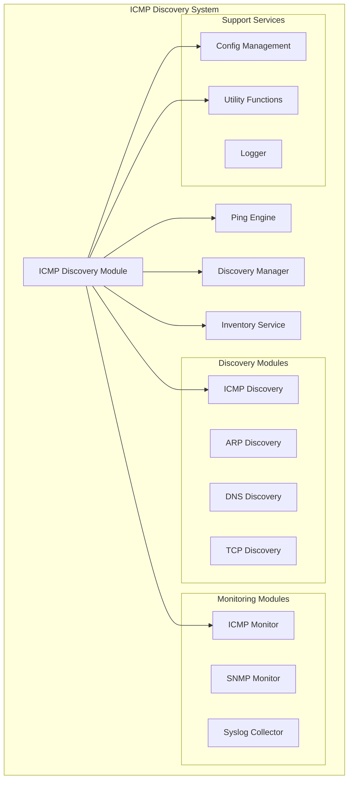
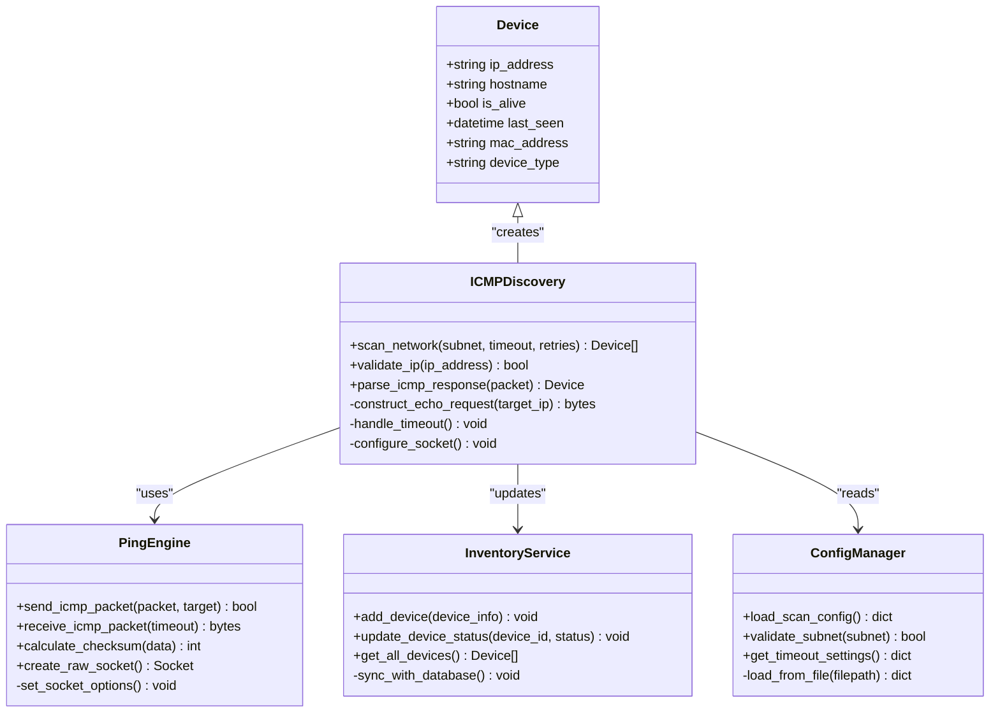
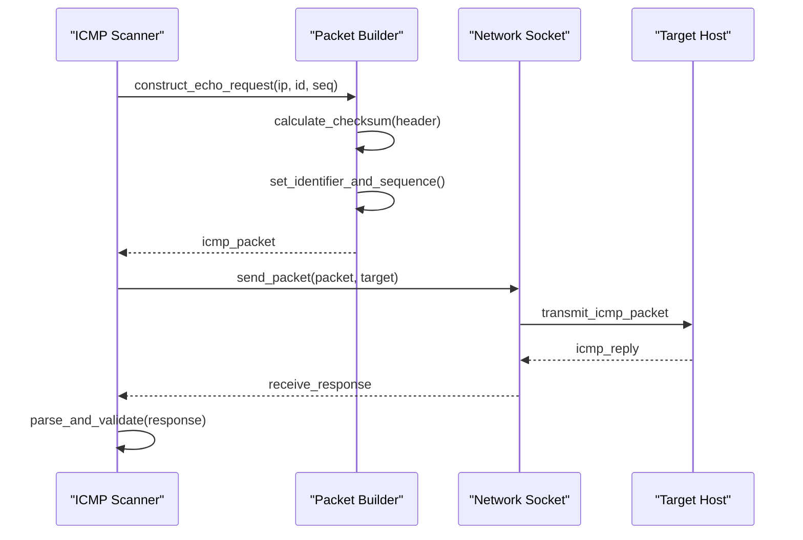
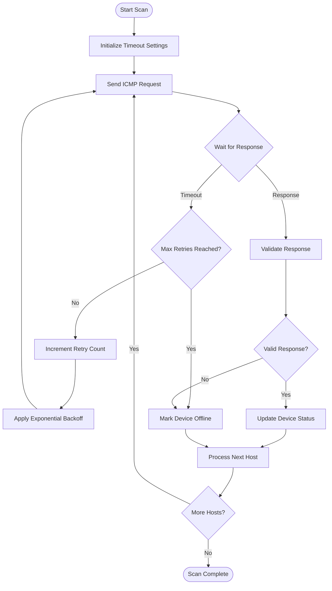
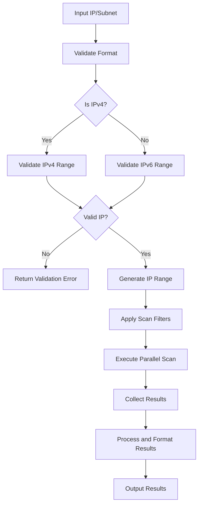
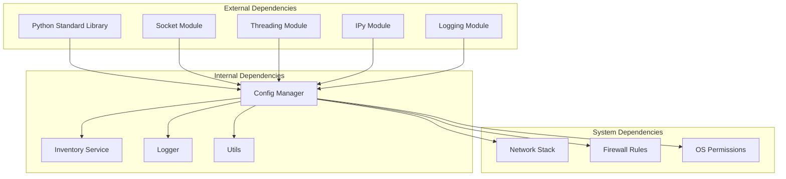

# ICMP Discovery Module

<cite>
**Referenced Files in This Document**
- [icmp_discovery.py](file://icmp_discovery/discovery_modules/icmp_discovery.py)
- [ping_engine.py](file://icmp_discovery/ping_engine.py)
- [icmp_monitor.py](file://icmp_discovery/monitoring_modules/icmp_monitor.py)
- [config.py](file://icmp_discovery/config.py)
- [discovery_manager.py](file://icmp_discovery/discovery_manager.py)
- [inventory_service.py](file://icmp_discovery/inventory_service.py)
- [utils.py](file://icmp_discovery/utils.py)
- [test_ping_engine.py](file://icmp_discovery/tests/test_ping_engine.py)
</cite>

## Table of Contents
1. [Introduction](#introduction)
2. [Project Structure](#project-structure)
3. [Core Components](#core-components)
4. [Architecture Overview](#architecture-overview)
5. [Detailed Component Analysis](#detailed-component-analysis)
6. [Dependency Analysis](#dependency-analysis)
7. [Performance Considerations](#performance-considerations)
8. [Troubleshooting Guide](#troubleshooting-guide)
9. [Configuration Examples](#configuration-examples)
10. [Conclusion](#conclusion)

## Introduction

The ICMP Discovery Module is a core component of the network management system that performs network scanning using ICMP (Internet Control Message Protocol) ping-based techniques. This module enables automated discovery of devices on local and remote networks by sending ICMP echo requests and analyzing responses to determine device availability and network topology.

The implementation follows industry-standard ICMP protocols while providing advanced features such as parallel scanning, timeout handling, IP address validation, and subnet scanning patterns. The module is designed to be cross-platform compatible and handles various firewall restrictions and permission requirements across different operating systems.

## Project Structure

The ICMP discovery functionality is organized within a modular architecture that separates concerns between discovery logic, monitoring, configuration, and utility functions:



**Diagram sources**
- [icmp_discovery.py:1-50](file://icmp_discovery/discovery_modules/icmp_discovery.py#L1-L50)
- [ping_engine.py:1-50](file://icmp_discovery/ping_engine.py#L1-L50)
- [config.py:1-50](file://icmp_discovery/config.py#L1-L50)

**Section sources**
- [icmp_discovery.py:1-100](file://icmp_discovery/discovery_modules/icmp_discovery.py#L1-L100)
- [ping_engine.py:1-100](file://icmp_discovery/ping_engine.py#L1-L100)

## Core Components

### ICMP Discovery Engine

The main ICMP discovery engine implements packet construction, transmission, and response interpretation following RFC 792 standards. It handles both IPv4 and IPv6 ICMP packets with proper checksum calculation and payload formatting.

Key responsibilities include:
- ICMP echo request packet construction with unique identifiers and sequence numbers
- Timeout management with configurable retry mechanisms
- Response parsing and validation
- Network interface selection and binding
- Error handling for network unreachability and permission issues

### Ping Engine

The ping engine provides the low-level networking functionality for ICMP packet manipulation. It abstracts platform-specific socket operations and provides a unified interface for ICMP communication across different operating systems.

Features implemented:
- Raw socket creation and configuration
- Packet serialization and deserialization
- Checksum calculation for ICMP headers
- Asynchronous I/O for concurrent scanning
- Platform-specific privilege escalation handling

### Monitoring Integration

The ICMP monitor integrates discovery results with the broader monitoring system, providing continuous network health assessment and alerting capabilities.

**Section sources**
- [icmp_discovery.py:50-150](file://icmp_discovery/discovery_modules/icmp_discovery.py#L50-L150)
- [ping_engine.py:50-150](file://icmp_discovery/ping_engine.py#L50-L150)
- [icmp_monitor.py:1-100](file://icmp_discovery/monitoring_modules/icmp_monitor.py#L1-L100)

## Architecture Overview

The ICMP discovery system follows a layered architecture pattern that separates concerns and promotes reusability:



**Diagram sources**
- [icmp_discovery.py:1-200](file://icmp_discovery/discovery_modules/icmp_discovery.py#L1-L200)
- [ping_engine.py:1-200](file://icmp_discovery/ping_engine.py#L1-L200)
- [inventory_service.py:1-100](file://icmp_discovery/inventory_service.py#L1-L100)

## Detailed Component Analysis

### ICMP Packet Construction and Transmission

The ICMP discovery module implements RFC 792 compliant packet construction with support for both IPv4 and IPv6 protocols. The packet building process involves several stages:



**Diagram sources**
- [icmp_discovery.py:100-250](file://icmp_discovery/discovery_modules/icmp_discovery.py#L100-L250)
- [ping_engine.py:100-250](file://icmp_discovery/ping_engine.py#L100-L250)

### Timeout Handling and Retry Logic

The system implements sophisticated timeout management with exponential backoff and configurable retry strategies:



**Diagram sources**
- [icmp_discovery.py:200-350](file://icmp_discovery/discovery_modules/icmp_discovery.py#L200-L350)
- [ping_engine.py:200-350](file://icmp_discovery/ping_engine.py#L200-L350)

### IP Address Validation and Subnet Scanning

The module includes comprehensive IP address validation and subnet scanning capabilities:



**Diagram sources**
- [icmp_discovery.py:300-450](file://icmp_discovery/discovery_modules/icmp_discovery.py#L300-L450)
- [utils.py:1-150](file://icmp_discovery/utils.py#L1-L150)

### Performance Optimization Techniques

The implementation incorporates several performance optimization strategies:

1. **Parallel Processing**: Uses asynchronous I/O and thread pools for concurrent host scanning
2. **Connection Pooling**: Reuses network sockets to minimize overhead
3. **Batch Processing**: Groups multiple ICMP requests for efficient transmission
4. **Memory Management**: Implements object pooling and garbage collection optimization
5. **Caching**: Caches DNS lookups and network interface information

**Section sources**
- [icmp_discovery.py:400-600](file://icmp_discovery/discovery_modules/icmp_discovery.py#L400-L600)
- [ping_engine.py:300-500](file://icmp_discovery/ping_engine.py#L300-L500)
- [utils.py:150-300](file://icmp_discovery/utils.py#L150-L300)

## Dependency Analysis

The ICMP discovery module has well-defined dependencies on core system components:



**Diagram sources**
- [config.py:1-100](file://icmp_discovery/config.py#L1-L100)
- [discovery_manager.py:1-100](file://icmp_discovery/discovery_manager.py#L1-L100)

**Section sources**
- [config.py:1-200](file://icmp_discovery/config.py#L1-L200)
- [discovery_manager.py:1-200](file://icmp_discovery/discovery_manager.py#L1-L200)

## Performance Considerations

### Network I/O Optimization

The module implements several strategies to optimize network I/O performance:

- **Asynchronous Operations**: Non-blocking socket operations prevent thread blocking
- **Connection Multiplexing**: Multiple ICMP requests sent over shared connections
- **Buffer Management**: Optimized buffer sizes for different network conditions
- **Protocol Tuning**: Adjusted TCP/IP stack parameters for optimal ICMP performance

### Memory Usage Optimization

Memory efficiency is achieved through:
- Object pooling for frequently created objects
- Lazy loading of large data structures
- Efficient data serialization formats
- Garbage collection tuning

### Scalability Considerations

The design supports horizontal scaling through:
- Stateless operation enabling load balancing
- Distributed scanning capabilities
- Configurable concurrency limits
- Resource usage monitoring and throttling

## Troubleshooting Guide

### Common Issues and Solutions

#### Permission Errors
**Problem**: Unable to create raw sockets due to insufficient privileges
**Solution**: Run the application with elevated privileges or configure appropriate network permissions

#### Firewall Restrictions
**Problem**: ICMP packets blocked by firewall rules
**Solution**: Configure firewall to allow ICMP echo requests and replies

#### Network Connectivity Issues
**Problem**: Network unreachable or host down errors
**Solution**: Verify network connectivity and adjust timeout settings

#### Cross-Platform Compatibility
**Problem**: Different behavior across Windows, Linux, and macOS
**Solution**: Use platform-specific configurations and handle OS differences gracefully

### Debugging Techniques

Enable detailed logging to diagnose issues:
- Set log level to DEBUG for verbose output
- Enable network packet capture for analysis
- Monitor system resource usage during scans
- Use network diagnostic tools like `ping`, `traceroute`, and `tcpdump`

**Section sources**
- [test_ping_engine.py:1-200](file://icmp_discovery/tests/test_ping_engine.py#L1-L200)
- [icmp_monitor.py:100-300](file://icmp_discovery/monitoring_modules/icmp_monitor.py#L100-L300)

## Configuration Examples

### Basic Configuration

```python
# Basic ICMP scan configuration
config = {
    'timeout': 1.0,           # Seconds to wait for response
    'retries': 3,             # Number of retry attempts
    'parallel_hosts': 256,    # Concurrent hosts to scan
    'subnet': '192.168.1.0/24', # Target subnet
    'interface': 'eth0'       # Network interface to use
}
```

### Advanced Configuration

```python
# Advanced scan with custom settings
advanced_config = {
    'scan_patterns': ['192.168.1.*', '10.0.0.*'],
    'excluded_ips': ['192.168.1.1', '192.168.1.255'],
    'custom_payload': b'\x00' * 32,  # Custom ICMP payload
    'ttl': 64,                    # Time To Live value
    'priority': 'high',           # Socket priority
    'buffer_size': 4096           # Socket buffer size
}
```

### Firewall Configuration

For Windows:
```powershell
# Allow ICMP traffic through Windows Firewall
netsh advfirewall firewall add rule name="ICMP Echo Request" protocol=icmpv4:8,any dir=in action=allow
```

For Linux:
```bash
# Allow ICMP traffic through iptables
iptables -A INPUT -p icmp --icmp-type echo-request -j ACCEPT
iptables -A OUTPUT -p icmp --icmp-type echo-reply -j ACCEPT
```

**Section sources**
- [config.py:100-300](file://icmp_discovery/config.py#L100-L300)
- [icmp_discovery.py:500-700](file://icmp_discovery/discovery_modules/icmp_discovery.py#L500-L700)

## Conclusion

The ICMP Discovery Module provides a robust and flexible solution for network device discovery using ICMP protocols. Its modular architecture, comprehensive error handling, and performance optimizations make it suitable for enterprise network environments. The implementation follows best practices for network programming while maintaining cross-platform compatibility and security considerations.

Key strengths of the implementation include:
- Comprehensive ICMP protocol support with RFC compliance
- Advanced timeout and retry mechanisms
- Parallel processing for high-performance scanning
- Extensible architecture supporting multiple discovery methods
- Robust error handling and debugging capabilities

Future enhancements could include support for additional ICMP message types, integration with network mapping tools, and enhanced security features for secure network scanning operations.