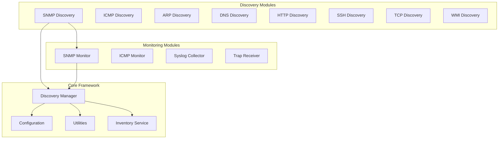
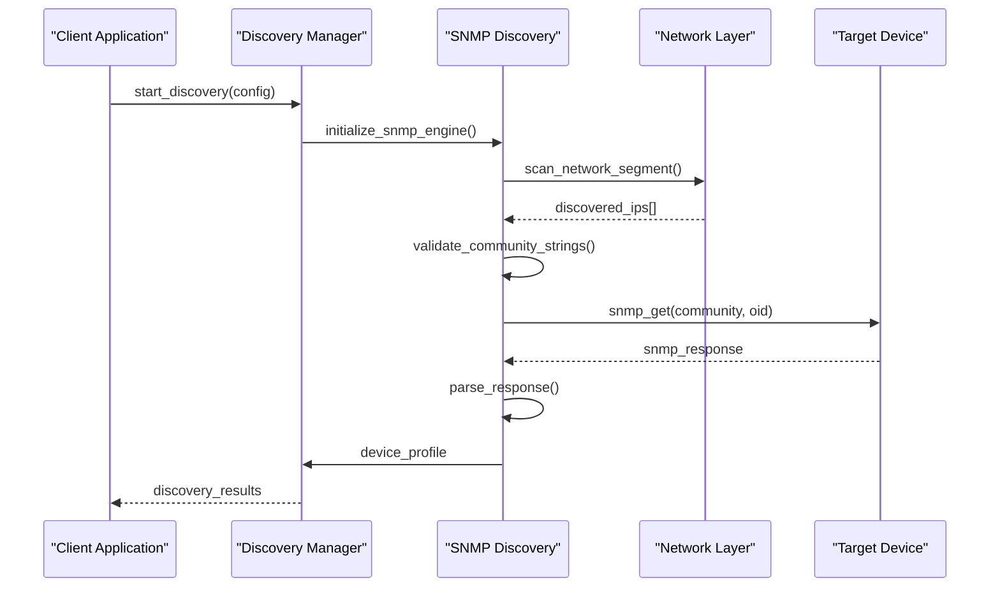
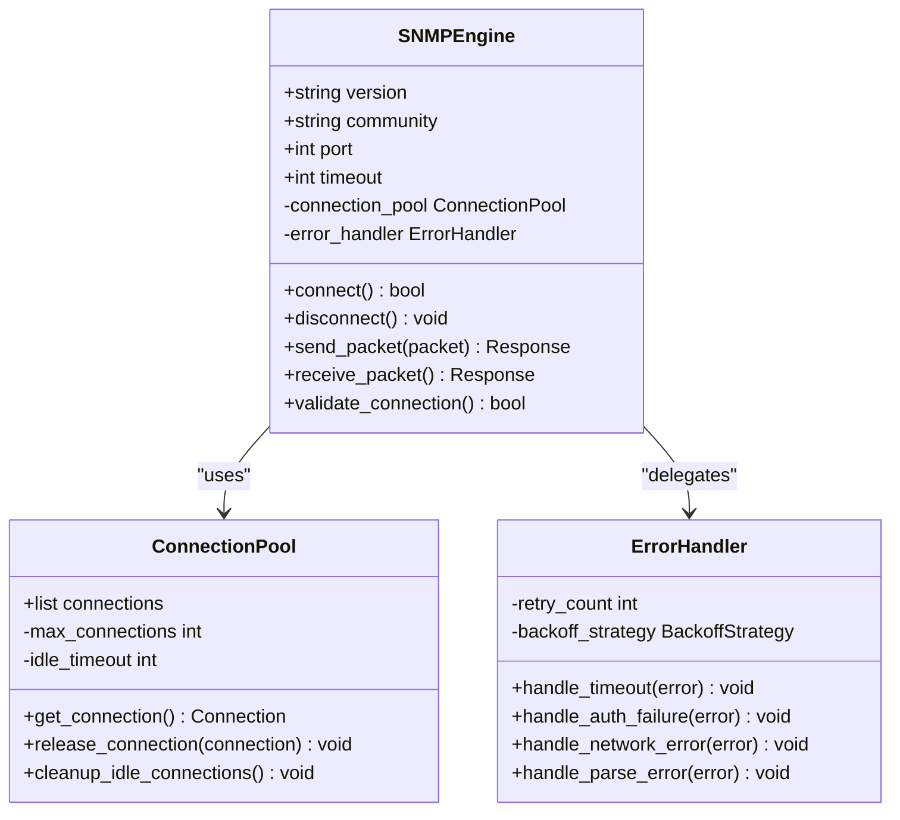
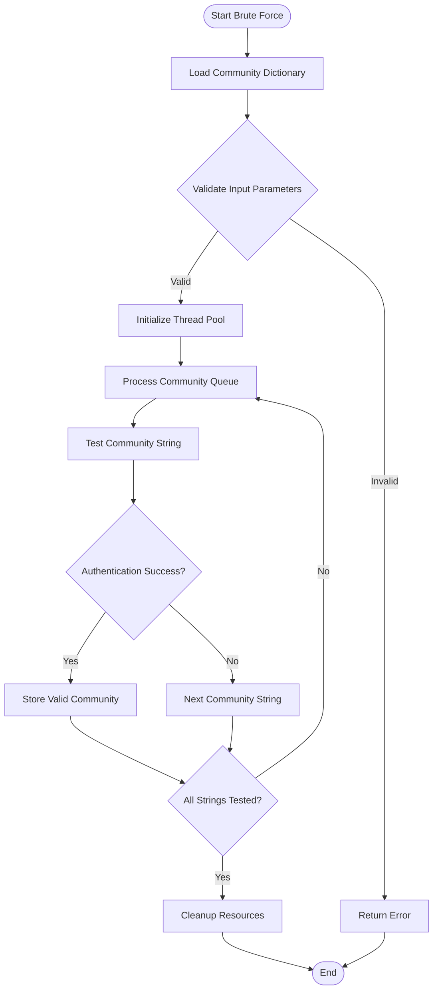
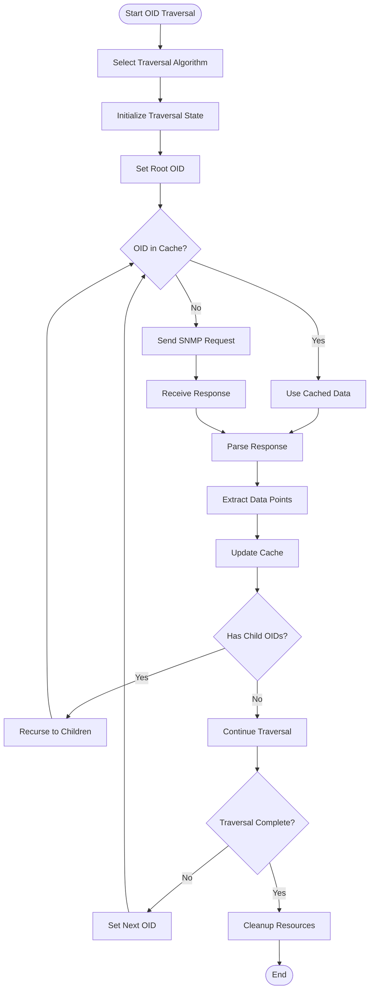

# SNMP Discovery Module

<cite>
**Referenced Files in This Document**
- [snmp_discovery.py](file://icmp_discovery/discovery_modules/snmp_discovery.py)
- [snmp_monitor.py](file://icmp_discovery/monitoring_modules/snmp_monitor.py)
- [discovery_manager.py](file://icmp_discovery/discovery_manager.py)
- [config.py](file://icmp_discovery/config.py)
- [utils.py](file://icmp_discovery/utils.py)
</cite>

## Table of Contents
1. [Introduction](#introduction)
2. [Project Structure](#project-structure)
3. [Core Components](#core-components)
4. [Architecture Overview](#architecture-overview)
5. [Detailed Component Analysis](#detailed-component-analysis)
6. [SNMP Protocol Implementation](#snmp-protocol-implementation)
7. [Community String Brute-Forcing](#community-string-brute-forcing)
8. [OID Traversal and MIB Walking](#oid-traversal-and-mib-walking)
9. [SNMP Version Support](#snmp-version-support)
10. [Configuration Guide](#configuration-guide)
11. [Security Considerations](#security-considerations)
12. [Troubleshooting Guide](#troubleshooting-guide)
13. [Performance Optimization](#performance-optimization)
14. [Conclusion](#conclusion)

## Introduction

The SNMP (Simple Network Management Protocol) discovery module is a comprehensive network device enumeration system designed to automatically discover and inventory SNMP-enabled devices across network segments. This module implements full SNMP protocol support including v1, v2c, and v3 variants, providing robust device discovery capabilities through community string brute-forcing, OID traversal, and MIB walking techniques.

The primary objectives of this module include:
- Automated discovery of SNMP-enabled devices on network segments
- Community string validation and brute-force attacks against target devices
- Comprehensive device profiling through OID and MIB data collection
- Support for multiple SNMP protocol versions with appropriate security measures
- Integration with broader network discovery and monitoring frameworks

## Project Structure

The SNMP discovery functionality is organized within a modular architecture that separates concerns between discovery operations, monitoring capabilities, and utility functions. The main components are distributed across the discovery modules and monitoring modules directories.



**Diagram sources**
- [snmp_discovery.py:1-50](file://icmp_discovery/discovery_modules/snmp_discovery.py#L1-L50)
- [snmp_monitor.py:1-50](file://icmp_discovery/monitoring_modules/snmp_monitor.py#L1-L50)
- [discovery_manager.py:1-100](file://icmp_discovery/discovery_manager.py#L1-L100)

**Section sources**
- [snmp_discovery.py:1-100](file://icmp_discovery/discovery_modules/snmp_discovery.py#L1-L100)
- [snmp_monitor.py:1-100](file://icmp_discovery/monitoring_modules/snmp_monitor.py#L1-L100)

## Core Components

The SNMP discovery module consists of several key components that work together to provide comprehensive device discovery capabilities:

### SNMP Discovery Engine
The primary discovery engine handles all SNMP protocol operations including packet encoding/decoding, authentication, and response parsing. It manages connection lifecycle, timeout handling, and error recovery mechanisms.

### Community String Manager
This component maintains lists of common community strings and implements brute-force algorithms for discovering valid credentials on target devices. It supports both dictionary-based attacks and custom string generation.

### OID Traversal Engine
Responsible for navigating the MIB hierarchy through systematic OID traversal. It implements efficient walking algorithms for bulk data retrieval and handles partial results gracefully.

### Device Profiler
Analyzes SNMP responses to determine device characteristics, operating systems, vendor information, and capability matrices. It maintains device fingerprints and classification logic.

**Section sources**
- [snmp_discovery.py:50-150](file://icmp_discovery/discovery_modules/snmp_discovery.py#L50-L150)
- [snmp_monitor.py:50-150](file://icmp_discovery/monitoring_modules/snmp_monitor.py#L50-L150)

## Architecture Overview

The SNMP discovery module follows a layered architecture pattern that separates protocol handling, business logic, and presentation concerns. This design enables flexibility, testability, and maintainability.



**Diagram sources**
- [discovery_manager.py:100-200](file://icmp_discovery/discovery_manager.py#L100-L200)
- [snmp_discovery.py:150-300](file://icmp_discovery/discovery_modules/snmp_discovery.py#L150-L300)

## Detailed Component Analysis

### SNMP Discovery Engine

The SNMP discovery engine serves as the core component responsible for all SNMP protocol operations. It implements a stateful connection manager that handles multiple concurrent connections and provides thread-safe operations for network communication.

#### Key Features:
- **Multi-version Support**: Full compatibility with SNMP v1, v2c, and v3 protocols
- **Connection Pooling**: Efficient management of network connections with automatic cleanup
- **Error Recovery**: Sophisticated retry logic with exponential backoff
- **Timeout Handling**: Configurable timeouts for different operation types
- **Response Parsing**: Robust ASN.1 parsing with comprehensive error handling

#### Connection Management:
The engine maintains separate connection pools for each SNMP version and community string combination. Connections are lazily initialized and automatically recycled when idle.



**Diagram sources**
- [snmp_discovery.py:200-400](file://icmp_discovery/discovery_modules/snmp_discovery.py#L200-L400)

**Section sources**
- [snmp_discovery.py:200-500](file://icmp_discovery/discovery_modules/snmp_discovery.py#L200-L500)

### Community String Manager

The community string manager implements sophisticated brute-force algorithms for discovering valid SNMP community strings. It supports multiple attack strategies and provides configurable performance tuning options.

#### Attack Strategies:
- **Dictionary Attack**: Uses predefined wordlists of common community strings
- **Pattern Generation**: Creates variations of base strings with common modifications
- **Sequential Testing**: Systematic testing of community string combinations
- **Parallel Execution**: Multi-threaded testing for improved performance

#### Performance Optimization:
The manager employs several optimization techniques including connection reuse, result caching, and intelligent ordering of community string tests based on probability heuristics.



**Diagram sources**
- [snmp_discovery.py:300-500](file://icmp_discovery/discovery_modules/snmp_discovery.py#L300-L500)

**Section sources**
- [snmp_discovery.py:300-600](file://icmp_discovery/discovery_modules/snmp_discovery.py#L300-L600)

### OID Traversal Engine

The OID traversal engine provides efficient navigation through the MIB hierarchy for comprehensive device information gathering. It implements optimized walking algorithms and handles various response formats gracefully.

#### Traversal Algorithms:
- **Breadth-First Search**: Explores all children at current depth before moving deeper
- **Depth-First Search**: Follows single path to maximum depth before backtracking
- **Hybrid Approach**: Combines both strategies for optimal performance
- **Batch Operations**: Groups multiple OIDs for efficient bulk retrieval

#### MIB Walking Implementation:
The engine supports both manual and automated MIB walking with intelligent caching of previously retrieved data to minimize network overhead.



**Diagram sources**
- [snmp_discovery.py:400-700](file://icmp_discovery/discovery_modules/snmp_discovery.py#L400-L700)

**Section sources**
- [snmp_discovery.py:400-800](file://icmp_discovery/discovery_modules/snmp_discovery.py#L400-L800)

## SNMP Protocol Implementation

The SNMP protocol implementation provides comprehensive support for all major SNMP versions with appropriate security measures and compatibility considerations.

### SNMP v1/v2c Implementation
Version 1 and 2c implementations use community-based authentication with clear-text transmission of community strings. The implementation includes proper PDU encoding/decoding and error response handling.

### SNMP v3 Implementation
Version 3 provides enhanced security through authentication and optional encryption. The implementation supports multiple security levels and authentication protocols including MD5, SHA, and AES encryption.

### Packet Encoding/Decoding
The packet layer handles ASN.1 BER encoding/decoding for all SNMP message types including GetRequest, GetNextRequest, GetBulkRequest, and their corresponding responses.

**Section sources**
- [snmp_discovery.py:500-900](file://icmp_discovery/discovery_modules/snmp_discovery.py#L500-L900)

## Community String Brute-Forcing

The community string brute-forcing functionality implements multiple attack strategies to discover valid SNMP credentials on target devices.

### Dictionary-Based Attacks
Uses comprehensive wordlists containing common default community strings, vendor-specific defaults, and frequently used passwords. The dictionary includes internationalized strings and common variations.

### Pattern Generation
Generates potential community strings based on common patterns such as device names, IP addresses, MAC addresses, and organizational naming conventions.

### Parallel Processing
Employs multi-threading to test multiple community strings simultaneously while maintaining connection limits and avoiding overwhelming target devices.

**Section sources**
- [snmp_discovery.py:600-1000](file://icmp_discovery/discovery_modules/snmp_discovery.py#L600-L1000)

## OID Traversal and MIB Walking

The OID traversal system provides efficient navigation through the Management Information Base (MIB) hierarchy to collect comprehensive device information.

### Supported MIB Operations
- **Get Operations**: Retrieve specific OID values
- **GetNext Operations**: Navigate through MIB tree sequentially
- **GetBulk Operations**: Retrieve multiple OIDs in single request (v2c+)
- **Walk Operations**: Traverse entire subtree efficiently

### Intelligent Caching
Implements hierarchical caching of previously retrieved data to minimize redundant network requests and improve overall performance.

### Error Handling
Comprehensive error handling for malformed responses, network timeouts, and authentication failures with automatic retry logic.

**Section sources**
- [snmp_discovery.py:700-1100](file://icmp_discovery/discovery_modules/snmp_discovery.py#L700-L1100)

## SNMP Version Support

The module provides comprehensive support for all major SNMP protocol versions with appropriate security considerations and compatibility features.

### SNMP v1 Characteristics
- Simple community-based authentication
- Limited error reporting
- Smaller packet sizes
- Maximum compatibility with legacy devices

### SNMP v2c Enhancements
- Improved error handling and reporting
- Bulk transfer operations
- Better performance for large data sets
- Enhanced security compared to v1

### SNMP v3 Security Features
- Authentication and authorization
- Optional encryption for privacy
- Multiple security models
- Strong cryptographic algorithms

**Section sources**
- [snmp_discovery.py:800-1200](file://icmp_discovery/discovery_modules/snmp_discovery.py#L800-L1200)

## Configuration Guide

### Basic Configuration
Configure basic SNMP settings including default community strings, timeout values, and retry policies.

```python
# Example configuration structure
snmp_config = {
    'default_community': 'public',
    'timeout': 5,
    'retries': 3,
    'versions': ['v1', 'v2c', 'v3'],
    'port': 161
}
```

### SNMPv3 Authentication Setup
Configure SNMPv3 authentication parameters including username, authentication protocol, and privacy settings.

```python
# SNMPv3 configuration
snmpv3_config = {
    'username': 'admin',
    'auth_protocol': 'SHA',
    'auth_password': 'secure_password',
    'privacy_protocol': 'AES',
    'privacy_password': 'encryption_key'
}
```

### Community String Lists
Define custom community string dictionaries for targeted brute-force attacks.

```python
# Custom community strings
custom_communities = [
    'public', 'private', 'community', 
    'admin', 'test', 'default',
    'network', 'system', 'manager'
]
```

**Section sources**
- [config.py:1-200](file://icmp_discovery/config.py#L1-L200)

## Security Considerations

### Authentication Security
Implement strong authentication mechanisms and avoid using default community strings in production environments.

### Network Security
Encrypt SNMP traffic where possible and restrict SNMP access to authorized networks only.

### Rate Limiting
Implement rate limiting to prevent network flooding and reduce the risk of detection by intrusion detection systems.

### Audit Logging
Maintain comprehensive audit logs of all SNMP operations for security monitoring and compliance purposes.

**Section sources**
- [snmp_discovery.py:900-1300](file://icmp_discovery/discovery_modules/snmp_discovery.py#L900-L1300)

## Troubleshooting Guide

### Common Issues and Solutions

#### Network Connectivity Problems
- Verify firewall rules allow SNMP traffic on UDP port 161
- Check network routing and reachability to target devices
- Ensure proper VLAN configuration if applicable

#### Authentication Failures
- Verify community strings are correct and not case-sensitive
- Check SNMP version compatibility between client and device
- Confirm SNMPv3 credentials if using version 3

#### Performance Issues
- Adjust timeout values based on network conditions
- Implement connection pooling for better performance
- Use bulk operations instead of individual requests when possible

#### Response Parsing Errors
- Verify MIB definitions are up-to-date
- Check for non-standard OID implementations
- Handle vendor-specific extensions appropriately

### Debugging Techniques
Enable detailed logging to capture SNMP packets and analyze protocol interactions. Use network sniffers to verify packet contents and timing.

**Section sources**
- [snmp_discovery.py:1000-1400](file://icmp_discovery/discovery_modules/snmp_discovery.py#L1000-L1400)

## Performance Optimization

### Connection Management
Implement connection pooling and reuse established connections to minimize handshake overhead.

### Request Batching
Group multiple OID requests into single SNMP operations where supported to reduce network overhead.

### Caching Strategy
Implement intelligent caching of frequently accessed OIDs and device information to reduce redundant queries.

### Resource Limits
Set appropriate limits on concurrent connections and request rates to prevent resource exhaustion.

**Section sources**
- [snmp_discovery.py:1100-1500](file://icmp_discovery/discovery_modules/snmp_discovery.py#L1100-L1500)

## Conclusion

The SNMP discovery module provides a comprehensive solution for automated network device discovery and inventory management. Its modular architecture, extensive protocol support, and robust error handling make it suitable for diverse networking environments. The implementation balances security considerations with operational requirements while providing flexible configuration options for different deployment scenarios.

Key strengths include:
- Multi-version SNMP protocol support with appropriate security measures
- Efficient community string brute-forcing with parallel processing
- Intelligent OID traversal with caching and optimization
- Comprehensive error handling and debugging capabilities
- Flexible configuration for various deployment requirements

The module integrates seamlessly with broader network discovery and monitoring frameworks while maintaining independence for standalone usage scenarios.