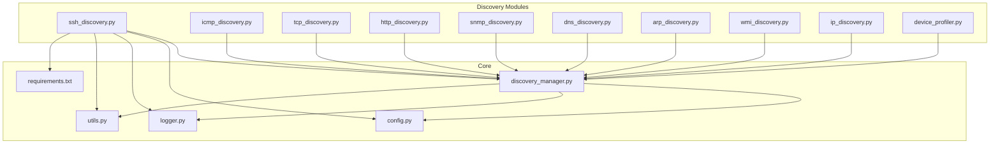
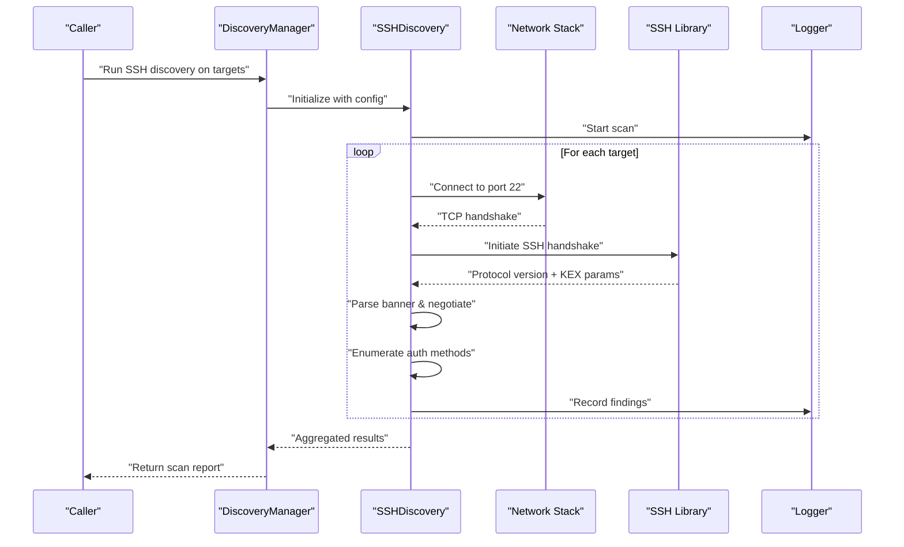
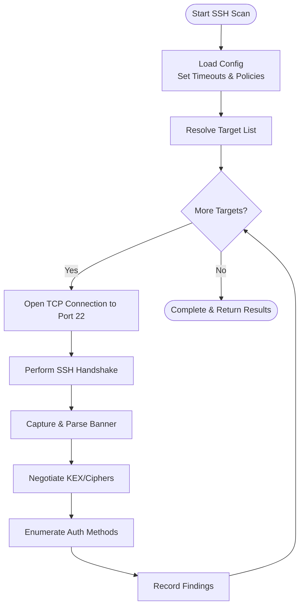
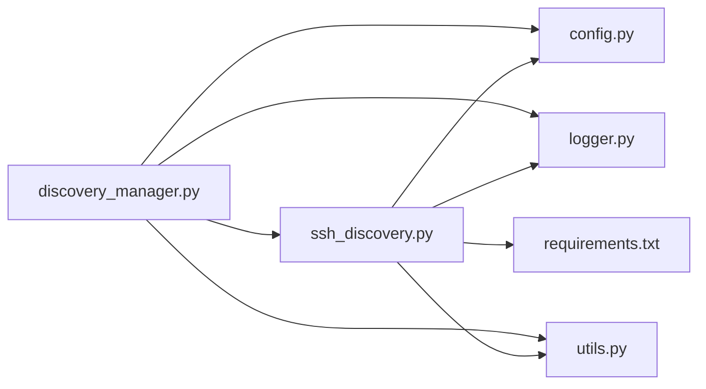

# SSH Discovery Module

<cite>
**Referenced Files in This Document**
- [ssh_discovery.py](file://icmp_discovery/discovery_modules/ssh_discovery.py)
- [discovery_manager.py](file://icmp_discovery/discovery_manager.py)
- [config.py](file://icmp_discovery/config.py)
- [logger.py](file://icmp_discovery/logger.py)
- [utils.py](file://icmp_discovery/utils.py)
- [requirements.txt](file://icmp_discovery/requirements.txt)
</cite>

## Table of Contents
1. [Introduction](#introduction)
2. [Project Structure](#project-structure)
3. [Core Components](#core-components)
4. [Architecture Overview](#architecture-overview)
5. [Detailed Component Analysis](#detailed-component-analysis)
6. [Dependency Analysis](#dependency-analysis)
7. [Performance Considerations](#performance-considerations)
8. [Troubleshooting Guide](#troubleshooting-guide)
9. [Conclusion](#conclusion)
10. [Appendices](#appendices)

## Introduction
This document explains the SSH discovery module that performs SSH-based service detection across target hosts. It covers banner grabbing, version fingerprinting, and authentication method enumeration. It also documents how SSH connections are established, key exchange negotiation is handled, and protocol versions are detected. Guidance is provided for configuring SSH clients, handling different SSH implementations, managing connection pools, interpreting banners, and addressing security considerations such as encryption algorithms, authentication methods, and safe credential handling practices.

## Project Structure
The SSH discovery functionality resides under the discovery modules package and integrates with the broader discovery manager, configuration, logging, utilities, and dependency definitions.

**Diagram sources**
- [ssh_discovery.py](file://icmp_discovery/discovery_modules/ssh_discovery.py)
- [discovery_manager.py](file://icmp_discovery/discovery_manager.py)
- [config.py](file://icmp_discovery/config.py)
- [logger.py](file://icmp_discovery/logger.py)
- [utils.py](file://icmp_discovery/utils.py)
- [requirements.txt](file://icmp_discovery/requirements.txt)

**Section sources**
- [ssh_discovery.py](file://icmp_discovery/discovery_modules/ssh_discovery.py)
- [discovery_manager.py](file://icmp_discovery/discovery_manager.py)
- [config.py](file://icmp_discovery/config.py)
- [logger.py](file://icmp_discovery/logger.py)
- [utils.py](file://icmp_discovery/utils.py)
- [requirements.txt](file://icmp_discovery/requirements.txt)

## Core Components
- SSH Discovery Module: Implements SSH-specific scanning logic including banner capture, version inference, and authentication method enumeration. It encapsulates connection lifecycle management and error handling.
- Discovery Manager: Orchestrates multiple discovery modules, coordinates execution, and aggregates results from SSH and other scanners.
- Configuration: Centralizes settings such as timeouts, concurrency, allowed ciphers/auth methods, and credential stores.
- Logger: Provides structured logging for scan progress, errors, and findings.
- Utilities: Common helpers for networking, parsing, and data normalization used by the SSH module.
- Requirements: Declares external dependencies (e.g., SSH libraries) required to run the module.

Key responsibilities:
- Establish secure SSH sessions with robust timeout and retry policies.
- Extract and parse SSH banners to infer software and version.
- Enumerate supported authentication methods without triggering account lockouts.
- Normalize findings into a consistent schema for downstream consumers.

**Section sources**
- [ssh_discovery.py](file://icmp_discovery/discovery_modules/ssh_discovery.py)
- [discovery_manager.py](file://icmp_discovery/discovery_manager.py)
- [config.py](file://icmp_discovery/config.py)
- [logger.py](file://icmp_discovery/logger.py)
- [utils.py](file://icmp_discovery/utils.py)
- [requirements.txt](file://icmp_discovery/requirements.txt)

## Architecture Overview
The SSH discovery module integrates with the discovery pipeline through the discovery manager. It uses configuration-driven parameters to control behavior, logs all operations via the logger, and leverages utility functions for common tasks. External SSH libraries provide low-level protocol capabilities.

**Diagram sources**
- [discovery_manager.py](file://icmp_discovery/discovery_manager.py)
- [ssh_discovery.py](file://icmp_discovery/discovery_modules/ssh_discovery.py)
- [logger.py](file://icmp_discovery/logger.py)

## Detailed Component Analysis

### SSH Discovery Module
Responsibilities:
- Connect to remote SSH services with configurable timeouts and retries.
- Capture and interpret SSH banners to identify vendor and version.
- Negotiate key exchange and cipher suites according to policy.
- Enumerate supported authentication methods safely.
- Normalize outputs for integration with the discovery manager.

Operational flow:
- Initialize with configuration (timeouts, concurrency, allowed algorithms).
- Iterate over targets and attempt SSH handshakes.
- Parse server responses to extract banner and capabilities.
- Attempt minimal interactions to enumerate authentication methods.
- Aggregate and return structured results.

Error handling:
- Distinguish between network failures, protocol errors, and authentication restrictions.
- Retry transient errors with backoff where appropriate.
- Log detailed diagnostics while avoiding sensitive data exposure.

Security considerations:
- Enforce minimum protocol versions and disallow weak ciphers/KEX.
- Avoid sending credentials unless explicitly configured; prefer read-only enumeration.
- Sanitize logs to prevent leakage of secrets or hostnames.

**Diagram sources**
- [ssh_discovery.py](file://icmp_discovery/discovery_modules/ssh_discovery.py)
- [config.py](file://icmp_discovery/config.py)

**Section sources**
- [ssh_discovery.py](file://icmp_discovery/discovery_modules/ssh_discovery.py)
- [config.py](file://icmp_discovery/config.py)

### Discovery Manager Integration
Responsibilities:
- Coordinate execution of multiple discovery modules including SSH.
- Manage concurrency and resource limits.
- Aggregate results and handle cross-module dependencies.

Integration points:
- Accepts configuration for SSH scanning (ports, timeouts, algorithms).
- Invokes SSH discovery per target set and collects outcomes.
- Routes logs and metrics through shared logging infrastructure.

**Section sources**
- [discovery_manager.py](file://icmp_discovery/discovery_manager.py)

### Configuration Management
Responsibilities:
- Define SSH-specific settings: timeouts, retries, allowed algorithms, concurrency, and credential handling flags.
- Provide defaults and validation for safe operation.

Key aspects:
- Timeouts and retries to balance responsiveness and reliability.
- Algorithm allowlists to enforce security posture.
- Credential storage references and access controls.

**Section sources**
- [config.py](file://icmp_discovery/config.py)

### Logging and Diagnostics
Responsibilities:
- Emit structured logs for scan lifecycle, events, and errors.
- Ensure no sensitive information is logged inadvertently.

Best practices:
- Use log levels appropriately (debug for verbose details, info for progress, warning/error for issues).
- Mask secrets and tokens in logs.

**Section sources**
- [logger.py](file://icmp_discovery/logger.py)

### Utilities
Responsibilities:
- Provide helper functions for networking, parsing, and data normalization.
- Support SSH module with common operations like address resolution and string parsing.

**Section sources**
- [utils.py](file://icmp_discovery/utils.py)

### Dependencies
Responsibilities:
- Declare external libraries required for SSH operations (e.g., SSH client libraries).
- Pin versions to ensure compatibility and reproducibility.

**Section sources**
- [requirements.txt](file://icmp_discovery/requirements.txt)

## Dependency Analysis
The SSH discovery module depends on configuration, logging, utilities, and external SSH libraries. The discovery manager orchestrates its usage within the broader discovery ecosystem.

**Diagram sources**
- [ssh_discovery.py](file://icmp_discovery/discovery_modules/ssh_discovery.py)
- [discovery_manager.py](file://icmp_discovery/discovery_manager.py)
- [config.py](file://icmp_discovery/config.py)
- [logger.py](file://icmp_discovery/logger.py)
- [utils.py](file://icmp_discovery/utils.py)
- [requirements.txt](file://icmp_discovery/requirements.txt)

**Section sources**
- [ssh_discovery.py](file://icmp_discovery/discovery_modules/ssh_discovery.py)
- [discovery_manager.py](file://icmp_discovery/discovery_manager.py)
- [config.py](file://icmp_discovery/config.py)
- [logger.py](file://icmp_discovery/logger.py)
- [utils.py](file://icmp_discovery/utils.py)
- [requirements.txt](file://icmp_discovery/requirements.txt)

## Performance Considerations
- Concurrency: Tune parallelism to match network capacity and target responsiveness.
- Timeouts: Set reasonable connect and handshake timeouts to avoid blocking scans.
- Caching: Cache resolved addresses and repeated capability checks where safe.
- Resource Limits: Limit open connections and memory usage during large-scale scans.
- Selective Enumeration: Skip expensive operations when not needed (e.g., skip auth enumeration if only banner/version is required).

[No sources needed since this section provides general guidance]

## Troubleshooting Guide
Common issues and resolutions:
- Connection timeouts: Increase timeouts or verify firewall rules and port reachability.
- Protocol mismatches: Adjust allowed protocols and ciphers to match target implementations.
- Authentication enumeration failures: Ensure read-only mode and avoid sending credentials unless necessary.
- Inconsistent banners: Normalize vendor-specific formats and fallback to conservative version inference.
- Excessive retries: Reduce retry counts and adjust backoff strategies.

Diagnostic steps:
- Enable debug logging for handshake and negotiation phases.
- Validate configuration against target constraints.
- Isolate problematic hosts and test connectivity manually.

**Section sources**
- [logger.py](file://icmp_discovery/logger.py)
- [config.py](file://icmp_discovery/config.py)
- [ssh_discovery.py](file://icmp_discovery/discovery_modules/ssh_discovery.py)

## Conclusion
The SSH discovery module provides robust service detection capabilities, including banner grabbing, version fingerprinting, and authentication method enumeration. It integrates seamlessly with the discovery manager and adheres to security best practices through configurable algorithm policies and careful credential handling. Proper configuration, logging, and performance tuning enable reliable and safe scanning across diverse SSH implementations.

[No sources needed since this section summarizes without analyzing specific files]

## Appendices

### SSH Client Configuration Examples
- Basic connection with timeouts and allowed algorithms.
- Read-only mode for banner and version detection without credentials.
- Custom cipher and KEX allowlists aligned with organizational policy.

[No sources needed since this section provides general guidance]

### Interpreting SSH Banners
- Identify vendor strings and version numbers.
- Handle non-standard or truncated banners gracefully.
- Map vendor signatures to normalized product names and versions.

[No sources needed since this section provides general guidance]

### Security Considerations
- Enforce minimum SSH protocol versions.
- Disallow weak ciphers and KEX algorithms.
- Avoid storing plaintext credentials; use secure secret stores.
- Restrict enumeration actions to read-only where possible.

[No sources needed since this section provides general guidance]