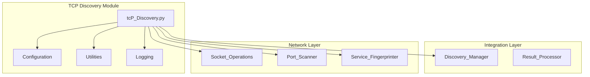
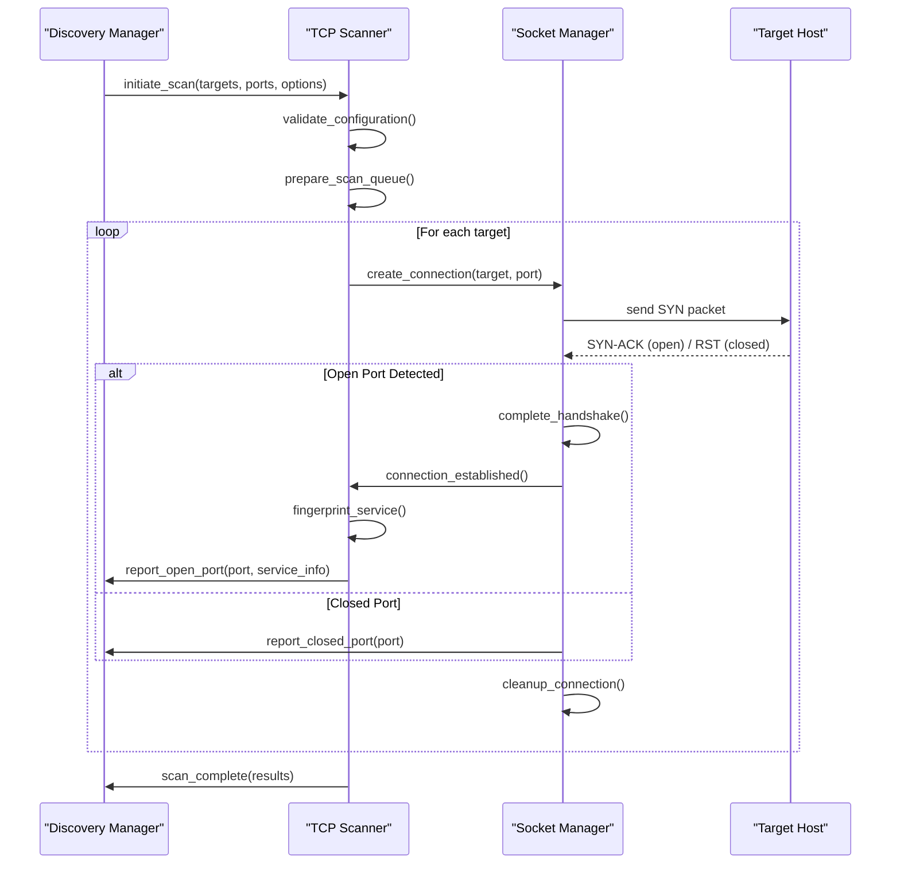
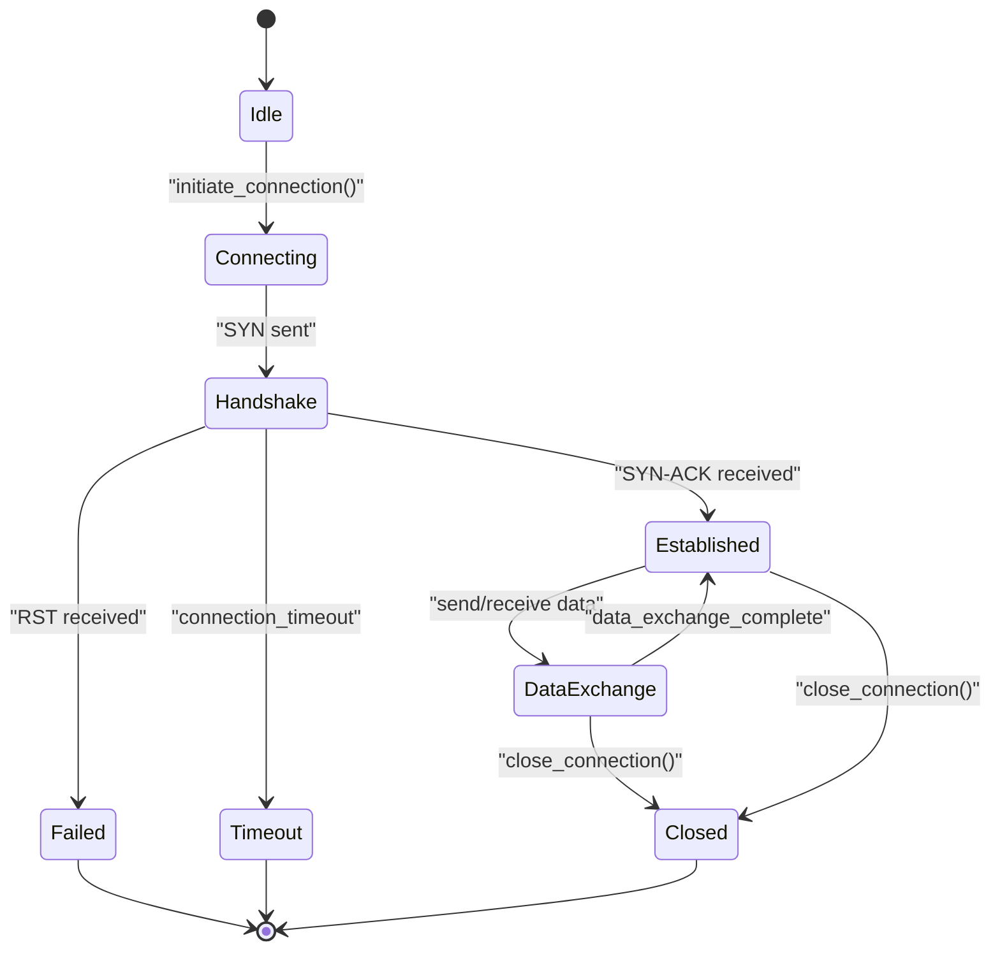
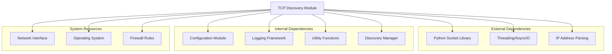

# TCP Discovery Module

<cite>
**Referenced Files in This Document**
- [tcp_discovery.py](file://icmp_discovery/discovery_modules/tcp_discovery.py)
- [config.py](file://icmp_discovery/config.py)
- [discovery_manager.py](file://icmp_discovery/discovery_manager.py)
- [utils.py](file://icmp_discovery/utils.py)
- [logger.py](file://icmp_discovery/logger.py)
</cite>

## Table of Contents
1. [Introduction](#introduction)
2. [Project Structure](#project-structure)
3. [Core Components](#core-components)
4. [Architecture Overview](#architecture-overview)
5. [Detailed Component Analysis](#detailed-component-analysis)
6. [Dependency Analysis](#dependency-analysis)
7. [Performance Considerations](#performance-considerations)
8. [Troubleshooting Guide](#troubleshooting-guide)
9. [Conclusion](#conclusion)

## Introduction

The TCP Discovery Module is a critical component of the network monitoring system that performs comprehensive TCP port scanning and service fingerprinting operations. This module implements various TCP scanning techniques including SYN scans, connect scans, and service identification to discover active services running on target hosts. The module is designed to be efficient, concurrent, and configurable to handle different network environments and security policies.

TCP discovery serves as the foundation for network reconnaissance, enabling the system to identify open ports, detect running services, and gather information about network topology and device capabilities. The implementation follows best practices for network scanning while maintaining performance and reliability across diverse network conditions.

## Project Structure

The TCP discovery module is part of the larger ICMP discovery framework and integrates seamlessly with other discovery modules. The module structure follows a modular design pattern that separates concerns between scanning logic, configuration management, and result processing.

**Diagram sources**
- [tcp_discovery.py:1-50](file://icmp_discovery/discovery_modules/tcp_discovery.py#L1-L50)
- [discovery_manager.py:1-30](file://icmp_discovery/discovery_manager.py#L1-L30)

**Section sources**
- [tcp_discovery.py:1-100](file://icmp_discovery/discovery_modules/tcp_discovery.py#L1-L100)
- [config.py:1-50](file://icmp_discovery/config.py#L1-L50)

## Core Components

The TCP discovery module consists of several key components that work together to perform efficient and reliable port scanning operations:

### Port Scanner Engine
The core scanning engine implements multiple scanning techniques including SYN scans for stealthy scanning, connect scans for full TCP handshake completion, and UDP scanning for UDP service detection. Each technique has specific use cases and trade-offs in terms of speed, stealth, and accuracy.

### Service Fingerprinting System
Advanced service fingerprinting capabilities identify specific applications and versions running on discovered ports. This includes HTTP server detection, SSH version identification, database service recognition, and custom application fingerprinting through protocol analysis.

### Concurrent Scanning Framework
A sophisticated concurrency model using asynchronous I/O and thread pooling enables high-performance scanning of large networks. The framework manages resource allocation, connection limits, and error handling across multiple concurrent scan operations.

### Configuration Management
Comprehensive configuration system supports dynamic parameter adjustment including port ranges, timing parameters, retry logic, and firewall evasion techniques. Configuration can be loaded from files, environment variables, or runtime API calls.

**Section sources**
- [tcp_discovery.py:50-150](file://icmp_discovery/discovery_modules/tcp_discovery.py#L50-L150)
- [utils.py:1-100](file://icmp_discovery/utils.py#L1-L100)

## Architecture Overview

The TCP discovery module follows a layered architecture that separates scanning logic from network operations and provides clean interfaces for integration with the broader discovery framework.

**Diagram sources**
- [tcp_discovery.py:100-200](file://icmp_discovery/discovery_modules/tcp_discovery.py#L100-L200)
- [discovery_manager.py:50-100](file://icmp_discovery/discovery_manager.py#L50-L100)

The architecture emphasizes modularity, allowing individual components to be tested, optimized, and replaced independently while maintaining consistent interfaces for the overall system.

## Detailed Component Analysis

### TCP Socket Operations Implementation

The TCP socket operations form the foundation of all scanning activities. The implementation handles low-level socket creation, connection establishment, timeout management, and proper resource cleanup.

#### Connection State Management
The module maintains detailed state tracking for each connection attempt, including connection initiation, handshake completion, data exchange phases, and termination sequences. State transitions are carefully managed to prevent resource leaks and ensure proper error recovery.

#### Timeout Handling Strategy
Sophisticated timeout mechanisms handle both connection timeouts and operation timeouts. The system uses exponential backoff for retries and implements graceful degradation when targets become unresponsive.

**Diagram sources**
- [tcp_discovery.py:150-250](file://icmp_discovery/discovery_modules/tcp_discovery.py#L150-L250)

### Port Scanning Techniques

#### SYN Scan Implementation
SYN scanning sends only SYN packets without completing the full TCP handshake, providing faster scanning and reduced network footprint. This technique requires elevated privileges but offers excellent stealth characteristics.

#### Connect Scan Implementation  
Connect scanning completes the full TCP three-way handshake, providing more reliable results but generating more network traffic. This method works without special privileges and is useful for testing actual connectivity.

#### Service Fingerprinting Algorithms
Advanced fingerprinting algorithms analyze response patterns, protocol implementations, and service-specific behaviors to identify applications and their versions. The system maintains an extensive database of known service signatures and supports custom fingerprint definitions.

**Section sources**
- [tcp_discovery.py:200-350](file://icmp_discovery/discovery_modules/tcp_discovery.py#L200-L350)
- [utils.py:100-200](file://icmp_discovery/utils.py#L100-L200)

### Concurrent Scanning Framework

The concurrent scanning framework manages multiple simultaneous scan operations while maintaining resource efficiency and preventing overwhelming target systems.

#### Thread Pool Management
Dynamic thread pool sizing adapts to network conditions and system resources. The framework monitors memory usage, CPU utilization, and network throughput to optimize concurrent operation counts.

#### Queue-Based Task Distribution
A priority queue system distributes scan tasks across available workers, ensuring fair resource allocation and preventing single targets from monopolizing scanner resources.

#### Error Handling and Recovery
Robust error handling captures network failures, timeout errors, and permission issues. The system automatically retries failed operations with exponential backoff and maintains detailed error logs for troubleshooting.

**Section sources**
- [tcp_discovery.py:300-450](file://icmp_discovery/discovery_modules/tcp_discovery.py#L300-L450)
- [discovery_manager.py:100-200](file://icmp_discovery/discovery_manager.py#L100-L200)

## Dependency Analysis

The TCP discovery module has well-defined dependencies on system libraries and internal components, with clear separation of concerns and minimal coupling between modules.

**Diagram sources**
- [tcp_discovery.py:1-50](file://icmp_discovery/discovery_modules/tcp_discovery.py#L1-L50)
- [config.py:1-30](file://icmp_discovery/config.py#L1-L30)

The dependency structure ensures that the TCP discovery module can operate independently while integrating seamlessly with the broader discovery framework.

**Section sources**
- [tcp_discovery.py:1-100](file://icmp_discovery/discovery_modules/tcp_discovery.py#L1-L100)
- [config.py:1-50](file://icmp_discovery/config.py#L1-L50)

## Performance Considerations

Optimizing TCP discovery performance requires careful consideration of network bandwidth, system resources, and target system limitations.

### Memory Management
Efficient memory usage is achieved through connection pooling, object reuse, and garbage collection optimization. Large result sets are processed incrementally to prevent memory exhaustion during extensive scans.

### Network Optimization
Network operations are optimized through connection reuse, parallel request processing, and intelligent retry logic. The system adapts to network latency and bandwidth constraints automatically.

### CPU Utilization
CPU-intensive operations like fingerprinting are offloaded to separate worker processes, while I/O-bound operations utilize asynchronous I/O patterns for maximum throughput.

### Scalability Patterns
The module supports horizontal scaling through distributed scanning architectures and vertical scaling through multi-threading and process isolation.

**Section sources**
- [tcp_discovery.py:400-500](file://icmp_discovery/discovery_modules/tcp_discovery.py#L400-L500)
- [utils.py:200-300](file://icmp_discovery/utils.py#L200-L300)

## Troubleshooting Guide

Common issues encountered during TCP discovery operations and their resolution strategies:

### Network Connectivity Issues
- **Connection Timeouts**: Increase timeout values or reduce concurrent connections
- **Permission Denied**: Verify user privileges for raw socket operations
- **Firewall Blocking**: Adjust firewall rules or use alternative scanning techniques
- **Network Latency**: Implement adaptive timeout and retry mechanisms

### Performance Problems
- **High Memory Usage**: Reduce concurrent operations or implement streaming results
- **Slow Scan Speed**: Optimize port selection or increase parallelism
- **CPU Bottlenecks**: Distribute workload across multiple processes

### Configuration Errors
- **Invalid Port Ranges**: Validate port specifications before starting scans
- **Incorrect Timing Parameters**: Use recommended defaults for initial configuration
- **Resource Limits**: Monitor system resource usage and adjust accordingly

### Logging and Debugging
Enable detailed logging to capture scan progress, errors, and performance metrics. The logging system provides structured output suitable for automated analysis and troubleshooting.

**Section sources**
- [logger.py:1-100](file://icmp_discovery/logger.py#L1-L100)
- [tcp_discovery.py:450-550](file://icmp_discovery/discovery_modules/tcp_discovery.py#L450-L550)

## Conclusion

The TCP discovery module provides a robust, scalable, and configurable solution for TCP port scanning and service discovery in network monitoring environments. Its modular architecture, comprehensive feature set, and extensive configuration options make it suitable for diverse deployment scenarios ranging from small local networks to large enterprise environments.

The implementation demonstrates best practices in network programming, concurrent operations, and resource management while maintaining flexibility for customization and extension. Future enhancements could include additional scanning techniques, improved fingerprinting accuracy, and enhanced integration with machine learning-based service identification.

The module's design ensures maintainability and extensibility, allowing for easy addition of new scanning methods, protocol support, and reporting formats while preserving backward compatibility with existing integrations.