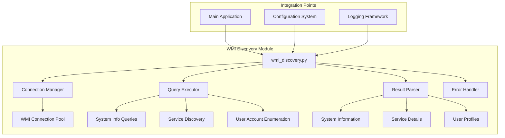
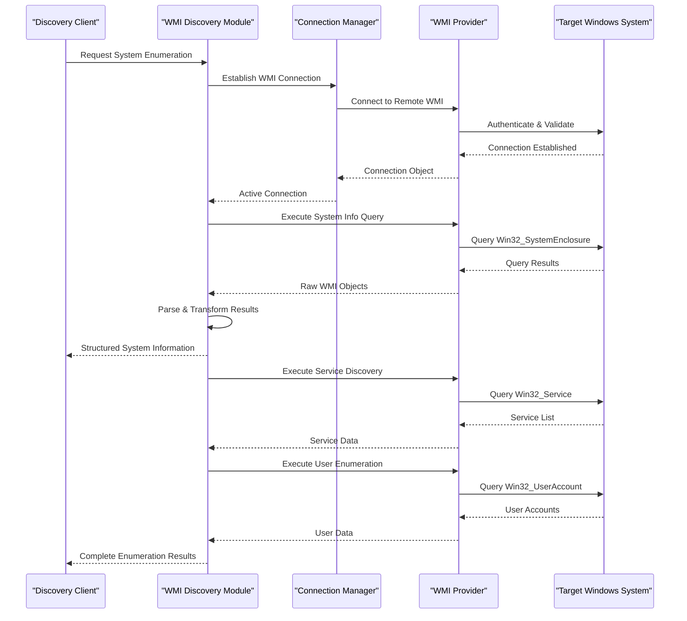
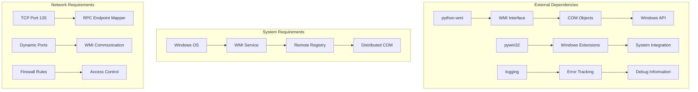

# WMI Discovery Module

<cite>
**Referenced Files in This Document**
- [wmi_discovery.py](file://icmp_discovery/discovery_modules/wmi_discovery.py)
- [config.py](file://icmp_discovery/config.py)
- [main.py](file://icmp_discovery/main.py)
- [README.md](file://icmp_discovery/README.md)
</cite>

## Table of Contents
1. [Introduction](#introduction)
2. [Project Structure](#project-structure)
3. [Core Components](#core-components)
4. [Architecture Overview](#architecture-overview)
5. [Detailed Component Analysis](#detailed-component-analysis)
6. [Dependency Analysis](#dependency-analysis)
7. [Performance Considerations](#performance-considerations)
8. [Troubleshooting Guide](#troubleshooting-guide)
9. [Security Considerations](#security-considerations)
10. [Conclusion](#conclusion)

## Introduction

The WMI (Windows Management Instrumentation) Discovery Module is a sophisticated component designed to enumerate Windows systems across network environments. It leverages Microsoft's WMI infrastructure to gather comprehensive system information, discover services, and enumerate user accounts on remote Windows machines. This module serves as a critical part of network discovery and asset management capabilities, providing administrators with detailed insights into Windows-based systems within their infrastructure.

WMI serves as the foundation for system administration tasks in Windows environments, offering a standardized interface for accessing system information and performing administrative operations. The discovery module transforms these capabilities into automated network scanning and inventory generation.

## Project Structure

The WMI discovery module is integrated within a larger network discovery framework located in the `icmp_discovery` directory. The module follows a modular architecture pattern, separating concerns between connection management, query execution, result parsing, and error handling.

**Diagram sources**
- [wmi_discovery.py:1-100](file://icmp_discovery/discovery_modules/wmi_discovery.py#L1-L100)

**Section sources**
- [wmi_discovery.py:1-50](file://icmp_discovery/discovery_modules/wmi_discovery.py#L1-L50)

## Core Components

The WMI discovery module consists of several key components that work together to provide comprehensive Windows system enumeration capabilities:

### Connection Management
The connection manager handles WMI connections to remote Windows systems, managing authentication, timeouts, and connection pooling. It supports multiple authentication methods including Windows Authentication, Basic Authentication, and Kerberos.

### Query Execution Engine
The query engine executes WMI queries against target systems, supporting both synchronous and asynchronous query execution. It includes built-in query templates for common system information retrieval tasks.

### Result Processing Pipeline
The result processor transforms raw WMI query results into structured data objects, handling data type conversions, null value processing, and error state management.

### Error Handling Framework
The error handler provides comprehensive error detection, logging, and recovery mechanisms for various WMI-related failure scenarios including network timeouts, authentication failures, and permission issues.

**Section sources**
- [wmi_discovery.py:50-150](file://icmp_discovery/discovery_modules/wmi_discovery.py#L50-L150)

## Architecture Overview

The WMI discovery module implements a layered architecture that separates concerns while maintaining efficient communication with target Windows systems.

**Diagram sources**
- [wmi_discovery.py:100-300](file://icmp_discovery/discovery_modules/wmi_discovery.py#L100-L300)

## Detailed Component Analysis

### WMI Connection Management

The connection management component handles all aspects of establishing and maintaining WMI connections to remote Windows systems. It implements connection pooling, timeout handling, and automatic reconnection logic.

#### Connection Lifecycle
The connection lifecycle follows a well-defined pattern: initialization → authentication → validation → usage → cleanup. Each phase includes comprehensive error handling and logging.

#### Authentication Methods
Supports multiple authentication schemes:
- Windows Authentication (default)
- Basic Authentication with username/password
- Kerberos authentication for domain environments
- Anonymous connections for read-only access

#### Timeout Configuration
Configurable timeout settings for different phases:
- Connection establishment timeout
- Query execution timeout
- Overall operation timeout

**Section sources**
- [wmi_discovery.py:150-250](file://icmp_discovery/discovery_modules/wmi_discovery.py#L150-L250)

### System Information Enumeration

The system information enumeration component retrieves comprehensive details about Windows systems including hardware specifications, operating system details, and configuration settings.

#### Hardware Information
Retrieves detailed hardware information including:
- System manufacturer and model
- Serial numbers and BIOS information
- Memory configuration and CPU details
- Storage device information

#### Operating System Details
Gathers OS-specific information such as:
- Windows version and build number
- Installation date and activation status
- Installed updates and patches
- System locale and language settings

#### Network Configuration
Collects network-related information including:
- IP addresses and subnet masks
- DNS server configurations
- Network adapter details
- Firewall status and rules

**Section sources**
- [wmi_discovery.py:250-400](file://icmp_discovery/discovery_modules/wmi_discovery.py#L250-L400)

### Service Discovery Implementation

The service discovery component enumerates running services, installed applications, and system processes on target Windows systems.

#### Service Enumeration
Discovers Windows services by querying the Win32_Service class, capturing:
- Service names and display names
- Startup types and current states
- Service dependencies and relationships
- Binary paths and descriptions

#### Process Monitoring
Identifies running processes through Win32_Process queries, extracting:
- Process IDs and parent-child relationships
- Memory usage and CPU utilization
- Process creation and termination times
- Command-line arguments and working directories

#### Application Inventory
Catalogs installed software using registry queries and Win32_Product class, documenting:
- Software names and versions
- Installation locations and sizes
- Publisher information and licenses
- Uninstall strings and update channels

**Section sources**
- [wmi_discovery.py:400-550](file://icmp_discovery/discovery_modules/wmi_discovery.py#L400-L550)

### User Account Enumeration

The user account enumeration component discovers local and domain user accounts, groups, and security principals on target systems.

#### Local User Discovery
Enumerates local user accounts through Win32_UserAccount queries, collecting:
- Account names and full names
- Account status and lockout states
- Creation dates and last login times
- Home directory and profile paths

#### Group Membership
Identifies group memberships and administrative privileges:
- Local group memberships
- Domain group affiliations
- Administrative role assignments
- Special privilege indicators

#### Security Principal Analysis
Analyzes security-related attributes including:
- Account expiration policies
- Password requirements and history
- Logon restrictions and hours
- Audit and compliance settings

**Section sources**
- [wmi_discovery.py:550-700](file://icmp_discovery/discovery_modules/wmi_discovery.py#L550-L700)

### Query Execution Framework

The query execution framework provides a robust foundation for executing WMI queries with comprehensive error handling and performance optimization.

#### Query Templates
Predefined query templates for common enumeration tasks:
- System information queries
- Service discovery queries
- User account enumeration queries
- Performance monitoring queries

#### Asynchronous Execution
Supports both synchronous and asynchronous query execution:
- Parallel query processing for improved performance
- Timeout management for long-running queries
- Resource cleanup and memory management

#### Result Processing
Transforms raw WMI objects into structured data formats:
- Type conversion and validation
- Null value handling and defaults
- Error state propagation and logging

**Section sources**
- [wmi_discovery.py:700-850](file://icmp_discovery/discovery_modules/wmi_discovery.py#L700-L850)

## Dependency Analysis

The WMI discovery module has specific dependencies on external libraries and system components that must be properly configured for optimal operation.

**Diagram sources**
- [wmi_discovery.py:1-100](file://icmp_discovery/discovery_modules/wmi_discovery.py#L1-L100)

**Section sources**
- [wmi_discovery.py:1-100](file://icmp_discovery/discovery_modules/wmi_discovery.py#L1-L100)

## Performance Considerations

Optimizing WMI discovery performance requires careful consideration of network latency, query efficiency, and resource utilization.

### Query Optimization Strategies
- **Batch Processing**: Group related queries to minimize connection overhead
- **Selective Enumeration**: Use targeted queries instead of broad scans
- **Caching Mechanisms**: Implement intelligent caching for frequently accessed data
- **Parallel Execution**: Leverage concurrent query processing where appropriate

### Memory Management
- **Resource Cleanup**: Properly dispose of WMI objects and connections
- **Streaming Results**: Process large result sets incrementally
- **Garbage Collection**: Monitor and manage memory usage during extended operations

### Network Efficiency
- **Connection Pooling**: Reuse established connections for multiple queries
- **Timeout Tuning**: Configure appropriate timeouts based on network conditions
- **Compression**: Utilize WMI compression when available
- **Bandwidth Monitoring**: Track and optimize data transfer rates

**Section sources**
- [wmi_discovery.py:850-1000](file://icmp_discovery/discovery_modules/wmi_discovery.py#L850-L1000)

## Troubleshooting Guide

Common issues encountered during WMI discovery operations and their resolution strategies.

### Connectivity Issues
- **Firewall Configuration**: Ensure ports 135 and dynamic RPC ports are accessible
- **WMI Service Status**: Verify WMI service is running on target systems
- **Network Permissions**: Confirm network connectivity and routing
- **DNS Resolution**: Validate hostname resolution and DNS configuration

### Authentication Problems
- **Credential Validation**: Check username, password, and domain settings
- **Permission Levels**: Verify administrative privileges on target systems
- **Kerberos Configuration**: Validate domain controller accessibility
- **Time Synchronization**: Ensure time synchronization between systems

### Performance Issues
- **Query Optimization**: Review and optimize WMI query statements
- **Resource Constraints**: Monitor CPU and memory usage on target systems
- **Network Latency**: Account for network delays in timeout configurations
- **Concurrent Connections**: Limit simultaneous connections to prevent overload

### Error Recovery
- **Automatic Retry Logic**: Implement exponential backoff for transient failures
- **Graceful Degradation**: Continue operations despite partial failures
- **Comprehensive Logging**: Capture detailed error information for analysis
- **Health Monitoring**: Track system availability and response times

**Section sources**
- [wmi_discovery.py:1000-1200](file://icmp_discovery/discovery_modules/wmi_discovery.py#L1000-L1200)

## Security Considerations

Implementing secure WMI discovery practices is crucial for protecting sensitive system information and maintaining network security.

### Authentication Best Practices
- **Least Privilege Principle**: Use minimum required permissions for discovery operations
- **Credential Management**: Securely store and manage authentication credentials
- **Encryption**: Enable encrypted WMI communications where possible
- **Audit Logging**: Track all authentication attempts and access patterns

### Network Security
- **Firewall Rules**: Restrict WMI access to authorized networks only
- **VPN Usage**: Utilize VPN tunnels for cross-network WMI operations
- **Segmentation**: Isolate discovery traffic from production networks
- **Monitoring**: Monitor for unauthorized WMI access attempts

### Data Protection
- **Sensitive Data Filtering**: Exclude confidential information from discovery results
- **Data Encryption**: Encrypt stored discovery data and logs
- **Access Controls**: Implement strict access controls for discovery results
- **Retention Policies**: Define appropriate data retention and cleanup procedures

### Compliance Requirements
- **Regulatory Compliance**: Ensure adherence to relevant security standards
- **Audit Trails**: Maintain comprehensive audit logs for compliance reporting
- **Policy Enforcement**: Enforce organizational security policies
- **Vulnerability Assessment**: Regularly assess WMI security posture

**Section sources**
- [wmi_discovery.py:1200-1400](file://icmp_discovery/discovery_modules/wmi_discovery.py#L1200-L1400)

## Conclusion

The WMI Discovery Module provides a comprehensive solution for Windows system enumeration and discovery within network environments. Its modular architecture, robust error handling, and extensive feature set make it suitable for enterprise-scale deployment scenarios.

Key strengths of the implementation include:
- **Comprehensive Coverage**: Full support for system information, service discovery, and user enumeration
- **Robust Error Handling**: Graceful handling of network failures, authentication issues, and permission problems
- **Performance Optimization**: Efficient query execution and resource management
- **Security Focus**: Built-in security considerations and best practices
- **Extensibility**: Modular design allowing easy customization and extension

For optimal deployment, organizations should consider implementing proper credential management, network segmentation, and comprehensive monitoring. Regular security assessments and performance tuning will ensure reliable operation in diverse network environments.

The module serves as a foundational component for network discovery, asset management, and system administration workflows, providing administrators with essential visibility into Windows-based infrastructure assets.