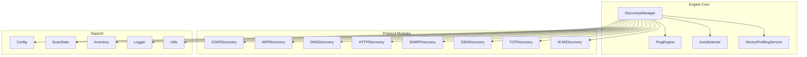
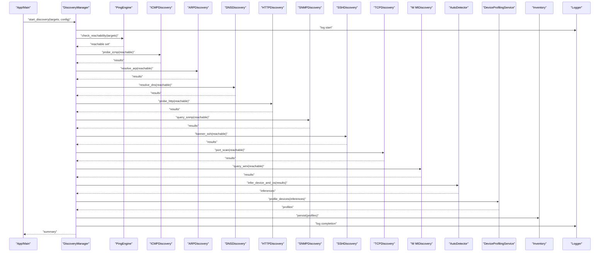
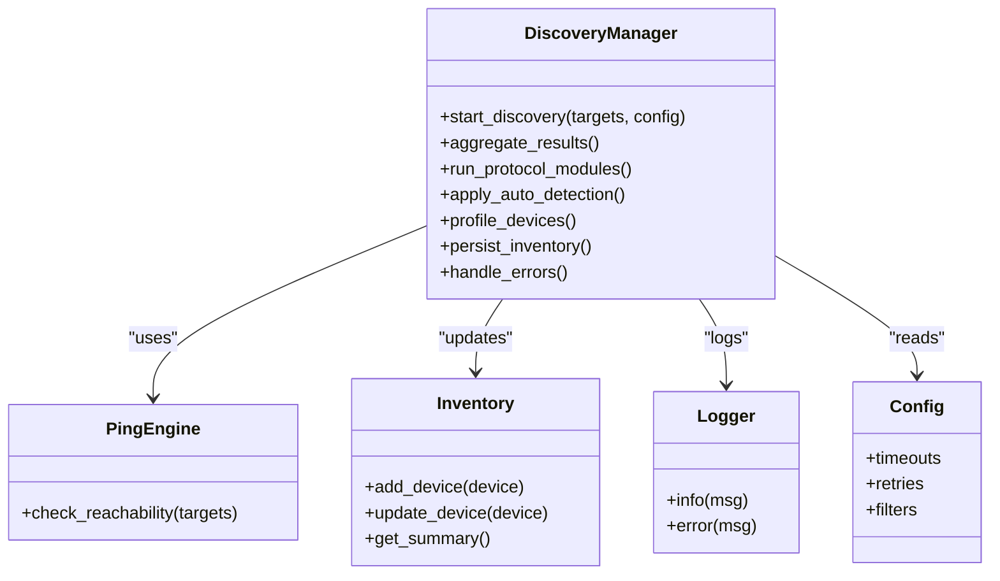
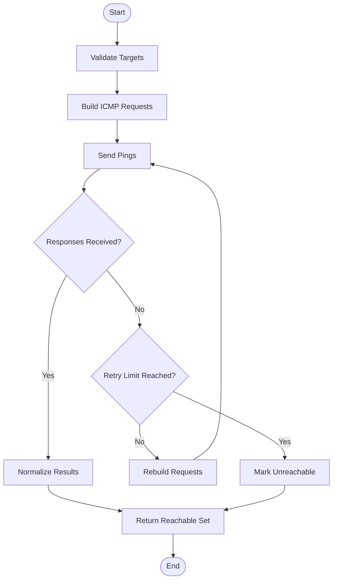
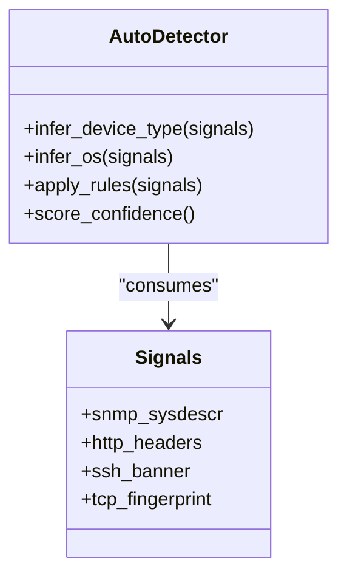
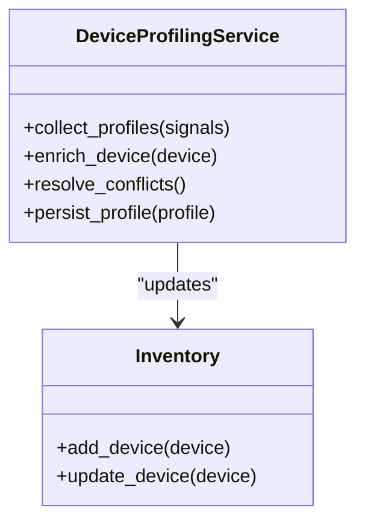
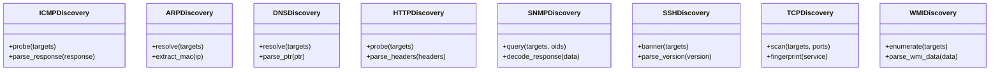
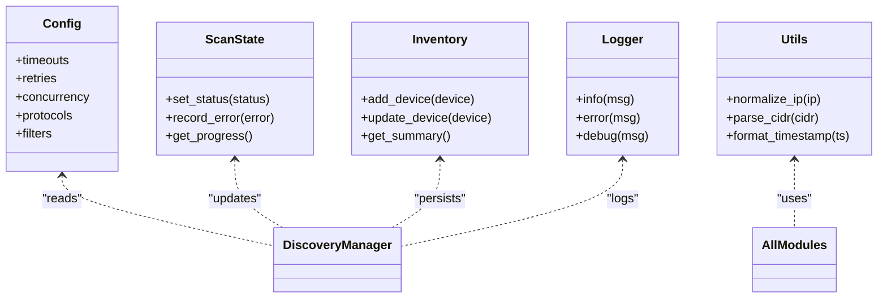
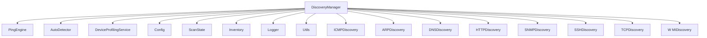

# ICMP Discovery Engine

<cite>
**Referenced Files in This Document**
- [discovery_manager.py](file://icmp_discovery/discovery_manager.py)
- [ping_engine.py](file://icmp_discovery/ping_engine.py)
- [auto_detector.py](file://icmp_discovery/auto_detector.py)
- [device_profiling_service.py](file://icmp_discovery/device_profiling_service.py)
- [icmp_discovery.py](file://icmp_discovery/discovery_modules/icmp_discovery.py)
- [arp_discovery.py](file://icmp_discovery/discovery_modules/arp_discovery.py)
- [dns_discovery.py](file://icmp_discovery/discovery_modules/dns_discovery.py)
- [http_discovery.py](file://icmp_discovery/discovery_modules/http_discovery.py)
- [snmp_discovery.py](file://icmp_discovery/discovery_modules/snmp_discovery.py)
- [ssh_discovery.py](file://icmp_discovery/discovery_modules/ssh_discovery.py)
- [tcp_discovery.py](file://icmp_discovery/discovery_modules/tcp_discovery.py)
- [wmi_discovery.py](file://icmp_discovery/discovery_modules/wmi_discovery.py)
- [config.py](file://icmp_discovery/config.py)
- [scan_state.py](file://icmp_discovery/scan_state.py)
- [inventory.py](file://icmp_discovery/inventory.py)
- [logger.py](file://icmp_discovery/logger.py)
- [utils.py](file://icmp_discovery/utils.py)
- [app.py](file://icmp_discovery/app.py)
- [main.py](file://icmp_discovery/main.py)
</cite>

## Table of Contents
1. [Introduction](#introduction)
2. [Project Structure](#project-structure)
3. [Core Components](#core-components)
4. [Architecture Overview](#architecture-overview)
5. [Detailed Component Analysis](#detailed-component-analysis)
6. [Dependency Analysis](#dependency-analysis)
7. [Performance Considerations](#performance-considerations)
8. [Troubleshooting Guide](#troubleshooting-guide)
9. [Conclusion](#conclusion)
10. [Appendices](#appendices)

## Introduction
This document explains the ICMP Discovery Engine core functionality, focusing on the discovery manager architecture that orchestrates multiple discovery protocols (ICMP, ARP, DNS, HTTP, SNMP, SSH, TCP, and WMI). It details the ping engine for network reachability testing and device detection, the auto-detector system for identifying device types and operating systems, and the device profiling service for gathering detailed device information. The guide also includes examples for developing custom discovery modules, configuration options for different network topologies, performance tuning parameters, error handling strategies, retry mechanisms, and network timeout configurations.

## Project Structure
The ICMP Discovery Engine is organized into modular components:
- Discovery Manager: Orchestrates protocol-specific discovery modules and coordinates scanning workflows.
- Ping Engine: Implements ICMP-based reachability checks and device detection heuristics.
- Auto Detector: Infers device type and OS from collected signals.
- Device Profiling Service: Enriches discovered devices with detailed attributes.
- Protocol Modules: Implement specific discovery logic for each protocol.
- Configuration and Utilities: Provide settings, logging, state management, and common helpers.

**Diagram sources**
- [discovery_manager.py](file://icmp_discovery/discovery_manager.py)
- [ping_engine.py](file://icmp_discovery/ping_engine.py)
- [auto_detector.py](file://icmp_discovery/auto_detector.py)
- [device_profiling_service.py](file://icmp_discovery/device_profiling_service.py)
- [icmp_discovery.py](file://icmp_discovery/discovery_modules/icmp_discovery.py)
- [arp_discovery.py](file://icmp_discovery/discovery_modules/arp_discovery.py)
- [dns_discovery.py](file://icmp_discovery/discovery_modules/dns_discovery.py)
- [http_discovery.py](file://icmp_discovery/discovery_modules/http_discovery.py)
- [snmp_discovery.py](file://icmp_discovery/discovery_modules/snmp_discovery.py)
- [ssh_discovery.py](file://icmp_discovery/discovery_modules/ssh_discovery.py)
- [tcp_discovery.py](file://icmp_discovery/discovery_modules/tcp_discovery.py)
- [wmi_discovery.py](file://icmp_discovery/discovery_modules/wmi_discovery.py)
- [config.py](file://icmp_discovery/config.py)
- [scan_state.py](file://icmp_discovery/scan_state.py)
- [inventory.py](file://icmp_discovery/inventory.py)
- [logger.py](file://icmp_discovery/logger.py)
- [utils.py](file://icmp_discovery/utils.py)

**Section sources**
- [discovery_manager.py](file://icmp_discovery/discovery_manager.py)
- [config.py](file://icmp_discovery/config.py)
- [scan_state.py](file://icmp_discovery/scan_state.py)
- [inventory.py](file://icmp_discovery/inventory.py)
- [logger.py](file://icmp_discovery/logger.py)
- [utils.py](file://icmp_discovery/utils.py)

## Core Components
- Discovery Manager: Central orchestrator that schedules and executes discovery across multiple protocols, aggregates results, and updates inventory and scan state.
- Ping Engine: Provides fast reachability checks using ICMP echo requests and optional heuristics to detect responsive devices.
- Auto Detector: Analyzes signals (e.g., banners, SNMP sysDescr, HTTP headers, SSH version strings) to infer device type and OS.
- Device Profiling Service: Collects and enriches device attributes such as hostname, MAC address, vendor, firmware, and open ports.

Key responsibilities and interactions are implemented across the following files:
- Orchestration and workflow control: [discovery_manager.py](file://icmp_discovery/discovery_manager.py)
- Reachability and basic probing: [ping_engine.py](file://icmp_discovery/ping_engine.py)
- Device and OS inference: [auto_detector.py](file://icmp_discovery/auto_detector.py)
- Detailed profiling: [device_profiling_service.py](file://icmp_discovery/device_profiling_service.py)
- Protocol implementations: [icmp_discovery.py](file://icmp_discovery/discovery_modules/icmp_discovery.py), [arp_discovery.py](file://icmp_discovery/discovery_modules/arp_discovery.py), [dns_discovery.py](file://icmp_discovery/discovery_modules/dns_discovery.py), [http_discovery.py](file://icmp_discovery/discovery_modules/http_discovery.py), [snmp_discovery.py](file://icmp_discovery/discovery_modules/snmp_discovery.py), [ssh_discovery.py](file://icmp_discovery/discovery_modules/ssh_discovery.py), [tcp_discovery.py](file://icmp_discovery/discovery_modules/tcp_discovery.py), [wmi_discovery.py](file://icmp_discovery/discovery_modules/wmi_discovery.py)
- Configuration and utilities: [config.py](file://icmp_discovery/config.py), [utils.py](file://icmp_discovery/utils.py), [logger.py](file://icmp_discovery/logger.py), [scan_state.py](file://icmp_discovery/scan_state.py), [inventory.py](file://icmp_discovery/inventory.py)

**Section sources**
- [discovery_manager.py](file://icmp_discovery/discovery_manager.py)
- [ping_engine.py](file://icmp_discovery/ping_engine.py)
- [auto_detector.py](file://icmp_discovery/auto_detector.py)
- [device_profiling_service.py](file://icmp_discovery/device_profiling_service.py)
- [icmp_discovery.py](file://icmp_discovery/discovery_modules/icmp_discovery.py)
- [arp_discovery.py](file://icmp_discovery/discovery_modules/arp_discovery.py)
- [dns_discovery.py](file://icmp_discovery/discovery_modules/dns_discovery.py)
- [http_discovery.py](file://icmp_discovery/discovery_modules/http_discovery.py)
- [snmp_discovery.py](file://icmp_discovery/discovery_modules/snmp_discovery.py)
- [ssh_discovery.py](file://icmp_discovery/discovery_modules/ssh_discovery.py)
- [tcp_discovery.py](file://icmp_discovery/discovery_modules/tcp_discovery.py)
- [wmi_discovery.py](file://icmp_discovery/discovery_modules/wmi_discovery.py)
- [config.py](file://icmp_discovery/config.py)
- [utils.py](file://icmp_discovery/utils.py)
- [logger.py](file://icmp_discovery/logger.py)
- [scan_state.py](file://icmp_discovery/scan_state.py)
- [inventory.py](file://icmp_discovery/inventory.py)

## Architecture Overview
The discovery pipeline begins with target selection and configuration, proceeds through layered probing (ICMP first, then ARP/DNS/HTTP/SNMP/SSH/TCP/WMI based on capabilities), applies auto-detection and profiling, and persists results to inventory while maintaining scan state.

**Diagram sources**
- [discovery_manager.py](file://icmp_discovery/discovery_manager.py)
- [ping_engine.py](file://icmp_discovery/ping_engine.py)
- [icmp_discovery.py](file://icmp_discovery/discovery_modules/icmp_discovery.py)
- [arp_discovery.py](file://icmp_discovery/discovery_modules/arp_discovery.py)
- [dns_discovery.py](file://icmp_discovery/discovery_modules/dns_discovery.py)
- [http_discovery.py](file://icmp_discovery/discovery_modules/http_discovery.py)
- [snmp_discovery.py](file://icmp_discovery/discovery_modules/snmp_discovery.py)
- [ssh_discovery.py](file://icmp_discovery/discovery_modules/ssh_discovery.py)
- [tcp_discovery.py](file://icmp_discovery/discovery_modules/tcp_discovery.py)
- [wmi_discovery.py](file://icmp_discovery/discovery_modules/wmi_discovery.py)
- [auto_detector.py](file://icmp_discovery/auto_detector.py)
- [device_profiling_service.py](file://icmp_discovery/device_profiling_service.py)
- [inventory.py](file://icmp_discovery/inventory.py)
- [logger.py](file://icmp_discovery/logger.py)

## Detailed Component Analysis

### Discovery Manager
Responsibilities:
- Coordinates multi-protocol discovery execution order and concurrency.
- Aggregates results from all modules and feeds them into auto-detection and profiling.
- Manages scan state and persistence to inventory.
- Applies configuration-driven filters and timeouts.

Key implementation aspects:
- Entry points for starting discovery and retrieving summaries.
- Integration with ping engine for initial reachability filtering.
- Dispatch to protocol modules with appropriate targets and credentials.
- Error aggregation and retry orchestration per module.

**Diagram sources**
- [discovery_manager.py](file://icmp_discovery/discovery_manager.py)
- [ping_engine.py](file://icmp_discovery/ping_engine.py)
- [inventory.py](file://icmp_discovery/inventory.py)
- [logger.py](file://icmp_discovery/logger.py)
- [config.py](file://icmp_discovery/config.py)

**Section sources**
- [discovery_manager.py](file://icmp_discovery/discovery_manager.py)

### Ping Engine
Responsibilities:
- Performs ICMP echo requests to determine host reachability.
- Optionally applies heuristics to improve detection accuracy (e.g., TTL analysis, response size).
- Exposes a simple interface for reachability checks used by the discovery manager.

Implementation highlights:
- Configurable timeouts and retries for robustness across varying network conditions.
- Concurrency controls to avoid overwhelming the network stack.
- Result normalization for downstream modules.

**Diagram sources**
- [ping_engine.py](file://icmp_discovery/ping_engine.py)

**Section sources**
- [ping_engine.py](file://icmp_discovery/ping_engine.py)

### Auto Detector
Responsibilities:
- Infers device type and operating system from signals gathered by various modules (e.g., SNMP sysDescr, HTTP Server header, SSH banner, TCP fingerprinting).
- Produces structured inferences consumed by the device profiling service.

Implementation highlights:
- Rule-based matching with confidence scoring.
- Fallback strategies when primary signals are missing or ambiguous.
- Extensible rule sets for new device families and OS signatures.

**Diagram sources**
- [auto_detector.py](file://icmp_discovery/auto_detector.py)

**Section sources**
- [auto_detector.py](file://icmp_discovery/auto_detector.py)

### Device Profiling Service
Responsibilities:
- Gathers and enriches device attributes (hostname, MAC, vendor, firmware, OS, services).
- Normalizes data across sources and resolves conflicts.
- Persists profiles to inventory and supports incremental updates.

Implementation highlights:
- Combines outputs from auto detector and protocol modules.
- Applies validation and deduplication rules.
- Supports batch operations for large networks.

**Diagram sources**
- [device_profiling_service.py](file://icmp_discovery/device_profiling_service.py)
- [inventory.py](file://icmp_discovery/inventory.py)

**Section sources**
- [device_profiling_service.py](file://icmp_discovery/device_profiling_service.py)

### Protocol Modules
Each protocol module implements a consistent interface for discovery:
- ICMPDiscovery: Echo request/reply processing and basic host info.
- ARPDiscovery: Local subnet neighbor discovery via ARP tables.
- DNSDiscovery: Reverse DNS lookups and PTR resolution.
- HTTPDiscovery: Banner grabbing and service identification via HTTP responses.
- SNMPDiscovery: OID queries for system information and interfaces.
- SSHDiscovery: Version banner parsing and capability negotiation.
- TCPDiscovery: Port scanning and service fingerprinting.
- W MIDiscovery: Windows-specific enumeration via WMI where applicable.

Common patterns:
- Target filtering and credential handling.
- Timeout and retry policies aligned with global configuration.
- Structured result formats for aggregation.

**Diagram sources**
- [icmp_discovery.py](file://icmp_discovery/discovery_modules/icmp_discovery.py)
- [arp_discovery.py](file://icmp_discovery/discovery_modules/arp_discovery.py)
- [dns_discovery.py](file://icmp_discovery/discovery_modules/dns_discovery.py)
- [http_discovery.py](file://icmp_discovery/discovery_modules/http_discovery.py)
- [snmp_discovery.py](file://icmp_discovery/discovery_modules/snmp_discovery.py)
- [ssh_discovery.py](file://icmp_discovery/discovery_modules/ssh_discovery.py)
- [tcp_discovery.py](file://icmp_discovery/discovery_modules/tcp_discovery.py)
- [wmi_discovery.py](file://icmp_discovery/discovery_modules/wmi_discovery.py)

**Section sources**
- [icmp_discovery.py](file://icmp_discovery/discovery_modules/icmp_discovery.py)
- [arp_discovery.py](file://icmp_discovery/discovery_modules/arp_discovery.py)
- [dns_discovery.py](file://icmp_discovery/discovery_modules/dns_discovery.py)
- [http_discovery.py](file://icmp_discovery/discovery_modules/http_discovery.py)
- [snmp_discovery.py](file://icmp_discovery/discovery_modules/snmp_discovery.py)
- [ssh_discovery.py](file://icmp_discovery/discovery_modules/ssh_discovery.py)
- [tcp_discovery.py](file://icmp_discovery/discovery_modules/tcp_discovery.py)
- [wmi_discovery.py](file://icmp_discovery/discovery_modules/wmi_discovery.py)

### Configuration and State Management
- Config: Centralized settings for timeouts, retries, concurrency, protocol enablement, and filters.
- ScanState: Tracks progress, errors, and intermediate states during discovery runs.
- Inventory: Stores discovered devices and their profiles; supports querying and summary generation.
- Logger: Structured logging for debugging and audit trails.
- Utils: Common helpers for networking, parsing, and formatting.

**Diagram sources**
- [config.py](file://icmp_discovery/config.py)
- [scan_state.py](file://icmp_discovery/scan_state.py)
- [inventory.py](file://icmp_discovery/inventory.py)
- [logger.py](file://icmp_discovery/logger.py)
- [utils.py](file://icmp_discovery/utils.py)

**Section sources**
- [config.py](file://icmp_discovery/config.py)
- [scan_state.py](file://icmp_discovery/scan_state.py)
- [inventory.py](file://icmp_discovery/inventory.py)
- [logger.py](file://icmp_discovery/logger.py)
- [utils.py](file://icmp_discovery/utils.py)

## Dependency Analysis
The discovery manager depends on protocol modules, ping engine, auto detector, device profiler, configuration, state, inventory, logger, and utilities. Protocol modules may depend on external libraries for SNMP, SSH, HTTP, and WMI operations.

**Diagram sources**
- [discovery_manager.py](file://icmp_discovery/discovery_manager.py)
- [ping_engine.py](file://icmp_discovery/ping_engine.py)
- [auto_detector.py](file://icmp_discovery/auto_detector.py)
- [device_profiling_service.py](file://icmp_discovery/device_profiling_service.py)
- [config.py](file://icmp_discovery/config.py)
- [scan_state.py](file://icmp_discovery/scan_state.py)
- [inventory.py](file://icmp_discovery/inventory.py)
- [logger.py](file://icmp_discovery/logger.py)
- [utils.py](file://icmp_discovery/utils.py)
- [icmp_discovery.py](file://icmp_discovery/discovery_modules/icmp_discovery.py)
- [arp_discovery.py](file://icmp_discovery/discovery_modules/arp_discovery.py)
- [dns_discovery.py](file://icmp_discovery/discovery_modules/dns_discovery.py)
- [http_discovery.py](file://icmp_discovery/discovery_modules/http_discovery.py)
- [snmp_discovery.py](file://icmp_discovery/discovery_modules/snmp_discovery.py)
- [ssh_discovery.py](file://icmp_discovery/discovery_modules/ssh_discovery.py)
- [tcp_discovery.py](file://icmp_discovery/discovery_modules/tcp_discovery.py)
- [wmi_discovery.py](file://icmp_discovery/discovery_modules/wmi_discovery.py)

**Section sources**
- [discovery_manager.py](file://icmp_discovery/discovery_manager.py)

## Performance Considerations
- Concurrency: Adjust worker pools per protocol to balance throughput and resource usage.
- Timeouts: Configure per-protocol timeouts to prevent slow probes from blocking pipelines.
- Retries: Use exponential backoff for transient failures; limit maximum attempts to avoid long delays.
- Filtering: Apply CIDR and hostname filters early to reduce unnecessary probing.
- Caching: Cache DNS resolutions and ARP entries where supported to minimize repeated queries.
- Batch Operations: Prefer batched SNMP/WMI queries to reduce round-trips.
- Memory: Stream results where possible to avoid loading large datasets into memory.

[No sources needed since this section provides general guidance]

## Troubleshooting Guide
Common issues and strategies:
- Network timeouts: Increase timeouts and retries; verify firewall rules and routing.
- Authentication failures: Validate credentials and access rights for SNMP/SSH/WMI.
- Incomplete results: Enable debug logging; check protocol-specific error logs.
- High CPU/Memory: Reduce concurrency; apply stricter filters; profile slow modules.
- Data inconsistencies: Review auto-detection rules and conflict resolution logic.

Operational tips:
- Use structured logs to trace discovery flows and pinpoint failures.
- Inspect scan state for progress and error accumulation.
- Validate inventory integrity with summary queries.

**Section sources**
- [logger.py](file://icmp_discovery/logger.py)
- [scan_state.py](file://icmp_discovery/scan_state.py)
- [inventory.py](file://icmp_discovery/inventory.py)

## Conclusion
The ICMP Discovery Engine provides a robust, extensible framework for discovering and profiling network devices across multiple protocols. Its modular design enables easy addition of new discovery methods, while centralized configuration and state management ensure reliable operation at scale. By tuning performance parameters and applying strong error handling and retry strategies, operators can achieve accurate and timely device inventories across diverse network topologies.

[No sources needed since this section summarizes without analyzing specific files]

## Appendices

### Custom Discovery Module Development
Steps to add a new protocol module:
- Implement a class with standardized methods for probing and parsing results.
- Integrate with the discovery manager’s dispatch mechanism.
- Register configuration options for timeouts, retries, and credentials.
- Add tests to validate behavior under normal and error conditions.

Example references:
- Interface patterns and integration points: [discovery_manager.py](file://icmp_discovery/discovery_manager.py)
- Protocol module templates: [icmp_discovery.py](file://icmp_discovery/discovery_modules/icmp_discovery.py), [tcp_discovery.py](file://icmp_discovery/discovery_modules/tcp_discovery.py)

**Section sources**
- [discovery_manager.py](file://icmp_discovery/discovery_manager.py)
- [icmp_discovery.py](file://icmp_discovery/discovery_modules/icmp_discovery.py)
- [tcp_discovery.py](file://icmp_discovery/discovery_modules/tcp_discovery.py)

### Configuration Options for Network Topologies
- Small LAN: Minimal timeouts, low concurrency, enable ARP and DNS.
- Large Enterprise: Higher timeouts, moderate concurrency, enable SNMP/SSH/TCP/WMI selectively.
- Cloud/Virtualized: Focus on HTTP/API endpoints, reduce ARP reliance, increase DNS caching.
- IoT Networks: Lightweight ICMP and TCP probing, conservative retries, strict filters.

Configuration keys typically include:
- Timeouts per protocol
- Retry counts and backoff strategy
- Concurrency limits
- Protocol enablement flags
- CIDR and hostname filters

**Section sources**
- [config.py](file://icmp_discovery/config.py)

### Error Handling Strategies and Retry Mechanisms
- Global retry policy: Define max attempts and backoff intervals.
- Per-module overrides: Allow protocol-specific adjustments.
- Error categorization: Distinguish transient vs. permanent failures.
- Graceful degradation: Continue discovery despite partial failures.

References:
- Retry and timeout configuration: [config.py](file://icmp_discovery/config.py)
- State tracking for errors and progress: [scan_state.py](file://icmp_discovery/scan_state.py)
- Logging for diagnostics: [logger.py](file://icmp_discovery/logger.py)

**Section sources**
- [config.py](file://icmp_discovery/config.py)
- [scan_state.py](file://icmp_discovery/scan_state.py)
- [logger.py](file://icmp_discovery/logger.py)

### Network Timeout Configurations
Recommended baseline:
- ICMP: Short timeout, quick fail for unreachable hosts.
- ARP: Immediate local subnet resolution.
- DNS: Moderate timeout with caching.
- HTTP: Standard web timeouts.
- SNMP: Conservative timeout due to potential latency.
- SSH: Connection handshake timeout.
- TCP: Port scan timeout tuned to expected responsiveness.
- WMI: Longer timeout for remote enumeration.

Adjust based on observed network characteristics and SLAs.

**Section sources**
- [config.py](file://icmp_discovery/config.py)

### Entry Points and Execution Flow
- Application entry points: [app.py](file://icmp_discovery/app.py), [main.py](file://icmp_discovery/main.py)
- These initialize configuration, logging, and trigger discovery workflows managed by the discovery manager.

**Section sources**
- [app.py](file://icmp_discovery/app.py)
- [main.py](file://icmp_discovery/main.py)