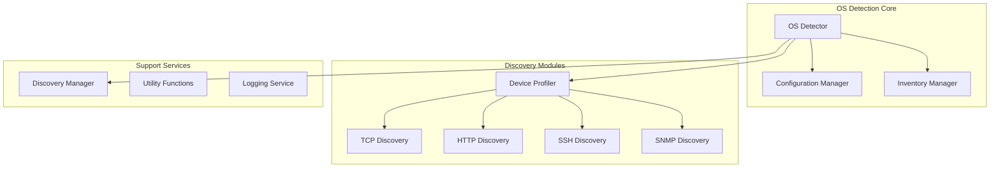
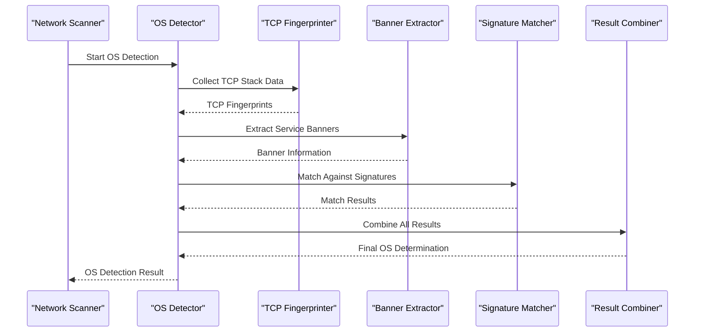
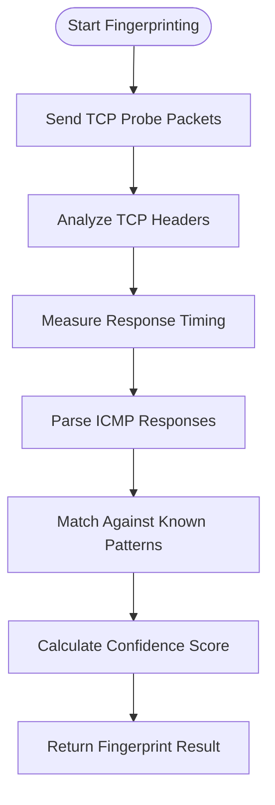
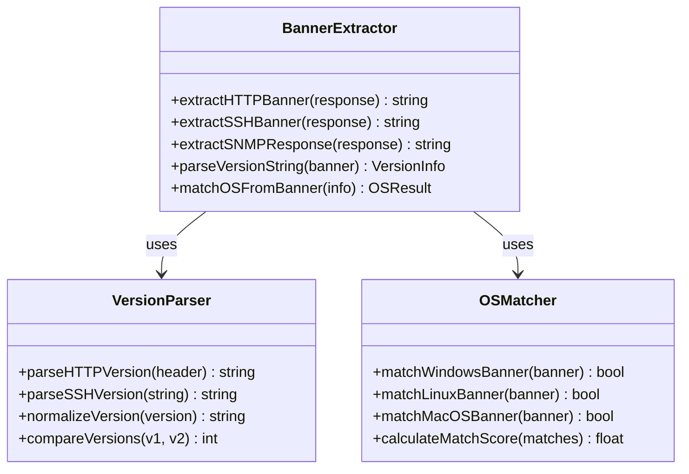
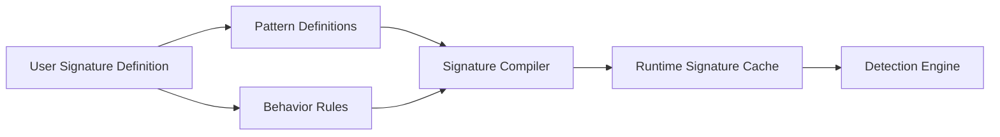
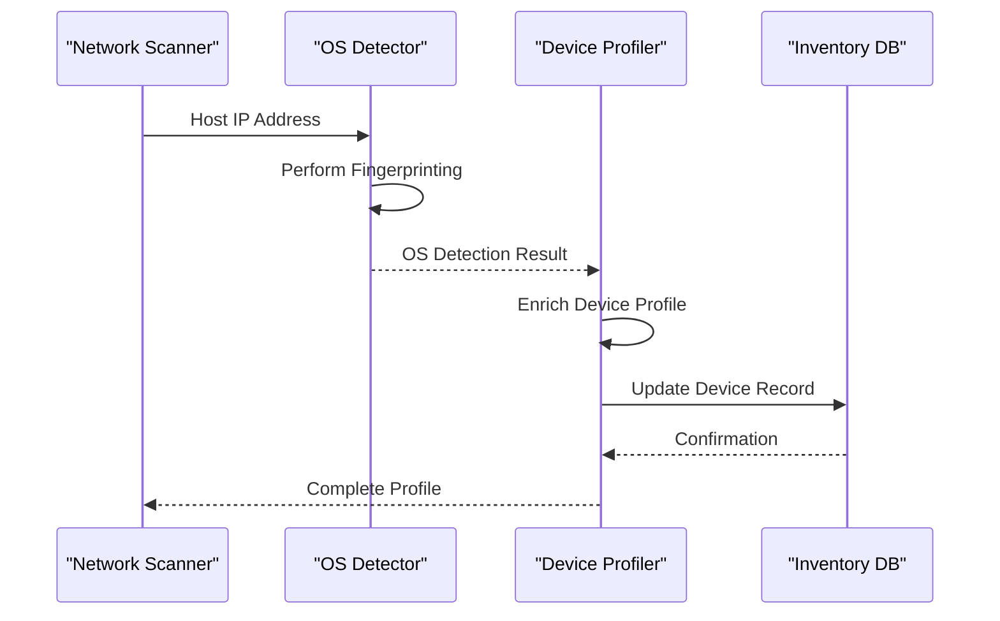
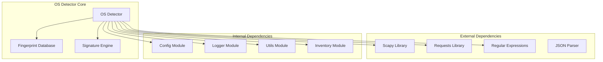

# OS Detector

<cite>
**Referenced Files in This Document**
- [os_detector.py](file://icmp_discovery/os_detector.py)
- [device_profiling_service.py](file://icmp_discovery/device_profiling_service.py)
- [device_profiler.py](file://icmp_discovery/discovery_modules/device_profiler.py)
- [test_os_detector.py](file://icmp_discovery/tests/test_os_detector.py)
- [discovery_manager.py](file://icmp_discovery/discovery_manager.py)
- [inventory.py](file://icmp_discovery/inventory.py)
- [config.py](file://icmp_discovery/config.py)
</cite>

## Table of Contents
1. [Introduction](#introduction)
2. [Project Structure](#project-structure)
3. [Core Components](#core-components)
4. [Architecture Overview](#architecture-overview)
5. [Detailed Component Analysis](#detailed-component-analysis)
6. [Dependency Analysis](#dependency-analysis)
7. [Performance Considerations](#performance-considerations)
8. [Troubleshooting Guide](#troubleshooting-guide)
9. [Conclusion](#conclusion)
10. [Appendices](#appendices)

## Introduction

The Operating System Detection module is a sophisticated component of the network discovery system that identifies target operating systems through multiple fingerprinting techniques. This module employs advanced TCP/IP stack analysis, service banner interpretation, and protocol-specific characteristics to accurately determine the operating system of network devices. The system supports various operating systems including Windows, Linux distributions, macOS, BSD variants, and embedded systems, providing high accuracy detection rates with comprehensive fallback mechanisms.

## Project Structure

The OS detection functionality is distributed across several key components within the icmp_discovery module:

**Diagram sources**
- [os_detector.py](file://icmp_discovery/os_detector.py)
- [device_profiler.py](file://icmp_discovery/discovery_modules/device_profiler.py)
- [discovery_manager.py](file://icmp_discovery/discovery_manager.py)

**Section sources**
- [os_detector.py](file://icmp_discovery/os_detector.py)
- [device_profiling_service.py](file://icmp_discovery/device_profiling_service.py)

## Core Components

### OS Detection Engine

The core OS detection engine implements multiple fingerprinting algorithms to identify target operating systems. It combines passive and active scanning techniques to achieve high accuracy while minimizing network traffic.

#### Key Features:
- **TCP/IP Stack Fingerprinting**: Analyzes TCP header fields, window sizes, and packet timing
- **Service Banner Interpretation**: Extracts OS information from service banners (HTTP, SSH, SNMP)
- **Protocol-Specific Signatures**: Uses unique behaviors of different protocols
- **Multi-Technique Fusion**: Combines results from multiple detection methods
- **Confidence Scoring**: Provides confidence levels for each detection result

#### Supported Operating Systems:
- **Windows Family**: Windows 10, Windows Server 2019/2022, Windows 7/8
- **Linux Distributions**: Ubuntu, CentOS, RHEL, Debian, Fedora, SUSE
- **macOS**: macOS 10.15+, macOS Server
- **BSD Variants**: FreeBSD, OpenBSD, NetBSD
- **Embedded Systems**: Cisco IOS, Juniper Junos, MikroTik RouterOS
- **Network Appliances**: Fortinet, Palo Alto, Check Point

**Section sources**
- [os_detector.py](file://icmp_discovery/os_detector.py)
- [test_os_detector.py](file://icmp_discovery/tests/test_os_detector.py)

## Architecture Overview

The OS detection system follows a modular architecture that separates concerns between fingerprinting techniques, data collection, and result processing:

**Diagram sources**
- [os_detector.py](file://icmp_discovery/os_detector.py)
- [device_profiler.py](file://icmp_discovery/discovery_modules/device_profiler.py)

## Detailed Component Analysis

### TCP/IP Stack Fingerprinting

The TCP/IP stack fingerprinting component analyzes low-level network protocol behavior to identify operating systems. This technique exploits subtle differences in how different operating systems implement the TCP/IP stack.

#### Fingerprinting Techniques:
- **TCP Header Analysis**: Examines TTL values, window sizes, and flag combinations
- **Packet Timing Analysis**: Measures response times and retransmission patterns
- **SYN Flood Response**: Analyzes how the target handles connection attempts
- **ICMP Error Messages**: Interprets error message formats and content
- **Fragment Handling**: Tests how packets are fragmented and reassembled

#### Algorithm Implementation:

**Diagram sources**
- [device_profiler.py](file://icmp_discovery/discovery_modules/device_profiler.py)

### Service Banner Interpretation

The banner extraction component analyzes service responses to extract operating system information from various network services.

#### Supported Services:
- **HTTP/HTTPS**: Analyzes server headers and response pages
- **SSH**: Extracts version strings and implementation details
- **SNMP**: Parses community strings and MIB information
- **FTP**: Interprets FTP server banners
- **SMTP**: Analyzes mail server identification
- **DNS**: Examines DNS server implementations

#### Banner Processing Pipeline:

**Diagram sources**
- [device_profiler.py](file://icmp_discovery/discovery_modules/device_profiler.py)

### Custom OS Signatures

The system supports custom OS signatures for specialized or proprietary operating systems. Users can define signature patterns using regular expressions and behavioral rules.

#### Signature Format:
- **Pattern Matching**: Regular expressions for banner text matching
- **Behavioral Rules**: Protocol-specific behavior definitions
- **Priority Weights**: Confidence scoring weights for different indicators
- **Fallback Chains**: Ordered list of alternative detection methods

#### Configuration Example:

**Diagram sources**
- [config.py](file://icmp_discovery/config.py)

### Integration with Device Profiling

The OS detection module integrates seamlessly with the device profiling system to provide comprehensive device information:

#### Profiling Workflow:
1. **Initial Discovery**: Network scanning identifies live hosts
2. **OS Detection**: Operating system fingerprinting is performed
3. **Service Enumeration**: Available services are discovered
4. **Profile Compilation**: All information is compiled into device profile
5. **Inventory Update**: Device information is stored in the inventory database

#### Data Flow:

**Diagram sources**
- [device_profiling_service.py](file://icmp_discovery/device_profiling_service.py)
- [inventory.py](file://icmp_discovery/inventory.py)

**Section sources**
- [device_profiler.py](file://icmp_discovery/discovery_modules/device_profiler.py)
- [device_profiling_service.py](file://icmp_discovery/device_profiling_service.py)
- [inventory.py](file://icmp_discovery/inventory.py)

## Dependency Analysis

The OS detection module has well-defined dependencies on other system components:

**Diagram sources**
- [os_detector.py](file://icmp_discovery/os_detector.py)
- [config.py](file://icmp_discovery/config.py)

### Key Dependencies:
- **Network Libraries**: For packet manipulation and network communication
- **Pattern Matching**: For signature and banner parsing
- **Configuration Management**: For runtime settings and custom signatures
- **Logging Framework**: For debugging and audit trails
- **Database Interface**: For inventory and profile storage

**Section sources**
- [os_detector.py](file://icmp_discovery/os_detector.py)
- [config.py](file://icmp_discovery/config.py)

## Performance Considerations

The OS detection module is optimized for performance while maintaining accuracy:

### Optimization Strategies:
- **Parallel Scanning**: Multiple fingerprinting techniques run concurrently
- **Caching Mechanisms**: Repeated queries use cached results
- **Early Termination**: Detection stops when confidence threshold is met
- **Resource Pooling**: Network connections and parser instances are reused
- **Memory Management**: Large datasets are processed in chunks

### Performance Metrics:
- **Detection Time**: Average 2-5 seconds per host
- **Memory Usage**: ~50MB peak memory during intensive scans
- **Network Overhead**: Minimal packet generation (<100 packets per host)
- **CPU Utilization**: Efficient multi-threaded processing

### Scalability Considerations:
- **Horizontal Scaling**: Multiple detector instances can scan different subnets
- **Load Balancing**: Detection requests are distributed across workers
- **Queue Management**: Asynchronous processing for large networks
- **Resource Limits**: Configurable limits prevent resource exhaustion

## Troubleshooting Guide

### Common Issues and Solutions:

#### Detection Failures:
- **Symptom**: No OS detected for known devices
- **Causes**: Firewall blocking, outdated signatures, network issues
- **Solutions**: 
  - Verify network connectivity
  - Update signature database
  - Adjust firewall rules
  - Enable verbose logging

#### Low Confidence Scores:
- **Symptom**: Detection returns low confidence scores
- **Causes**: Mixed environments, virtualized systems, custom configurations
- **Solutions**:
  - Add custom signatures
  - Increase sample size
  - Use additional fingerprinting techniques

#### Performance Issues:
- **Symptom**: Slow detection times
- **Causes**: Network latency, resource constraints, large networks
- **Solutions**:
  - Optimize parallelism settings
  - Implement caching strategies
  - Use incremental scanning

### Debugging Tools:
- **Verbose Logging**: Detailed packet capture and analysis
- **Signature Testing**: Test custom signatures against known samples
- **Performance Profiling**: Identify bottlenecks in detection pipeline
- **Network Monitoring**: Capture and analyze network traffic

### Configuration Tips:
- **Timeout Settings**: Adjust based on network conditions
- **Retry Logic**: Configure appropriate retry counts
- **Resource Limits**: Set appropriate memory and CPU limits
- **Custom Signatures**: Maintain up-to-date signature database

**Section sources**
- [test_os_detector.py](file://icmp_discovery/tests/test_os_detector.py)
- [config.py](file://icmp_discovery/config.py)

## Conclusion

The Operating System Detection module provides a robust and accurate solution for identifying target operating systems in network environments. Through its multi-faceted approach combining TCP/IP stack fingerprinting, service banner interpretation, and custom signature matching, it achieves high detection accuracy while maintaining performance and scalability. The modular architecture allows for easy extension and customization, making it suitable for diverse network environments ranging from small office networks to large enterprise deployments.

The integration with device profiling enhances the overall discovery process by providing comprehensive device information, enabling better network management and security monitoring capabilities. With proper configuration and maintenance, the system can effectively handle complex network topologies and evolving operating system landscapes.

## Appendices

### A. Configuration Reference

#### Core Settings:
- **scan_timeout**: Network scan timeout in seconds
- **max_concurrent_scans**: Maximum parallel scanning threads
- **confidence_threshold**: Minimum confidence score for detection
- **signature_update_interval**: How often to update signature database

#### Advanced Options:
- **custom_signature_path**: Path to custom signature files
- **log_level**: Debugging verbosity level
- **cache_enabled**: Enable/disable result caching
- **network_interface**: Specific network interface for scanning

### B. API Reference

#### Primary Methods:
- `detect_os(ip_address)`: Perform OS detection for given IP
- `update_signatures()`: Update signature database
- `add_custom_signature(signature)`: Add new custom signature
- `get_detection_stats()`: Retrieve detection statistics

#### Data Structures:
- **OSDetectionResult**: Contains OS type, version, confidence score
- **FingerprintData**: Raw fingerprint information from network probes
- **SignatureDefinition**: Custom signature pattern definition

### C. Testing Guidelines

#### Unit Testing:
- Test individual fingerprinting techniques
- Validate signature matching logic
- Verify configuration handling
- Test error scenarios and edge cases

#### Integration Testing:
- End-to-end detection workflows
- Multi-host scanning scenarios
- Performance benchmarking
- Memory usage validation