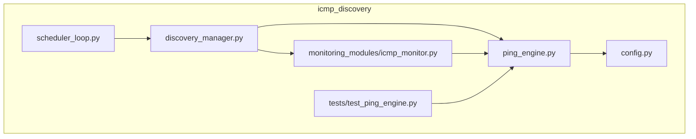
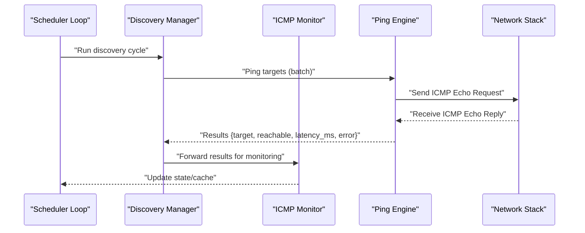
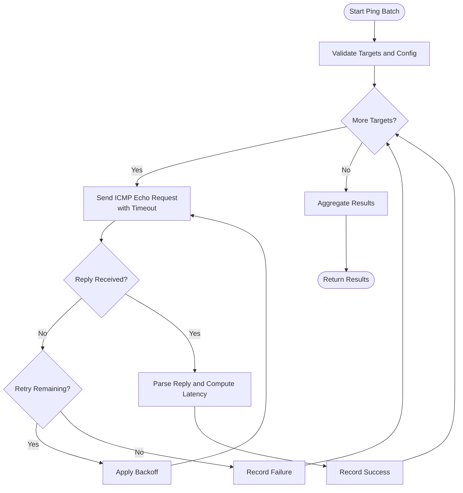
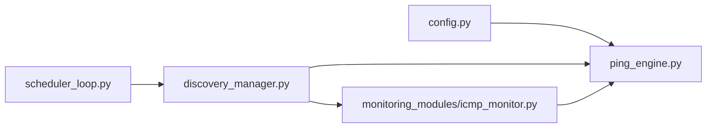

# Ping Engine

<cite>
**Referenced Files in This Document**
- [ping_engine.py](file://icmp_discovery/ping_engine.py)
- [discovery_manager.py](file://icmp_discovery/discovery_manager.py)
- [icmp_monitor.py](file://icmp_discovery/monitoring_modules/icmp_monitor.py)
- [test_ping_engine.py](file://icmp_discovery/tests/test_ping_engine.py)
- [config.py](file://icmp_discovery/config.py)
- [scheduler_loop.py](file://icmp_discovery/scheduler_loop.py)
</cite>

## Table of Contents
1. [Introduction](#introduction)
2. [Project Structure](#project-structure)
3. [Core Components](#core-components)
4. [Architecture Overview](#architecture-overview)
5. [Detailed Component Analysis](#detailed-component-analysis)
6. [Dependency Analysis](#dependency-analysis)
7. [Performance Considerations](#performance-considerations)
8. [Troubleshooting Guide](#troubleshooting-guide)
9. [Conclusion](#conclusion)

## Introduction
This document explains the Ping Engine implementation that performs ICMP echo requests to test device reachability. It covers how ping requests are generated, responses are parsed, and latency is measured. It also documents timeout configurations, retry mechanisms, batch processing capabilities, custom ping strategies, performance tuning parameters, error handling for network failures, and integration with the discovery manager for result processing and caching.

## Project Structure
The Ping Engine resides under the icmp_discovery package and integrates with monitoring and discovery modules:
- Core engine: ping_engine.py
- Monitoring integration: monitoring_modules/icmp_monitor.py
- Discovery orchestration: discovery_manager.py
- Configuration: config.py
- Scheduling: scheduler_loop.py
- Tests: tests/test_ping_engine.py

**Diagram sources**
- [ping_engine.py](file://icmp_discovery/ping_engine.py)
- [icmp_monitor.py](file://icmp_discovery/monitoring_modules/icmp_monitor.py)
- [discovery_manager.py](file://icmp_discovery/discovery_manager.py)
- [config.py](file://icmp_discovery/config.py)
- [scheduler_loop.py](file://icmp_discovery/scheduler_loop.py)
- [test_ping_engine.py](file://icmp_discovery/tests/test_ping_engine.py)

**Section sources**
- [ping_engine.py](file://icmp_discovery/ping_engine.py)
- [discovery_manager.py](file://icmp_discovery/discovery_manager.py)
- [icmp_monitor.py](file://icmp_discovery/monitoring_modules/icmp_monitor.py)
- [config.py](file://icmp_discovery/config.py)
- [scheduler_loop.py](file://icmp_discovery/scheduler_loop.py)
- [test_ping_engine.py](file://icmp_discovery/tests/test_ping_engine.py)

## Core Components
- Ping Engine: encapsulates ICMP echo request generation, response parsing, latency measurement, timeouts, retries, and batch operations.
- ICMP Monitor: consumes ping results for ongoing monitoring tasks.
- Discovery Manager: orchestrates discovery workflows and integrates ping outcomes into inventory/state.
- Configuration: centralizes timeout, retry, concurrency, and strategy settings.
- Scheduler Loop: drives periodic execution of discovery and monitoring tasks that may invoke ping operations.

Key responsibilities:
- Generate ICMP echo requests efficiently and safely across platforms.
- Parse ICMP replies and compute round-trip latency.
- Apply configurable timeouts and retry policies.
- Support batch pinging for multiple targets.
- Provide hooks for custom ping strategies (e.g., raw sockets vs. external tools).
- Surface structured results to discovery and monitoring layers.

**Section sources**
- [ping_engine.py](file://icmp_discovery/ping_engine.py)
- [icmp_monitor.py](file://icmp_discovery/monitoring_modules/icmp_monitor.py)
- [discovery_manager.py](file://icmp_discovery/discovery_manager.py)
- [config.py](file://icmp_discovery/config.py)

## Architecture Overview
The Ping Engine is a core utility used by both discovery and monitoring subsystems. The discovery manager coordinates scans and can trigger ping-based reachability checks. The ICMP monitor uses ping results to update device status over time. Configuration controls behavior such as timeouts, retries, and concurrency. A scheduler loop periodically invokes these components.

**Diagram sources**
- [scheduler_loop.py](file://icmp_discovery/scheduler_loop.py)
- [discovery_manager.py](file://icmp_discovery/discovery_manager.py)
- [icmp_monitor.py](file://icmp_discovery/monitoring_modules/icmp_monitor.py)
- [ping_engine.py](file://icmp_discovery/ping_engine.py)

## Detailed Component Analysis

### Ping Engine
Responsibilities:
- ICMP echo request generation using platform-appropriate mechanisms.
- Response parsing to determine reachability and compute latency.
- Timeout enforcement per request and overall batch timeout.
- Retry logic with backoff or immediate retransmission based on configuration.
- Batch processing to handle multiple targets concurrently.
- Custom strategy abstraction to swap implementations (e.g., raw socket vs. subprocess).

Typical flow:
- Validate target list and configuration.
- For each target, send ICMP echo request with configured timeout.
- On reply, parse payload and measure latency; record success/failure.
- On failure, apply retry policy up to configured attempts.
- Aggregate results and return structured data.

**Diagram sources**
- [ping_engine.py](file://icmp_discovery/ping_engine.py)

**Section sources**
- [ping_engine.py](file://icmp_discovery/ping_engine.py)

### ICMP Monitor
Responsibilities:
- Consume ping results from the engine.
- Update monitoring state and cache for device reachability.
- Emit events or metrics based on reachability changes.

Integration points:
- Receives structured results from Ping Engine via discovery or direct calls.
- Persists or caches latest status per target.

**Section sources**
- [icmp_monitor.py](file://icmp_discovery/monitoring_modules/icmp_monitor.py)

### Discovery Manager
Responsibilities:
- Orchestrate discovery cycles and coordinate multiple discovery methods.
- Trigger ping-based reachability checks for discovered or configured targets.
- Integrate ping results into discovery state and inventory.

Integration points:
- Calls Ping Engine for batch pings.
- Passes results to monitoring and caching layers.

**Section sources**
- [discovery_manager.py](file://icmp_discovery/discovery_manager.py)

### Configuration
Responsibilities:
- Centralize settings for timeouts, retries, concurrency, and strategy selection.
- Provide defaults and allow overrides for different environments.

Common parameters:
- Per-request timeout
- Overall batch timeout
- Max retries and backoff strategy
- Concurrency limit for parallel pings
- Strategy selector (raw socket, external tool, etc.)

**Section sources**
- [config.py](file://icmp_discovery/config.py)

### Scheduler Loop
Responsibilities:
- Periodically execute discovery and monitoring tasks.
- Invoke discovery manager which may call Ping Engine.

**Section sources**
- [scheduler_loop.py](file://icmp_discovery/scheduler_loop.py)

### Tests
Responsibilities:
- Validate ping request generation, response parsing, latency computation.
- Verify timeout and retry behaviors.
- Exercise batch processing paths and error conditions.

**Section sources**
- [test_ping_engine.py](file://icmp_discovery/tests/test_ping_engine.py)

## Dependency Analysis
The Ping Engine depends on configuration and interacts with discovery and monitoring layers. The following diagram shows key dependencies and interactions.

**Diagram sources**
- [config.py](file://icmp_discovery/config.py)
- [ping_engine.py](file://icmp_discovery/ping_engine.py)
- [discovery_manager.py](file://icmp_discovery/discovery_manager.py)
- [icmp_monitor.py](file://icmp_discovery/monitoring_modules/icmp_monitor.py)
- [scheduler_loop.py](file://icmp_discovery/scheduler_loop.py)

**Section sources**
- [config.py](file://icmp_discovery/config.py)
- [ping_engine.py](file://icmp_discovery/ping_engine.py)
- [discovery_manager.py](file://icmp_discovery/discovery_manager.py)
- [icmp_monitor.py](file://icmp_discovery/monitoring_modules/icmp_monitor.py)
- [scheduler_loop.py](file://icmp_discovery/scheduler_loop.py)

## Performance Considerations
- Concurrency: Use appropriate parallelism to balance throughput and resource usage. Tune concurrency limits to avoid overwhelming the network stack.
- Timeouts: Set per-request and batch timeouts to prevent long hangs. Shorter timeouts improve responsiveness but may increase false negatives.
- Retries: Configure retry counts and backoff to mitigate transient failures without excessive load.
- Buffer sizes and packet sizes: Ensure ICMP payloads are within OS limits and aligned with network constraints.
- Caching: Cache recent ping results to reduce redundant work during frequent queries.
- Resource cleanup: Close sockets or release resources promptly after use.

[No sources needed since this section provides general guidance]

## Troubleshooting Guide
Common issues and resolutions:
- No replies received:
  - Check firewall rules and host ACLs blocking ICMP.
  - Verify network connectivity and routing.
  - Increase timeout values if networks are slow.
- High latency or timeouts:
  - Reduce concurrency to avoid congestion.
  - Inspect system resource utilization (CPU, file descriptors).
  - Adjust batch size and retry policies.
- Permission errors:
  - Ensure sufficient privileges for raw socket operations when required.
- Inconsistent results:
  - Validate configuration consistency across runs.
  - Review logs for intermittent network errors.

Operational tips:
- Enable detailed logging around ping operations.
- Use targeted tests to isolate problematic targets.
- Monitor system metrics during heavy ping batches.

**Section sources**
- [test_ping_engine.py](file://icmp_discovery/tests/test_ping_engine.py)
- [config.py](file://icmp_discovery/config.py)

## Conclusion
The Ping Engine provides robust ICMP-based reachability testing with configurable timeouts, retries, and batch processing. It integrates seamlessly with the discovery manager and monitoring modules, enabling efficient device status updates and caching. Proper tuning of concurrency, timeouts, and retry policies ensures reliable performance across diverse network environments.

[No sources needed since this section summarizes without analyzing specific files]