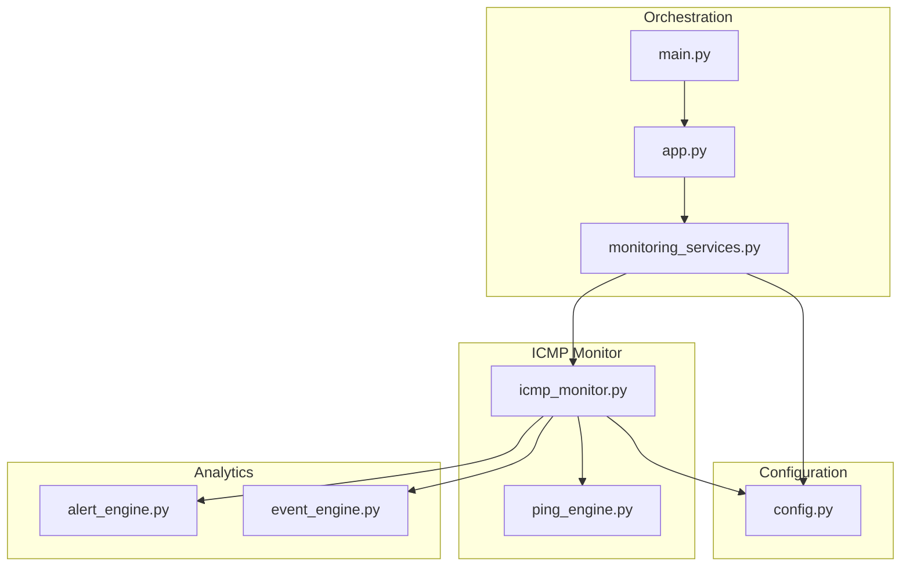
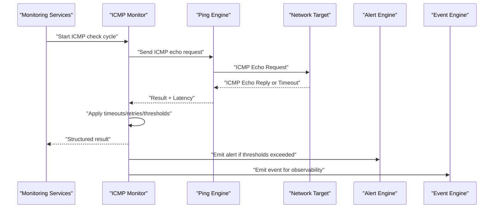
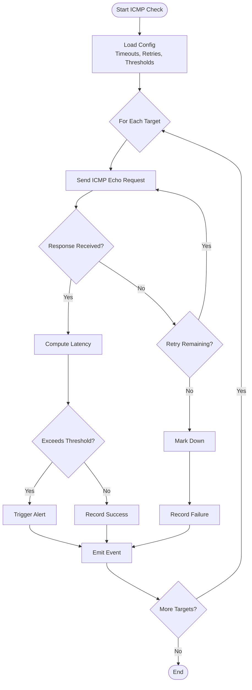
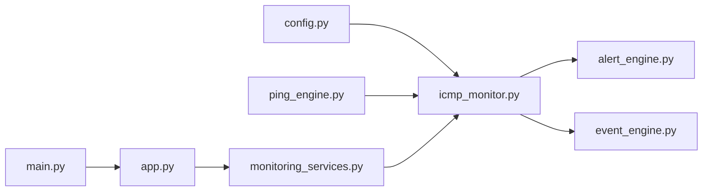

# ICMP Monitor

<cite>
**Referenced Files in This Document**
- [icmp_monitor.py](file://icmp_discovery/monitoring_modules/icmp_monitor.py)
- [ping_engine.py](file://icmp_discovery/ping_engine.py)
- [config.py](file://icmp_discovery/config.py)
- [monitoring_services.py](file://icmp_discovery/monitoring_services.py)
- [alert_engine.py](file://icmp_discovery/analytics_modules/alert_engine.py)
- [event_engine.py](file://icmp_discovery/analytics_modules/event_engine.py)
- [app.py](file://icmp_discovery/app.py)
- [main.py](file://icmp_discovery/main.py)
</cite>

## Table of Contents
1. [Introduction](#introduction)
2. [Project Structure](#project-structure)
3. [Core Components](#core-components)
4. [Architecture Overview](#architecture-overview)
5. [Detailed Component Analysis](#detailed-component-analysis)
6. [Dependency Analysis](#dependency-analysis)
7. [Performance Considerations](#performance-considerations)
8. [Troubleshooting Guide](#troubleshooting-guide)
9. [Conclusion](#conclusion)
10. [Appendices](#appendices)

## Introduction
This document explains the ICMP monitor component responsible for basic connectivity checks and latency measurements using ICMP echo requests. It covers configuration options, timeout settings, retry mechanisms, threshold configurations, data formats returned by ICMP checks, integration with alerting, and practical guidance for high-volume environments.

## Project Structure
The ICMP monitor is implemented under the monitoring modules and integrates with a ping engine, configuration management, monitoring services orchestration, and analytics engines for alerts and events.

**Diagram sources**
- [icmp_monitor.py:1-200](file://icmp_discovery/monitoring_modules/icmp_monitor.py#L1-L200)
- [ping_engine.py:1-200](file://icmp_discovery/ping_engine.py#L1-L200)
- [config.py:1-200](file://icmp_discovery/config.py#L1-L200)
- [monitoring_services.py:1-200](file://icmp_discovery/monitoring_services.py#L1-L200)
- [alert_engine.py:1-200](file://icmp_discovery/analytics_modules/alert_engine.py#L1-L200)
- [event_engine.py:1-200](file://icmp_discovery/analytics_modules/event_engine.py#L1-L200)
- [app.py:1-200](file://icmp_discovery/app.py#L1-L200)
- [main.py:1-200](file://icmp_discovery/main.py#L1-L200)

**Section sources**
- [icmp_monitor.py:1-200](file://icmp_discovery/monitoring_modules/icmp_monitor.py#L1-L200)
- [ping_engine.py:1-200](file://icmp_discovery/ping_engine.py#L1-L200)
- [config.py:1-200](file://icmp_discovery/config.py#L1-L200)
- [monitoring_services.py:1-200](file://icmp_discovery/monitoring_services.py#L1-L200)
- [alert_engine.py:1-200](file://icmp_discovery/analytics_modules/alert_engine.py#L1-L200)
- [event_engine.py:1-200](file://icmp_discovery/analytics_modules/event_engine.py#1-L200)
- [app.py:1-200](file://icmp_discovery/app.py#L1-L200)
- [main.py:1-200](file://icmp_discovery/main.py#L1-L200)

## Core Components
- ICMP Monitor: Orchestrates ICMP echo-based checks, applies timeouts and retries, computes latency metrics, and emits results and alerts.
- Ping Engine: Low-level ICMP echo request/response handling and timing.
- Configuration: Centralized settings for ICMP behavior (timeouts, retries, thresholds).
- Monitoring Services: Scheduling and lifecycle management for monitors.
- Alert and Event Engines: Emit alerts and events based on ICMP outcomes and thresholds.

Key responsibilities:
- Perform periodic ICMP echo requests to targets.
- Measure round-trip time and availability.
- Apply configured timeouts and retry policies.
- Generate structured results and trigger alerts when thresholds are breached.

**Section sources**
- [icmp_monitor.py:1-200](file://icmp_discovery/monitoring_modules/icmp_monitor.py#L1-L200)
- [ping_engine.py:1-200](file://icmp_discovery/ping_engine.py#L1-L200)
- [config.py:1-200](file://icmp_discovery/config.py#L1-L200)
- [monitoring_services.py:1-200](file://icmp_discovery/monitoring_services.py#L1-L200)
- [alert_engine.py:1-200](file://icmp_discovery/analytics_modules/alert_engine.py#L1-L200)
- [event_engine.py:1-200](file://icmp_discovery/analytics_modules/event_engine.py#L1-L200)

## Architecture Overview
The ICMP monitor integrates into the broader monitoring pipeline. The monitoring services schedule and run the ICMP monitor, which uses the ping engine to send ICMP echo requests. Results are transformed into standardized data and forwarded to alert and event engines for further processing.

**Diagram sources**
- [monitoring_services.py:1-200](file://icmp_discovery/monitoring_services.py#L1-L200)
- [icmp_monitor.py:1-200](file://icmp_discovery/monitoring_modules/icmp_monitor.py#L1-L200)
- [ping_engine.py:1-200](file://icmp_discovery/ping_engine.py#L1-L200)
- [alert_engine.py:1-200](file://icmp_discovery/analytics_modules/alert_engine.py#L1-L200)
- [event_engine.py:1-200](file://icmp_discovery/analytics_modules/event_engine.py#L1-L200)

## Detailed Component Analysis

### ICMP Monitor
Responsibilities:
- Configure ICMP parameters from centralized configuration.
- Execute echo checks with retry logic and timeouts.
- Compute latency and availability metrics.
- Produce structured output and integrate with alerting.

Operational flow:
- Initialize with configuration values (timeout, retries, thresholds).
- For each target, send ICMP echo requests via the ping engine.
- Handle responses, timeouts, and errors; apply retry policy.
- Calculate latency and status; compare against thresholds.
- Emit structured results and trigger alerts/events as needed.

**Diagram sources**
- [icmp_monitor.py:1-200](file://icmp_discovery/monitoring_modules/icmp_monitor.py#L1-L200)
- [ping_engine.py:1-200](file://icmp_discovery/ping_engine.py#L1-L200)
- [config.py:1-200](file://icmp_discovery/config.py#L1-L200)
- [alert_engine.py:1-200](file://icmp_discovery/analytics_modules/alert_engine.py#L1-L200)
- [event_engine.py:1-200](file://icmp_discovery/analytics_modules/event_engine.py#L1-L200)

**Section sources**
- [icmp_monitor.py:1-200](file://icmp_discovery/monitoring_modules/icmp_monitor.py#L1-L200)
- [ping_engine.py:1-200](file://icmp_discovery/ping_engine.py#L1-L200)
- [config.py:1-200](file://icmp_discovery/config.py#L1-L200)
- [alert_engine.py:1-200](file://icmp_discovery/analytics_modules/alert_engine.py#L1-L200)
- [event_engine.py:1-200](file://icmp_discovery/analytics_modules/event_engine.py#L1-L200)

### Ping Engine
Responsibilities:
- Construct and send ICMP echo requests.
- Receive replies and measure round-trip times.
- Surface low-level errors (e.g., socket issues, permission problems).

Behavioral notes:
- Uses system-level ICMP capabilities; may require elevated privileges depending on OS.
- Returns success/failure and latency per attempt.

**Section sources**
- [ping_engine.py:1-200](file://icmp_discovery/ping_engine.py#L1-L200)

### Configuration
Responsibilities:
- Provide centralized settings for ICMP monitoring behavior.
- Define default and overrideable values for timeouts, retries, thresholds, and scheduling.

Key options typically include:
- Timeout per ICMP request.
- Number of retries before marking a target down.
- Latency thresholds for warning/critical states.
- Interval between monitoring cycles.

**Section sources**
- [config.py:1-200](file://icmp_discovery/config.py#L1-L200)

### Monitoring Services
Responsibilities:
- Schedule and manage the lifecycle of monitors including ICMP.
- Coordinate execution intervals and resource usage.

Integration points:
- Invokes ICMP monitor periodically.
- Aggregates results and forwards to analytics engines.

**Section sources**
- [monitoring_services.py:1-200](file://icmp_discovery/monitoring_services.py#L1-L200)

### Alert and Event Engines
Responsibilities:
- Alert Engine: Evaluate thresholds and emit alerts when conditions are met.
- Event Engine: Emit operational events for visibility and audit trails.

Integration points:
- Receives structured results from ICMP monitor.
- Applies rule evaluation and emits outputs consumed by dashboards or external systems.

**Section sources**
- [alert_engine.py:1-200](file://icmp_discovery/analytics_modules/alert_engine.py#L1-L200)
- [event_engine.py:1-200](file://icmp_discovery/analytics_modules/event_engine.py#L1-L200)

## Dependency Analysis
The ICMP monitor depends on the ping engine for network operations, configuration for runtime parameters, and analytics engines for alerting and event emission. Monitoring services orchestrate execution.

**Diagram sources**
- [config.py:1-200](file://icmp_discovery/config.py#L1-L200)
- [icmp_monitor.py:1-200](file://icmp_discovery/monitoring_modules/icmp_monitor.py#L1-L200)
- [ping_engine.py:1-200](file://icmp_discovery/ping_engine.py#L1-L200)
- [alert_engine.py:1-200](file://icmp_discovery/analytics_modules/alert_engine.py#L1-L200)
- [event_engine.py:1-200](file://icmp_discovery/analytics_modules/event_engine.py#L1-L200)
- [monitoring_services.py:1-200](file://icmp_discovery/monitoring_services.py#L1-L200)
- [app.py:1-200](file://icmp_discovery/app.py#L1-L200)
- [main.py:1-200](file://icmp_discovery/main.py#L1-L200)

**Section sources**
- [icmp_monitor.py:1-200](file://icmp_discovery/monitoring_modules/icmp_monitor.py#L1-L200)
- [monitoring_services.py:1-200](file://icmp_discovery/monitoring_services.py#L1-L200)
- [config.py:1-200](file://icmp_discovery/config.py#L1-L200)
- [ping_engine.py:1-200](file://icmp_discovery/ping_engine.py#L1-L200)
- [alert_engine.py:1-200](file://icmp_discovery/analytics_modules/alert_engine.py#L1-L200)
- [event_engine.py:1-200](file://icmp_discovery/analytics_modules/event_engine.py#L1-L200)

## Performance Considerations
Guidelines for high-volume ICMP monitoring:
- Tune timeouts to match expected network characteristics; avoid overly aggressive timeouts that cause false negatives.
- Adjust retry counts to balance reliability and load; fewer retries reduce overhead but increase sensitivity to transient failures.
- Set appropriate latency thresholds to minimize alert noise while catching meaningful degradation.
- Use batched checks and staggered schedules to avoid spikes in ICMP traffic.
- Ensure sufficient system resources (CPU, sockets) and consider running multiple worker processes if supported by the monitoring services.
- Monitor system-level constraints such as firewall rules, rate limiting, and kernel ICMP stack limits.

[No sources needed since this section provides general guidance]

## Troubleshooting Guide
Common issues and resolutions:
- No ICMP replies: Verify host firewall allows ICMP echo requests and replies; check routing and ACLs.
- High latency or timeouts: Investigate network congestion, packet loss, or misconfigured timeouts; adjust thresholds accordingly.
- Permission errors: On some operating systems, sending raw ICMP requires elevated privileges; ensure the process runs with required permissions.
- Excessive alerts: Review threshold settings and retry policies; tune to reduce false positives.
- Resource exhaustion: Increase socket limits and CPU allocation; scale out monitoring workers.

Diagnostic steps:
- Inspect logs from the ICMP monitor and ping engine for error details.
- Validate configuration values for timeouts, retries, and thresholds.
- Test connectivity manually using system tools to confirm reachability.
- Correlate alerts and events with network changes or maintenance windows.

**Section sources**
- [icmp_monitor.py:1-200](file://icmp_discovery/monitoring_modules/icmp_monitor.py#L1-L200)
- [ping_engine.py:1-200](file://icmp_discovery/ping_engine.py#L1-L200)
- [config.py:1-200](file://icmp_discovery/config.py#L1-L200)
- [alert_engine.py:1-200](file://icmp_discovery/analytics_modules/alert_engine.py#L1-L200)
- [event_engine.py:1-200](file://icmp_discovery/analytics_modules/event_engine.py#L1-L200)

## Conclusion
The ICMP monitor provides reliable connectivity checks and latency measurements through ICMP echo requests. With configurable timeouts, retries, and thresholds, it integrates seamlessly with alerting and event systems to deliver actionable insights. Proper tuning and troubleshooting ensure robust performance across diverse network scenarios.

[No sources needed since this section summarizes without analyzing specific files]

## Appendices

### Monitoring Configuration Options
Typical options to configure ICMP monitoring behavior:
- Timeout per request: Controls how long to wait for an ICMP reply.
- Retry count: Number of attempts before marking a target down.
- Latency thresholds: Warning and critical levels to trigger alerts.
- Monitoring interval: Frequency of ICMP check cycles.
- Batch size and concurrency: Limits on parallel checks to control load.

Where to set these:
- Centralized configuration file/module used by the ICMP monitor and monitoring services.

**Section sources**
- [config.py:1-200](file://icmp_discovery/config.py#L1-L200)
- [monitoring_services.py:1-200](file://icmp_discovery/monitoring_services.py#L1-L200)

### Data Format Returned by ICMP Checks
Expected fields in the structured result:
- Target identifier (IP or hostname).
- Status (up/down).
- Latency measurement (milliseconds).
- Attempt count and retry outcome.
- Timestamp of the check.
- Error details (if any).

Consumers:
- Dashboards and reporting tools display status and latency trends.
- Alerting systems evaluate thresholds and generate notifications.
- Event engines log operational events for auditing and correlation.

**Section sources**
- [icmp_monitor.py:1-200](file://icmp_discovery/monitoring_modules/icmp_monitor.py#L1-L200)
- [alert_engine.py:1-200](file://icmp_discovery/analytics_modules/alert_engine.py#L1-L200)
- [event_engine.py:1-200](file://icmp_discovery/analytics_modules/event_engine.py#L1-L200)

### Integration with Alerting System
Flow:
- ICMP monitor evaluates results against configured thresholds.
- When thresholds are exceeded, the alert engine generates alerts.
- Event engine emits corresponding events for observability.
- Alerts can be routed to notification channels (email, chat, ticketing).

Best practices:
- Define clear severity levels and cooldown periods.
- Use targeted thresholds per environment or criticality.
- Correlate alerts with events to reduce noise and improve triage.

**Section sources**
- [icmp_monitor.py:1-200](file://icmp_discovery/monitoring_modules/icmp_monitor.py#L1-L200)
- [alert_engine.py:1-200](file://icmp_discovery/analytics_modules/alert_engine.py#L1-L200)
- [event_engine.py:1-200](file://icmp_discovery/analytics_modules/event_engine.py#L1-L200)

### Example Scenarios
- Small office LAN: Short timeouts, minimal retries, conservative thresholds to detect local issues quickly.
- Wide area network: Longer timeouts, moderate retries, higher latency thresholds reflecting transit variability.
- Cloud environments: Align thresholds with service SLAs; use burst-friendly retry policies during maintenance windows.

[No sources needed since this section provides conceptual examples]