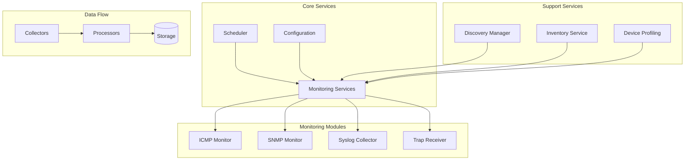
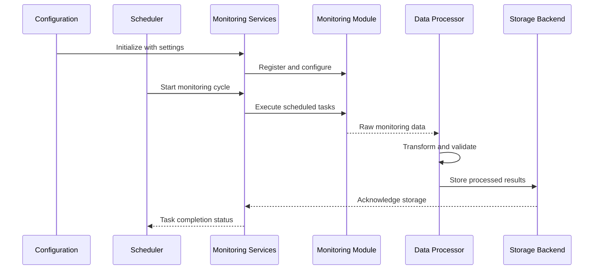
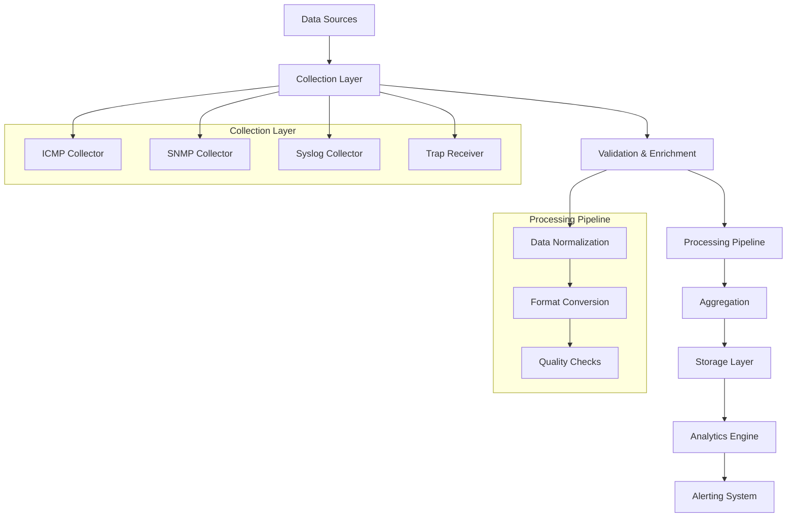
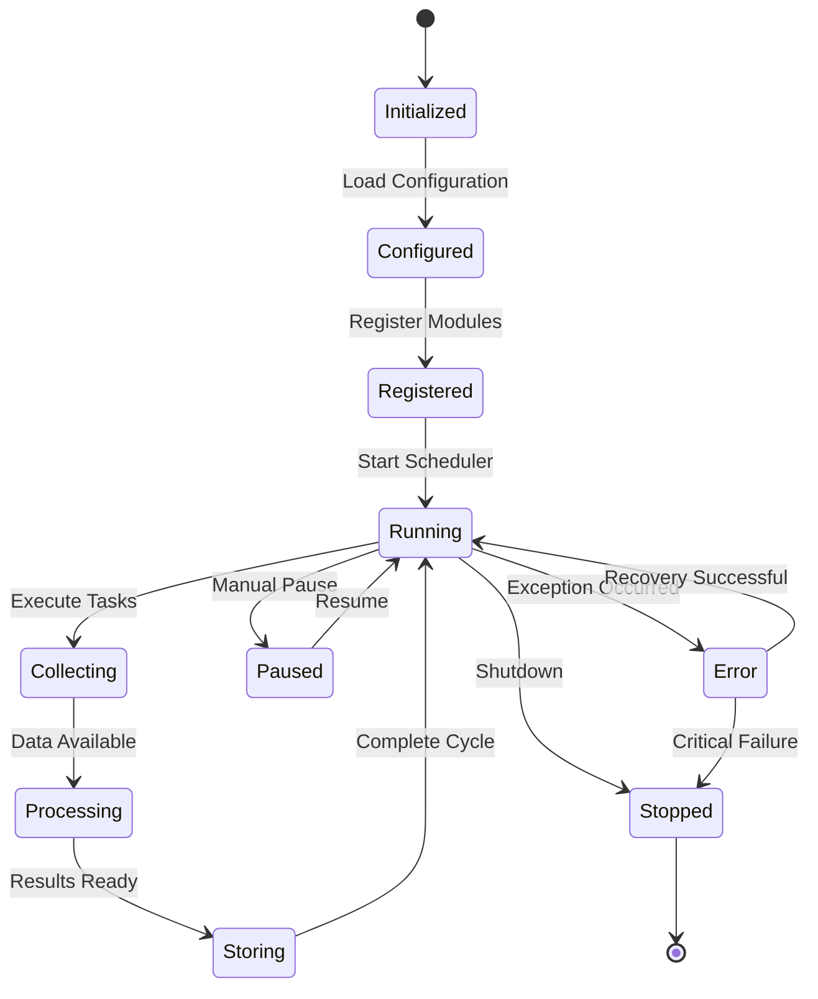
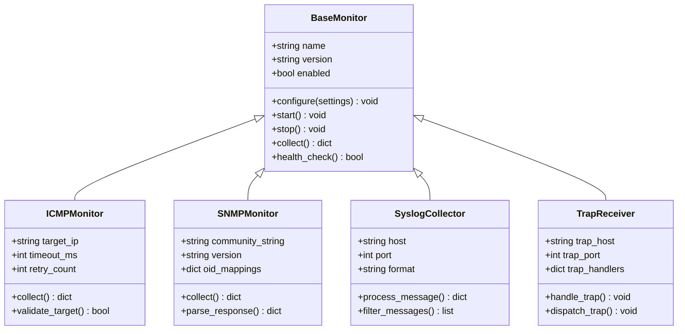
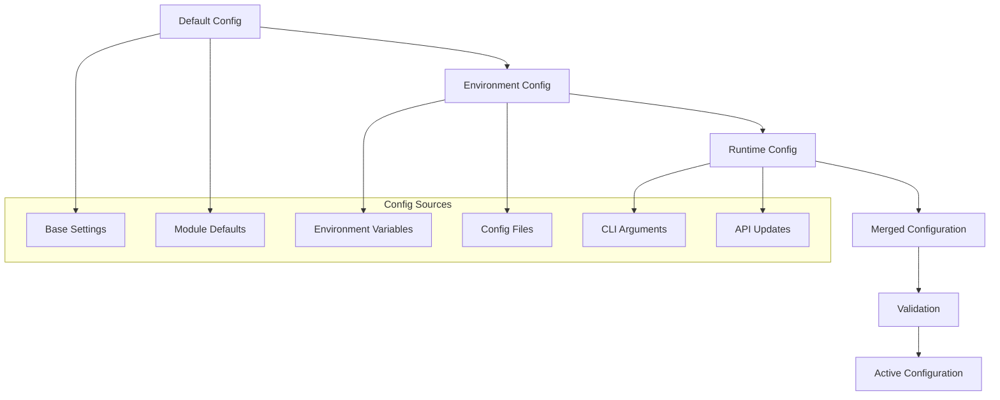
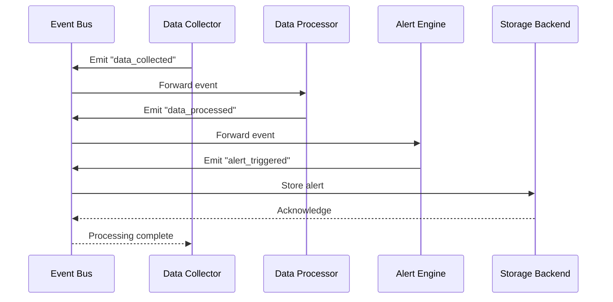
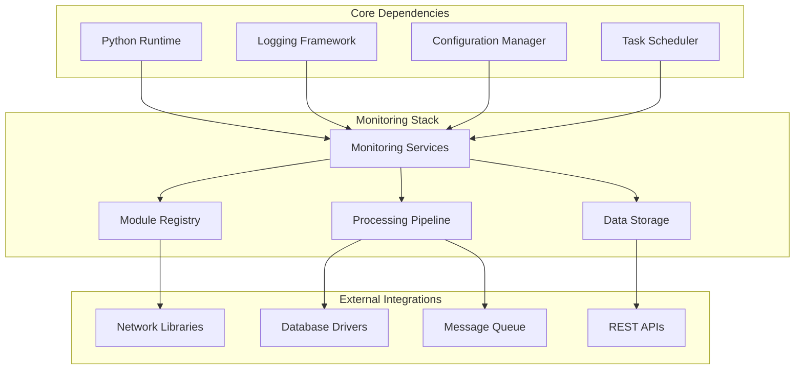

# Monitoring Services Core

<cite>
**Referenced Files in This Document**
- [monitoring_services.py](file://icmp_discovery/monitoring_services.py)
- [config.py](file://icmp_discovery/config.py)
- [scheduler.py](file://icmp_discovery/scheduler.py)
- [main.py](file://icmp_discovery/main.py)
- [app.py](file://icmp_discovery/app.py)
- [monitoring_modules/__init__.py](file://icmp_discovery/monitoring_modules/__init__.py)
- [icmp_monitor.py](file://icmp_discovery/monitoring_modules/icmp_monitor.py)
- [snmp_monitor.py](file://icmp_discovery/monitoring_modules/snmp_monitor.py)
- [syslog_collector.py](file://icmp_discovery/monitoring_modules/syslog_collector.py)
- [trap_receiver.py](file://icmp_discovery/monitoring_modules/trap_receiver.py)
- [discovery_manager.py](file://icmp_discovery/discovery_manager.py)
- [inventory_service.py](file://icmp_discovery/inventory_service.py)
- [device_profiling_service.py](file://icmp_discovery/device_profiling_service.py)
</cite>

## Table of Contents
1. [Introduction](#introduction)
2. [Project Structure](#project-structure)
3. [Core Components](#core-components)
4. [Architecture Overview](#architecture-overview)
5. [Detailed Component Analysis](#detailed-component-analysis)
6. [Dependency Analysis](#dependency-analysis)
7. [Performance Considerations](#performance-considerations)
8. [Troubleshooting Guide](#troubleshooting-guide)
9. [Conclusion](#conclusion)
10. [Appendices](#appendices)

## Introduction

The Monitoring Services Core is a comprehensive network monitoring system designed to orchestrate multiple monitoring modules for collecting, processing, and analyzing network device data. This system provides a modular architecture that supports various monitoring protocols including ICMP, SNMP, syslog, and SNMP traps, enabling distributed network monitoring capabilities.

The core system manages the complete lifecycle of monitoring operations, from module registration and configuration to execution scheduling and result aggregation. It serves as the central orchestrator for all monitoring activities within the network discovery and management ecosystem.

## Project Structure

The monitoring system follows a modular architecture with clear separation of concerns:

**Diagram sources**
- [monitoring_services.py](file://icmp_discovery/monitoring_services.py)
- [scheduler.py](file://icmp_discovery/scheduler.py)
- [config.py](file://icmp_discovery/config.py)

**Section sources**
- [monitoring_services.py](file://icmp_discovery/monitoring_services.py)
- [monitoring_modules/__init__.py](file://icmp_discovery/monitoring_modules/__init__.py)

## Core Components

### Monitoring Services Orchestrator

The Monitoring Services component serves as the central coordinator for all monitoring activities. It manages the lifecycle of monitoring modules, handles inter-module communication, and ensures proper resource allocation and error handling.

Key responsibilities include:
- Module registration and initialization
- Configuration management and validation
- Scheduling coordination
- Error handling and recovery
- Health monitoring and status reporting

### Scheduler Engine

The scheduler engine manages the timing and execution of monitoring tasks. It implements flexible scheduling policies including:
- Cron-based scheduling
- Interval-based execution
- Event-driven triggers
- Priority-based task queuing

### Configuration Management

The configuration system provides centralized management of monitoring parameters, module settings, and runtime options. It supports:
- Hierarchical configuration inheritance
- Dynamic configuration updates
- Environment-specific settings
- Configuration validation and defaults

**Section sources**
- [monitoring_services.py](file://icmp_discovery/monitoring_services.py)
- [scheduler.py](file://icmp_discovery/scheduler.py)
- [config.py](file://icmp_discovery/config.py)

## Architecture Overview

The monitoring system follows a pipeline architecture with clear separation between data collection, processing, and storage phases:

**Diagram sources**
- [monitoring_services.py](file://icmp_discovery/monitoring_services.py)
- [scheduler.py](file://icmp_discovery/scheduler.py)

### Data Flow Architecture

The system implements a producer-consumer pattern for efficient data processing:

**Diagram sources**
- [monitoring_modules/icmp_monitor.py](file://icmp_discovery/monitoring_modules/icmp_monitor.py)
- [monitoring_modules/snmp_monitor.py](file://icmp_discovery/monitoring_modules/snmp_monitor.py)
- [monitoring_modules/syslog_collector.py](file://icmp_discovery/monitoring_modules/syslog_collector.py)
- [monitoring_modules/trap_receiver.py](file://icmp_discovery/monitoring_modules/trap_receiver.py)

## Detailed Component Analysis

### Monitoring Services Lifecycle

The monitoring services implement a robust lifecycle management system:

**Diagram sources**
- [monitoring_services.py](file://icmp_discovery/monitoring_services.py)

### Module Registration System

The module registration system provides a plugin architecture for extending monitoring capabilities:

**Diagram sources**
- [monitoring_modules/icmp_monitor.py](file://icmp_discovery/monitoring_modules/icmp_monitor.py)
- [monitoring_modules/snmp_monitor.py](file://icmp_discovery/monitoring_modules/snmp_monitor.py)
- [monitoring_modules/syslog_collector.py](file://icmp_discovery/monitoring_modules/syslog_collector.py)
- [monitoring_modules/trap_receiver.py](file://icmp_discovery/monitoring_modules/trap_receiver.py)

### Configuration Management

The configuration system supports hierarchical settings with environment-specific overrides:

**Diagram sources**
- [config.py](file://icmp_discovery/config.py)

### Inter-Module Communication

The system implements event-driven communication between modules:

**Diagram sources**
- [analytics_modules/alert_engine.py](file://icmp_discovery/analytics_modules/alert_engine.py)
- [analytics_modules/event_engine.py](file://icmp_discovery/analytics_modules/event_engine.py)

## Dependency Analysis

The monitoring system has well-defined dependencies between components:

**Diagram sources**
- [monitoring_services.py](file://icmp_discovery/monitoring_services.py)
- [discovery_manager.py](file://icmp_discovery/discovery_manager.py)
- [inventory_service.py](file://icmp_discovery/inventory_service.py)

**Section sources**
- [monitoring_services.py](file://icmp_discovery/monitoring_services.py)
- [discovery_manager.py](file://icmp_discovery/discovery_manager.py)
- [inventory_service.py](file://icmp_discovery/inventory_service.py)

## Performance Considerations

### Scalability Patterns

The monitoring system supports horizontal scaling through several patterns:

1. **Worker Pool Architecture**: Multiple worker processes handle concurrent monitoring tasks
2. **Load Balancing**: Intelligent distribution of monitoring tasks across available workers
3. **Stateless Design**: Monitoring modules maintain minimal state for easy horizontal scaling
4. **Message Queuing**: Asynchronous processing using message queues for high-throughput scenarios

### Resource Management

Key performance optimizations include:
- Connection pooling for network operations
- Memory-mapped files for large dataset processing
- Lazy loading of monitoring modules
- Efficient data serialization formats
- Background garbage collection

### Monitoring Metrics

The system exposes comprehensive metrics for performance monitoring:
- Task execution times and throughput
- Memory usage and CPU utilization
- Network I/O statistics
- Error rates and failure patterns
- Queue depths and processing latency

## Troubleshooting Guide

### Common Issues and Solutions

#### Module Registration Failures
- Verify module import paths and dependencies
- Check configuration syntax and required parameters
- Validate module interface implementation
- Review error logs for specific failure reasons

#### Scheduling Problems
- Ensure proper cron expression syntax
- Verify system time synchronization
- Check resource availability and limits
- Monitor scheduler queue depth

#### Data Collection Issues
- Validate network connectivity to targets
- Check authentication credentials and permissions
- Verify protocol compatibility and versions
- Review firewall rules and network policies

#### Performance Degradation
- Monitor memory usage and garbage collection
- Check disk I/O and storage performance
- Analyze network latency and bandwidth
- Review database query performance

### Debugging Techniques

Enable detailed logging for troubleshooting:
- Set appropriate log levels (DEBUG, INFO, WARNING, ERROR)
- Enable structured logging with correlation IDs
- Monitor system resources during operation
- Use profiling tools for performance analysis

**Section sources**
- [logger.py](file://icmp_discovery/logger.py)
- [utils.py](file://icmp_discovery/utils.py)

## Conclusion

The Monitoring Services Core provides a robust, scalable foundation for network monitoring operations. Its modular architecture enables easy extension and customization while maintaining high performance and reliability. The system's comprehensive error handling, health monitoring, and operational visibility make it suitable for production deployments of varying scales.

Key strengths include:
- Flexible module registration and lifecycle management
- Comprehensive configuration management with environment support
- Efficient data processing pipeline with error handling
- Scalable architecture supporting distributed deployments
- Rich monitoring and observability features

## Appendices

### Adding New Monitoring Modules

To extend the monitoring system with new capabilities:

1. Create a new module class inheriting from the base monitor interface
2. Implement required methods: `configure()`, `collect()`, `health_check()`
3. Register the module in the module registry
4. Add configuration parameters and validation rules
5. Implement proper error handling and logging
6. Add unit tests and integration tests

### Configuration Examples

Common configuration patterns for different deployment scenarios:
- Development: Minimal configuration with debug logging
- Production: Optimized settings with comprehensive monitoring
- High Availability: Redundant configurations with failover support
- Cloud Deployments: Container-friendly configurations with dynamic scaling

### Deployment Patterns

Recommended deployment strategies:
- Single Node: All components running on one machine
- Multi-Node: Distributed components across multiple servers
- Containerized: Docker/Kubernetes deployments with auto-scaling
- Hybrid: Combination of local and cloud-based monitoring