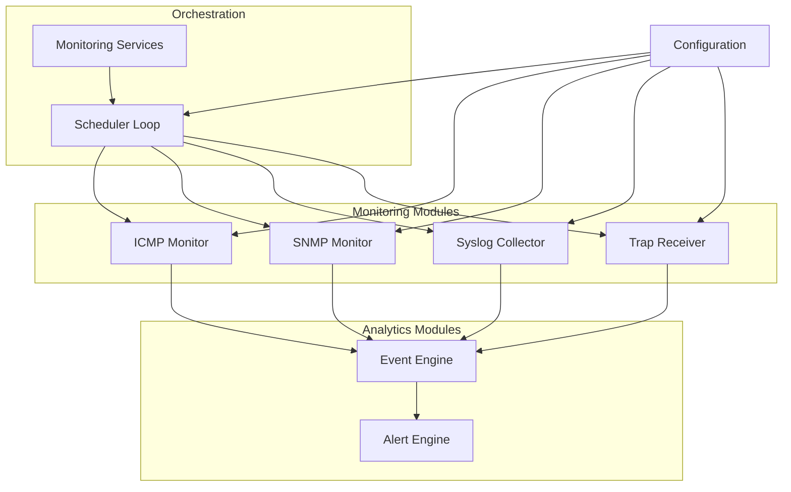
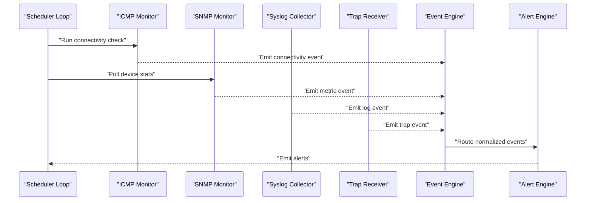
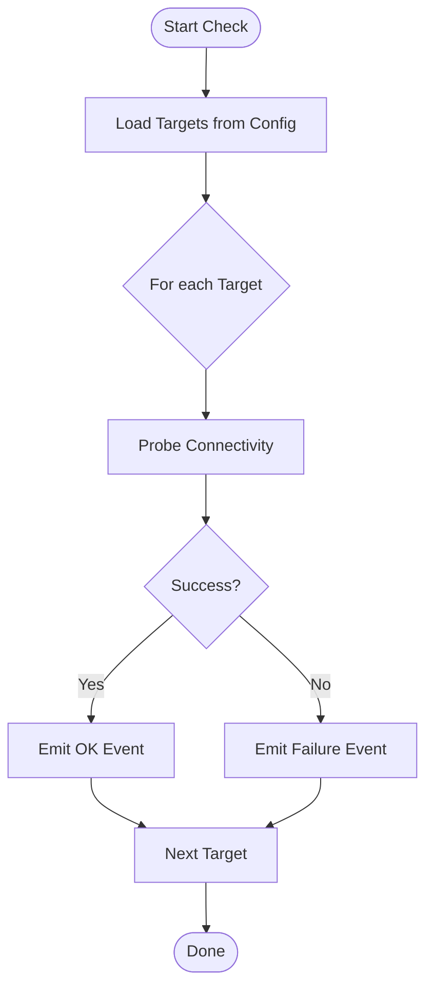
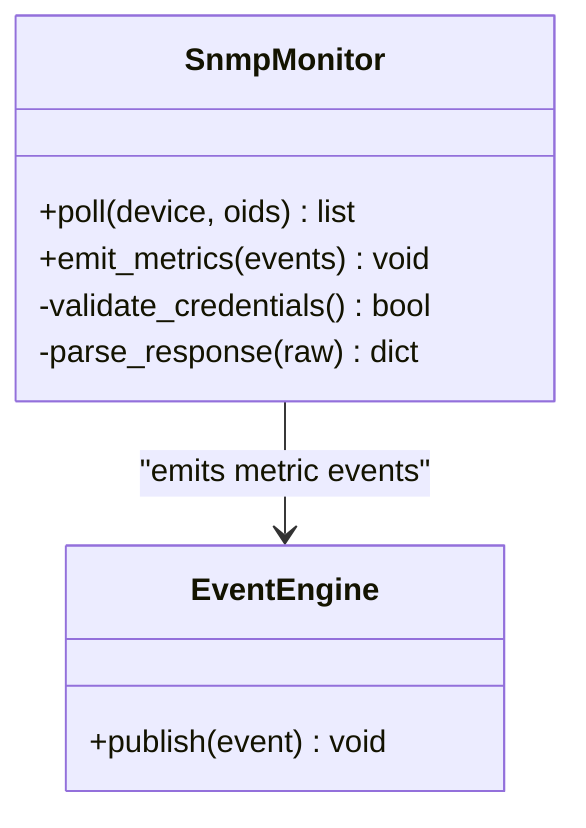
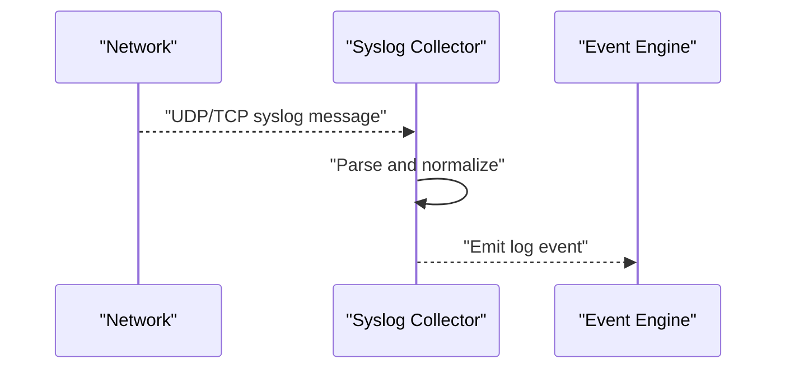
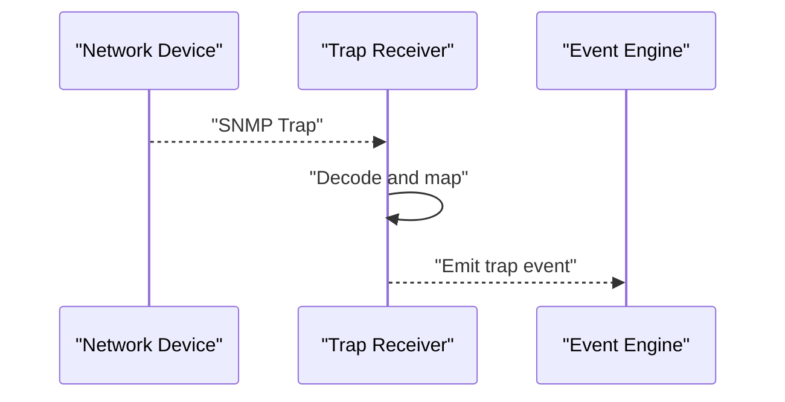
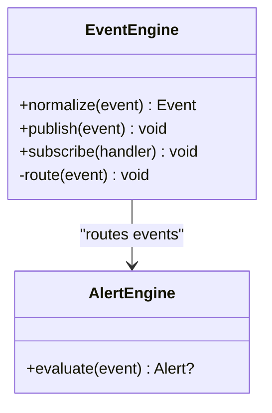
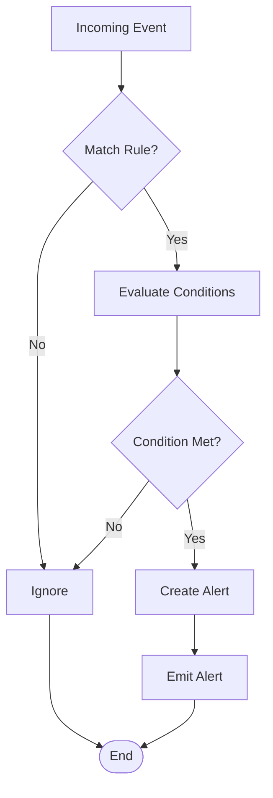
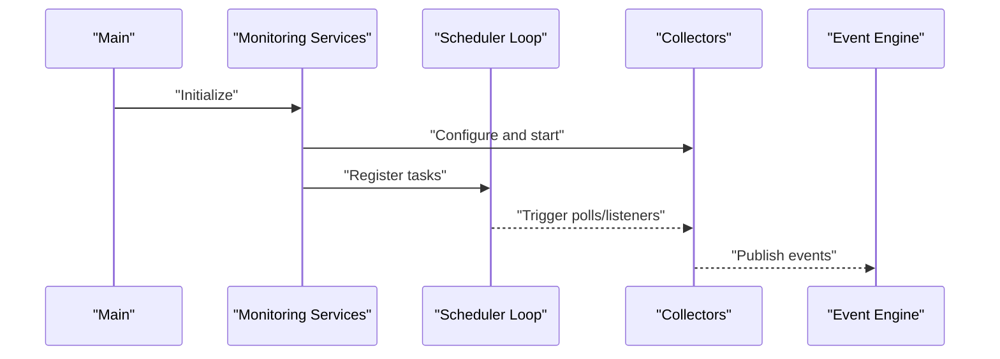
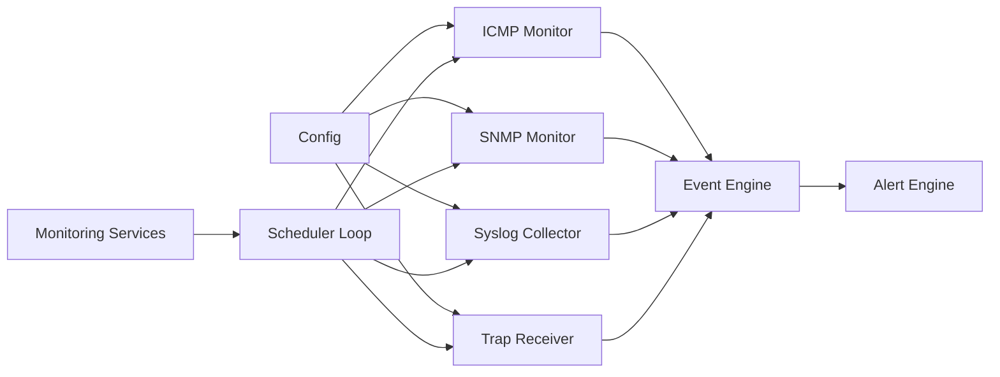

# Monitoring System

<cite>
**Referenced Files in This Document**
- [icmp_monitor.py](file://icmp_discovery/monitoring_modules/icmp_monitor.py)
- [snmp_monitor.py](file://icmp_discovery/monitoring_modules/snmp_monitor.py)
- [syslog_collector.py](file://icmp_discovery/monitoring_modules/syslog_collector.py)
- [trap_receiver.py](file://icmp_discovery/monitoring_modules/trap_receiver.py)
- [event_engine.py](file://icmp_discovery/analytics_modules/event_engine.py)
- [alert_engine.py](file://icmp_discovery/analytics_modules/alert_engine.py)
- [monitoring_services.py](file://icmp_discovery/monitoring_services.py)
- [config.py](file://icmp_discovery/config.py)
- [scheduler_loop.py](file://icmp_discovery/scheduler_loop.py)
- [main.py](file://icmp_discovery/main.py)
</cite>

## Table of Contents
1. [Introduction](#introduction)
2. [Project Structure](#project-structure)
3. [Core Components](#core-components)
4. [Architecture Overview](#architecture-overview)
5. [Detailed Component Analysis](#detailed-component-analysis)
6. [Dependency Analysis](#dependency-analysis)
7. [Performance Considerations](#performance-considerations)
8. [Troubleshooting Guide](#troubleshooting-guide)
9. [Conclusion](#conclusion)
10. [Appendices](#appendices)

## Introduction
This document describes the monitoring system that collects and processes network device metrics. It covers:
- ICMP monitor for basic connectivity checks
- SNMP monitor for advanced device statistics
- Syslog collector for log aggregation
- Trap receiver for SNMP notifications
It also explains the event-driven pipeline, data collection strategies, alerting mechanisms, configuration examples, performance tuning guidelines, and troubleshooting steps.

## Project Structure
The monitoring subsystem resides under icmp_discovery with a clear separation of concerns:
- monitoring_modules: collectors (ICMP, SNMP, syslog, traps)
- analytics_modules: event and alert engines
- orchestration: scheduler loop and services that wire collectors to the event pipeline
- configuration: centralized settings for collectors and pipelines

**Diagram sources**
- [monitoring_services.py](file://icmp_discovery/monitoring_services.py)
- [scheduler_loop.py](file://icmp_discovery/scheduler_loop.py)
- [event_engine.py](file://icmp_discovery/analytics_modules/event_engine.py)
- [alert_engine.py](file://icmp_discovery/analytics_modules/alert_engine.py)
- [icmp_monitor.py](file://icmp_discovery/monitoring_modules/icmp_monitor.py)
- [snmp_monitor.py](file://icmp_discovery/monitoring_modules/snmp_monitor.py)
- [syslog_collector.py](file://icmp_discovery/monitoring_modules/syslog_collector.py)
- [trap_receiver.py](file://icmp_discovery/monitoring_modules/trap_receiver.py)
- [config.py](file://icmp_discovery/config.py)

**Section sources**
- [monitoring_services.py](file://icmp_discovery/monitoring_services.py)
- [scheduler_loop.py](file://icmp_discovery/scheduler_loop.py)
- [config.py](file://icmp_discovery/config.py)

## Core Components
- ICMP Monitor: Performs reachability checks against target devices and emits connectivity events.
- SNMP Monitor: Collects device statistics via SNMP and emits metric events.
- Syslog Collector: Listens for syslog messages and emits log events.
- Trap Receiver: Receives SNMP traps and emits trap events.
- Event Engine: Normalizes incoming events into a common schema and routes them downstream.
- Alert Engine: Evaluates rules against events and generates alerts.

Key responsibilities:
- Data collection: Each collector implements a consistent interface for polling or listening.
- Event emission: Collectors publish normalized events to the event engine.
- Alerting: The alert engine consumes events and produces actionable alerts.
- Orchestration: Scheduler drives periodic tasks; services coordinate lifecycle and configuration.

**Section sources**
- [icmp_monitor.py](file://icmp_discovery/monitoring_modules/icmp_monitor.py)
- [snmp_monitor.py](file://icmp_discovery/monitoring_modules/snmp_monitor.py)
- [syslog_collector.py](file://icmp_discovery/monitoring_modules/syslog_collector.py)
- [trap_receiver.py](file://icmp_discovery/monitoring_modules/trap_receiver.py)
- [event_engine.py](file://icmp_discovery/analytics_modules/event_engine.py)
- [alert_engine.py](file://icmp_discovery/analytics_modules/alert_engine.py)
- [monitoring_services.py](file://icmp_discovery/monitoring_services.py)
- [scheduler_loop.py](file://icmp_discovery/scheduler_loop.py)

## Architecture Overview
The system follows an event-driven architecture:
- Collectors gather raw telemetry and emit standardized events.
- The event engine normalizes and routes events to consumers.
- The alert engine evaluates rules and emits alerts.
- A scheduler orchestrates periodic tasks and long-running listeners.

**Diagram sources**
- [scheduler_loop.py](file://icmp_discovery/scheduler_loop.py)
- [icmp_monitor.py](file://icmp_discovery/monitoring_modules/icmp_monitor.py)
- [snmp_monitor.py](file://icmp_discovery/monitoring_modules/snmp_monitor.py)
- [syslog_collector.py](file://icmp_discovery/monitoring_modules/syslog_collector.py)
- [trap_receiver.py](file://icmp_discovery/monitoring_modules/trap_receiver.py)
- [event_engine.py](file://icmp_discovery/analytics_modules/event_engine.py)
- [alert_engine.py](file://icmp_discovery/analytics_modules/alert_engine.py)

## Detailed Component Analysis

### ICMP Monitor
Purpose:
- Perform periodic reachability checks against configured targets.
- Emit connectivity events with status and timing details.

Key behaviors:
- Iterates over target list from configuration.
- Executes ping-like probes and records success/failure and latency.
- Emits normalized events to the event engine.

**Diagram sources**
- [icmp_monitor.py](file://icmp_discovery/monitoring_modules/icmp_monitor.py)
- [config.py](file://icmp_discovery/config.py)

**Section sources**
- [icmp_monitor.py](file://icmp_discovery/monitoring_modules/icmp_monitor.py)
- [config.py](file://icmp_discovery/config.py)

### SNMP Monitor
Purpose:
- Poll SNMP-enabled devices for operational metrics (interfaces, CPU, memory, etc.).
- Emit metric events with structured values and timestamps.

Key behaviors:
- Reads SNMP credentials and OIDs from configuration.
- Performs GET/WALK operations and aggregates results.
- Emits normalized metric events to the event engine.

**Diagram sources**
- [snmp_monitor.py](file://icmp_discovery/monitoring_modules/snmp_monitor.py)
- [event_engine.py](file://icmp_discovery/analytics_modules/event_engine.py)

**Section sources**
- [snmp_monitor.py](file://icmp_discovery/monitoring_modules/snmp_monitor.py)
- [event_engine.py](file://icmp_discovery/analytics_modules/event_engine.py)

### Syslog Collector
Purpose:
- Listen for syslog messages on configured endpoints.
- Parse and normalize logs into events for downstream processing.

Key behaviors:
- Binds to UDP/TCP syslog ports as configured.
- Parses message fields and enriches with metadata.
- Publishes log events to the event engine.

**Diagram sources**
- [syslog_collector.py](file://icmp_discovery/monitoring_modules/syslog_collector.py)
- [event_engine.py](file://icmp_discovery/analytics_modules/event_engine.py)

**Section sources**
- [syslog_collector.py](file://icmp_discovery/monitoring_modules/syslog_collector.py)
- [event_engine.py](file://icmp_discovery/analytics_modules/event_engine.py)

### Trap Receiver
Purpose:
- Receive SNMPv2c/v3 traps and convert them into events.
- Enrich traps with context and forward to the event engine.

Key behaviors:
- Starts SNMP trap listener on configured port.
- Decodes trap PDU and maps variables to normalized fields.
- Emits trap events to the event engine.

**Diagram sources**
- [trap_receiver.py](file://icmp_discovery/monitoring_modules/trap_receiver.py)
- [event_engine.py](file://icmp_discovery/analytics_modules/event_engine.py)

**Section sources**
- [trap_receiver.py](file://icmp_discovery/monitoring_modules/trap_receiver.py)
- [event_engine.py](file://icmp_discovery/analytics_modules/event_engine.py)

### Event Engine
Purpose:
- Normalize heterogeneous events into a unified schema.
- Route events to subscribers such as the alert engine.

Key behaviors:
- Validates and transforms incoming events.
- Maintains routing tables and subscriber callbacks.
- Ensures ordering and delivery guarantees per policy.

**Diagram sources**
- [event_engine.py](file://icmp_discovery/analytics_modules/event_engine.py)
- [alert_engine.py](file://icmp_discovery/analytics_modules/alert_engine.py)

**Section sources**
- [event_engine.py](file://icmp_discovery/analytics_modules/event_engine.py)
- [alert_engine.py](file://icmp_discovery/analytics_modules/alert_engine.py)

### Alert Engine
Purpose:
- Evaluate alerting rules against incoming events.
- Generate alerts when conditions are met.

Key behaviors:
- Loads rule sets from configuration.
- Applies thresholds, patterns, and correlation logic.
- Emits alerts for further handling (e.g., notifications).

**Diagram sources**
- [alert_engine.py](file://icmp_discovery/analytics_modules/alert_engine.py)
- [config.py](file://icmp_discovery/config.py)

**Section sources**
- [alert_engine.py](file://icmp_discovery/analytics_modules/alert_engine.py)
- [config.py](file://icmp_discovery/config.py)

### Monitoring Services and Scheduler
Purpose:
- Coordinate lifecycle of collectors and the event pipeline.
- Schedule periodic tasks and manage long-running listeners.

Key behaviors:
- Initializes collectors based on configuration.
- Registers event handlers and starts the scheduler loop.
- Provides graceful shutdown and error recovery hooks.

**Diagram sources**
- [monitoring_services.py](file://icmp_discovery/monitoring_services.py)
- [scheduler_loop.py](file://icmp_discovery/scheduler_loop.py)
- [main.py](file://icmp_discovery/main.py)

**Section sources**
- [monitoring_services.py](file://icmp_discovery/monitoring_services.py)
- [scheduler_loop.py](file://icmp_discovery/scheduler_loop.py)
- [main.py](file://icmp_discovery/main.py)

## Dependency Analysis
Collectors depend on configuration and the event engine. The alert engine depends on the event engine and configuration. The scheduler and services orchestrate all components.

**Diagram sources**
- [config.py](file://icmp_discovery/config.py)
- [icmp_monitor.py](file://icmp_discovery/monitoring_modules/icmp_monitor.py)
- [snmp_monitor.py](file://icmp_discovery/monitoring_modules/snmp_monitor.py)
- [syslog_collector.py](file://icmp_discovery/monitoring_modules/syslog_collector.py)
- [trap_receiver.py](file://icmp_discovery/monitoring_modules/trap_receiver.py)
- [event_engine.py](file://icmp_discovery/analytics_modules/event_engine.py)
- [alert_engine.py](file://icmp_discovery/analytics_modules/alert_engine.py)
- [monitoring_services.py](file://icmp_discovery/monitoring_services.py)
- [scheduler_loop.py](file://icmp_discovery/scheduler_loop.py)

**Section sources**
- [config.py](file://icmp_discovery/config.py)
- [monitoring_services.py](file://icmp_discovery/monitoring_services.py)
- [scheduler_loop.py](file://icmp_discovery/scheduler_loop.py)

## Performance Considerations
- Batch and throttle:
  - Group SNMP polls and batch event emissions to reduce overhead.
  - Use backpressure in the event engine to prevent queue buildup.
- Concurrency:
  - Parallelize ICMP probes across targets while respecting rate limits.
  - Use asynchronous I/O for syslog and trap listeners.
- Resource usage:
  - Tune buffer sizes for syslog/trap sockets.
  - Limit concurrent SNMP sessions per device group.
- Caching:
  - Cache device capabilities and OID mappings to avoid repeated discovery.
- Observability:
  - Emit internal metrics for collector throughput, latency, and error rates.

[No sources needed since this section provides general guidance]

## Troubleshooting Guide
Common issues and resolutions:
- ICMP failures:
  - Verify firewall rules and host reachability.
  - Increase timeouts and retries if networks are congested.
- SNMP errors:
  - Confirm community strings or SNMPv3 credentials.
  - Validate OIDs and version compatibility.
- Syslog not received:
  - Check port bindings and permissions.
  - Ensure correct protocol (UDP/TCP) and IP addresses.
- Traps not received:
  - Confirm trap destination and SNMP version.
  - Validate MIB availability and variable mapping.
- Event pipeline stalls:
  - Inspect event engine queues and consumer lag.
  - Review alert engine rule complexity and evaluation time.

**Section sources**
- [icmp_monitor.py](file://icmp_discovery/monitoring_modules/icmp_monitor.py)
- [snmp_monitor.py](file://icmp_discovery/monitoring_modules/snmp_monitor.py)
- [syslog_collector.py](file://icmp_discovery/monitoring_modules/syslog_collector.py)
- [trap_receiver.py](file://icmp_discovery/monitoring_modules/trap_receiver.py)
- [event_engine.py](file://icmp_discovery/analytics_modules/event_engine.py)
- [alert_engine.py](file://icmp_discovery/analytics_modules/alert_engine.py)

## Conclusion
The monitoring system provides a robust, event-driven pipeline for collecting network device metrics and logs. By standardizing events through the event engine and applying configurable rules in the alert engine, it enables scalable and maintainable monitoring. Proper configuration, performance tuning, and proactive troubleshooting ensure reliable operation across diverse environments.

[No sources needed since this section summarizes without analyzing specific files]

## Appendices

### Configuration Examples
- Basic ICMP-only monitoring:
  - Configure target list and probe interval.
  - Enable minimal logging and disable SNMP/syslog/trap modules.
- Full-stack monitoring:
  - Add SNMP credentials and OIDs.
  - Enable syslog listener on appropriate port.
  - Configure SNMP trap receiver endpoint.
- High-throughput scenario:
  - Increase concurrency limits for ICMP and SNMP.
  - Adjust event engine buffers and alert evaluation batching.

[No sources needed since this section provides general guidance]

### Event Schema Overview
- Common fields:
  - Timestamp, source device ID, event type, severity, payload.
- Normalization:
  - Collectors map raw data to the common schema before publishing.

[No sources needed since this section provides general guidance]