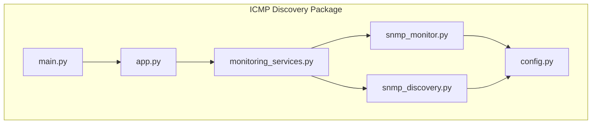
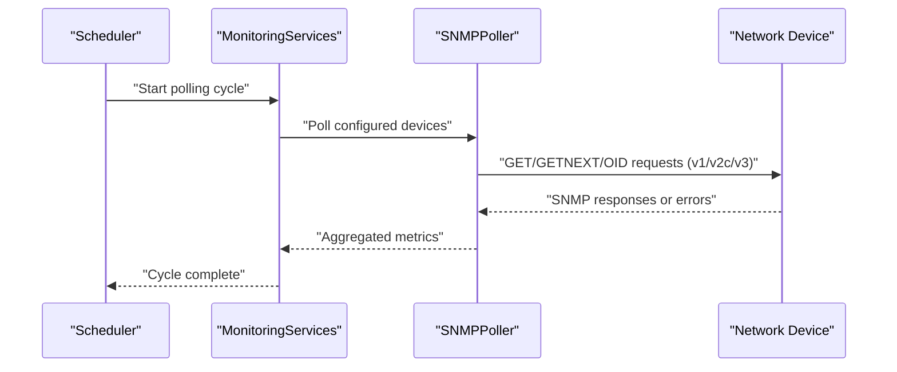
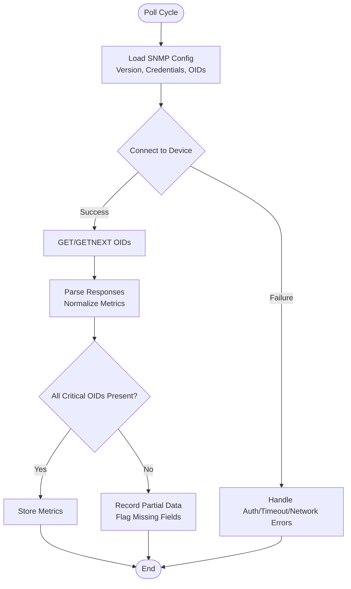
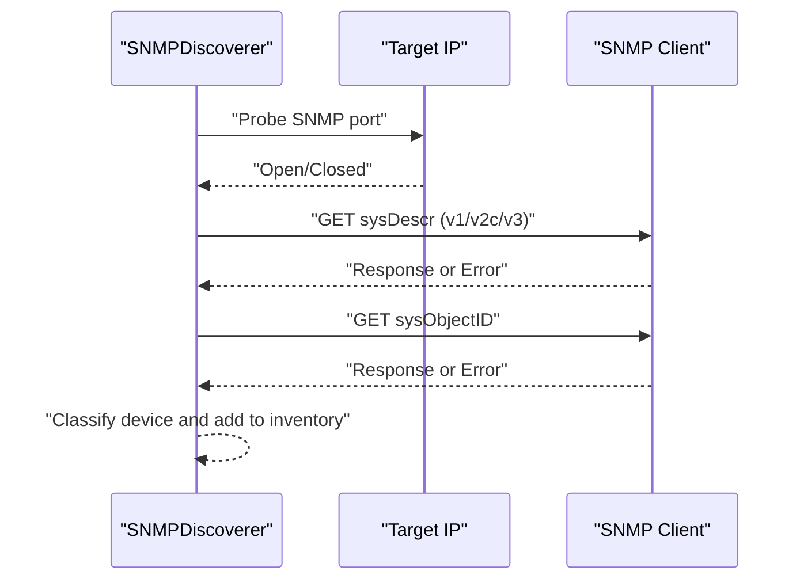
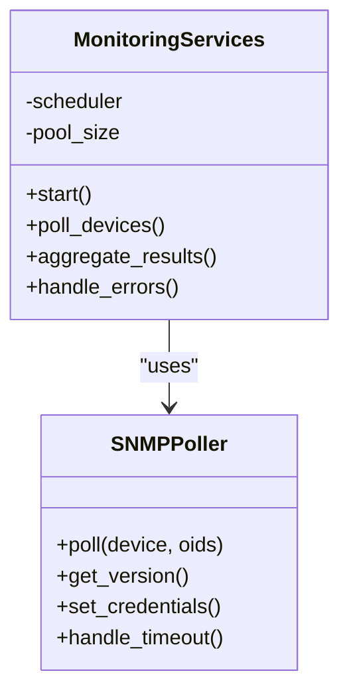
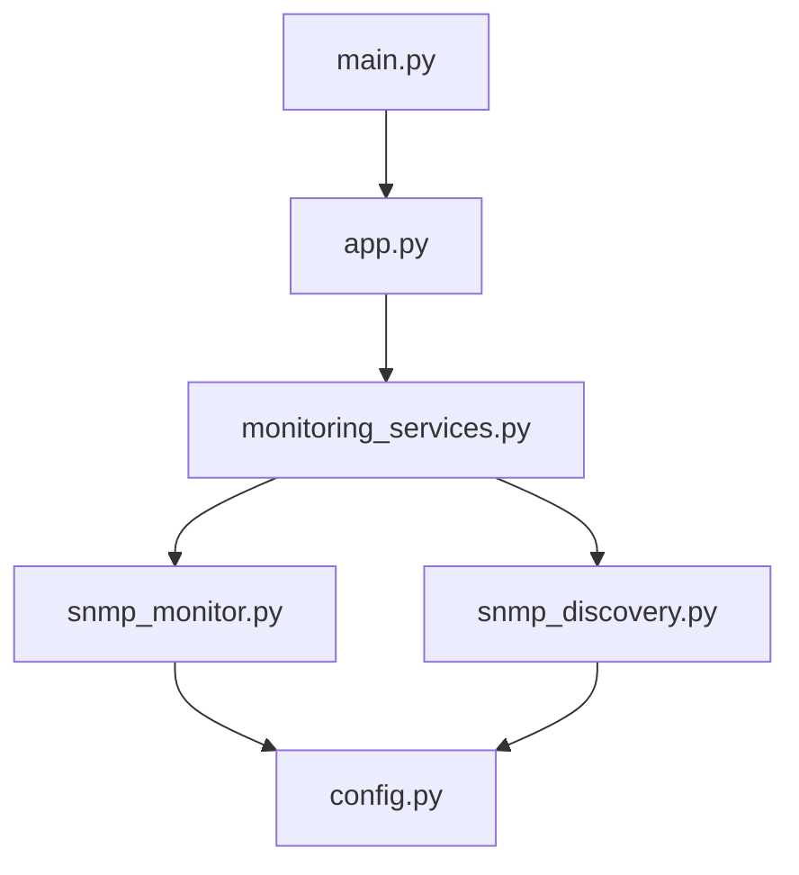

# SNMP Monitor

<cite>
**Referenced Files in This Document**
- [snmp_monitor.py](file://icmp_discovery/monitoring_modules/snmp_monitor.py)
- [snmp_discovery.py](file://icmp_discovery/discovery_modules/snmp_discovery.py)
- [monitoring_services.py](file://icmp_discovery/monitoring_services.py)
- [config.py](file://icmp_discovery/config.py)
- [app.py](file://icmp_discovery/app.py)
- [main.py](file://icmp_discovery/main.py)
</cite>

## Table of Contents
1. [Introduction](#introduction)
2. [Project Structure](#project-structure)
3. [Core Components](#core-components)
4. [Architecture Overview](#architecture-overview)
5. [Detailed Component Analysis](#detailed-component-analysis)
6. [Dependency Analysis](#dependency-analysis)
7. [Performance Considerations](#performance-considerations)
8. [Troubleshooting Guide](#troubleshooting-guide)
9. [Conclusion](#conclusion)
10. [Appendices](#appendices)

## Introduction
This document provides comprehensive documentation for the SNMP monitor component within the repository. It explains how advanced device statistics, interface metrics, CPU utilization, memory usage, and other SNMP OIDs are collected. It also documents supported SNMP versions (v1, v2c, v3), authentication methods, community strings, and security configurations. Practical examples include OID discovery, custom metric collection, polling intervals, and error handling strategies. Finally, it covers performance considerations for large networks and best practices for designing robust SNMP monitoring systems.

## Project Structure
The SNMP monitoring functionality is primarily implemented under the icmp_discovery package:
- Monitoring module: snmp_monitor.py
- Discovery module: snmp_discovery.py
- Orchestration and scheduling: monitoring_services.py, app.py, main.py
- Configuration: config.py

**Diagram sources**
- [monitoring_services.py](file://icmp_discovery/monitoring_services.py)
- [snmp_monitor.py](file://icmp_discovery/monitoring_modules/snmp_monitor.py)
- [snmp_discovery.py](file://icmp_discovery/discovery_modules/snmp_discovery.py)
- [config.py](file://icmp_discovery/config.py)
- [app.py](file://icmp_discovery/app.py)
- [main.py](file://icmp_discovery/main.py)

**Section sources**
- [monitoring_services.py](file://icmp_discovery/monitoring_services.py)
- [snmp_monitor.py](file://icmp_discovery/monitoring_modules/snmp_monitor.py)
- [snmp_discovery.py](file://icmp_discovery/discovery_modules/snmp_discovery.py)
- [config.py](file://icmp_discovery/config.py)
- [app.py](file://icmp_discovery/app.py)
- [main.py](file://icmp_discovery/main.py)

## Core Components
- SNMP Monitor (snmp_monitor.py): Implements polling logic, OID retrieval, version negotiation, and error handling for SNMP operations. It exposes functions to collect interface counters, system resources (CPU/memory), and custom OIDs with configurable timeouts and retries.
- SNMP Discovery (snmp_discovery.py): Discovers SNMP-enabled devices by probing common ports and validating responses using community strings or v3 credentials.
- Monitoring Services (monitoring_services.py): Orchestrates scheduled polling cycles, manages concurrency, and aggregates results from multiple monitors including SNMP.
- Configuration (config.py): Centralizes settings such as default SNMP versions, community strings, v3 parameters, timeouts, retry policies, and polling intervals.
- Application Entry Points (app.py, main.py): Initialize services, configure logging, and start the scheduler that drives periodic SNMP polling.

Key responsibilities:
- Version support: v1, v2c, v3
- Authentication and security: community strings for v1/v2c; username, auth protocol, privacy protocol, and security level for v3
- Metric collection: interfaces, system stats, CPU, memory, and custom OIDs
- Polling strategy: configurable intervals, timeouts, retries, and backoff
- Error handling: network errors, authentication failures, timeout handling, and partial data recovery

**Section sources**
- [snmp_monitor.py](file://icmp_discovery/monitoring_modules/snmp_monitor.py)
- [snmp_discovery.py](file://icmp_discovery/discovery_modules/snmp_discovery.py)
- [monitoring_services.py](file://icmp_discovery/monitoring_services.py)
- [config.py](file://icmp_discovery/config.py)
- [app.py](file://icmp_discovery/app.py)
- [main.py](file://icmp_discovery/main.py)

## Architecture Overview
The SNMP monitor integrates into a broader monitoring pipeline. The scheduler triggers periodic polls; the SNMP monitor queries devices via SNMP; results are aggregated and stored or forwarded to analytics/alerting components.

**Diagram sources**
- [monitoring_services.py](file://icmp_discovery/monitoring_services.py)
- [snmp_monitor.py](file://icmp_discovery/monitoring_modules/snmp_monitor.py)
- [config.py](file://icmp_discovery/config.py)

## Detailed Component Analysis

### SNMP Monitor (snmp_monitor.py)
Responsibilities:
- Establish SNMP sessions with version negotiation
- Retrieve standard and custom OIDs
- Handle timeouts, retries, and error classification
- Normalize responses into structured metrics

Supported SNMP versions and security:
- v1 and v2c: community string-based access
- v3: username, auth protocol (e.g., MD5/SHA), privacy protocol (e.g., DES/AES), and security level (noAuthNoPriv, authNoPriv, authPriv)

Common OIDs and metrics:
- System: sysUpTime, sysDescr, sysObjectID
- Interfaces: ifIndex, ifDescr, ifOperStatus, ifInOctets, ifOutOctets, ifInErrors, ifOutErrors
- CPU/Memory: vendor-specific OIDs or platform MIBs
- Custom OIDs: user-defined lists per device profile

Polling configuration:
- Interval: seconds between polls
- Timeout: per-request timeout
- Retries: number of attempts before failure
- Concurrency: parallel requests per device or across devices

Error handling strategies:
- Network unreachable: exponential backoff and alert
- Authentication failure: credential validation and rotation
- Timeout: retry with jitter and mark stale metrics
- Partial response: record available fields and flag missing ones

OID discovery:
- Use GETNEXT to walk subtrees for dynamic interface enumeration
- Cache discovered OIDs to reduce overhead
- Validate presence of critical OIDs before full polling

Custom metric collection:
- Define per-device OID maps
- Parse numeric values and units
- Apply scaling and thresholds

**Diagram sources**
- [snmp_monitor.py](file://icmp_discovery/monitoring_modules/snmp_monitor.py)
- [config.py](file://icmp_discovery/config.py)

**Section sources**
- [snmp_monitor.py](file://icmp_discovery/monitoring_modules/snmp_monitor.py)
- [config.py](file://icmp_discovery/config.py)

### SNMP Discovery (snmp_discovery.py)
Responsibilities:
- Probe IP ranges for SNMP responders
- Validate community strings or v3 credentials
- Classify device capabilities based on returned OIDs
- Populate device inventory for subsequent polling

Discovery workflow:
- Iterate target IPs
- Attempt SNMP handshake with version fallback
- On success, fetch sysDescr and sysObjectID
- Add to device list with discovered attributes

**Diagram sources**
- [snmp_discovery.py](file://icmp_discovery/discovery_modules/snmp_discovery.py)
- [config.py](file://icmp_discovery/config.py)

**Section sources**
- [snmp_discovery.py](file://icmp_discovery/discovery_modules/snmp_discovery.py)
- [config.py](file://icmp_discovery/config.py)

### Monitoring Services (monitoring_services.py)
Responsibilities:
- Schedule periodic SNMP polling
- Manage concurrency and resource limits
- Aggregate results and handle cross-monitor coordination
- Emit events for alerts and analytics

Scheduling model:
- Fixed interval or adaptive intervals based on device criticality
- Batched polling to avoid overwhelming devices
- Retry and backoff policies at service level

**Diagram sources**
- [monitoring_services.py](file://icmp_discovery/monitoring_services.py)
- [snmp_monitor.py](file://icmp_discovery/monitoring_modules/snmp_monitor.py)

**Section sources**
- [monitoring_services.py](file://icmp_discovery/monitoring_services.py)
- [snmp_monitor.py](file://icmp_discovery/monitoring_modules/snmp_monitor.py)

### Configuration (config.py)
Responsibilities:
- Define defaults for SNMP versions, community strings, v3 parameters
- Configure timeouts, retries, polling intervals, and concurrency
- Provide per-device overrides and profiles

Key settings:
- Default SNMP version
- Community strings for v1/v2c
- v3 username, auth/privacy protocols, security level
- Timeouts and retries
- Polling intervals and batch sizes
- OID maps for standard and custom metrics

**Section sources**
- [config.py](file://icmp_discovery/config.py)

### Application Entry Points (app.py, main.py)
Responsibilities:
- Initialize application context and logging
- Load configuration
- Start monitoring services and scheduler
- Graceful shutdown and cleanup

Startup flow:
- Load config
- Initialize monitoring services
- Start scheduler loop
- Handle signals for clean exit

**Section sources**
- [app.py](file://icmp_discovery/app.py)
- [main.py](file://icmp_discovery/main.py)

## Dependency Analysis
The SNMP monitor depends on configuration for credentials and behavior, and is orchestrated by monitoring services. Discovery feeds device inventory into the polling pipeline.

**Diagram sources**
- [config.py](file://icmp_discovery/config.py)
- [app.py](file://icmp_discovery/app.py)
- [main.py](file://icmp_discovery/main.py)
- [monitoring_services.py](file://icmp_discovery/monitoring_services.py)
- [snmp_monitor.py](file://icmp_discovery/monitoring_modules/snmp_monitor.py)
- [snmp_discovery.py](file://icmp_discovery/discovery_modules/snmp_discovery.py)

**Section sources**
- [config.py](file://icmp_discovery/config.py)
- [app.py](file://icmp_discovery/app.py)
- [main.py](file://icmp_discovery/main.py)
- [monitoring_services.py](file://icmp_discovery/monitoring_services.py)
- [snmp_monitor.py](file://icmp_discovery/monitoring_modules/snmp_monitor.py)
- [snmp_discovery.py](file://icmp_discovery/discovery_modules/snmp_discovery.py)

## Performance Considerations
- Concurrency control: Limit parallel SNMP requests per device and across devices to avoid overloading targets and the collector.
- Polling intervals: Tune intervals based on device criticality and change frequency; use longer intervals for stable devices.
- Timeouts and retries: Set conservative timeouts and limited retries to prevent cascading delays.
- OID batching: Group related OIDs to minimize round trips.
- Caching: Cache discovered OIDs and device capabilities to reduce discovery overhead.
- Backpressure: Drop or defer non-critical metrics during high load.
- Scaling: Distribute polling across multiple workers or nodes for large networks.
- MIB optimization: Prefer specific OIDs over broad walks where possible.

[No sources needed since this section provides general guidance]

## Troubleshooting Guide
Common issues and resolutions:
- Authentication failures:
  - Verify community strings for v1/v2c
  - Confirm v3 username, auth/privacy protocols, and security level
  - Check device ACLs and SNMP access controls
- Timeouts:
  - Increase timeouts gradually
  - Reduce concurrent requests
  - Investigate network latency and packet loss
- Partial data:
  - Inspect which OIDs failed and adjust OID maps
  - Implement fallback OIDs for critical metrics
- Stale metrics:
  - Mark metrics as stale after consecutive failures
  - Alert on prolonged unreachability
- Discovery problems:
  - Validate SNMP port reachability
  - Ensure correct version negotiation order

Operational checks:
- Log detailed error categories and counts
- Monitor poll duration distributions
- Track success rates per device and per OID group

**Section sources**
- [snmp_monitor.py](file://icmp_discovery/monitoring_modules/snmp_monitor.py)
- [monitoring_services.py](file://icmp_discovery/monitoring_services.py)
- [config.py](file://icmp_discovery/config.py)

## Conclusion
The SNMP monitor component provides robust, configurable SNMP polling for advanced device statistics, interface metrics, CPU/memory usage, and custom OIDs. It supports SNMP v1, v2c, and v3 with appropriate authentication and security settings. By tuning polling intervals, concurrency, timeouts, and retries, it scales effectively across large networks. Following the best practices outlined here ensures reliable, performant, and maintainable SNMP monitoring.

[No sources needed since this section summarizes without analyzing specific files]

## Appendices

### Supported SNMP Versions and Security
- SNMP v1/v2c:
  - Community string-based access
  - No encryption; suitable for trusted networks
- SNMP v3:
  - Username, authentication protocol, privacy protocol, and security level
  - Supports noAuthNoPriv, authNoPriv, authPriv

### Example OID Categories
- System: uptime, description, object ID
- Interfaces: operational status, traffic counters, error counters
- Resources: CPU utilization, memory usage (vendor-specific)
- Custom: application-specific metrics defined per device profile

### Polling Intervals and Scheduling
- Base intervals: e.g., 60–300 seconds depending on device type
- Adaptive intervals: shorten for critical devices, lengthen for stable ones
- Batch size: limit simultaneous requests to protect devices and collectors

### Best Practices
- Use SNMP v3 in production environments
- Separate read-only communities or users
- Avoid broad OID walks; prefer targeted OIDs
- Implement health checks and alerting for failures
- Regularly review and prune unused OIDs

[No sources needed since this section provides general guidance]