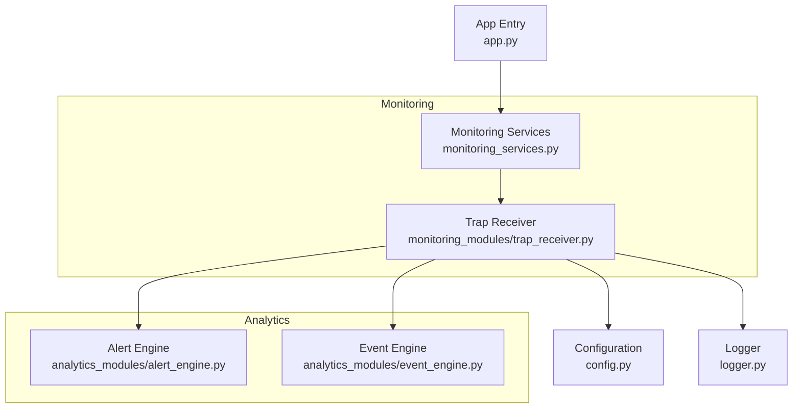
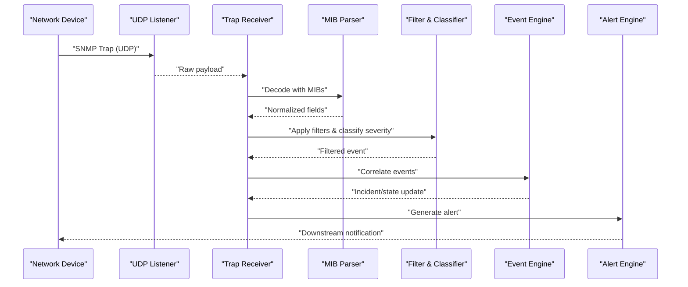
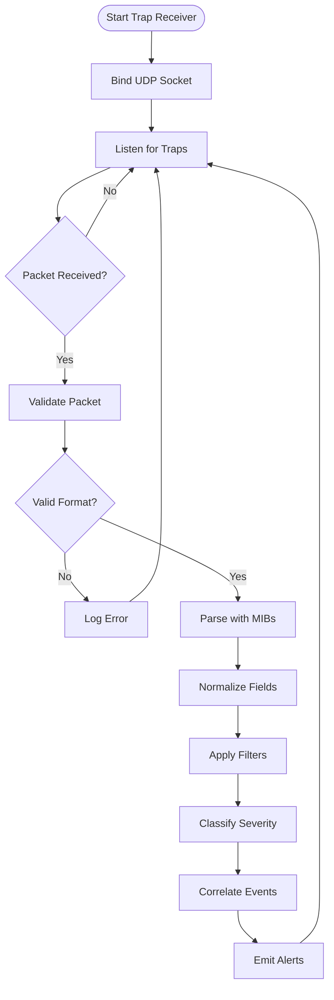
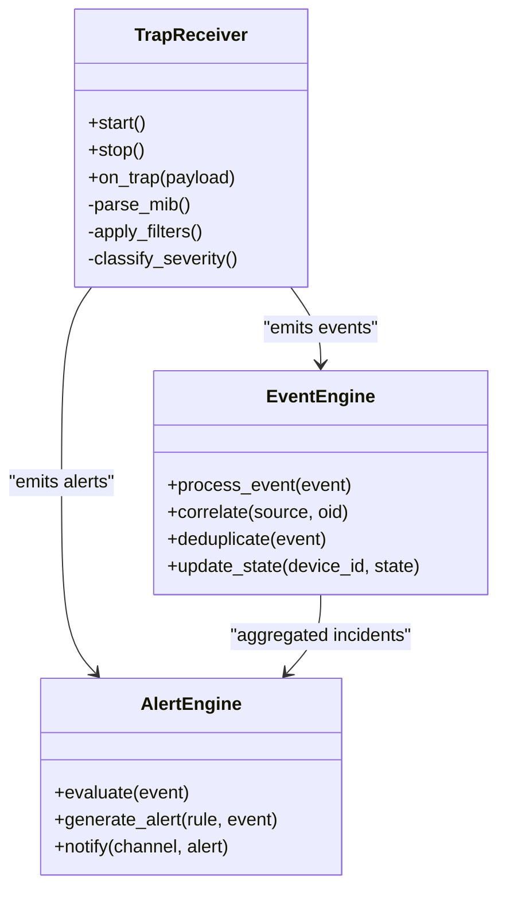
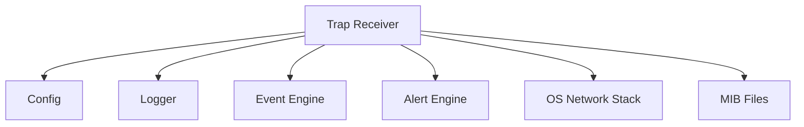

# SNMP Trap Receiver

<cite>
**Referenced Files in This Document**
- [trap_receiver.py](file://icmp_discovery/monitoring_modules/trap_receiver.py)
- [monitoring_services.py](file://icmp_discovery/monitoring_services.py)
- [alert_engine.py](file://icmp_discovery/analytics_modules/alert_engine.py)
- [event_engine.py](file://icmp_discovery/analytics_modules/event_engine.py)
- [config.py](file://icmp_discovery/config.py)
- [logger.py](file://icmp_discovery/logger.py)
- [app.py](file://icmp_discovery/app.py)
</cite>

## Table of Contents
1. [Introduction](#introduction)
2. [Project Structure](#project-structure)
3. [Core Components](#core-components)
4. [Architecture Overview](#architecture-overview)
5. [Detailed Component Analysis](#detailed-component-analysis)
6. [Dependency Analysis](#dependency-analysis)
7. [Performance Considerations](#performance-considerations)
8. [Troubleshooting Guide](#troubleshooting-guide)
9. [Conclusion](#conclusion)

## Introduction
This document provides comprehensive documentation for the SNMP trap receiver component within the monitoring subsystem. It explains how traps and notifications are received, parsed, classified, correlated, and forwarded to alerting engines. It also covers configuration for trap reception, MIB file support, filtering strategies, severity classification, performance considerations for high-frequency environments, and troubleshooting guidance.

## Project Structure
The SNMP trap receiver is implemented as a dedicated module under the monitoring subsystem and integrates with analytics modules for event correlation and alerting. The relevant files include:
- Monitoring module implementing the trap receiver
- Monitoring services orchestrating background tasks
- Analytics modules providing alerting and event processing capabilities
- Configuration and logging utilities
- Application entry points that initialize components

**Diagram sources**
- [trap_receiver.py](file://icmp_discovery/monitoring_modules/trap_receiver.py)
- [monitoring_services.py](file://icmp_discovery/monitoring_services.py)
- [alert_engine.py](file://icmp_discovery/analytics_modules/alert_engine.py)
- [event_engine.py](file://icmp_discovery/analytics_modules/event_engine.py)
- [config.py](file://icmp_discovery/config.py)
- [logger.py](file://icmp_discovery/logger.py)
- [app.py](file://icmp_discovery/app.py)

**Section sources**
- [trap_receiver.py](file://icmp_discovery/monitoring_modules/trap_receiver.py)
- [monitoring_services.py](file://icmp_discovery/monitoring_services.py)
- [alert_engine.py](file://icmp_discovery/analytics_modules/alert_engine.py)
- [event_engine.py](file://icmp_discovery/analytics_modules/event_engine.py)
- [config.py](file://icmp_discovery/config.py)
- [logger.py](file://icmp_discovery/logger.py)
- [app.py](file://icmp_discovery/app.py)

## Core Components
- Trap Receiver: Implements UDP listener for SNMP traps, parses incoming messages, applies filters, classifies severity, correlates events, and forwards alerts.
- Alert Engine: Consumes processed trap events and generates actionable alerts based on rules and thresholds.
- Event Engine: Handles event correlation, deduplication, and state transitions across related traps.
- Configuration: Provides runtime settings for trap listening (port, bind address), MIB paths, parsing options, and filter rules.
- Logger: Centralized logging for trap reception, parsing errors, and operational metrics.

Key responsibilities:
- Receive SNMP traps over UDP
- Parse ASN.1/BER-encoded payloads using configured MIBs
- Normalize fields into internal event structures
- Apply filtering by source, OID, or message content
- Classify severity (e.g., informational, warning, critical)
- Correlate related traps into incidents
- Emit alerts to downstream systems

**Section sources**
- [trap_receiver.py](file://icmp_discovery/monitoring_modules/trap_receiver.py)
- [alert_engine.py](file://icmp_discovery/analytics_modules/alert_engine.py)
- [event_engine.py](file://icmp_discovery/analytics_modules/event_engine.py)
- [config.py](file://icmp_discovery/config.py)
- [logger.py](file://icmp_discovery/logger.py)

## Architecture Overview
The trap receiver operates as a background service initialized by the application. It binds to a UDP port, listens for incoming SNMP traps, decodes them using MIB definitions, and publishes normalized events to analytics engines.

**Diagram sources**
- [trap_receiver.py](file://icmp_discovery/monitoring_modules/trap_receiver.py)
- [event_engine.py](file://icmp_discovery/analytics_modules/event_engine.py)
- [alert_engine.py](file://icmp_discovery/analytics_modules/alert_engine.py)

## Detailed Component Analysis

### Trap Receiver Module
Responsibilities:
- Initialize UDP socket and bind to configured interface/port
- Continuously receive and buffer incoming traps
- Decode payloads using MIB files
- Normalize and validate trap attributes
- Apply filtering rules (source IP, community strings, OIDs, enterprise-specific fields)
- Classify severity based on rule sets or MIB-defined semantics
- Forward events to event and alert engines

Operational flow:
- Start listener thread/process
- On each incoming packet:
  - Validate size and format
  - Resolve MIB definitions for OIDs
  - Map enterprise-specific traps to standard categories
  - Enforce rate limiting and backpressure if needed
  - Publish normalized event

Error handling:
- Log malformed packets and decoding failures
- Retry on transient network issues
- Graceful shutdown on signal

**Diagram sources**
- [trap_receiver.py](file://icmp_discovery/monitoring_modules/trap_receiver.py)

**Section sources**
- [trap_receiver.py](file://icmp_discovery/monitoring_modules/trap_receiver.py)

### Event Correlation and Alerting Integration
- Event Engine: Maintains state for device and trap correlations, deduplicates repeated events, and aggregates related traps into incidents.
- Alert Engine: Evaluates alerting rules against normalized events and triggers notifications via configured channels.

Integration points:
- Trap receiver emits standardized events
- Event engine updates correlation state and may suppress noise
- Alert engine evaluates thresholds and policies to generate alerts

**Diagram sources**
- [trap_receiver.py](file://icmp_discovery/monitoring_modules/trap_receiver.py)
- [event_engine.py](file://icmp_discovery/analytics_modules/event_engine.py)
- [alert_engine.py](file://icmp_discovery/analytics_modules/alert_engine.py)

**Section sources**
- [event_engine.py](file://icmp_discovery/analytics_modules/event_engine.py)
- [alert_engine.py](file://icmp_discovery/analytics_modules/alert_engine.py)

### Configuration and MIB Support
- Listening parameters: bind address, UDP port, community strings, allowed sources
- MIB configuration: directories containing MIB files, custom enterprise MIBs, reload behavior
- Parsing options: strict mode, fallback defaults, timeout for MIB resolution
- Filtering rules: source-based, OID-based, message pattern matching
- Severity mapping: rule-based classification, MIB-defined severities, overrides

Best practices:
- Use separate MIB directories per vendor
- Enable strict parsing in production to avoid silent misinterpretation
- Maintain minimal filter sets to reduce overhead
- Version-control MIB files alongside configuration

**Section sources**
- [config.py](file://icmp_discovery/config.py)

### Logging and Observability
- Structured logs for trap reception, parsing, filtering, and alert emission
- Metrics counters for traps received, dropped, parsed, filtered, and alerted
- Error categorization for malformed packets, MIB resolution failures, and network errors

Operational tips:
- Enable debug logging during initial deployment
- Rotate logs and aggregate centrally
- Expose metrics endpoints for monitoring dashboards

**Section sources**
- [logger.py](file://icmp_discovery/logger.py)

### Initialization and Lifecycle
- Application entry initializes monitoring services
- Monitoring services start trap receiver as a background task
- Graceful shutdown stops listeners and flushes pending events

Lifecycle hooks:
- Pre-start validation of ports and MIB paths
- Post-start health checks and readiness signals
- Shutdown handlers to release resources

**Section sources**
- [monitoring_services.py](file://icmp_discovery/monitoring_services.py)
- [app.py](file://icmp_discovery/app.py)

## Dependency Analysis
The trap receiver depends on configuration, logging, and analytics modules. It interacts with the OS network stack for UDP I/O and external MIB files for parsing.

**Diagram sources**
- [trap_receiver.py](file://icmp_discovery/monitoring_modules/trap_receiver.py)
- [config.py](file://icmp_discovery/config.py)
- [logger.py](file://icmp_discovery/logger.py)
- [event_engine.py](file://icmp_discovery/analytics_modules/event_engine.py)
- [alert_engine.py](file://icmp_discovery/analytics_modules/alert_engine.py)

**Section sources**
- [trap_receiver.py](file://icmp_discovery/monitoring_modules/trap_receiver.py)
- [config.py](file://icmp_discovery/config.py)
- [logger.py](file://icmp_discovery/logger.py)
- [event_engine.py](file://icmp_discovery/analytics_modules/event_engine.py)
- [alert_engine.py](file://icmp_discovery/analytics_modules/alert_engine.py)

## Performance Considerations
High-frequency trap environments require careful tuning:
- Buffer sizing: Increase UDP receive buffers to prevent drops under burst traffic
- Parsing efficiency: Cache MIB lookups and normalize OIDs once per session
- Filtering optimization: Use indexed filters and early-exit conditions
- Concurrency model: Prefer asynchronous I/O or worker pools for parallel processing
- Backpressure: Implement queue limits and drop policies when downstream engines lag
- Resource isolation: Run trap receiver in isolated processes or containers to contain memory spikes
- Metrics-driven scaling: Monitor throughput and latency; scale horizontally if needed

Recommendations:
- Profile CPU usage during peak trap rates
- Tune kernel parameters for UDP sockets
- Avoid synchronous disk writes in hot path; batch log outputs
- Use efficient serialization formats for inter-process communication

[No sources needed since this section provides general guidance]

## Troubleshooting Guide
Common issues and resolutions:
- No traps received:
  - Verify UDP port binding and firewall rules
  - Confirm source devices are configured to send traps to correct IP/port
  - Check community strings and access control lists
- Malformed packets:
  - Inspect logs for ASN.1/BER decode errors
  - Validate MIB files for syntax and completeness
  - Enable verbose logging temporarily
- High drop rate:
  - Increase buffer sizes and worker threads
  - Review filter complexity and optimize rules
  - Ensure downstream engines can keep up
- Incorrect severity classification:
  - Audit filter mappings and severity rules
  - Cross-check MIB-defined severities vs. local overrides
- MIB resolution failures:
  - Confirm MIB paths and permissions
  - Reload MIB cache after updates
  - Test parsing with known-good traps

Diagnostic steps:
- Capture raw UDP traffic for analysis
- Compare parsed fields against expected MIB definitions
- Validate event correlation state and deduplication logic
- Review alerting rule evaluations and thresholds

**Section sources**
- [logger.py](file://icmp_discovery/logger.py)
- [config.py](file://icmp_discovery/config.py)
- [trap_receiver.py](file://icmp_discovery/monitoring_modules/trap_receiver.py)

## Conclusion
The SNMP trap receiver provides robust reception, parsing, filtering, classification, correlation, and alerting integration for SNMP traps. Proper configuration of MIBs, filters, and performance tuning ensures reliable operation in high-frequency environments. Effective troubleshooting relies on structured logging, metrics, and systematic validation of network and parsing configurations.

[No sources needed since this section summarizes without analyzing specific files]