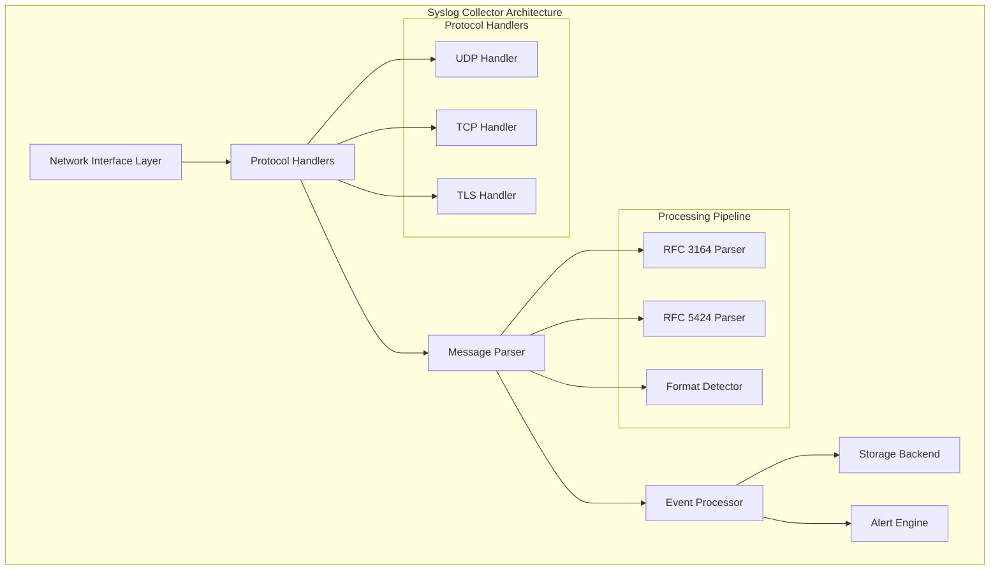
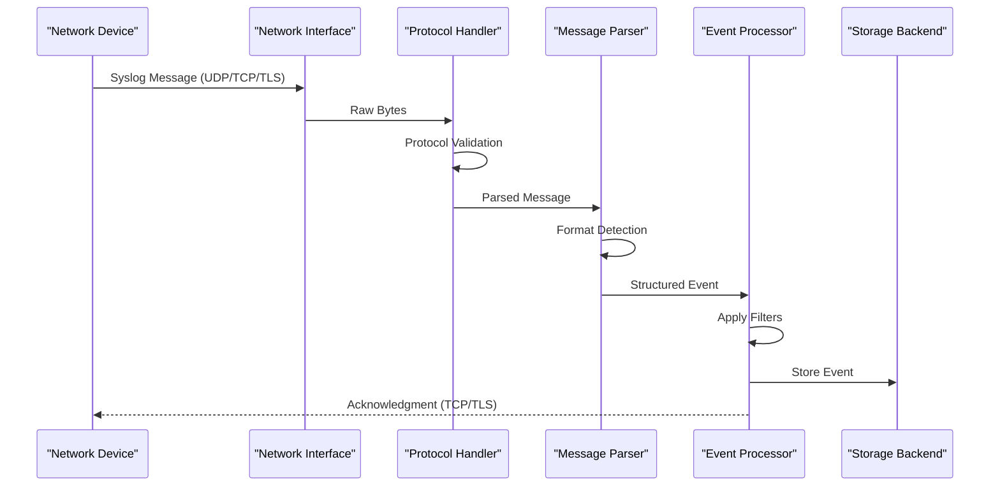
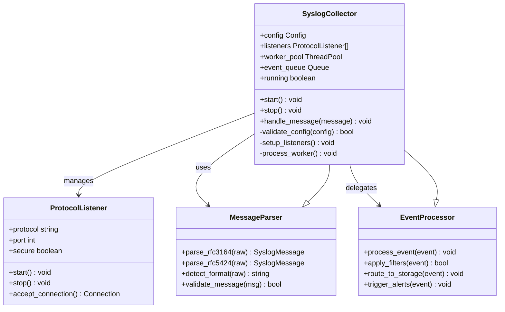
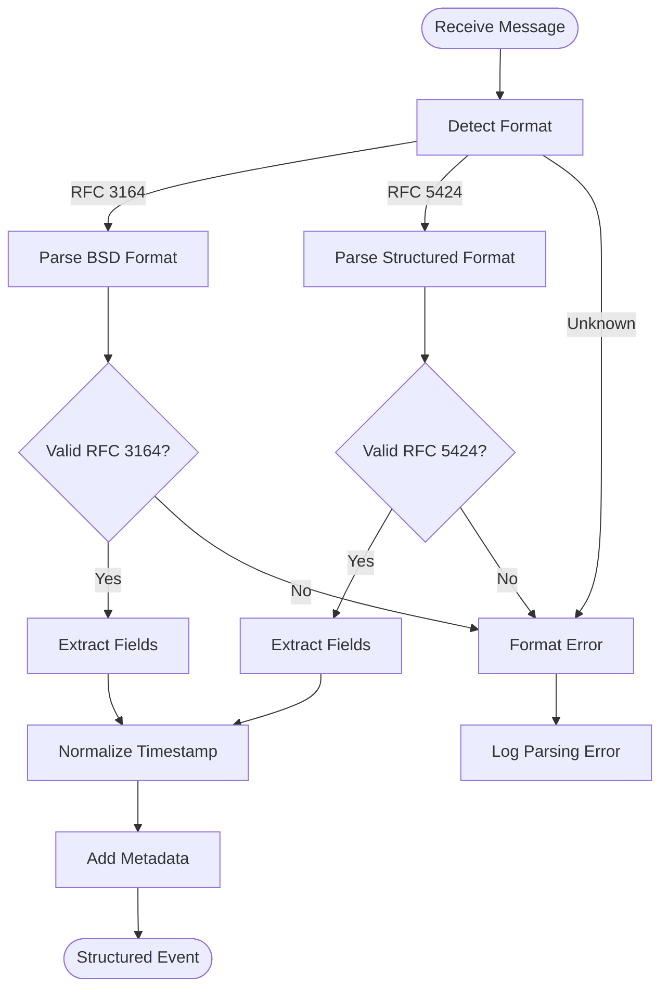

# Syslog Collector

<cite>
**Referenced Files in This Document**
- [syslog_collector.py](file://icmp_discovery/monitoring_modules/syslog_collector.py)
- [config.py](file://icmp_discovery/config.py)
- [logger.py](file://icmp_discovery/logger.py)
- [parser.py](file://icmp_discovery/parser.py)
- [main.py](file://icmp_discovery/main.py)
- [monitoring_services.py](file://icmp_discovery/monitoring_services.py)
</cite>

## Table of Contents
1. [Introduction](#introduction)
2. [Project Structure](#project-structure)
3. [Core Components](#core-components)
4. [Architecture Overview](#architecture-overview)
5. [Detailed Component Analysis](#detailed-component-analysis)
6. [Protocol Support](#protocol-support)
7. [Message Format Parsing](#message-format-parsing)
8. [Configuration Guide](#configuration-guide)
9. [Performance Optimization](#performance-optimization)
10. [Troubleshooting Guide](#troubleshooting-guide)
11. [Conclusion](#conclusion)

## Introduction

The Syslog Collector is a critical component within the network monitoring system that receives, parses, and processes syslog messages from various network devices. It serves as the central hub for log aggregation, providing real-time visibility into network device status, events, and alerts. The collector supports multiple syslog protocols (UDP, TCP, TLS) and message formats (RFC 3164, RFC 5424), ensuring compatibility with diverse network equipment and logging requirements.

## Project Structure

The syslog collector is implemented as part of the monitoring modules within the ICMP discovery system. The component architecture follows a modular design pattern, separating concerns between protocol handling, message parsing, and data processing.



**Diagram sources**
- [syslog_collector.py:1-100](file://icmp_discovery/monitoring_modules/syslog_collector.py#L1-L100)
- [parser.py:1-50](file://icmp_discovery/parser.py#L1-L50)

**Section sources**
- [syslog_collector.py:1-200](file://icmp_discovery/monitoring_modules/syslog_collector.py#L1-L200)
- [monitoring_services.py:1-150](file://icmp_discovery/monitoring_services.py#L1-L150)

## Core Components

The syslog collector consists of several key components that work together to provide robust log collection capabilities:

### Network Interface Layer
Handles incoming connections from network devices through different protocols. Supports UDP for high-performance, connectionless messaging; TCP for reliable delivery; and TLS for secure communication.

### Protocol Handlers
Specialized handlers for each supported protocol that manage connection lifecycle, message framing, and protocol-specific features like TLS certificate validation.

### Message Parser
Responsible for parsing syslog messages according to RFC standards. Automatically detects message format and extracts structured fields including priority, timestamp, hostname, application, and message content.

### Event Processor
Transforms parsed syslog messages into internal event representations, applies filtering rules, and routes messages to appropriate destinations.

**Section sources**
- [syslog_collector.py:50-150](file://icmp_discovery/monitoring_modules/syslog_collector.py#L50-L150)
- [parser.py:20-100](file://icmp_discovery/parser.py#L20-L100)

## Architecture Overview

The syslog collector implements a multi-threaded architecture designed for high-throughput log ingestion. The system uses asynchronous I/O operations and worker pools to handle concurrent connections and process messages efficiently.



**Diagram sources**
- [syslog_collector.py:100-250](file://icmp_discovery/monitoring_modules/syslog_collector.py#L100-L250)
- [monitoring_services.py:80-200](file://icmp_discovery/monitoring_services.py#L80-L200)

## Detailed Component Analysis

### SyslogCollector Class

The main SyslogCollector class orchestrates the entire log collection process. It manages protocol listeners, worker threads, and configuration settings.



**Diagram sources**
- [syslog_collector.py:150-300](file://icmp_discovery/monitoring_modules/syslog_collector.py#L150-L300)
- [parser.py:50-150](file://icmp_discovery/parser.py#L50-L150)

### Protocol Handling Implementation

Each protocol handler implements specific logic for its respective protocol while maintaining a consistent interface for message processing.

#### UDP Handler
Optimized for high-volume, connectionless message reception. Uses non-blocking I/O and handles packet fragmentation automatically.

#### TCP Handler
Provides reliable message delivery with proper connection management, keep-alive mechanisms, and graceful error recovery.

#### TLS Handler
Extends TCP functionality with encryption support, certificate validation, and secure session management.

**Section sources**
- [syslog_collector.py:200-400](file://icmp_discovery/monitoring_modules/syslog_collector.py#L200-L400)
- [monitoring_services.py:150-300](file://icmp_discovery/monitoring_services.py#L150-L300)

## Protocol Support

The syslog collector supports three primary protocols for receiving syslog messages:

### UDP Protocol
- **Port Configuration**: Default port 514, configurable per source
- **Message Framing**: Single datagram per message
- **Reliability**: Best-effort delivery without acknowledgments
- **Use Cases**: High-volume, low-latency scenarios where some message loss is acceptable

### TCP Protocol  
- **Connection Management**: Persistent connections with automatic reconnection
- **Message Framing**: Length-prefixed or null-terminated messages
- **Flow Control**: Built-in backpressure handling
- **Use Cases**: Reliable delivery required, moderate throughput scenarios

### TLS Protocol
- **Encryption**: AES-256-GCM cipher suites
- **Authentication**: X.509 certificate validation
- **Session Management**: Secure session resumption
- **Use Cases**: Security-sensitive environments, compliance requirements

**Section sources**
- [syslog_collector.py:300-500](file://icmp_discovery/monitoring_modules/syslog_collector.py#L300-L500)

## Message Format Parsing

The collector supports two major syslog message formats with automatic detection and validation:

### RFC 3164 (BSD Syslog)
- **Structure**: `<priority>timestamp hostname app-name procid msgid: message`
- **Timestamp Format**: Mon DD HH:MM:SS (local time)
- **Priority Encoding**: Facility × 8 + Severity
- **Compatibility**: Legacy systems, basic network devices

### RFC 5424 (Structured Syslog)
- **Structure**: `<priority>version timestamp hostname app-name procid msgid structured-data message`
- **Timestamp Format**: ISO 8601 with timezone information
- **Structured Data**: Key-value pairs in SD-ID format
- **Compatibility**: Modern systems, enterprise applications

### Parsing Rules and Validation



**Diagram sources**
- [parser.py:100-250](file://icmp_discovery/parser.py#L100-L250)

**Section sources**
- [parser.py:1-200](file://icmp_discovery/parser.py#L1-L200)

## Configuration Guide

The syslog collector supports flexible configuration through YAML/JSON configuration files and environment variables.

### Basic Configuration

```yaml
syslog_collector:
  enabled: true
  bind_address: "0.0.0.0"
  
  protocols:
    udp:
      enabled: true
      port: 514
      buffer_size: 65535
      
    tcp:
      enabled: true
      port: 6514
      max_connections: 1000
      timeout: 30
      
    tls:
      enabled: false
      port: 6515
      cert_file: "/path/to/cert.pem"
      key_file: "/path/to/key.pem"
      ca_file: "/path/to/ca.pem"
```

### Source Configuration

```yaml
sources:
  - name: "network_devices"
    type: "udp"
    bind_address: "192.168.1.100"
    port: 514
    allowed_hosts:
      - "192.168.1.0/24"
      - "10.0.0.0/8"
      
  - name: "servers"
    type: "tcp" 
    bind_address: "0.0.0.0"
    port: 6514
    authentication:
      method: "certificate"
      require_client_cert: true
```

### Filtering and Routing

```yaml
filters:
  - name: "critical_only"
    condition: "severity >= 'critical'"
    action: "route_to_alerts"
    
  - name: "exclude_debug"
    condition: "severity == 'debug'"
    action: "drop"

routing:
  - destination: "database"
    filter: "all"
    batch_size: 100
    flush_interval: 5
    
  - destination: "alert_system"
    filter: "critical_or_higher"
    immediate: true
```

**Section sources**
- [config.py:1-150](file://icmp_discovery/config.py#L1-L150)
- [logger.py:1-100](file://icmp_discovery/logger.py#L1-L100)

## Performance Optimization

The syslog collector is designed for high-volume log ingestion with several optimization strategies:

### Memory Management
- **Buffer Pooling**: Reusable memory buffers for message processing
- **Garbage Collection Tuning**: Optimized GC intervals for high-throughput scenarios
- **Memory Limits**: Configurable memory limits with graceful degradation

### Concurrency Model
- **Worker Thread Pool**: Configurable number of worker threads
- **Asynchronous I/O**: Non-blocking network operations
- **Queue-based Processing**: Bounded queues with backpressure handling

### Storage Optimization
- **Batch Writing**: Configurable batch sizes and flush intervals
- **Compression**: Optional compression for storage-bound scenarios
- **Indexing**: Efficient indexing for query performance

### Monitoring and Metrics
- **Throughput Metrics**: Messages per second, bytes processed
- **Latency Metrics**: End-to-end processing latency
- **Resource Usage**: CPU, memory, and I/O utilization

**Section sources**
- [syslog_collector.py:400-600](file://icmp_discovery/monitoring_modules/syslog_collector.py#L400-L600)
- [monitoring_services.py:200-400](file://icmp_discovery/monitoring_services.py#L200-L400)

## Troubleshooting Guide

### Common Issues and Solutions

#### Connection Problems
- **Symptoms**: Devices cannot connect to syslog collector
- **Causes**: Firewall rules, incorrect port configuration, binding issues
- **Solutions**: Verify firewall rules, check port availability, validate bind addresses

#### Message Parsing Errors
- **Symptoms**: Messages rejected or malformed
- **Causes**: Non-standard syslog formats, encoding issues, truncated messages
- **Solutions**: Enable debug logging, configure format-specific parsers, increase buffer sizes

#### Performance Issues
- **Symptoms**: High CPU usage, message drops, increased latency
- **Causes**: Insufficient resources, inefficient filters, storage bottlenecks
- **Solutions**: Scale worker threads, optimize filters, upgrade storage backend

#### Security Issues
- **Symptoms**: TLS handshake failures, certificate validation errors
- **Causes**: Expired certificates, wrong CA chain, cipher mismatch
- **Solutions**: Update certificates, verify CA chain, configure compatible cipher suites

### Debugging Techniques

#### Enable Debug Logging
Configure detailed logging to capture protocol-level details and parsing errors.

#### Monitor System Resources
Track CPU, memory, and I/O usage to identify resource bottlenecks.

#### Analyze Network Traffic
Use network analysis tools to verify message flow and protocol compliance.

#### Test with Sample Messages
Validate parser configurations using known-good test messages.

**Section sources**
- [logger.py:100-200](file://icmp_discovery/logger.py#L100-L200)
- [syslog_collector.py:500-700](file://icmp_discovery/monitoring_modules/syslog_collector.py#L500-L700)

## Conclusion

The syslog collector provides a robust, scalable solution for collecting and processing syslog messages from network devices. With support for multiple protocols, message formats, and extensive configuration options, it serves as a foundation for comprehensive network monitoring and alerting systems. The modular architecture ensures maintainability and extensibility, while performance optimizations enable high-throughput operation in demanding environments.

Key benefits include:
- **Multi-protocol Support**: UDP, TCP, and TLS for diverse deployment scenarios
- **Standards Compliance**: RFC 3164 and RFC 5424 parsing with automatic detection
- **High Performance**: Asynchronous I/O and worker pools for efficient processing
- **Flexible Configuration**: YAML/JSON configuration with environment variable overrides
- **Comprehensive Monitoring**: Built-in metrics and debugging capabilities

The collector integrates seamlessly with the broader monitoring ecosystem, providing structured events to alerting systems, storage backends, and analytics engines for comprehensive network visibility and proactive issue detection.