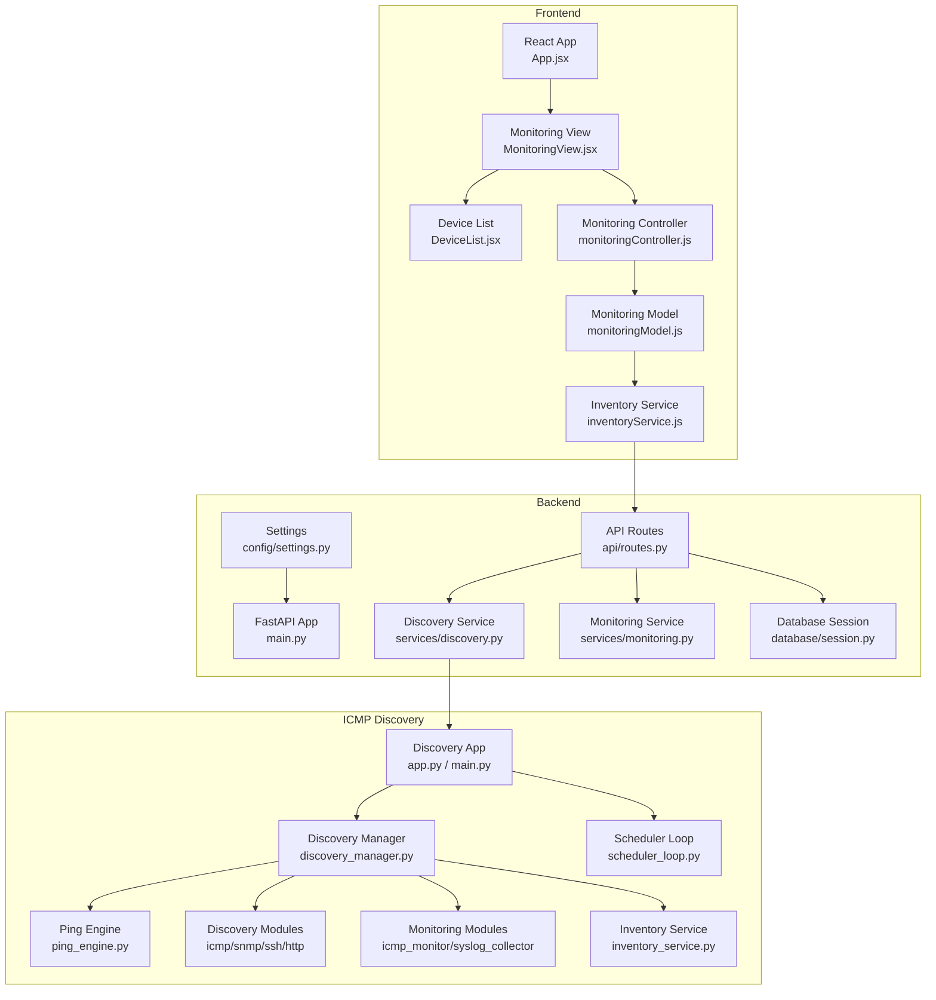
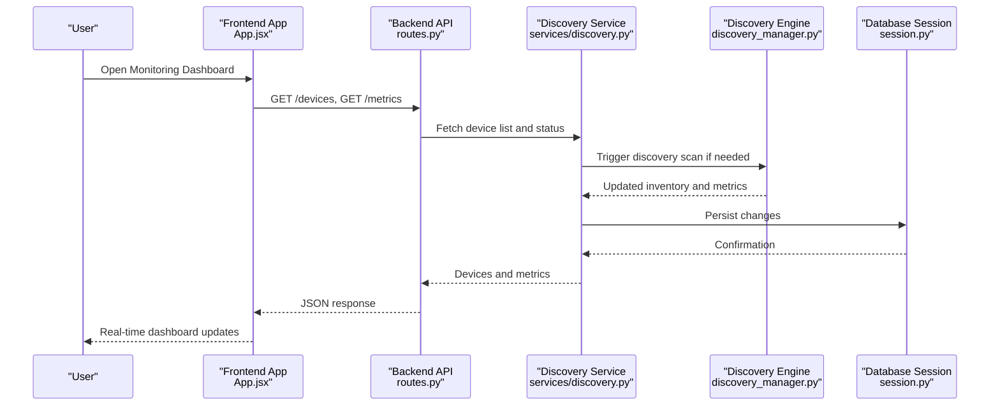
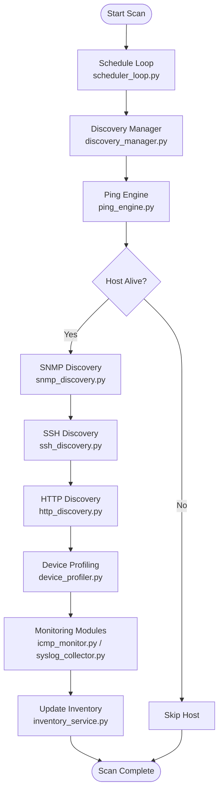
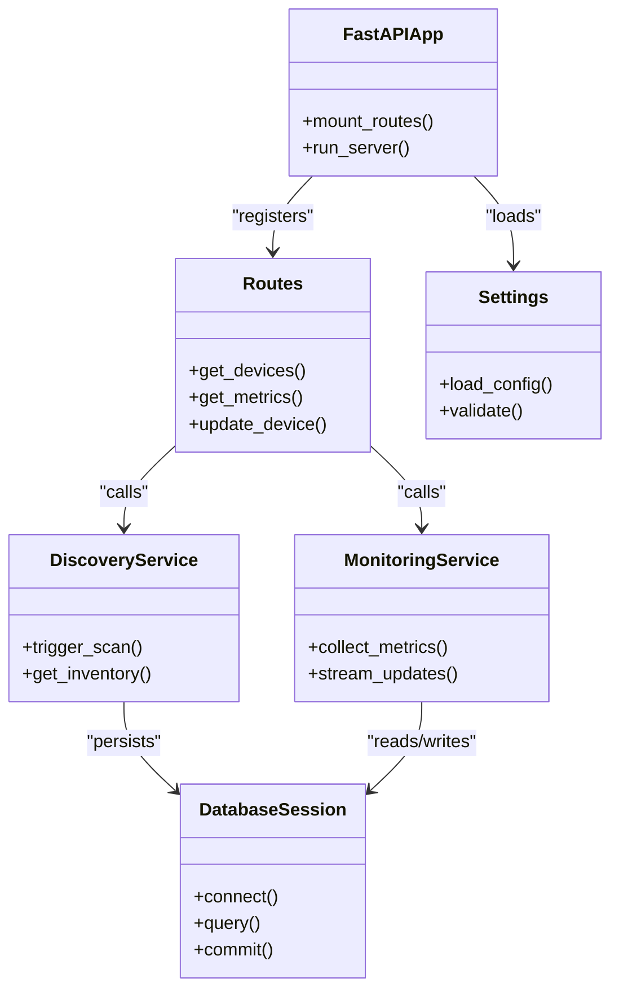
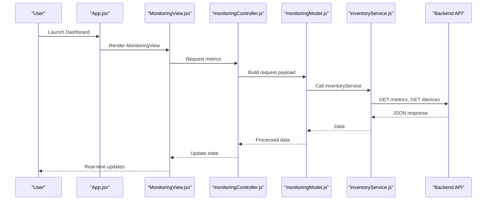
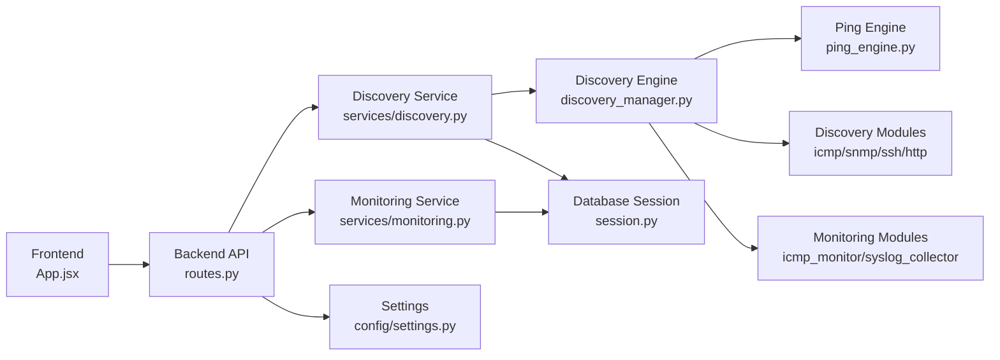

# Project Overview

<cite>
**Referenced Files in This Document**
- [backend/main.py](file://backend/main.py)
- [backend/api/routes.py](file://backend/api/routes.py)
- [backend/services/discovery.py](file://backend/services/discovery.py)
- [backend/services/monitoring.py](file://backend/services/monitoring.py)
- [backend/config/settings.py](file://backend/config/settings.py)
- [backend/database/session.py](file://backend/database/session.py)
- [icmp_discovery/app.py](file://icmp_discovery/app.py)
- [icmp_discovery/main.py](file://icmp_discovery/main.py)
- [icmp_discovery/discovery_manager.py](file://icmp_discovery/discovery_manager.py)
- [icmp_discovery/ping_engine.py](file://icmp_discovery/ping_engine.py)
- [icmp_discovery/discovery_modules/icmp_discovery.py](file://icmp_discovery/discovery_modules/icmp_discovery.py)
- [icmp_discovery/discovery_modules/snmp_discovery.py](file://icmp_discovery/discovery_modules/snmp_discovery.py)
- [icmp_discovery/discovery_modules/ssh_discovery.py](file://icmp_discovery/discovery_modules/ssh_discovery.py)
- [icmp_discovery/discovery_modules/http_discovery.py](file://icmp_discovery/discovery_modules/http_discovery.py)
- [icmp_discovery/monitoring_modules/icmp_monitor.py](file://icmp_discovery/monitoring_modules/icmp_monitor.py)
- [icmp_discovery/monitoring_modules/syslog_collector.py](file://icmp_discovery/monitoring_modules/syslog_collector.py)
- [icmp_discovery/inventory_service.py](file://icmp_discovery/inventory_service.py)
- [icmp_discovery/scheduler_loop.py](file://icmp_discovery/scheduler_loop.py)
- [frontend/src/App.jsx](file://frontend/src/App.jsx)
- [frontend/src/views/MonitoringView.jsx](file://frontend/src/views/MonitoringView.jsx)
- [frontend/src/components/DeviceList.jsx](file://frontend/src/components/DeviceList.jsx)
- [frontend/src/controllers/monitoringController.js](file://frontend/src/controllers/monitoringController.js)
- [frontend/src/models/monitoringModel.js](file://frontend/src/models/monitoringModel.js)
- [frontend/src/services/inventoryService.js](file://frontend/src/services/inventoryService.js)
</cite>

## Table of Contents
1. [Introduction](#introduction)
2. [Project Structure](#project-structure)
3. [Core Components](#core-components)
4. [Architecture Overview](#architecture-overview)
5. [Detailed Component Analysis](#detailed-component-analysis)
6. [Dependency Analysis](#dependency-analysis)
7. [Performance Considerations](#performance-considerations)
8. [Troubleshooting Guide](#troubleshooting-guide)
9. [Conclusion](#conclusion)

## Introduction
This Network Management System (NMS) is a comprehensive solution for network discovery, monitoring, and management. It integrates three primary components:
- ICMP Discovery Engine: Discovers devices across networks using ICMP and complementary protocols such as SNMP, SSH, and HTTP to enrich device profiles and capabilities.
- Backend API Services: Built with Python FastAPI, exposing REST endpoints for device inventory, configuration, and monitoring data access.
- Frontend Dashboard: A React-based interface providing real-time monitoring, device lists, and operational insights.

The system enables automated discovery, centralized inventory, continuous monitoring, and intuitive visualization to support network operations teams.

## Project Structure
The repository is organized into three main areas:
- backend: FastAPI application with routes, services, database session management, schemas, and utilities.
- icmp_discovery: Discovery and monitoring modules, schedulers, inventory service, and analytics engines.
- frontend: React application with views, components, controllers, models, and services.

**Diagram sources**
- [backend/main.py](file://backend/main.py)
- [backend/api/routes.py](file://backend/api/routes.py)
- [backend/services/discovery.py](file://backend/services/discovery.py)
- [backend/services/monitoring.py](file://backend/services/monitoring.py)
- [backend/database/session.py](file://backend/database/session.py)
- [backend/config/settings.py](file://backend/config/settings.py)
- [icmp_discovery/app.py](file://icmp_discovery/app.py)
- [icmp_discovery/main.py](file://icmp_discovery/main.py)
- [icmp_discovery/discovery_manager.py](file://icmp_discovery/discovery_manager.py)
- [icmp_discovery/ping_engine.py](file://icmp_discovery/ping_engine.py)
- [icmp_discovery/discovery_modules/icmp_discovery.py](file://icmp_discovery/discovery_modules/icmp_discovery.py)
- [icmp_discovery/discovery_modules/snmp_discovery.py](file://icmp_discovery/discovery_modules/snmp_discovery.py)
- [icmp_discovery/discovery_modules/ssh_discovery.py](file://icmp_discovery/discovery_modules/ssh_discovery.py)
- [icmp_discovery/discovery_modules/http_discovery.py](file://icmp_discovery/discovery_modules/http_discovery.py)
- [icmp_discovery/monitoring_modules/icmp_monitor.py](file://icmp_discovery/monitoring_modules/icmp_monitor.py)
- [icmp_discovery/monitoring_modules/syslog_collector.py](file://icmp_discovery/monitoring_modules/syslog_collector.py)
- [icmp_discovery/inventory_service.py](file://icmp_discovery/inventory_service.py)
- [icmp_discovery/scheduler_loop.py](file://icmp_discovery/scheduler_loop.py)
- [frontend/src/App.jsx](file://frontend/src/App.jsx)
- [frontend/src/views/MonitoringView.jsx](file://frontend/src/views/MonitoringView.jsx)
- [frontend/src/components/DeviceList.jsx](file://frontend/src/components/DeviceList.jsx)
- [frontend/src/controllers/monitoringController.js](file://frontend/src/controllers/monitoringController.js)
- [frontend/src/models/monitoringModel.js](file://frontend/src/models/monitoringModel.js)
- [frontend/src/services/inventoryService.js](file://frontend/src/services/inventoryService.js)

**Section sources**
- [backend/main.py](file://backend/main.py)
- [icmp_discovery/app.py](file://icmp_discovery/app.py)
- [frontend/src/App.jsx](file://frontend/src/App.jsx)

## Core Components
- ICMP Discovery Engine: Orchestrates network scanning and device profiling through modular discovery and monitoring components. It uses ping and protocol-specific probes to identify active hosts and gather attributes.
- Backend API Services: Exposes REST endpoints for device inventory, configuration, and monitoring metrics. Integrates with the discovery engine and persists data via a database session layer.
- Frontend Dashboard: Provides interactive UI for real-time monitoring, device listing, and operational dashboards. Communicates with backend APIs to fetch and display live data.

Key responsibilities:
- Discovery Engine: Scheduling scans, executing ICMP and protocol probes, collecting telemetry, and updating inventory.
- Backend: Request routing, validation, business logic orchestration, and data persistence.
- Frontend: Stateful UI, polling or streaming updates, and user interactions.

**Section sources**
- [icmp_discovery/discovery_manager.py](file://icmp_discovery/discovery_manager.py)
- [icmp_discovery/ping_engine.py](file://icmp_discovery/ping_engine.py)
- [backend/api/routes.py](file://backend/api/routes.py)
- [backend/services/discovery.py](file://backend/services/discovery.py)
- [backend/services/monitoring.py](file://backend/services/monitoring.py)
- [frontend/src/controllers/monitoringController.js](file://frontend/src/controllers/monitoringController.js)
- [frontend/src/services/inventoryService.js](file://frontend/src/services/inventoryService.js)

## Architecture Overview
The NMS architecture connects the discovery engine, backend API, and frontend dashboard to deliver end-to-end network visibility.

**Diagram sources**
- [frontend/src/App.jsx](file://frontend/src/App.jsx)
- [backend/api/routes.py](file://backend/api/routes.py)
- [backend/services/discovery.py](file://backend/services/discovery.py)
- [icmp_discovery/discovery_manager.py](file://icmp_discovery/discovery_manager.py)
- [backend/database/session.py](file://backend/database/session.py)

## Detailed Component Analysis

### ICMP Discovery Engine
The discovery engine coordinates scanning and profiling:
- Scheduler triggers periodic scans.
- Discovery manager orchestrates modules and state.
- Ping engine performs ICMP reachability checks.
- Protocol modules (SNMP, SSH, HTTP) enrich device attributes.
- Monitoring modules collect telemetry and logs.
- Inventory service maintains device records.

**Diagram sources**
- [icmp_discovery/scheduler_loop.py](file://icmp_discovery/scheduler_loop.py)
- [icmp_discovery/discovery_manager.py](file://icmp_discovery/discovery_manager.py)
- [icmp_discovery/ping_engine.py](file://icmp_discovery/ping_engine.py)
- [icmp_discovery/discovery_modules/snmp_discovery.py](file://icmp_discovery/discovery_modules/snmp_discovery.py)
- [icmp_discovery/discovery_modules/ssh_discovery.py](file://icmp_discovery/discovery_modules/ssh_discovery.py)
- [icmp_discovery/discovery_modules/http_discovery.py](file://icmp_discovery/discovery_modules/http_discovery.py)
- [icmp_discovery/monitoring_modules/icmp_monitor.py](file://icmp_discovery/monitoring_modules/icmp_monitor.py)
- [icmp_discovery/monitoring_modules/syslog_collector.py](file://icmp_discovery/monitoring_modules/syslog_collector.py)
- [icmp_discovery/inventory_service.py](file://icmp_discovery/inventory_service.py)

**Section sources**
- [icmp_discovery/discovery_manager.py](file://icmp_discovery/discovery_manager.py)
- [icmp_discovery/ping_engine.py](file://icmp_discovery/ping_engine.py)
- [icmp_discovery/discovery_modules/icmp_discovery.py](file://icmp_discovery/discovery_modules/icmp_discovery.py)
- [icmp_discovery/discovery_modules/snmp_discovery.py](file://icmp_discovery/discovery_modules/snmp_discovery.py)
- [icmp_discovery/discovery_modules/ssh_discovery.py](file://icmp_discovery/discovery_modules/ssh_discovery.py)
- [icmp_discovery/discovery_modules/http_discovery.py](file://icmp_discovery/discovery_modules/http_discovery.py)
- [icmp_discovery/monitoring_modules/icmp_monitor.py](file://icmp_discovery/monitoring_modules/icmp_monitor.py)
- [icmp_discovery/monitoring_modules/syslog_collector.py](file://icmp_discovery/monitoring_modules/syslog_collector.py)
- [icmp_discovery/inventory_service.py](file://icmp_discovery/inventory_service.py)
- [icmp_discovery/scheduler_loop.py](file://icmp_discovery/scheduler_loop.py)

### Backend API Services
The backend exposes REST endpoints for device management and monitoring:
- Routes define endpoints for inventory and metrics.
- Services encapsulate business logic and integrate with discovery and monitoring.
- Database session manages persistent storage.
- Settings provide configuration.

**Diagram sources**
- [backend/main.py](file://backend/main.py)
- [backend/api/routes.py](file://backend/api/routes.py)
- [backend/services/discovery.py](file://backend/services/discovery.py)
- [backend/services/monitoring.py](file://backend/services/monitoring.py)
- [backend/database/session.py](file://backend/database/session.py)
- [backend/config/settings.py](file://backend/config/settings.py)

**Section sources**
- [backend/api/routes.py](file://backend/api/routes.py)
- [backend/services/discovery.py](file://backend/services/discovery.py)
- [backend/services/monitoring.py](file://backend/services/monitoring.py)
- [backend/database/session.py](file://backend/database/session.py)
- [backend/config/settings.py](file://backend/config/settings.py)

### Frontend Dashboard
The React frontend provides real-time monitoring and device management:
- App orchestrates views and navigation.
- MonitoringView displays live metrics and status.
- DeviceList shows discovered devices and details.
- Controllers and models manage state and API calls.
- InventoryService interacts with backend endpoints.

**Diagram sources**
- [frontend/src/App.jsx](file://frontend/src/App.jsx)
- [frontend/src/views/MonitoringView.jsx](file://frontend/src/views/MonitoringView.jsx)
- [frontend/src/controllers/monitoringController.js](file://frontend/src/controllers/monitoringController.js)
- [frontend/src/models/monitoringModel.js](file://frontend/src/models/monitoringModel.js)
- [frontend/src/services/inventoryService.js](file://frontend/src/services/inventoryService.js)

**Section sources**
- [frontend/src/App.jsx](file://frontend/src/App.jsx)
- [frontend/src/views/MonitoringView.jsx](file://frontend/src/views/MonitoringView.jsx)
- [frontend/src/components/DeviceList.jsx](file://frontend/src/components/DeviceList.jsx)
- [frontend/src/controllers/monitoringController.js](file://frontend/src/controllers/monitoringController.js)
- [frontend/src/models/monitoringModel.js](file://frontend/src/models/monitoringModel.js)
- [frontend/src/services/inventoryService.js](file://frontend/src/services/inventoryService.js)

## Dependency Analysis
High-level dependencies among components:
- Frontend depends on backend APIs for data.
- Backend depends on discovery and monitoring services.
- Discovery engine depends on ping and protocol modules.
- All services depend on database session for persistence.
- Configuration drives behavior across components.

**Diagram sources**
- [frontend/src/App.jsx](file://frontend/src/App.jsx)
- [backend/api/routes.py](file://backend/api/routes.py)
- [backend/services/discovery.py](file://backend/services/discovery.py)
- [backend/services/monitoring.py](file://backend/services/monitoring.py)
- [icmp_discovery/discovery_manager.py](file://icmp_discovery/discovery_manager.py)
- [icmp_discovery/ping_engine.py](file://icmp_discovery/ping_engine.py)
- [icmp_discovery/discovery_modules/icmp_discovery.py](file://icmp_discovery/discovery_modules/icmp_discovery.py)
- [icmp_discovery/discovery_modules/snmp_discovery.py](file://icmp_discovery/discovery_modules/snmp_discovery.py)
- [icmp_discovery/discovery_modules/ssh_discovery.py](file://icmp_discovery/discovery_modules/ssh_discovery.py)
- [icmp_discovery/discovery_modules/http_discovery.py](file://icmp_discovery/discovery_modules/http_discovery.py)
- [icmp_discovery/monitoring_modules/icmp_monitor.py](file://icmp_discovery/monitoring_modules/icmp_monitor.py)
- [icmp_discovery/monitoring_modules/syslog_collector.py](file://icmp_discovery/monitoring_modules/syslog_collector.py)
- [backend/database/session.py](file://backend/database/session.py)
- [backend/config/settings.py](file://backend/config/settings.py)

**Section sources**
- [backend/main.py](file://backend/main.py)
- [icmp_discovery/app.py](file://icmp_discovery/app.py)
- [frontend/src/App.jsx](file://frontend/src/App.jsx)

## Performance Considerations
- Discovery Scans: Use parallelism judiciously to avoid overwhelming target networks; tune concurrency based on network capacity.
- Polling vs Streaming: Prefer efficient polling intervals or server-sent events where possible to reduce load.
- Caching: Cache frequently accessed device metadata to minimize repeated queries.
- Database Optimization: Index commonly queried fields and batch writes during scans.
- Resource Limits: Configure timeouts and retries for network probes to prevent blocking.

[No sources needed since this section provides general guidance]

## Troubleshooting Guide
Common issues and resolutions:
- Discovery failures: Validate network reachability, firewall rules, and credentials for SNMP/SSH/HTTP probes.
- API errors: Check route definitions, request payloads, and backend logs for validation failures.
- Frontend connectivity: Ensure CORS settings are correct and backend endpoints are reachable.
- Monitoring gaps: Verify scheduler execution and module health; inspect syslog collector and trap receiver logs.

Recommended steps:
- Inspect backend logs and error responses from routes.
- Confirm database session connectivity and schema consistency.
- Review discovery scheduler logs and probe results.
- Validate frontend network requests and state updates.

**Section sources**
- [backend/api/routes.py](file://backend/api/routes.py)
- [backend/database/session.py](file://backend/database/session.py)
- [icmp_discovery/scheduler_loop.py](file://icmp_discovery/scheduler_loop.py)
- [icmp_discovery/monitoring_modules/syslog_collector.py](file://icmp_discovery/monitoring_modules/syslog_collector.py)

## Conclusion
The NMS integrates an ICMP-driven discovery engine, a FastAPI backend, and a React frontend to deliver comprehensive network discovery, monitoring, and management. The modular design allows scalable expansion of discovery protocols and monitoring capabilities while maintaining clear separation of concerns between components.

[No sources needed since this section summarizes without analyzing specific files]