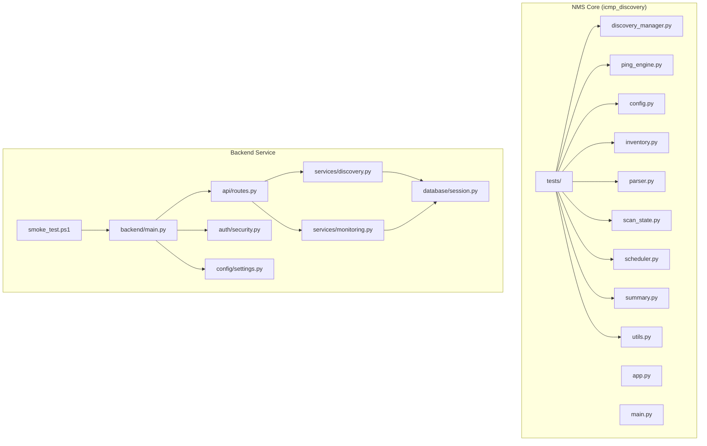
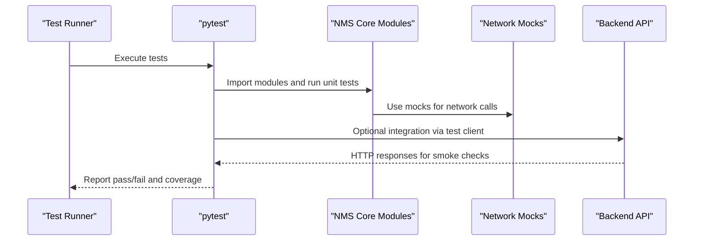
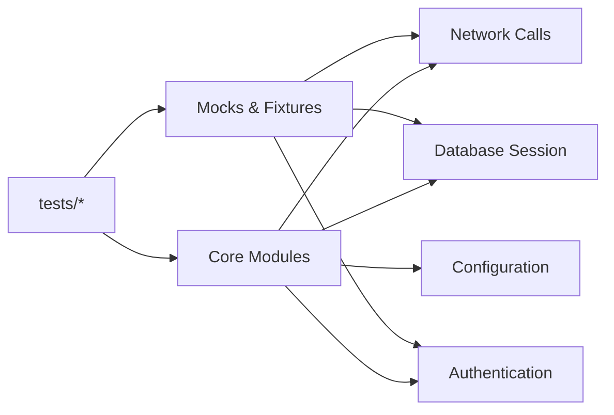

# Testing Guide

<cite>
**Referenced Files in This Document**
- [icmp_discovery/tests/test_nms_modules.py](file://icmp_discovery/tests/test_nms_modules.py)
- [icmp_discovery/tests/test_ping_engine.py](file://icmp_discovery/tests/test_ping_engine.py)
- [icmp_discovery/tests/test_config.py](file://icmp_discovery/tests/test_config.py)
- [icmp_discovery/tests/test_inventory.py](file://icmp_discovery/tests/test_inventory.py)
- [icmp_discovery/tests/test_parser.py](file://icmp_discovery/tests/test_parser.py)
- [icmp_discovery/tests/test_scan_state.py](file://icmp_discovery/tests/test_scan_state.py)
- [icmp_discovery/tests/test_scheduler.py](file://icmp_discovery/tests/test_scheduler.py)
- [icmp_discovery/tests/test_summary.py](file://icmp_discovery/tests/test_summary.py)
- [icmp_discovery/tests/test_utils.py](file://icmp_discovery/tests/test_utils.py)
- [icmp_discovery/discovery_manager.py](file://icmp_discovery/discovery_manager.py)
- [icmp_discovery/ping_engine.py](file://icmp_discovery/ping_engine.py)
- [icmp_discovery/config.py](file://icmp_discovery/config.py)
- [icmp_discovery/inventory.py](file://icmp_discovery/inventory.py)
- [icmp_discovery/parser.py](file://icmp_discovery/parser.py)
- [icmp_discovery/scan_state.py](file://icmp_discovery/scan_state.py)
- [icmp_discovery/scheduler.py](file://icmp_discovery/scheduler.py)
- [icmp_discovery/summary.py](file://icmp_discovery/summary.py)
- [icmp_discovery/utils.py](file://icmp_discovery/utils.py)
- [icmp_discovery/app.py](file://icmp_discovery/app.py)
- [icmp_discovery/main.py](file://icmp_discovery/main.py)
- [backend/main.py](file://backend/main.py)
- [backend/api/routes.py](file://backend/api/routes.py)
- [backend/services/discovery.py](file://backend/services/discovery.py)
- [backend/services/monitoring.py](file://backend/services/monitoring.py)
- [backend/database/session.py](file://backend/database/session.py)
- [backend/auth/security.py](file://backend/auth/security.py)
- [backend/config/settings.py](file://backend/config/settings.py)
- [backend/smoke_test.ps1](file://backend/smoke_test.ps1)
- [icmp_discovery/README.md](file://icmp_discovery/README.md)
</cite>

## Table of Contents
1. [Introduction](#introduction)
2. [Project Structure](#project-structure)
3. [Core Components](#core-components)
4. [Architecture Overview](#architecture-overview)
5. [Detailed Component Analysis](#detailed-component-analysis)
6. [Dependency Analysis](#dependency-analysis)
7. [Performance Considerations](#performance-considerations)
8. [Troubleshooting Guide](#troubleshooting-guide)
9. [Conclusion](#conclusion)
10. [Appendices](#appendices)

## Introduction
This Testing Guide provides comprehensive guidance for unit, integration, and smoke tests across the NMS components. It covers test structure, frameworks used, execution procedures, and best practices for testing discovery modules, API endpoints, and monitoring components. It also explains mocking strategies for network-dependent code, test data management, continuous integration setup, coverage requirements, performance testing approaches, and debugging techniques in network environments.

## Project Structure
The repository contains two primary subsystems:
- icmp_discovery: Core NMS logic for discovery, monitoring, scheduling, parsing, and reporting, with a dedicated tests directory containing Python-based unit and integration tests.
- backend: A FastAPI-based service exposing APIs for discovery and monitoring, along with database and authentication utilities.

Key testing-related locations:
- Unit and integration tests are located under icmp_discovery/tests.
- Smoke tests are provided as a PowerShell script under backend/smoke_test.ps1.
- Application entry points exist at icmp_discovery/main.py and backend/main.py.

**Diagram sources**
- [icmp_discovery/discovery_manager.py](file://icmp_discovery/discovery_manager.py)
- [icmp_discovery/ping_engine.py](file://icmp_discovery/ping_engine.py)
- [icmp_discovery/config.py](file://icmp_discovery/config.py)
- [icmp_discovery/inventory.py](file://icmp_discovery/inventory.py)
- [icmp_discovery/parser.py](file://icmp_discovery/parser.py)
- [icmp_discovery/scan_state.py](file://icmp_discovery/scan_state.py)
- [icmp_discovery/scheduler.py](file://icmp_discovery/scheduler.py)
- [icmp_discovery/summary.py](file://icmp_discovery/summary.py)
- [icmp_discovery/utils.py](file://icmp_discovery/utils.py)
- [icmp_discovery/app.py](file://icmp_discovery/app.py)
- [icmp_discovery/main.py](file://icmp_discovery/main.py)
- [backend/main.py](file://backend/main.py)
- [backend/api/routes.py](file://backend/api/routes.py)
- [backend/services/discovery.py](file://backend/services/discovery.py)
- [backend/services/monitoring.py](file://backend/services/monitoring.py)
- [backend/database/session.py](file://backend/database/session.py)
- [backend/auth/security.py](file://backend/auth/security.py)
- [backend/config/settings.py](file://backend/config/settings.py)
- [backend/smoke_test.ps1](file://backend/smoke_test.ps1)

**Section sources**
- [icmp_discovery/README.md](file://icmp_discovery/README.md)

## Core Components
This section outlines the core NMS components that are actively tested or commonly integrated into tests:
- Discovery Manager: Orchestrates discovery workflows and integrates with discovery modules.
- Ping Engine: Performs ICMP-based reachability checks; often mocked in tests to avoid real network calls.
- Configuration: Centralized settings and environment-driven configuration.
- Inventory: Manages device inventory state and persistence.
- Parser: Parses raw outputs from devices or protocols.
- Scan State: Tracks scan progress and results.
- Scheduler: Schedules periodic tasks such as scans and reports.
- Summary: Aggregates results and generates summaries.
- Utilities: Shared helpers used across modules.

Testing focus areas:
- Unit tests validate isolated behavior of functions and classes.
- Integration tests verify interactions between modules and external dependencies using mocks or test doubles.
- Smoke tests ensure critical paths of the application start and respond correctly.

**Section sources**
- [icmp_discovery/discovery_manager.py](file://icmp_discovery/discovery_manager.py)
- [icmp_discovery/ping_engine.py](file://icmp_discovery/ping_engine.py)
- [icmp_discovery/config.py](file://icmp_discovery/config.py)
- [icmp_discovery/inventory.py](file://icmp_discovery/inventory.py)
- [icmp_discovery/parser.py](file://icmp_discovery/parser.py)
- [icmp_discovery/scan_state.py](file://icmp_discovery/scan_state.py)
- [icmp_discovery/scheduler.py](file://icmp_discovery/scheduler.py)
- [icmp_discovery/summary.py](file://icmp_discovery/summary.py)
- [icmp_discovery/utils.py](file://icmp_discovery/utils.py)

## Architecture Overview
The NMS architecture separates concerns into discovery, monitoring, scheduling, parsing, and reporting layers. Tests target these layers through unit and integration patterns, while smoke tests validate end-to-end startup and basic API responses.

[No sources needed since this diagram shows conceptual workflow, not actual code structure]

## Detailed Component Analysis

### Unit Testing Framework and Structure
- Framework: pytest is used across icmp_discovery/tests for unit and integration tests.
- Organization: Each major module has corresponding test files covering functionality and edge cases.
- Execution: Run all tests from the icmp_discovery directory using pytest.

Common patterns observed:
- Isolation of network calls via mocking.
- Assertions on return values, exceptions, and side effects.
- Use of fixtures for shared test data and setup.

Examples of test files:
- [icmp_discovery/tests/test_nms_modules.py](file://icmp_discovery/tests/test_nms_modules.py)
- [icmp_discovery/tests/test_ping_engine.py](file://icmp_discovery/tests/test_ping_engine.py)
- [icmp_discovery/tests/test_config.py](file://icmp_discovery/tests/test_config.py)
- [icmp_discovery/tests/test_inventory.py](file://icmp_discovery/tests/test_inventory.py)
- [icmp_discovery/tests/test_parser.py](file://icmp_discovery/tests/test_parser.py)
- [icmp_discovery/tests/test_scan_state.py](file://icmp_discovery/tests/test_scan_state.py)
- [icmp_discovery/tests/test_scheduler.py](file://icmp_discovery/tests/test_scheduler.py)
- [icmp_discovery/tests/test_summary.py](file://icmp_discovery/tests/test_summary.py)
- [icmp_discovery/tests/test_utils.py](file://icmp_discovery/tests/test_utils.py)

**Section sources**
- [icmp_discovery/tests/test_nms_modules.py](file://icmp_discovery/tests/test_nms_modules.py)
- [icmp_discovery/tests/test_ping_engine.py](file://icmp_discovery/tests/test_ping_engine.py)
- [icmp_discovery/tests/test_config.py](file://icmp_discovery/tests/test_config.py)
- [icmp_discovery/tests/test_inventory.py](file://icmp_discovery/tests/test_inventory.py)
- [icmp_discovery/tests/test_parser.py](file://icmp_discovery/tests/test_parser.py)
- [icmp_discovery/tests/test_scan_state.py](file://icmp_discovery/tests/test_scan_state.py)
- [icmp_discovery/tests/test_scheduler.py](file://icmp_discovery/tests/test_scheduler.py)
- [icmp_discovery/tests/test_summary.py](file://icmp_discovery/tests/test_summary.py)
- [icmp_discovery/tests/test_utils.py](file://icmp_discovery/tests/test_utils.py)

### Testing Discovery Modules
Discovery modules interact with network protocols and device interfaces. To test them effectively:
- Mock network I/O using unittest.mock or pytest-mock.
- Provide deterministic inputs and expected outputs.
- Validate error handling for timeouts, unreachable hosts, and malformed responses.

Recommended approach:
- Create test fixtures for device profiles and protocol responses.
- Patch low-level network calls to simulate success, failure, and latency scenarios.
- Assert that discovery manager orchestrates modules correctly and aggregates results.

Example references:
- Discovery orchestration: [icmp_discovery/discovery_manager.py](file://icmp_discovery/discovery_manager.py)
- Network operations: [icmp_discovery/ping_engine.py](file://icmp_discovery/ping_engine.py)

**Section sources**
- [icmp_discovery/discovery_manager.py](file://icmp_discovery/discovery_manager.py)
- [icmp_discovery/ping_engine.py](file://icmp_discovery/ping_engine.py)

### Testing API Endpoints
For backend API testing:
- Use FastAPI’s TestClient to send requests without starting a server process.
- Mock database sessions and authentication to isolate endpoint logic.
- Validate request/response schemas, status codes, and error handling.

Suggested steps:
- Initialize a test client bound to backend.main.app.
- Override dependencies like database session and security utilities.
- Assert JSON payloads match expected schemas and business rules.

Example references:
- API routes: [backend/api/routes.py](file://backend/api/routes.py)
- App initialization: [backend/main.py](file://backend/main.py)
- Database session: [backend/database/session.py](file://backend/database/session.py)
- Authentication: [backend/auth/security.py](file://backend/auth/security.py)

**Section sources**
- [backend/api/routes.py](file://backend/api/routes.py)
- [backend/main.py](file://backend/main.py)
- [backend/database/session.py](file://backend/database/session.py)
- [backend/auth/security.py](file://backend/auth/security.py)

### Testing Monitoring Components
Monitoring components collect metrics and events from devices:
- Mock SNMP traps, syslog streams, and polling endpoints.
- Verify event ingestion, transformation, and storage.
- Ensure robustness against malformed messages and rate limits.

Example references:
- Monitoring services: [backend/services/monitoring.py](file://backend/services/monitoring.py)
- NMS core monitoring modules: [icmp_discovery/monitoring_services.py](file://icmp_discovery/monitoring_services.py)

**Section sources**
- [backend/services/monitoring.py](file://backend/services/monitoring.py)
- [icmp_discovery/monitoring_services.py](file://icmp_discovery/monitoring_services.py)

### Mocking Strategies for Network-Dependent Components
- Use unittest.mock.patch to replace network calls with deterministic stubs.
- For ICMP pings, mock subprocess or socket calls to simulate reachability.
- For HTTP/SNMP/SSH, provide canned responses and error conditions.
- Leverage pytest fixtures to centralize common mocks and reduce duplication.

Best practices:
- Keep mocks close to the boundary where network calls occur.
- Validate both success and failure paths.
- Avoid over-mocking business logic; only isolate external dependencies.

**Section sources**
- [icmp_discovery/ping_engine.py](file://icmp_discovery/ping_engine.py)

### Test Data Management
- Store static test fixtures in dedicated directories or inline within test files.
- Use JSON/YAML for structured device profiles and protocol responses.
- Seed minimal datasets for integration tests to keep runs fast and deterministic.

Guidelines:
- Separate fixture data from test logic.
- Version control test data alongside code.
- Clean up temporary files after tests.

**Section sources**
- [icmp_discovery/tests/test_inventory.py](file://icmp_discovery/tests/test_inventory.py)
- [icmp_discovery/tests/test_parser.py](file://icmp_discovery/tests/test_parser.py)

### Continuous Integration Setup
- Configure CI pipelines to install dependencies and run pytest with coverage.
- Cache virtual environments to speed up builds.
- Fail the pipeline on test failures or coverage thresholds.

Typical steps:
- Install Python dependencies from requirements.txt.
- Execute pytest with flags for verbosity and coverage reporting.
- Upload coverage artifacts for review.

**Section sources**
- [icmp_discovery/requirements.txt](file://icmp_discovery/requirements.txt)

### Coverage Requirements
- Aim for high line and branch coverage on core modules.
- Exclude trivial or auto-generated code from coverage targets.
- Enforce minimum thresholds in CI to prevent regressions.

Recommendations:
- Set per-module coverage goals based on complexity.
- Review uncovered branches for missing assertions.
- Use coverage reports to guide test additions.

**Section sources**
- [icmp_discovery/tests/test_nms_modules.py](file://icmp_discovery/tests/test_nms_modules.py)

### Performance Testing Approaches
- Use synthetic workloads to simulate large inventories and concurrent scans.
- Profile CPU and memory usage during discovery and monitoring tasks.
- Introduce load tests for API endpoints using tools like Locust or k6.

Practical tips:
- Benchmark critical paths like ping sweeps and parser throughput.
- Monitor resource consumption under realistic traffic patterns.
- Optimize bottlenecks identified by profiling.

**Section sources**
- [icmp_discovery/scheduler.py](file://icmp_discovery/scheduler.py)
- [icmp_discovery/discovery_manager.py](file://icmp_discovery/discovery_manager.py)

### Debugging Failed Tests in Network Environments
- Enable verbose logging to capture network call details.
- Use local network simulators or proxies to intercept and inspect traffic.
- Reproduce failures locally with controlled network conditions.

Steps:
- Increase log levels for discovery and monitoring modules.
- Inspect mock configurations for incorrect assumptions.
- Validate environment variables and configuration files.

**Section sources**
- [icmp_discovery/logger.py](file://icmp_discovery/logger.py)
- [icmp_discovery/config.py](file://icmp_discovery/config.py)

## Dependency Analysis
Tests depend on core modules and may mock external systems. Understanding these relationships helps maintain stable tests.

**Diagram sources**
- [icmp_discovery/tests/test_nms_modules.py](file://icmp_discovery/tests/test_nms_modules.py)
- [icmp_discovery/discovery_manager.py](file://icmp_discovery/discovery_manager.py)
- [icmp_discovery/ping_engine.py](file://icmp_discovery/ping_engine.py)
- [backend/database/session.py](file://backend/database/session.py)
- [backend/auth/security.py](file://backend/auth/security.py)
- [backend/config/settings.py](file://backend/config/settings.py)

**Section sources**
- [icmp_discovery/tests/test_nms_modules.py](file://icmp_discovery/tests/test_nms_modules.py)
- [icmp_discovery/discovery_manager.py](file://icmp_discovery/discovery_manager.py)
- [icmp_discovery/ping_engine.py](file://icmp_discovery/ping_engine.py)
- [backend/database/session.py](file://backend/database/session.py)
- [backend/auth/security.py](file://backend/auth/security.py)
- [backend/config/settings.py](file://backend/config/settings.py)

## Performance Considerations
- Keep unit tests fast by avoiding real network calls and heavy I/O.
- Use asynchronous patterns where applicable to improve throughput.
- Profile long-running tests to identify bottlenecks.

Guidelines:
- Prefer in-memory data structures for test databases when possible.
- Parallelize independent tests to reduce total runtime.
- Monitor memory leaks in long-running integration suites.

[No sources needed since this section provides general guidance]

## Troubleshooting Guide
Common issues and resolutions:
- Flaky network tests: Replace live calls with deterministic mocks.
- Missing dependencies: Ensure requirements are installed before running tests.
- Environment misconfiguration: Validate config files and environment variables.
- Slow tests: Identify and optimize heavy operations; consider splitting suites.

Debugging steps:
- Run individual tests with verbose output.
- Inspect logs for stack traces and assertion errors.
- Use breakpoints or print statements sparingly to trace execution.

**Section sources**
- [icmp_discovery/tests/test_config.py](file://icmp_discovery/tests/test_config.py)
- [icmp_discovery/tests/test_utils.py](file://icmp_discovery/tests/test_utils.py)

## Conclusion
This guide consolidates testing strategies for NMS components, emphasizing isolation of network dependencies, robust test data management, and reliable CI integration. By following the outlined practices, teams can maintain high-quality tests that validate discovery, API endpoints, and monitoring functionalities effectively.

[No sources needed since this section summarizes without analyzing specific files]

## Appendices

### Test Execution Procedures
- Unit tests: Run pytest from the icmp_discovery directory to execute all tests.
- Integration tests: Use test clients for backend APIs and mock external services.
- Smoke tests: Execute backend/smoke_test.ps1 to validate application startup and basic endpoints.

References:
- [icmp_discovery/tests/test_nms_modules.py](file://icmp_discovery/tests/test_nms_modules.py)
- [backend/smoke_test.ps1](file://backend/smoke_test.ps1)

**Section sources**
- [icmp_discovery/tests/test_nms_modules.py](file://icmp_discovery/tests/test_nms_modules.py)
- [backend/smoke_test.ps1](file://backend/smoke_test.ps1)

### Example Test Scenarios
- Discovery module test: Mock ICMP responses and assert device detection logic.
- API endpoint test: Send GET/POST requests via TestClient and validate JSON schemas.
- Monitoring component test: Inject synthetic events and verify aggregation and storage.

References:
- [icmp_discovery/ping_engine.py](file://icmp_discovery/ping_engine.py)
- [backend/api/routes.py](file://backend/api/routes.py)
- [backend/services/monitoring.py](file://backend/services/monitoring.py)

**Section sources**
- [icmp_discovery/ping_engine.py](file://icmp_discovery/ping_engine.py)
- [backend/api/routes.py](file://backend/api/routes.py)
- [backend/services/monitoring.py](file://backend/services/monitoring.py)